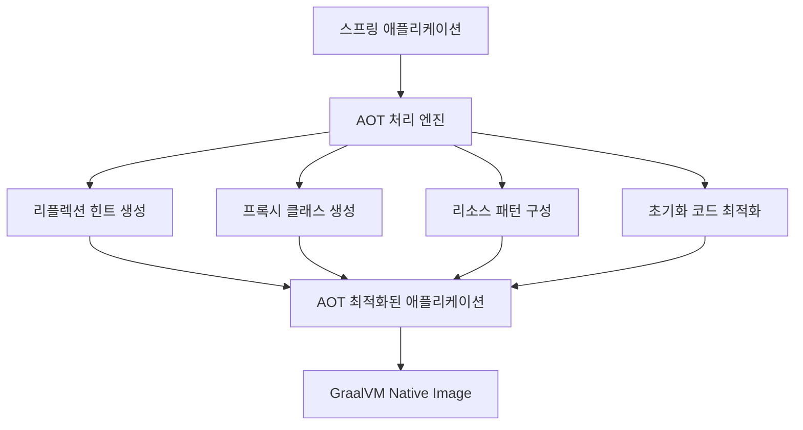
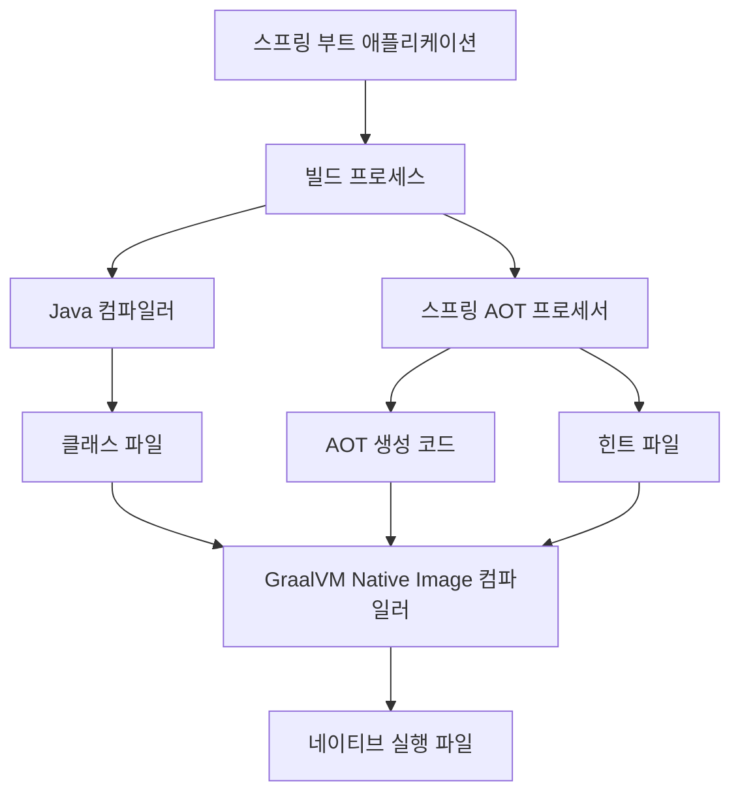

스프링 부트 네이티브 지원은 스프링 부트 애플리케이션을 GraalVM Native Image로 컴파일할 수 있게 해주는 기능입니다. 이를 통해 스프링 애플리케이션의 시작 시간을 대폭 단축하고, 메모리 사용량을 줄이며, 독립 실행 파일로 배포할 수 있게 되었습니다. 스프링 부트 3.0부터는 네이티브 이미지 지원이 정식 기능으로 포함되어 별도의 확장 없이도 사용할 수 있습니다.

## 역사적 배경

스프링 생태계에서 네이티브 이미지 지원은 다음과 같은 발전 과정을 거쳤습니다:

1. **Spring Native 프로젝트**: 초기에는 실험적인 프로젝트로 시작되어 별도의 의존성과 구성이 필요했습니다.
2. **Spring Framework 6.0**: AOT(Ahead-of-Time) 엔진이 도입되어 네이티브 이미지 생성을 위한 기반이 마련되었습니다.
3. **Spring Boot 3.0**: 네이티브 이미지 지원이 정식 기능으로 통합되었습니다.

이러한 발전으로 인해 스프링 생태계에서 네이티브 이미지를 만드는 과정이 크게 간소화되었습니다.

## [[AOT(Ahead-of-Time) 컴파일]] 처리 메커니즘

스프링 부트의 네이티브 지원은 AOT 처리 엔진을 중심으로 이루어집니다. AOT 처리는 애플리케이션 빌드 시점에 다음과 같은 작업을 수행합니다:



1. **리플렉션 메타데이터 생성**: 스프링이 사용하는 리플렉션 API에 대한 정보를 수집하여 GraalVM이 이해할 수 있는 구성 파일로 생성합니다.
2. **클래스 프록시 사전 생성**: 런타임에 동적으로 생성하던 프록시 클래스를 빌드 시점에 미리 생성합니다.
3. **초기화 코드 최적화**: 가능한 많은 초기화 작업을 빌드 시점으로 이동하여 런타임 오버헤드를 줄입니다.
4. **리소스 패턴 수집**: 애플리케이션이 필요로 하는 리소스 패턴을 식별하고 구성합니다.

## 주요 컴포넌트

스프링 부트 네이티브 지원의 핵심 구성 요소는 다음과 같습니다:

1. **스프링 AOT 엔진**: 컴파일 시점에 애플리케이션 최적화를 담당합니다.
2. **네이티브 빌드 도구 통합**: Maven과 Gradle 플러그인을 통한 빌드 프로세스 통합을 제공합니다.
3. **Spring Context 최적화**: 스프링 컨텍스트 초기화 및 빈 생성 과정을 최적화합니다.
4. **자동 설정 처리기**: 조건부 자동 설정을 빌드 시점에 처리합니다.
5. **네이티브 테스트 지원**: 네이티브 이미지에서 테스트를 실행할 수 있는 기능을 제공합니다.

## 스프링 부트 애플리케이션을 네이티브로 빌드하기

### Maven 설정

Maven을 사용하는 경우, `pom.xml` 파일에 다음 설정을 추가합니다:

```xml
<parent>
    <groupId>org.springframework.boot</groupId>
    <artifactId>spring-boot-starter-parent</artifactId>
    <version>3.2.0</version>
</parent>

<build>
    <plugins>
        <plugin>
            <groupId>org.springframework.boot</groupId>
            <artifactId>spring-boot-maven-plugin</artifactId>
            <configuration>
                <excludes>
                    <exclude>
                        <groupId>org.projectlombok</groupId>
                        <artifactId>lombok</artifactId>
                    </exclude>
                </excludes>
                <classifier>${repackage.classifier}</classifier>
                <image>
                    <builder>paketobuildpacks/builder-jammy-tiny:latest</builder>
                </image>
            </configuration>
        </plugin>
        <plugin>
            <groupId>org.graalvm.buildtools</groupId>
            <artifactId>native-maven-plugin</artifactId>
        </plugin>
    </plugins>
</build>
```

네이티브 이미지를 빌드하려면 다음 명령을 실행합니다:

```bash
./mvnw spring-boot:build-image -Pnative
```

또는 네이티브 실행 파일을 직접 생성하려면:

```bash
./mvnw native:compile -Pnative
```

### Gradle 설정

Gradle을 사용하는 경우, `build.gradle` 파일에 다음 설정을 추가합니다:

```groovy
plugins {
    id 'java'
    id 'org.springframework.boot' version '3.2.0'
    id 'io.spring.dependency-management' version '1.1.4'
    id 'org.graalvm.buildtools.native' version '0.9.28'
}

bootBuildImage {
    builder = "paketobuildpacks/builder-jammy-tiny:latest"
    environment = [
        "BP_NATIVE_IMAGE": "true"
    ]
}
```

네이티브 이미지를 빌드하려면 다음 명령을 실행합니다:

```bash
./gradlew bootBuildImage
```

또는 네이티브 실행 파일을 직접 생성하려면:

```bash
./gradlew nativeCompile
```

## 스프링 부트 네이티브의 제약 사항

스프링 부트 애플리케이션을 네이티브 이미지로 변환할 때 몇 가지 제약 사항이 있습니다:

### 1. 리플렉션 사용 제한

스프링은 리플렉션을 많이 사용하는 프레임워크이지만, 네이티브 이미지에서는 리플렉션 사용이 제한됩니다. 스프링 부트는 대부분의 리플렉션 사용을 자동으로 감지하여 필요한 구성을 생성하지만, 명시적인 리플렉션 사용은 다음과 같이 힌트를 제공해야 합니다:

```java
import org.springframework.aot.hint.RuntimeHints;
import org.springframework.aot.hint.RuntimeHintsRegistrar;

public class MyRuntimeHintsRegistrar implements RuntimeHintsRegistrar {
    @Override
    public void registerHints(RuntimeHints hints, ClassLoader classLoader) {
        hints.reflection().registerType(MyClass.class, 
            builder -> builder.withMembers(MemberCategory.INVOKE_DECLARED_CONSTRUCTORS,
                                          MemberCategory.INVOKE_DECLARED_METHODS));
    }
}
```

이 힌트 등록기를 다음과 같이 활성화합니다:

```java
@ImportRuntimeHints(MyRuntimeHintsRegistrar.class)
@SpringBootApplication
public class MyApplication {
    public static void main(String[] args) {
        SpringApplication.run(MyApplication.class, args);
    }
}
```

### 2. 동적 프록시 제한

스프링은 AOP, 트랜잭션 관리 등을 위해 동적 프록시를 많이 사용합니다. 네이티브 이미지에서는 빌드 시점에 알려지지 않은 인터페이스의 프록시를 생성할 수 없습니다. 스프링 부트는 대부분의 프록시 사용을 자동으로 처리하지만, 커스텀 프록시의 경우 다음과 같이 힌트를 제공해야 합니다:

```java
hints.proxies().registerJdkProxy(MyInterface.class);
```

### 3. 늦은 초기화 제한

네이티브 이미지는 빌드 시점에 가능한 많은 초기화를 수행하는 것이 좋습니다. 하지만 일부 초기화는 런타임에 이루어져야 합니다. 이를 위해 다음과 같은 방법을 사용할 수 있습니다:

```java
// 빌드 시점 초기화 방지
@Bean
@ImportRuntimeHints(...)
static MyBean myBean() {
    return new MyBean();
}
```

또는 자동 설정 클래스에서:

```java
@AutoConfiguration
@ImportRuntimeHints(...)
public class MyAutoConfiguration {
    // ...
}
```

### 4. 리소스 접근 제한

클래스패스 리소스에 접근하는 경우, Native Image에 해당 리소스를 포함하도록 지정해야 합니다:

```java
hints.resources().registerPattern("META-INF/my-resources/*");
```

## 스프링 부트 네이티브 성능 최적화

네이티브 이미지로 컴파일된 스프링 부트 애플리케이션의 성능을 최적화하기 위한 몇 가지 전략이 있습니다:

### 1. 빌드 시점 초기화 최대화

가능한 많은 코드를 빌드 시점에 초기화하면 애플리케이션 시작 시간이 단축됩니다:

```java
@SpringBootApplication(proxyBeanMethods = false)
public class MyApplication {
    // ...
}
```

### 2. 조건부 빈 줄이기

조건부 빈 설정(`@ConditionalOnXxx`)은 빌드 타임에 결정되어야 하므로, 가능한 단순화하는 것이 좋습니다.

### 3. 불필요한 컴포넌트 배제

애플리케이션에서 사용하지 않는 컴포넌트는 제외하여 이미지 크기를 줄이는 것이 좋습니다:

```java
@SpringBootApplication(exclude = {
    DataSourceAutoConfiguration.class,
    JmxAutoConfiguration.class
})
public class MyApplication {
    // ...
}
```

### 4. GraalVM 네이티브 이미지 옵션 최적화

네이티브 이미지 빌드 시 다양한 옵션을 통해 성능을 최적화할 수 있습니다:

```xml
<configuration>
    <buildArgs>
        <!-- 빌드 시간 최적화 -->
        --initialize-at-build-time=com.example.util
        <!-- 메모리 최적화 -->
        -H:+RemoveSaturatedTypeFlows
        <!-- 시작 시간 최적화 -->
        -H:+ReportExceptionStackTraces
    </buildArgs>
</configuration>
```

## 네이티브 테스트 지원

스프링 부트는 GraalVM Native Image 환경에서 테스트를 실행하는 기능도 제공합니다:

```java
@SpringBootTest
class MyApplicationTests {
    @Test
    void contextLoads() {
        // ...
    }
}
```

네이티브 테스트를 실행하려면 다음 명령을 사용합니다:

```bash
# Maven
./mvnw test -PnativeTest

# Gradle
./gradlew nativeTest
```

## 스프링 부트 네이티브 진단 및 문제 해결

네이티브 이미지 빌드나 실행 중 문제가 발생할 경우 다음과 같은 진단 도구를 활용할 수 있습니다:

### 1. 리플렉션 문제 진단

리플렉션 관련 오류가 발생하면 다음과 같이 디버그 로그를 활성화할 수 있습니다:

```bash
-H:+PrintClassInitialization -H:+ReportExceptionStackTraces
```

### 2. 빌드 시간 최적화 분석

네이티브 이미지 빌드 시간 및 최적화를 분석하려면:

```bash
-H:+PrintAnalysisCallTree
```

### 3. 런타임 오류 분석

런타임에 발생하는 오류에 대한 자세한 정보를 얻으려면:

```bash
./myapplication --verbose
```

## 실제 사용 사례

스프링 부트 네이티브 이미지는 다음과 같은 시나리오에서 특히 효과적입니다:

1. **마이크로서비스**: 빠른 시작 시간과 낮은 메모리 사용량으로 컨테이너화된 마이크로서비스에 적합합니다.
2. **서버리스 함수**: AWS Lambda, Azure Functions 등의 서버리스 환경에서 콜드 스타트 시간을 줄일 수 있습니다.
3. **CLI 도구**: 명령줄 도구의 빠른 응답 시간을 제공합니다.
4. **엣지 컴퓨팅**: 제한된 리소스 환경에서 Spring 애플리케이션을 실행할 수 있습니다.

## Spring Boot 3와 GraalVM의 통합 아키텍처

Spring Boot 3.0 이상에서는 네이티브 이미지 지원이 내부 아키텍처에 깊이 통합되었습니다. 다음 다이어그램은 이 통합 방식을 보여줍니다:



## 향후 발전 방향

스프링 부트의 네이티브 지원은 계속 발전하고 있으며, 다음과 같은 개선이 예상됩니다:

1. **개발자 경험 개선**: 더 나은 디버깅 및 프로파일링 도구 지원
2. **더 넓은 생태계 지원**: 더 많은 스프링 모듈 및 서드파티 라이브러리 지원
3. **성능 최적화**: 메모리 사용량 및 시작 시간 추가 개선
4. **부트스트랩 최적화**: 스프링 컨텍스트 로드 과정의 추가 최적화

## 결론

스프링 부트 네이티브 지원은 Java 애플리케이션 개발 방식을 크게 변화시키고 있습니다. 빠른 시작 시간, 낮은 메모리 사용량, 독립 실행 파일 배포 등의 이점을 통해 클라우드 네이티브 및 서버리스 환경에서 Java와 스프링의 경쟁력을 강화하고 있습니다.

하지만 네이티브 이미지 컴파일은 여전히 몇 가지 제약 사항과 최적화 요구사항이 있습니다. 개발자는 애플리케이션의 특성과 요구사항을 고려하여 전통적인 JVM 기반 실행과 네이티브 이미지 실행 중 적절한 방식을 선택해야 합니다.

스프링 부트 3.0 이상과 최신 GraalVM을 활용하면, 이전보다 훨씬 더 쉽게 네이티브 이미지를 구축할 수 있으며, 앞으로도 이 영역의 지속적인 발전이 기대됩니다.

## 참고 자료

- 스프링 부트 공식 문서(https://docs.spring.io/spring-boot/docs/current/reference/html/native-image.html)
- GraalVM 공식 문서(https://www.graalvm.org/reference-manual/native-image/)
- "Spring Boot Up & Running with Native" - Josh Long
- "Efficient Spring Boot Applications with GraalVM" - VMware Tanzu