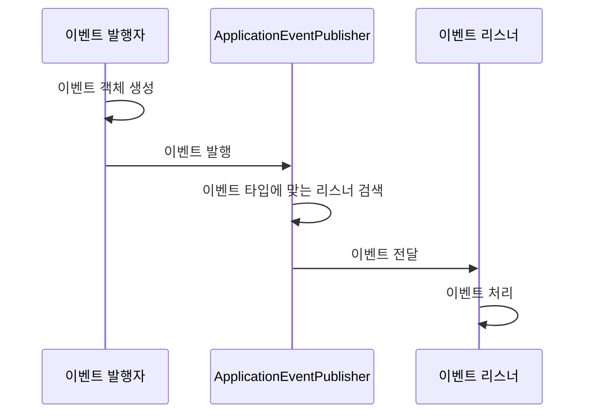

Spring Event는 Spring 프레임워크에서 제공하는 이벤트 기반 프로그래밍을 지원하는 메커니즘입니다. 이 메커니즘을 통해 애플리케이션 컴포넌트 간의 느슨한 결합을 유지하면서 효과적인 통신이 가능해집니다. Spring의 이벤트 시스템은 옵저버 패턴을 기반으로 하며, 발행-구독(Publish-Subscribe) 모델을 따릅니다.

[[이벤트 기반 아키텍처(Event-Driven Architecture)]]는 현대 애플리케이션 개발에서 중요한 역할을 하며, 특히 마이크로서비스나 대규모 엔터프라이즈 애플리케이션에서 컴포넌트 간의 효율적인 통신 방법으로 활용됩니다. Spring Event의 개념을 이해하기 위해서는 [[옵저버 패턴(Observer Pattern)]]과 [[발행-구독 모델(Publish-Subscribe Model)]]에 대한 기본적인 이해가 필요합니다.

## Spring Event의 핵심 개념

Spring Event 시스템은 세 가지 핵심 요소로 구성됩니다:

1. **이벤트(Event)**: 시스템 내에서 발생한 상태 변화나 액션을 나타내는 객체입니다.
2. **이벤트 발행자(Event Publisher)**: 이벤트를 생성하고 발행하는 주체입니다.
3. **이벤트 리스너(Event Listener)**: 특정 이벤트를 구독하고 해당 이벤트가 발생했을 때 반응하는 컴포넌트입니다.

이 세 요소가 상호작용하는 방식을 통해 애플리케이션 내 컴포넌트들이 직접적인 의존성 없이도 효과적으로 통신할 수 있습니다.

## Spring Event의 동작 방식

Spring Event의 동작 흐름은 다음과 같습니다:



1. 이벤트 발행자가 이벤트 객체를 생성합니다.
2. `ApplicationEventPublisher`를 통해 이벤트를 발행합니다.
3. Spring 컨테이너는 해당 이벤트 타입을 처리할 수 있는 모든 리스너를 찾습니다.
4. 이벤트가 모든 관련 리스너에게 전달됩니다.
5. 각 리스너는 이벤트를 처리합니다.

## Spring Event의 종류

Spring에서는 크게 두 가지 유형의 이벤트를 제공합니다:

### 1. 프레임워크 이벤트

Spring 프레임워크 자체에서 발생시키는 이벤트로, 애플리케이션 라이프사이클과 관련됩니다.

주요 프레임워크 이벤트는 다음과 같습니다:

- **ContextRefreshedEvent**: ApplicationContext가 초기화되거나 새로고침될 때 발생합니다.
- **ContextStartedEvent**: ApplicationContext가 start() 메서드에 의해 시작될 때 발생합니다.
- **ContextStoppedEvent**: ApplicationContext가 stop() 메서드에 의해 중지될 때 발생합니다.
- **ContextClosedEvent**: ApplicationContext가 close() 메서드에 의해 종료될 때 발생합니다.
- **RequestHandledEvent**: HTTP 요청이 처리될 때 발생합니다(웹 애플리케이션에서만 해당).

프레임워크 이벤트에 대한 자세한 내용은 [[Spring 프레임워크 이벤트]]를 참고해주세요.

### 2. 사용자 정의 이벤트

개발자가 직접 정의하여 비즈니스 로직에 활용하는 이벤트입니다. 사용자 정의 이벤트는 `ApplicationEvent` 클래스를 상속받거나 Spring 4.2부터는 POJO(Plain Old Java Object)를 이벤트 객체로 사용할 수 있습니다.

## 이벤트 생성 및 발행

### 이벤트 객체 생성

Spring 4.2 이전에는 `ApplicationEvent` 클래스를 상속받아 이벤트를 정의했습니다:

```java
public class UserCreatedEvent extends ApplicationEvent {
    private final String username;
    
    public UserCreatedEvent(Object source, String username) {
        super(source);
        this.username = username;
    }
    
    public String getUsername() {
        return username;
    }
}
```

Spring 4.2 이후부터는 POJO를 이벤트 객체로 사용할 수 있게 되었습니다:

```java
public class UserCreatedEvent {
    private final String username;
    
    public UserCreatedEvent(String username) {
        this.username = username;
    }
    
    public String getUsername() {
        return username;
    }
}
```

### 이벤트 발행

이벤트를 발행하기 위해서는 `ApplicationEventPublisher`를 사용합니다:

```java
@Service
public class UserService {
    private final ApplicationEventPublisher eventPublisher;
    
    @Autowired
    public UserService(ApplicationEventPublisher eventPublisher) {
        this.eventPublisher = eventPublisher;
    }
    
    public void createUser(String username, String email) {
        // 사용자 생성 로직...
        
        // 이벤트 발행
        eventPublisher.publishEvent(new UserCreatedEvent(username));
    }
}
```

또는 `ApplicationEventPublisherAware` 인터페이스를 구현하여 `ApplicationEventPublisher`를 주입받을 수도 있습니다:

```java
@Service
public class UserService implements ApplicationEventPublisherAware {
    private ApplicationEventPublisher eventPublisher;
    
    @Override
    public void setApplicationEventPublisher(ApplicationEventPublisher eventPublisher) {
        this.eventPublisher = eventPublisher;
    }
    
    public void createUser(String username, String email) {
        // 사용자 생성 로직...
        
        // 이벤트 발행
        eventPublisher.publishEvent(new UserCreatedEvent(username));
    }
}
```

## 이벤트 리스너 구현

### `@EventListener` 어노테이션 사용 (권장)

Spring 4.2부터는 `@EventListener` 어노테이션을 통해 이벤트 리스너를 간단하게 구현할 수 있습니다:

```java
@Component
public class UserEventListener {
    
    @EventListener
    public void handleUserCreatedEvent(UserCreatedEvent event) {
        System.out.println("사용자가 생성되었습니다: " + event.getUsername());
        // 이벤트에 대한 처리 로직...
    }
}
```

### `ApplicationListener` 인터페이스 구현

전통적인 방식으로는 `ApplicationListener` 인터페이스를 구현하여 이벤트 리스너를 정의할 수 있습니다:

```java
@Component
public class UserEventListener implements ApplicationListener<UserCreatedEvent> {
    
    @Override
    public void onApplicationEvent(UserCreatedEvent event) {
        System.out.println("사용자가 생성되었습니다: " + event.getUsername());
        // 이벤트에 대한 처리 로직...
    }
}
```

이벤트 리스너의 구현 방식에 따른 장단점은 [[Spring 이벤트 리스너 구현 방식]]에서 자세히 다루고 있습니다.

## 비동기 이벤트 처리

기본적으로 Spring 이벤트는 동기적으로 처리됩니다. 즉, 이벤트 발행자는 모든 리스너가 이벤트 처리를 완료할 때까지 블로킹됩니다. 이런 동기적 처리는 간단하고 직관적이지만, 리스너의 처리 시간이 길어질 경우 발행자의 성능에 영향을 줄 수 있습니다.

이러한 문제를 해결하기 위해 Spring은 비동기 이벤트 처리를 지원합니다:

```java
@Configuration
@EnableAsync
public class AsyncConfig {
    
    @Bean
    public Executor taskExecutor() {
        ThreadPoolTaskExecutor executor = new ThreadPoolTaskExecutor();
        executor.setCorePoolSize(5);
        executor.setMaxPoolSize(10);
        executor.setQueueCapacity(25);
        executor.setThreadNamePrefix("EventAsync-");
        executor.initialize();
        return executor;
    }
}
```

`@Async` 어노테이션을 `@EventListener`와 함께 사용하여 비동기 이벤트 리스너를 구현할 수 있습니다:

```java
@Component
public class UserEventListener {
    
    @Async
    @EventListener
    public void handleUserCreatedEvent(UserCreatedEvent event) {
        System.out.println("비동기적으로 사용자 생성 처리 중: " + event.getUsername());
        // 시간이 오래 걸리는 작업...
    }
}
```

비동기 이벤트 처리에 대한 상세한 내용은 [[Spring 비동기 이벤트 처리]]를 참고해주세요.

## 트랜잭션 바인딩 이벤트

Spring은 트랜잭션과 연계된 이벤트 처리를 지원합니다. `@TransactionalEventListener` 어노테이션을 사용하면 트랜잭션의 특정 단계(완료, 롤백 등)에 이벤트를 바인딩할 수 있습니다.

```java
@Component
public class UserEventListener {
    
    @TransactionalEventListener(phase = TransactionPhase.AFTER_COMMIT)
    public void handleUserCreatedEvent(UserCreatedEvent event) {
        System.out.println("트랜잭션이 성공적으로 커밋된 후 사용자 생성 처리: " + event.getUsername());
        // 이벤트 처리 로직...
    }
}
```

`TransactionPhase`는 다음과 같은 옵션을 제공합니다:

- **AFTER_COMMIT**: 트랜잭션이 성공적으로 커밋된 후에 이벤트를 처리합니다(기본값).
- **AFTER_ROLLBACK**: 트랜잭션이 롤백된 후에 이벤트를 처리합니다.
- **AFTER_COMPLETION**: 트랜잭션이 완료된 후(커밋 또는 롤백)에 이벤트를 처리합니다.
- **BEFORE_COMMIT**: 트랜잭션이 커밋되기 전에 이벤트를 처리합니다.

트랜잭션 이벤트 리스너에 대한 자세한 내용은 [[Spring 트랜잭션 이벤트 리스너]]를 참고해주세요.

## 조건부 이벤트 처리

Spring 4.2부터는 `@EventListener`의 `condition` 속성을 사용하여 SpEL(Spring Expression Language) 표현식을 기반으로 조건부 이벤트 처리가 가능합니다:

```java
@Component
public class UserEventListener {
    
    @EventListener(condition = "#event.username == 'admin'")
    public void handleAdminUserCreatedEvent(UserCreatedEvent event) {
        System.out.println("관리자 사용자가 생성되었습니다: " + event.getUsername());
        // 관리자 사용자 생성에 대한 특수 처리...
    }
}
```

이 예제에서는 `username`이 "admin"인 경우에만 이벤트 리스너가 동작합니다.

## 이벤트 리스너 우선순위 지정

여러 리스너가 동일한 이벤트를 처리할 때 실행 순서를 제어하고 싶다면 `@Order` 어노테이션을 사용할 수 있습니다:

```java
@Component
public class UserEventListener {
    
    @Order(1)
    @EventListener
    public void sendWelcomeEmail(UserCreatedEvent event) {
        System.out.println("환영 이메일 발송: " + event.getUsername());
        // 이메일 발송 로직...
    }
    
    @Order(2)
    @EventListener
    public void createUserProfile(UserCreatedEvent event) {
        System.out.println("사용자 프로필 생성: " + event.getUsername());
        // 프로필 생성 로직...
    }
}
```

숫자가 낮을수록 높은 우선순위를 가지며, 해당 리스너가 먼저 실행됩니다.

## Spring Event의 장단점

### 장점

- **느슨한 결합(Loose Coupling)**: 컴포넌트 간의 직접적인 의존성을 줄여 유지보수와 테스트가 용이해집니다.
- **확장성(Scalability)**: 새로운 기능이 추가될 때 기존 코드를 수정하지 않고도 새로운 리스너를 추가할 수 있습니다.
- **관심사 분리(Separation of Concerns)**: 핵심 비즈니스 로직과 부가 기능을 분리할 수 있습니다.
- **유연성(Flexibility)**: 동기/비동기 처리, 트랜잭션 처리 등 다양한 옵션을 제공합니다.

### 단점

- **디버깅 어려움**: 이벤트 기반 시스템은 코드 흐름을 추적하기 어려울 수 있습니다.
- **오버헤드**: 과도한 이벤트 사용은 시스템 복잡성을 증가시키고 성능에 영향을 줄 수 있습니다.
- **순서 보장 문제**: 기본적으로 리스너 실행 순서가 보장되지 않아 `@Order`를 통한 명시적 순서 지정이 필요합니다.
- **이벤트 손실 가능성**: 특히 비동기 처리에서 예외 발생 시 이벤트가 손실될 수 있습니다.

## 실제 사용 사례

Spring Event는 다양한 상황에서 활용될 수 있습니다:

1. **감사(Audit) 로깅**: 중요한 비즈니스 액션이 발생할 때 로그를 남기기 위해 이벤트를 사용할 수 있습니다.
2. **캐시 무효화**: 데이터가 변경될 때 관련 캐시를 무효화하는 이벤트를 발행할 수 있습니다.
3. **이메일 알림**: 사용자 등록, 주문 완료 등의 이벤트 발생 시 이메일을 발송할 수 있습니다.
4. **통계 수집**: 시스템 사용 패턴을 분석하기 위한 데이터를 수집할 수 있습니다.
5. **도메인 이벤트**: DDD(Domain-Driven Design)에서 도메인 이벤트를 구현하는 데 활용할 수 있습니다.

실제 사용 사례에 대한 상세한 내용은 [[Spring Event 실전 활용 사례]]를 참고해주세요.

## 이벤트 기반 아키텍처와의 통합

Spring Event는 내부 애플리케이션 이벤트를 처리하는 데 적합하지만, 대규모 분산 시스템에서는 RabbitMQ, Kafka 등의 외부 메시징 시스템과 통합하여 사용하는 경우가 많습니다.

Spring Event와 외부 메시징 시스템을 연계하는 방법으로는 Spring Event를 발행한 후, 리스너에서 외부 메시징 시스템으로 이벤트를 전파하는 방식이 일반적입니다.

```java
@Component
public class ExternalEventPublisher {
    
    private final KafkaTemplate<String, Object> kafkaTemplate;
    
    @Autowired
    public ExternalEventPublisher(KafkaTemplate<String, Object> kafkaTemplate) {
        this.kafkaTemplate = kafkaTemplate;
    }
    
    @EventListener
    public void handleUserCreatedEvent(UserCreatedEvent event) {
        // 내부 Spring Event를 외부 Kafka 이벤트로 변환하여 발행
        kafkaTemplate.send("user-events", event.getUsername(), event);
    }
}
```

외부 메시징 시스템과의 통합에 대한 자세한 내용은 [[Spring Event와 외부 메시징 시스템 통합]]을 참고해주세요.

## 테스트 방법

Spring Event를 사용하는 코드의 테스트는 다음과 같은 방법으로 수행할 수 있습니다:

1. **이벤트 발행 테스트**: 특정 조건에서 이벤트가 올바르게 발행되는지 검증합니다.
2. **이벤트 리스너 테스트**: 이벤트 리스너가 이벤트를 받았을 때 예상대로 동작하는지 검증합니다.

```java
@SpringBootTest
public class UserServiceTest {
    
    @Autowired
    private UserService userService;
    
    @MockBean
    private ApplicationEventPublisher eventPublisher;
    
    @Test
    public void testCreateUser_ShouldPublishUserCreatedEvent() {
        // Given
        String username = "testuser";
        String email = "test@example.com";
        
        // When
        userService.createUser(username, email);
        
        // Then
        verify(eventPublisher).publishEvent(argThat(event -> 
            event instanceof UserCreatedEvent && 
            ((UserCreatedEvent) event).getUsername().equals(username)
        ));
    }
}
```

Spring Event의 테스트에 대한 자세한 내용은 [[Spring Event 테스트 방법]]을 참고해주세요.

## 모범 사례 및 주의사항

Spring Event를 효과적으로 활용하기 위한 몇 가지 모범 사례와 주의사항입니다:

1. **이벤트는 불변(Immutable)으로 설계**: 이벤트 객체는 여러 리스너에 의해 공유되므로 불변으로 설계하는 것이 안전합니다.
2. **이벤트 이름은 과거 시제로 사용**: 이벤트는 이미 발생한 것을 나타내므로 `UserCreated`, `OrderCompleted`와 같이 과거 시제를 사용합니다.
3. **적절한 이벤트 사용**: 모든 것을 이벤트로 처리하지 말고, 실제로 다른 컴포넌트에서 관심을 가질 만한 중요한 상태 변화에만 이벤트를 사용합니다.
4. **예외 처리**: 특히 비동기 이벤트 리스너에서 발생하는 예외를 적절히 처리해야 합니다.
5. **스프링 부트의 자동 설정 활용**: 스프링 부트는 이벤트 관련 컴포넌트를 자동으로 설정하므로, 별도의 설정 없이도 이벤트 시스템을 바로 사용할 수 있습니다.

더 많은 모범 사례와 주의사항은 [[Spring Event 모범 사례]]를 참고해주세요.

## 결론

Spring Event는 애플리케이션 컴포넌트 간의 느슨한 결합을 유지하면서 효과적인 통신을 가능하게 하는 강력한 메커니즘입니다. 이벤트 기반 아키텍처는 확장성, 유지보수성, 테스트 용이성 등 다양한 이점을 제공합니다.

Spring 4.2 이후로 도입된 개선사항들(POJO 이벤트, `@EventListener` 어노테이션, `@TransactionalEventListener` 등)을 통해 보다 간결하고 직관적인 이벤트 기반 프로그래밍이 가능해졌습니다.

다만, 이벤트 기반 시스템은 코드 흐름을 추적하기 어렵게 만들 수 있으므로, 적절한 로깅과 모니터링이 중요합니다. 또한, 과도한 이벤트 사용은 시스템 복잡성을 증가시킬 수 있으므로, 실제로 다른 컴포넌트에서 관심을 가질 만한 중요한 상태 변화에만 이벤트를 사용하는 것이 좋습니다.

Spring Event를 효과적으로 활용하면, 보다 모듈화되고 확장성 있는 애플리케이션을 구축할 수 있을 것입니다.

## 참고 자료

- Spring Framework 공식 문서(https://docs.spring.io/spring-framework/docs/current/reference/html/core.html#context-functionality-events)
- Spring Boot in Action - Craig Walls
- 도메인 주도 설계 구현 - Vaughn Vernon
- 클린 아키텍처 - Robert C. Martin