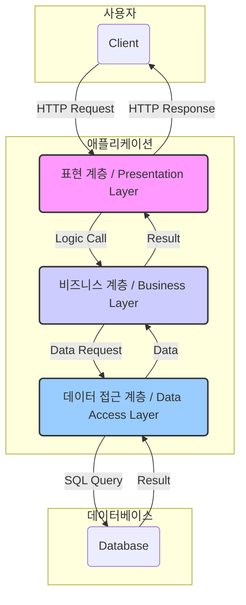

소프트웨어 개발의 세계에 첫발을 내디뎠을 때, 우리는 대부분 기능 구현에 집중합니다. 어떻게 하면 이 코드가 동작하게 만들까, 어떤 알고리즘을 써야 더 빠를까. 하지만 프로젝트의 규모가 커지고 여러 개발자가 함께 일하게 되면서, 단순히 '동작하는' 코드를 넘어 '좋은' 코드를 고민하게 됩니다. 그리고 그 고민의 중심에는 바로 **소프트웨어 아키텍처**가 있습니다.

이 글에서는 소프트웨어 아키텍처가 무엇인지, 왜 중요한지, 그리고 좋은 아키텍처를 구성하는 핵심 원칙은 무엇인지 논리적이고 명확하게 소개해 드리고자 합니다. 이 글은 이제 막 아키텍처에 대한 고민을 시작한 주니어 개발자부터 자신의 지식을 재정립하고 싶은 시니어 개발자 모두를 위한 나침반이 되어줄 것입니다.

---

### 소프트웨어 아키텍처란 무엇인가요?

가장 단순하게 정의하면, **소프트웨어 아키텍처는 ‘소프트웨어 시스템을 구성하는 주요 요소들과 그들 사이의 관계, 그리고 이들의 설계와 진화를 이끄는 원칙들의 집합’** 입니다.

이는 마치 건물을 짓기 전 설계도를 그리는 것과 같습니다. 어떤 방을 어디에 배치할지, 건물의 하중을 어떻게 분산시킬지, 전기 및 배관 시스템은 어떻게 연결할지 등 전체적인 구조를 결정하는 과정이죠. 이 설계도가 부실하다면, 아무리 좋은 자재로 방 하나를 잘 꾸민다 한들 건물 전체가 위험해지거나 비효율적인 공간이 될 수밖에 없습니다.

소프트웨어 아키텍처는 다음과 같은 질문에 대한 답을 정의합니다.

- 시스템은 어떤 주요 컴포넌트로 나뉘는가? (예: 사용자 인터페이스, 비즈니스 로직, 데이터베이스)
- 이 컴포넌트들은 서로 어떻게 상호작용하는가? (예: API 호출, 메시지 큐, 직접 함수 호출)
- 전체 시스템의 품질(예: 성능, 보안, 확장성)을 보장하기 위한 기술과 패턴은 무엇인가?

많은 분이 '아키텍처'와 '설계(Design)'를 혼용하지만, 둘 사이에는 중요한 차이가 있습니다. 아키텍처가 시스템의 전체적인 구조와 방향성을 결정하는 '거시적인' 관점이라면, 설계는 각 컴포넌트 내부의 구체적인 구현 방식을 다루는 '미시적인' 관점에 가깝습니다. [[아키텍처와 설계의 차이]]에 대해 더 깊이 알아볼 수 있습니다.

### 왜 좋은 아키텍처가 중요한가요?

잘 설계된 아키텍처는 프로젝트의 성공과 직결되는 중요한 가치를 제공합니다. 단순히 기술적 우아함을 넘어, 비즈니스 목표 달성에 실질적인 영향을 미칩니다.

1. **지속 가능한 개발 속도 유지**: 프로젝트 초반에는 아키텍처 없이 빠르게 기능을 개발하는 것이 더 효율적으로 보일 수 있습니다. 하지만 시간이 지날수록 코드는 복잡하게 얽히고(스파게티 코드), 작은 변경 하나가 예상치 못한 부작용을 일으키며 개발 속도는 급격히 저하됩니다. 좋은 아키텍처는 시스템의 복잡도를 관리하고 변경에 드는 비용을 줄여, 장기적으로 높은 생산성을 유지하게 해줍니다.
2. **확장성과 유지보수 용이성**: 비즈니스는 끊임없이 변화하고, 소프트웨어는 그에 맞춰 성장해야 합니다. 잘 정의된 아키텍처는 새로운 기능을 추가하거나 기존 기능을 수정하기 쉽게 만들어 줍니다. 각 컴포넌트가 명확한 책임과 경계를 가지므로, 수정의 영향 범위를 예측하고 관리하기 용이해집니다.
3. **이해관계자 간의 원활한 소통**: 아키텍처는 개발팀, 기획자, 프로젝트 관리자 등 다양한 이해관계자들이 시스템을 이해하는 공통의 언어 역할을 합니다. 시스템의 전체적인 구조와 동작 방식을 시각적으로, 또 논리적으로 표현함으로써, 모두가 동일한 그림을 보고 효율적으로 소통하고 의사결정을 내릴 수 있도록 돕습니다.

### 좋은 아키텍처를 위한 핵심 원칙

좋은 아키텍처는 몇 가지 핵심적인 원칙 위에 세워집니다. 이 원칙들은 시스템을 더 유연하고, 견고하며, 이해하기 쉽게 만들어 줍니다.

- **[[관심사 분리 (Separation of Concerns)]]**: 시스템을 각각 다른 관심사를 가진 여러 부분으로 분리하는 원칙입니다. 예를 들어, 사용자에게 보이는 부분(UI), 데이터 처리 규칙을 다루는 부분(Business Logic), 데이터를 저장하고 읽어오는 부분(Data Access)을 분리하는 것이 대표적입니다.
- **[[모듈화 (Modularity)]]**: 시스템을 독립적으로 기능하는 여러 개의 작은 모듈로 나누는 것을 의미합니다. 각 모듈은 재사용이 가능하고, 개별적으로 개발 및 테스트가 가능하여 생산성을 높입니다.
- **[[추상화 (Abstraction)]]**: 복잡한 내부 구현은 숨기고, 사용에 필요한 핵심적인 기능만 외부로 노출하는 원칙입니다. 이를 통해 사용자는 각 부분의 복잡한 동작 원리를 모두 알지 못해도 시스템을 쉽게 사용할 수 있습니다.
- **[[SOLID 원칙]]**: 객체 지향 설계에서 시작되었지만, 현대적인 소프트웨어 아키텍처 전반에 적용되는 다섯 가지 중요한 설계 원칙입니다.

### 아키텍처 시각화: 계층형 아키텍처 (Layered Architecture)

복잡한 시스템의 흐름을 설명할 때, 글만으로는 이해하기 어려운 경우가 많습니다. 이럴 때 `mermaid`와 같은 도구를 사용한 시각화는 매우 효과적입니다. 가장 고전적이면서도 널리 사용되는 **계층형 아키텍처**를 예로 들어보겠습니다.

계층형 아키텍처는 시스템의 각기 다른 관심사를 논리적인 계층으로 분리하는 구조입니다. 각 계층은 자신보다 하위 계층에만 의존하며, 특정 계층의 변경이 다른 계층에 미치는 영향을 최소화합니다.

위 다이어그램은 사용자의 요청이 어떻게 각 계층을 거쳐 처리되고 응답이 반환되는지를 명확하게 보여줍니다.

- **표현 계층**: 사용자와 직접 상호작용하며, 요청을 받아들이고 응답을 표시합니다. (예: 웹 서버, API 엔드포인트)
- **비즈니스 계층**: 시스템의 핵심 로직을 수행합니다. 데이터의 유효성을 검사하고, 비즈니스 규칙에 따라 데이터를 가공합니다.
- **데이터 접근 계층**: 데이터베이스나 외부 스토리지와의 통신을 책임집니다. 데이터의 영속성(Persistence)을 관리합니다.

이처럼 아키텍처를 시각화하면 복잡한 상호작용을 직관적으로 이해하고 팀원들과 공유하기가 훨씬 수월해집니다.

---

### 글을 마치며

소프트웨어 아키텍처는 한번 결정하고 끝나는 것이 아니라, 프로젝트의 생명주기 동안 끊임없이 고민하고 개선해나가는 과정입니다. 훌륭한 아키텍처는 기술적인 제약을 해결하는 것을 넘어, 비즈니스의 성공과 팀의 성장을 뒷받침하는 든든한 토대입니다.

이 글을 통해 아키텍처의 중요성을 이해하고, 여러분의 프로젝트에 어떤 아키텍처가 적합할지 고민해보는 계기가 되기를 바랍니다.

#### 참고 자료

- _Clean Architecture: A Craftsman's Guide to Software Structure and Design_ by Robert C. Martin
- _Patterns of Enterprise Application Architecture_ by Martin Fowl1er
- _Designing Data-Intensive Applications_ by Martin Kleppmann
- [yozm.wishket.com - 개발자를 위한 '소프트웨어 아키텍처' 개념과 활용법](https://yozm.wishket.com/magazine/detail/2743/)