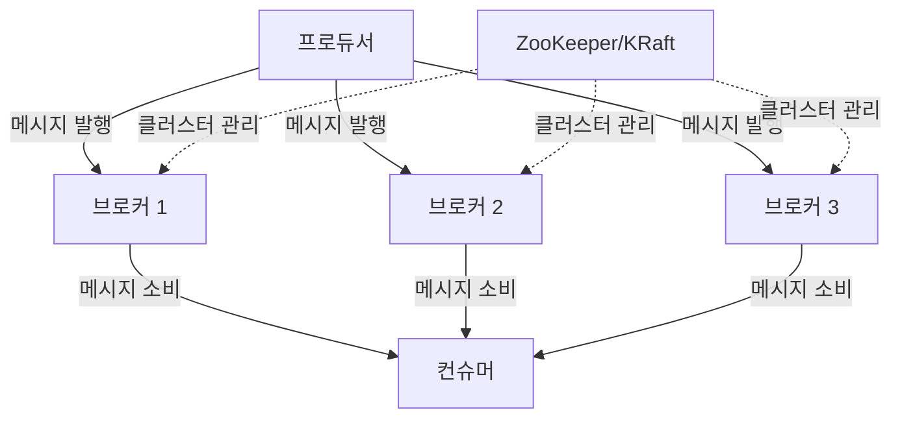
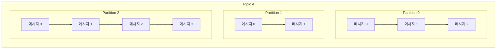
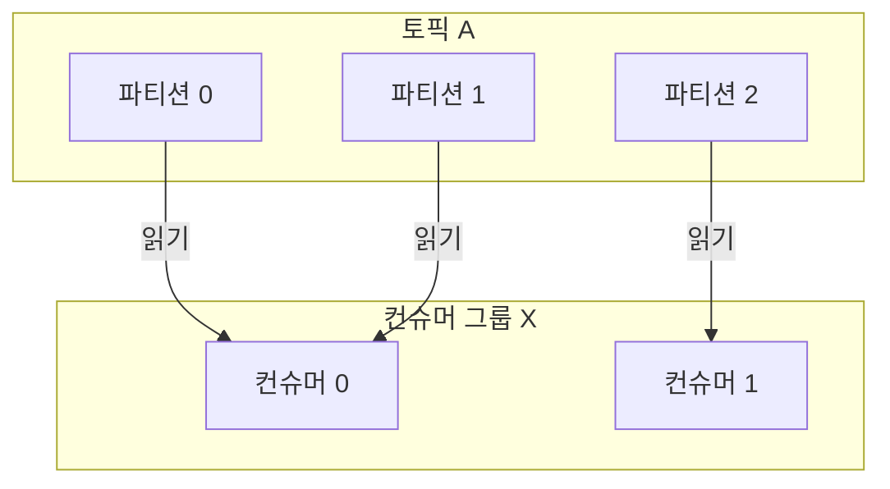

아파치 카프카(Apache Kafka)는 LinkedIn에서 개발되어 2011년 오픈소스로 공개된 분산 [[이벤트 스트리밍(Event Streaming)]] 플랫폼입니다. 이벤트 스트리밍이란 [[이벤트(Event)]]를 실시간으로 지속적으로 생성하고 처리하는 방식을 의미합니다. 카프카는 대용량 데이터를 높은 처리량(throughput)과 낮은 지연시간(latency)으로 안정적으로 처리할 수 있도록 설계되었습니다.

카프카는 세 가지 핵심 기능을 제공합니다:

1. **데이터 스트림 발행(publish)과 구독(subscribe)**: 다양한 시스템과 애플리케이션 간의 데이터 스트림을 안정적으로 전송합니다.
2. **데이터 스트림 저장**: 내구성을 가진 분산 저장소에 데이터 스트림을 지속적으로 저장합니다.
3. **데이터 스트림 처리**: 데이터가 발생할 때 실시간으로 처리합니다.

## 2. 카프카의 주요 개념

### 2.1 카프카 아키텍처

카프카는 다음과 같은 핵심 컴포넌트로 구성됩니다:

- **브로커(Broker)**: 카프카 서버로, 메시지를 저장하고 전달하는 역할을 합니다.
- **주키퍼(ZooKeeper)**: 카프카 클러스터의 메타데이터를 관리하고 브로커의 상태를 모니터링합니다. (최신 버전에서는 KRaft 모드로 주키퍼 의존성 제거 가능)
- **프로듀서(Producer)**: 메시지를 생성하여 브로커에 전송합니다.
- **컨슈머(Consumer)**: 브로커로부터 메시지를 읽어들입니다.
- **토픽(Topic)**: 메시지가 저장되는 카테고리입니다.
- **파티션(Partition)**: 토픽을 여러 부분으로 나누어 병렬 처리를 가능하게 합니다.

아래 다이어그램은 카프카의 기본 아키텍처를 보여줍니다:



### 2.2 토픽과 파티션

**[[카프카 토픽(Topic)|토픽]]** 은 카프카에서 메시지가 저장되는 논리적인 채널입니다. 각 토픽은 여러 **[[카프카 파티션(Partition)|파티션]]** 으로 분할될 수 있으며, 이를 통해 병렬 처리가 가능해집니다.

파티션의 특징:

- 각 파티션은 순서가 보장된 메시지 시퀀스입니다.
- 파티션 내부의 각 메시지는 '오프셋(offset)'이라는 고유 식별자를 가집니다.
- 새로운 메시지는 항상 파티션의 끝에 추가됩니다(append-only).
- 파티션은 여러 브로커에 분산 저장되어 고가용성과 확장성을 제공합니다.



### 2.3 프로듀서와 컨슈머

**프로듀서(Producer)**는 특정 토픽에 메시지를 발행합니다. 프로듀서는 메시지 키와 파티셔닝 전략을 사용하여 메시지가 어떤 파티션으로 전송될지 결정할 수 있습니다. 동일한 키를 가진 메시지는 항상 같은 파티션으로 전송됩니다.

**컨슈머(Consumer)**는 하나 이상의 토픽을 구독하고 메시지를 읽어들입니다. 각 컨슈머는 메시지를 읽은 후 현재 오프셋을 기록하여 중복 처리를 방지합니다.

컨슈머 그룹(Consumer Group)을 통해 여러 컨슈머가 토픽의 파티션을 나누어 처리할 수 있습니다. 이를 통해 병렬 처리와 고가용성을 확보할 수 있습니다.



## 3. 카프카의 핵심 특징

### 3.1 고가용성과 내구성

카프카는 다음과 같은 방식으로 고가용성과 내구성을 보장합니다:

- **복제(Replication)**: 각 파티션은 여러 브로커에 복제하여 저장됩니다. 복제 계수(replication factor)를 통해 복제본 수를 지정할 수 있습니다.
- **리더와 팔로워(Leader and Follower)**: 각 파티션은 한 개의 리더와 여러 개의 팔로워를 가집니다. 리더는 읽기와 쓰기를 담당하고, 팔로워는 리더의 데이터를 복제합니다.
- **자동 복구(Automatic Recovery)**: 브로커가 실패하면 카프카는 자동으로 새로운 리더를 선출하고 데이터 복제를 재조정합니다.

### 3.2 확장성

카프카는 수평적 확장이 쉽습니다:

- **브로커 추가**: 새로운 브로커를 클러스터에 추가하여 처리 용량을 늘릴 수 있습니다.
- **파티션 확장**: 토픽의 파티션 수를 증가시켜 병렬 처리 능력을 향상시킬 수 있습니다.

### 3.3 성능

카프카의 높은 성능은 다음과 같은 설계에서 비롯됩니다:

- **배치 처리(Batch Processing)**: 메시지를 개별적으로 처리하지 않고 배치로 처리하여 네트워크 왕복 시간을 줄입니다.
- **제로 카피(Zero Copy)**: 커널 수준에서 디스크에서 네트워크로 데이터를 직접 전송하여 CPU 오버헤드를 최소화합니다.
- **페이지 캐시(Page Cache)**: 운영체제의 페이지 캐시를 활용하여 디스크 I/O를 최적화합니다.
- **순차적 I/O**: 메시지를 순차적으로 디스크에 쓰고 읽어 랜덤 액세스보다 높은 성능을 제공합니다.

## 4. 카프카 사용 사례

### 4.1 메시징 시스템

카프카는 기존의 메시징 시스템보다 높은 처리량과 내구성을 제공합니다. 여러 생산자와 소비자 간의 비동기 통신에 적합합니다.

### 4.2 로그 집계

다양한 서비스에서 생성되는 로그를 중앙 집중화하고 처리할 수 있습니다. 로그를 수집하여 Elasticsearch, Hadoop 또는 다른 데이터 스토리지 시스템으로 전송할 수 있습니다.

### 4.3 스트림 처리

카프카 스트림즈(Kafka Streams) API를 사용하여 실시간으로 데이터를 변환하고 처리할 수 있습니다. 복잡한 이벤트 처리, 실시간 분석, 데이터 변환 등에 사용됩니다.

### 4.4 이벤트 소싱

시스템의 상태 변화를 이벤트로 저장하는 [[이벤트 소싱(Event Sourcing)]] 아키텍처에 적합합니다. 카프카의 지속적인 로그 저장 능력은 이벤트 소싱에 이상적입니다.

### 4.5 데이터 파이프라인

Kafka Connect를 사용하여 다양한 소스에서 데이터를 수집하고 다양한 싱크로 데이터를 전송하는 ETL(Extract, Transform, Load) 파이프라인을 구축할 수 있습니다.

## 5. 카프카 자바 프로그래밍 예제

### 5.1 프로듀서 예제

```java
import org.apache.kafka.clients.producer.*;
import java.util.Properties;

public class SimpleProducer {
    public static void main(String[] args) {
        // 프로듀서 설정
        Properties props = new Properties();
        props.put("bootstrap.servers", "localhost:9092");
        props.put("key.serializer", "org.apache.kafka.common.serialization.StringSerializer");
        props.put("value.serializer", "org.apache.kafka.common.serialization.StringSerializer");
        
        Producer<String, String> producer = new KafkaProducer<>(props);
        
        // 메시지 생성 및 전송
        for (int i = 0; i < 10; i++) {
            String key = "key-" + i;
            String value = "value-" + i;
            
            ProducerRecord<String, String> record = new ProducerRecord<>("my-topic", key, value);
            
            // 비동기 전송
            producer.send(record, new Callback() {
                @Override
                public void onCompletion(RecordMetadata metadata, Exception exception) {
                    if (exception == null) {
                        System.out.println("메시지 전송 성공: " + 
                                          "토픽=" + metadata.topic() + 
                                          ", 파티션=" + metadata.partition() + 
                                          ", 오프셋=" + metadata.offset());
                    } else {
                        System.err.println("메시지 전송 실패: " + exception.getMessage());
                    }
                }
            });
        }
        
        // 모든 요청 완료 대기 및 자원 해제
        producer.flush();
        producer.close();
    }
}
```

### 5.2 컨슈머 예제

```java
import org.apache.kafka.clients.consumer.*;
import org.apache.kafka.common.serialization.StringDeserializer;
import java.time.Duration;
import java.util.Arrays;
import java.util.Properties;

public class SimpleConsumer {
    public static void main(String[] args) {
        // 컨슈머 설정
        Properties props = new Properties();
        props.put("bootstrap.servers", "localhost:9092");
        props.put("group.id", "my-consumer-group");
        props.put("key.deserializer", StringDeserializer.class.getName());
        props.put("value.deserializer", StringDeserializer.class.getName());
        props.put("auto.offset.reset", "earliest");
        props.put("enable.auto.commit", "false");
        
        Consumer<String, String> consumer = new KafkaConsumer<>(props);
        
        // 토픽 구독
        consumer.subscribe(Arrays.asList("my-topic"));
        
        try {
            while (true) {
                // 메시지 폴링
                ConsumerRecords<String, String> records = consumer.poll(Duration.ofMillis(100));
                
                for (ConsumerRecord<String, String> record : records) {
                    System.out.println("메시지 수신: " + 
                                       "토픽=" + record.topic() + 
                                       ", 파티션=" + record.partition() + 
                                       ", 오프셋=" + record.offset() + 
                                       ", 키=" + record.key() + 
                                       ", 값=" + record.value());
                }
                
                // 오프셋 수동 커밋
                consumer.commitAsync(new OffsetCommitCallback() {
                    @Override
                    public void onComplete(Map<TopicPartition, OffsetAndMetadata> offsets, Exception exception) {
                        if (exception != null) {
                            System.err.println("커밋 실패: " + exception.getMessage());
                        }
                    }
                });
            }
        } finally {
            consumer.close();
        }
    }
}
```

## 6. 스프링 부트와 카프카 통합

스프링 부트는 카프카와의 통합을 위한 편리한 추상화를 제공합니다.

### 6.1 의존성 추가

```xml
<dependency>
    <groupId>org.springframework.kafka</groupId>
    <artifactId>spring-kafka</artifactId>
</dependency>
```

### 6.2 설정

```properties
# application.properties
spring.kafka.bootstrap-servers=localhost:9092
spring.kafka.producer.key-serializer=org.apache.kafka.common.serialization.StringSerializer
spring.kafka.producer.value-serializer=org.apache.kafka.common.serialization.StringSerializer
spring.kafka.consumer.group-id=my-consumer-group
spring.kafka.consumer.auto-offset-reset=earliest
spring.kafka.consumer.key-deserializer=org.apache.kafka.common.serialization.StringDeserializer
spring.kafka.consumer.value-deserializer=org.apache.kafka.common.serialization.StringDeserializer
```

### 6.3 스프링 부트 프로듀서 예제

```java
import org.springframework.beans.factory.annotation.Autowired;
import org.springframework.kafka.core.KafkaTemplate;
import org.springframework.kafka.support.SendResult;
import org.springframework.stereotype.Service;
import org.springframework.util.concurrent.ListenableFuture;
import org.springframework.util.concurrent.ListenableFutureCallback;

@Service
public class KafkaProducerService {

    private final KafkaTemplate<String, String> kafkaTemplate;
    
    @Autowired
    public KafkaProducerService(KafkaTemplate<String, String> kafkaTemplate) {
        this.kafkaTemplate = kafkaTemplate;
    }
    
    public void sendMessage(String topic, String key, String message) {
        ListenableFuture<SendResult<String, String>> future = 
            kafkaTemplate.send(topic, key, message);
            
        future.addCallback(new ListenableFutureCallback<>() {
            @Override
            public void onSuccess(SendResult<String, String> result) {
                System.out.println("메시지 전송 성공: " + 
                                   "토픽=" + result.getRecordMetadata().topic() + 
                                   ", 파티션=" + result.getRecordMetadata().partition() + 
                                   ", 오프셋=" + result.getRecordMetadata().offset());
            }
            
            @Override
            public void onFailure(Throwable ex) {
                System.err.println("메시지 전송 실패: " + ex.getMessage());
            }
        });
    }
}
```

### 6.4 스프링 부트 컨슈머 예제

```java
import org.springframework.kafka.annotation.KafkaListener;
import org.springframework.kafka.support.KafkaHeaders;
import org.springframework.messaging.handler.annotation.Header;
import org.springframework.messaging.handler.annotation.Payload;
import org.springframework.stereotype.Service;

@Service
public class KafkaConsumerService {

    @KafkaListener(topics = "my-topic", groupId = "my-consumer-group")
    public void listen(@Payload String message,
                       @Header(KafkaHeaders.RECEIVED_TOPIC) String topic,
                       @Header(KafkaHeaders.RECEIVED_PARTITION_ID) int partition,
                       @Header(KafkaHeaders.OFFSET) long offset,
                       @Header(KafkaHeaders.RECEIVED_KEY) String key) {
        
        System.out.println("메시지 수신: " + 
                           "토픽=" + topic + 
                           ", 파티션=" + partition + 
                           ", 오프셋=" + offset + 
                           ", 키=" + key + 
                           ", 값=" + message);
        
        // 비즈니스 로직 처리
    }
}
```

## 7. 카프카 운영 및 모니터링

### 7.1 중요 설정 파라미터

카프카의 성능과 신뢰성에 영향을 미치는 주요 설정 파라미터입니다:

1. **브로커 설정**:
    
    - `log.retention.hours`: 로그(데이터)를 보관하는 시간 (기본값: 168시간/7일)
    - `num.partitions`: 토픽 생성 시 기본 파티션 수 (기본값: 1)
    - `default.replication.factor`: 기본 복제 계수 (기본값: 1)
2. **프로듀서 설정**:
    
    - `acks`: 메시지 전송 확인 수준 (0, 1, all)
    - `batch.size`: 배치 처리 크기
    - `linger.ms`: 배치 처리 대기 시간
3. **컨슈머 설정**:
    
    - `fetch.min.bytes`: 최소 페치 바이트 수
    - `fetch.max.wait.ms`: 최대 페치 대기 시간
    - `max.poll.records`: 한 번의 폴링에서 가져올 최대 레코드 수

### 7.2 모니터링 및 관리 도구

카프카 클러스터의 상태와 성능을 모니터링하기 위한 도구들:

1. **카프카 관리자 도구(Kafka Manager)**: LinkedIn에서 개발한 오픈소스 웹 인터페이스로, 카프카 클러스터를 관리하고 모니터링할 수 있습니다.
2. **Confluent Control Center**: Confluent에서 제공하는 상용 모니터링 및 관리 도구입니다.
3. **Prometheus & Grafana**: 오픈소스 모니터링 스택으로, JMX 메트릭을 수집하고 시각화할 수 있습니다.
4. **카프카 CLI 도구**: 토픽 생성, 소비자 그룹 관리 등 다양한 작업을 수행할 수 있는 명령줄 도구입니다.

### 7.3 성능 튜닝 팁

카프카의 성능을 최적화하기 위한 팁:

1. **적절한 파티션 수 설정**: 너무 많은 파티션은 오버헤드를 증가시키고, 너무 적은 파티션은 병렬 처리 능력을 제한합니다.
2. **하드웨어 최적화**: SSD 디스크, 충분한 메모리, 고속 네트워크를 사용합니다.
3. **배치 설정 최적화**: 프로듀서와 컨슈머의 배치 크기와 대기 시간을 조정합니다.
4. **압축 사용**: 네트워크 대역폭을 줄이기 위해 메시지 압축을 활성화합니다.
5. **적절한 복제 계수 설정**: 데이터 내구성과 가용성을 확보하기 위해 적절한 복제 계수를 설정합니다.

## 8. 결론

아파치 카프카는 분산 이벤트 스트리밍 플랫폼으로, 실시간 데이터 처리, 마이크로서비스 간 통신, 로그 집계, 이벤트 소싱 등 다양한 사용 사례에 적합합니다. 높은 처리량, 낮은 지연 시간, 내구성, 확장성을 갖춘 카프카는 현대적인 데이터 중심 애플리케이션에 필수적인 구성 요소가 되었습니다.

카프카를 효과적으로 활용하려면 아키텍처의 기본 개념을 이해하고, 적절한 설계 및 운영 방법을 학습하는 것이 중요합니다. 이 가이드가 카프카에 대한 이해를 돕고, 실제 프로젝트에 적용할 수 있는 지식을 제공했기를 바랍니다.

## 9. 관련 노트

- [[이벤트 스트리밍(Event Streaming)]]
- [[이벤트 소싱(Event Sourcing)]]
- 분산 시스템 설계
- 마이크로서비스 아키텍처