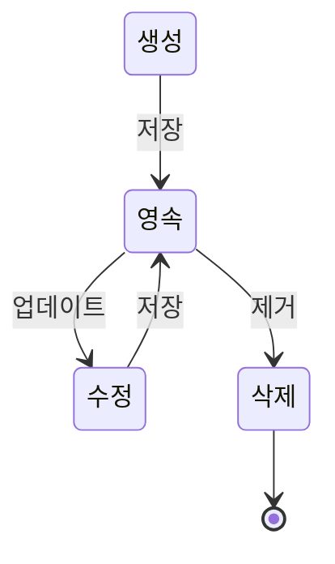

애그리게이트(Aggregate)는 도메인 주도 설계(Domain-Driven Design, DDD)에서 가장 중요한 개념 중 하나입니다. 이는 관련된 객체들의 집합을 하나의 단위로 취급하는 패턴으로, 데이터 일관성과 트랜잭션 경계를 명확히 정의하는 데 도움을 줍니다. 애그리게이트는 복잡한 도메인 모델을 더 작고 관리하기 쉬운 단위로 나누는 데 중요한 역할을 합니다. 애그리게이트의 개념을 이해하기 위해서는 먼저 [[도메인 주도 설계(DDD,Domain Driven Design)]] 기본 원칙을 이해하는 것이 중요합니다.

## 애그리게이트의 정의

애그리게이트는 연관된 객체들의 집합으로, 하나의 루트 엔티티(애그리게이트 루트)를 통해서만 접근이 가능합니다. 이는 도메인 내에서 일관성을 유지해야 하는 경계를 정의합니다. 애그리게이트 내의 객체들은 함께 생성되고, 수정되며, 삭제되는 경향이 있으며, 단일 단위로 처리됩니다.

## 애그리게이트의 구성 요소

애그리게이트는 다음과 같은 구성 요소를 포함합니다:

1. **애그리게이트 루트(Aggregate Root)**: 애그리게이트의 진입점이 되는 엔티티로, 외부에서는 이 루트를 통해서만 애그리게이트 내부 객체에 접근할 수 있습니다.
2. **엔티티(Entity)**: 고유 식별자를 가지고 있고, 생명주기 동안 연속성을 유지하는 객체입니다.
3. **값 객체(Value Object)**: 식별자가 없고, 속성 값으로만 식별되는 불변 객체입니다.

## 애그리게이트의 경계

애그리게이트의 경계는 도메인 규칙과 비즈니스 요구사항에 의해 결정됩니다. 애그리게이트 경계를 정의할 때는 다음과 같은 질문을 고려해볼 수 있습니다:

- 이 객체들은 항상 함께 변경되는가?
- 이 객체들 사이에 불변 규칙이 존재하는가?
- 이 객체들은 함께 생성되고 삭제되는가?

애그리게이트 경계에 대한 자세한 내용은 애그리게이트 경계 설정을 참고해주세요.

## 애그리게이트의 규칙

애그리게이트를 올바르게 설계하고 사용하기 위한 몇 가지 중요한 규칙들이 있습니다:

1. **애그리게이트 루트를 통한 접근**: 외부에서는 애그리게이트 루트를 통해서만 내부 객체에 접근해야 합니다.
2. **트랜잭션 일관성**: 하나의 트랜잭션은 하나의 애그리게이트만 수정해야 합니다. 여러 애그리게이트를 수정해야 한다면, 도메인 이벤트나 별도의 조정 메커니즘을 사용해야 합니다.
3. **참조 유지**: 다른 애그리게이트는 ID로만 참조해야 합니다. 객체 참조를 사용하지 않습니다.
4. **불변성 강제**: 애그리게이트 루트는 내부 객체들의 불변 조건을 강제하는 책임이 있습니다.

## 애그리게이트 생명주기

애그리게이트는 생성부터 삭제까지의 생명주기를 가집니다. 이 과정은 종종 리포지토리를 통해 관리됩니다.



1. **생성(Creation)**: 애그리게이트가 생성되고 초기화됩니다.
2. **영속(Persistence)**: 애그리게이트가 리포지토리에 저장됩니다.
3. **수정(Modification)**: 애그리게이트의 상태가 변경됩니다.
4. **삭제(Deletion)**: 애그리게이트가 리포지토리에서 제거됩니다.

## Java에서의 애그리게이트 구현

Java에서 애그리게이트를 구현할 때는 다음과 같은 접근 방식을 취할 수 있습니다:

### 애그리게이트 루트 예시

```java
public class Order {
    private OrderId id;
    private CustomerId customerId;
    private List<OrderLine> orderLines;
    private Money totalAmount;
    private OrderStatus status;
    
    // 생성자는 필요한 정보만 받고 유효성 검증을 수행
    public Order(OrderId id, CustomerId customerId) {
        this.id = id;
        this.customerId = customerId;
        this.orderLines = new ArrayList<>();
        this.totalAmount = Money.ZERO;
        this.status = OrderStatus.CREATED;
    }
    
    // 애그리게이트 내부 조작 메서드
    public void addOrderLine(Product product, int quantity) {
        validateProductCanBeAdded(product, quantity);
        
        OrderLine orderLine = new OrderLine(product.getId(), product.getPrice(), quantity);
        orderLines.add(orderLine);
        recalculateTotalAmount();
    }
    
    // 비즈니스 규칙 적용
    private void validateProductCanBeAdded(Product product, int quantity) {
        if (status != OrderStatus.CREATED) {
            throw new OrderAlreadyConfirmedException();
        }
        
        if (quantity <= 0) {
            throw new InvalidQuantityException();
        }
        
        // 추가 검증 로직...
    }
    
    private void recalculateTotalAmount() {
        totalAmount = orderLines.stream()
                .map(OrderLine::getAmount)
                .reduce(Money.ZERO, Money::add);
    }
    
    // 상태 변경 메서드
    public void confirm() {
        if (orderLines.isEmpty()) {
            throw new EmptyOrderException();
        }
        
        status = OrderStatus.CONFIRMED;
        // 도메인 이벤트 발행 가능
    }
    
    // 나머지 getter 메서드들...
}
```

이 예제에서 `Order`는 애그리게이트 루트이며, `OrderLine`은 애그리게이트 내부 객체입니다. 외부에서는 `Order` 객체를 통해서만 `OrderLine`을 조작할 수 있습니다.

애그리게이트 구현에 대한 자세한 내용은 애그리게이트 구현 패턴을 참고해주세요.

## 애그리게이트와 리포지토리

애그리게이트는 일반적으로 리포지토리를 통해 저장되고 로드됩니다. 리포지토리는 애그리게이트 루트에 대해서만 생성되며, 애그리게이트 내부 객체는 애그리게이트 루트와 함께 저장되고 로드됩니다.

```java
public interface OrderRepository {
    void save(Order order);
    Order findById(OrderId orderId);
    void delete(Order order);
}
```

리포지토리 구현과 애그리게이트 영속성에 대한 자세한 내용은 애그리게이트 영속성 관리를 참고해주세요.

## 스프링에서의 애그리게이트 구현

스프링 프레임워크에서는 JPA를 사용하여 애그리게이트를 효과적으로 구현할 수 있습니다:

```java
@Entity
@Table(name = "orders")
public class Order {
    @EmbeddedId
    private OrderId id;
    
    @AttributeOverride(name = "value", column = @Column(name = "customer_id"))
    private CustomerId customerId;
    
    @OneToMany(cascade = CascadeType.ALL, orphanRemoval = true)
    @JoinColumn(name = "order_id")
    private List<OrderLine> orderLines = new ArrayList<>();
    
    @Embedded
    private Money totalAmount;
    
    @Enumerated(EnumType.STRING)
    private OrderStatus status;
    
    // 비즈니스 메서드들...
}

@Entity
@Table(name = "order_lines")
public class OrderLine {
    @EmbeddedId
    private OrderLineId id;
    
    @AttributeOverride(name = "value", column = @Column(name = "product_id"))
    private ProductId productId;
    
    @Embedded
    private Money price;
    
    private int quantity;
    
    @Embedded
    private Money amount;
    
    // 생성자, 메서드들...
}
```

스프링과 JPA를 사용한 애그리게이트 구현에 대한 자세한 내용은 스프링 JPA와 애그리게이트를 참고해주세요.

## 애그리게이트 크기 설계

애그리게이트의 크기는 도메인의 복잡성과 일관성 요구사항에 따라 결정됩니다. 일반적으로 애그리게이트는 작을수록 좋습니다.

### 작은 애그리게이트의 장점:

- 메모리 사용량 감소
- 트랜잭션 충돌 감소
- 성능 향상

그러나 애그리게이트의 크기를 결정할 때는 비즈니스 규칙과 일관성 요구사항을 우선적으로 고려해야 합니다. 모든 비즈니스 불변성이 단일 트랜잭션 내에서 강제되어야 한다면, 관련 객체를 모두 포함하는 더 큰 애그리게이트가 필요할 수 있습니다.

애그리게이트 크기 설계에 대한 자세한 내용은 애그리게이트 크기 최적화를 참고해주세요.

## 애그리게이트 간의 관계

애그리게이트 간의 관계는 주로 ID 참조를 통해 이루어집니다. 이는 애그리게이트 간의 결합도를 낮추고, 각 애그리게이트가 독립적으로 발전할 수 있게 해줍니다.

```java
public class Order {
    private OrderId id;
    private CustomerId customerId; // ID 참조
    // ...
}

public class Customer {
    private CustomerId id;
    // ...
}
```

일관성이 즉시 필요하지 않은 경우, 도메인 이벤트를 사용하여 애그리게이트 간의 변경사항을 전파할 수 있습니다.

애그리게이트 간 관계 관리에 대한 자세한 내용은 애그리게이트 간 참조 관리를 참고해주세요.

## 애그리게이트와 도메인 이벤트

애그리게이트는 종종 중요한 상태 변경이 발생할 때 도메인 이벤트를 발행합니다. 이러한 이벤트는 다른 애그리게이트나 시스템 구성 요소에 의해 처리될 수 있습니다.

```java
public class Order {
    private List<DomainEvent> domainEvents = new ArrayList<>();
    
    public void confirm() {
        // 상태 변경 로직
        status = OrderStatus.CONFIRMED;
        
        // 도메인 이벤트 생성
        domainEvents.add(new OrderConfirmedEvent(this.id, this.customerId));
    }
    
    public List<DomainEvent> getDomainEvents() {
        return Collections.unmodifiableList(domainEvents);
    }
    
    public void clearDomainEvents() {
        domainEvents.clear();
    }
}
```

도메인 이벤트에 대한 자세한 내용은 도메인 이벤트를 참고해주세요.

## 애그리게이트의 장단점

### 장점

- **일관성 보장**: 애그리게이트는 비즈니스 규칙을 중앙 집중화하여 데이터 일관성을 보장합니다.
- **캡슐화 향상**: 내부 세부 구현을 숨기고 명확한 인터페이스를 제공합니다.
- **트랜잭션 경계 명확화**: 트랜잭션의 범위를 명확히 하여 동시성 문제를 줄입니다.
- **도메인 모델 단순화**: 복잡한 도메인을 관리 가능한 단위로 분할합니다.

### 단점

- **학습 곡선**: 애그리게이트 개념과 DDD를 이해하는 데 시간이 필요합니다.
- **성능 고려사항**: 큰 애그리게이트는 메모리 사용량과 성능에 영향을 줄 수 있습니다.
- **설계 복잡성**: 애그리게이트 경계를 올바르게 정의하는 것이 어려울 수 있습니다.
- **기술적 제약**: ORM 도구가 복잡한 애그리게이트 매핑을 지원하지 않을 수 있습니다.

## 실제 사용 사례

애그리게이트는 다양한 도메인에서 활용됩니다:

1. **전자상거래**: 주문, 고객, 제품, 장바구니 등
2. **금융 시스템**: 계좌, 거래, 투자 포트폴리오 등
3. **콘텐츠 관리**: 문서, 카테고리, 태그 등
4. **의료 시스템**: 환자 기록, 예약, 처방 등

## 애그리게이트 설계 지침

효과적인 애그리게이트 설계를 위한 몇 가지 지침:

1. **작게 시작하기**: 처음에는 작은 애그리게이트로 시작하고 필요한 경우에만 확장합니다.
2. **비즈니스 불변성 중심**: 비즈니스 규칙과 불변성을 기반으로 경계를 정의합니다.
3. **ID 참조 사용**: 다른 애그리게이트는 ID로만 참조합니다.
4. **애그리게이트 루트 책임 명확화**: 모든 불변성 검증은 루트에서 수행해야 합니다.
5. **이벤트 기반 통신**: 애그리게이트 간 통신에는 도메인 이벤트를 사용합니다.

애그리게이트 설계에 대한 자세한 지침은 효과적인 애그리게이트 설계를 참고해주세요.

## 결론

애그리게이트는 도메인 주도 설계의 핵심 개념으로, 복잡한 도메인 모델을 관리하기 쉬운 단위로 구성하는 데 중요한 역할을 합니다. 올바르게 설계된 애그리게이트는 데이터 일관성을 보장하고, 도메인 규칙을 명확히 하며, 시스템의 유지보수성과 확장성을 향상시킵니다.

애그리게이트를 효과적으로 구현하기 위해서는 도메인에 대한 깊은 이해와 경험이 필요합니다. 비즈니스 요구사항과 성능 고려사항 사이의 균형을 맞추는 것이 중요하며, 끊임없는 리팩터링과 개선을 통해 최적의 설계를 찾아가야 합니다.

더 복잡한 시스템에서는 CQRS 패턴, 이벤트 소싱, 분산 시스템에서의 애그리게이트 등의 고급 기법을 함께 활용하여 애그리게이트의 이점을 극대화할 수 있습니다.

## 참고 자료

- Domain-Driven Design: Tackling Complexity in the Heart of Software - Eric Evans
- Implementing Domain-Driven Design - Vaughn Vernon
- Domain-Driven Design Distilled - Vaughn Vernon
- 스프링으로 구현하는 DDD (도메인 주도 설계) - 최범균
- 도메인 주도 설계 핵심 - 에릭 에반스