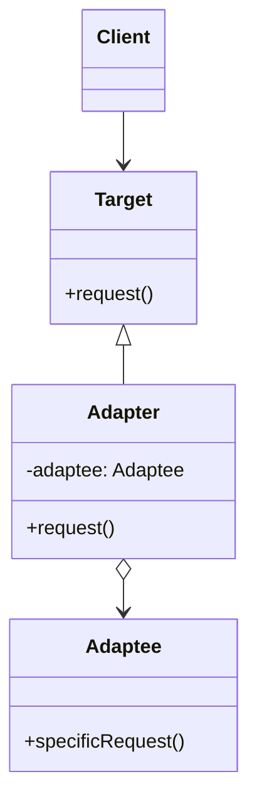

어댑터 패턴은 호환되지 않는 인터페이스를 가진 객체들이 협업할 수 있도록 하는 구조적 디자인 패턴입니다. 이 패턴은 기존 클래스의 인터페이스를 클라이언트가 기대하는 다른 인터페이스로 변환하여, 호환성 문제 없이 함께 동작할 수 있게 합니다.

## 어댑터 패턴의 목적

어댑터 패턴의 주요 목적은 다음과 같습니다:

1. 호환되지 않는 인터페이스 간의 협업을 가능하게 함
2. 기존 코드를 수정하지 않고 새로운 인터페이스와 통합
3. 레거시 코드와 새 코드 간의 원활한 통합 지원
4. 코드의 재사용성 향상

## 어댑터 패턴의 구조

어댑터 패턴은 다음과 같은 주요 구성 요소로 이루어집니다:

1. **Target(대상)**: 클라이언트가 사용하고자 하는 인터페이스
2. **Adaptee(적응 대상)**: 기존에 존재하는 클래스로, 인터페이스가 Target과 호환되지 않음
3. **Adapter(어댑터)**: Target 인터페이스를 구현하고, Adaptee 객체를 포함하여 Target과 Adaptee 사이의 변환을 수행



## 어댑터 패턴의 종류

어댑터 패턴은 구현 방식에 따라 두 가지 유형으로 나뉩니다:

### 1. 클래스 어댑터

클래스 어댑터는 다중 상속을 사용하여 구현됩니다. Adapter 클래스가 Target 인터페이스를 구현하고 Adaptee 클래스를 상속받습니다. 하지만 Java와 같이 다중 상속을 지원하지 않는 언어에서는 사용하기 어렵습니다.

### 2. 객체 어댑터

객체 어댑터는 합성(composition)을 사용하여 구현됩니다. Adapter 클래스가 Target 인터페이스를 구현하고 Adaptee 객체를 내부에 포함하는 방식입니다. 대부분의 경우 이 방식이 더 유연하고 널리 사용됩니다.

## 자바에서의 어댑터 패턴 구현

다음은 Java에서 객체 어댑터 패턴을 구현한 예시입니다:

```java
// Target 인터페이스
public interface MediaPlayer {
    void play(String audioType, String fileName);
}

// Adaptee 클래스
public class AdvancedMediaPlayer {
    public void playMp4(String fileName) {
        System.out.println("Playing mp4 file: " + fileName);
    }
    
    public void playVlc(String fileName) {
        System.out.println("Playing vlc file: " + fileName);
    }
}

// Adapter 클래스
public class MediaAdapter implements MediaPlayer {
    private AdvancedMediaPlayer advancedMediaPlayer;
    
    public MediaAdapter() {
        advancedMediaPlayer = new AdvancedMediaPlayer();
    }
    
    @Override
    public void play(String audioType, String fileName) {
        if(audioType.equalsIgnoreCase("vlc")) {
            advancedMediaPlayer.playVlc(fileName);
        } else if(audioType.equalsIgnoreCase("mp4")) {
            advancedMediaPlayer.playMp4(fileName);
        }
    }
}

// Client 클래스
public class AudioPlayer implements MediaPlayer {
    private MediaAdapter mediaAdapter;
    
    @Override
    public void play(String audioType, String fileName) {
        // 기본 오디오 형식 지원
        if(audioType.equalsIgnoreCase("mp3")) {
            System.out.println("Playing mp3 file: " + fileName);
        } 
        // mediaAdapter를 사용하여 다른 형식 지원
        else if(audioType.equalsIgnoreCase("vlc") || audioType.equalsIgnoreCase("mp4")) {
            mediaAdapter = new MediaAdapter(audioType);
            mediaAdapter.play(audioType, fileName);
        } else {
            System.out.println("Invalid media. " + audioType + " format not supported");
        }
    }
}
```

이 예시에서 `AudioPlayer`는 기본적으로 MP3 형식만 지원하지만, `MediaAdapter`를 통해 VLC와 MP4 형식도 재생할 수 있게 됩니다.

## 스프링 프레임워크에서의 어댑터 패턴

스프링 프레임워크는 내부적으로 어댑터 패턴을 광범위하게 사용합니다. 대표적인 예시로는 `HandlerAdapter`가 있습니다.

### HandlerAdapter

스프링 MVC에서 `DispatcherServlet`은 다양한 유형의 컨트롤러를 처리하기 위해 `HandlerAdapter`를 사용합니다. 각 컨트롤러 유형에 맞는 어댑터가 요청을 처리합니다.

```java
public interface HandlerAdapter {
    boolean supports(Object handler);
    ModelAndView handle(HttpServletRequest request, HttpServletResponse response, Object handler) throws Exception;
    long getLastModified(HttpServletRequest request, Object handler);
}
```

스프링은 다음과 같은 `HandlerAdapter` 구현체를 제공합니다:

- `RequestMappingHandlerAdapter`: `@RequestMapping` 어노테이션이 있는 메서드를 처리
- `HttpRequestHandlerAdapter`: `HttpRequestHandler` 인터페이스 구현체를 처리
- `SimpleControllerHandlerAdapter`: `Controller` 인터페이스 구현체를 처리

이를 통해 스프링은 다양한 유형의 컨트롤러가 일관된 방식으로 HTTP 요청을 처리할 수 있도록 합니다.

## 어댑터 패턴의 실제 활용 사례

어댑터 패턴은 다양한 실제 상황에서 유용하게 활용됩니다:

### 1. 레거시 시스템 통합

기존 레거시 시스템과 새로운 시스템을 통합할 때, 레거시 시스템의 인터페이스를 수정하지 않고 새 시스템과 연동할 수 있습니다.

### 2. 서드파티 라이브러리 통합

외부 라이브러리나 API를 애플리케이션에 통합할 때, 기존 코드 변경 없이 외부 라이브러리의 인터페이스를 애플리케이션의 인터페이스에 맞게 조정할 수 있습니다.

### 3. 다양한 데이터 소스 처리

여러 데이터 소스(데이터베이스, 웹 서비스, 파일 등)에서 데이터를 가져올 때, 각 데이터 소스에 맞는 어댑터를 통해 일관된 인터페이스로 데이터를 처리할 수 있습니다.

### 4. 실제 자바 API 예시

자바 API에서도 어댑터 패턴을 찾아볼 수 있습니다:

- `java.util.Arrays#asList()`: 배열을 List로 변환
- `java.io.InputStreamReader`: InputStream을 Reader로 변환
- `java.io.OutputStreamWriter`: OutputStream을 Writer로 변환

## 어댑터 패턴의 장단점

### 장점

1. **단일 책임 원칙(SRP)**: 변환 로직이 어댑터 클래스에 캡슐화되어 코드의 분리와 재사용성이 향상됩니다.
2. **개방 폐쇄 원칙(OCP)**: 기존 코드를 수정하지 않고 새로운 유형의 객체들과 작업할 수 있습니다.
3. **유연성 향상**: 호환되지 않는 인터페이스 간에 브리지 역할을 수행하여 유연성을 높입니다.
4. **레거시 코드 통합**: 기존 레거시 코드를 수정하지 않고도 새로운 코드와 함께 사용할 수 있습니다.

### 단점

1. **복잡성 증가**: 어댑터 클래스 추가로 인해 코드의 복잡성이 증가할 수 있습니다.
2. **오버헤드**: 어댑터 계층이 추가됨에 따라 경미한 성능 오버헤드가 발생할 수 있습니다.
3. **디버깅 어려움**: 인터페이스 변환 과정이 추가되어 디버깅이 더 복잡해질 수 있습니다.
4. **모든 메서드 매핑 필요**: 복잡한 인터페이스를 어댑터로 구현할 때 모든 메서드를 매핑해야 하는 번거로움이 있습니다.

## 어댑터 패턴 vs 다른 패턴

### 어댑터 vs 브리지

- **어댑터 패턴**: 이미 존재하는 객체들이 함께 작동할 수 있도록 합니다.
- **브리지 패턴**: 추상화와 구현을 분리하여 독립적으로 변형할 수 있게 합니다.

### 어댑터 vs 데코레이터

- **어댑터 패턴**: 객체의 인터페이스를 변경합니다.
- **데코레이터 패턴**: 객체의 인터페이스는 유지하면서 새로운 책임을 추가합니다.

### 어댑터 vs 퍼사드

- **어댑터 패턴**: 기존 인터페이스를 다른 인터페이스로 변환합니다.
- **퍼사드 패턴**: 복잡한 서브시스템을 단순화된 하나의 인터페이스로 제공합니다.

## 어댑터 패턴 적용 시 고려사항

어댑터 패턴을 적용할 때 다음 사항들을 고려해야 합니다:

1. **인터페이스 복잡성**: 어댑터가 구현해야 할 인터페이스가 너무 복잡하다면, 모든 메서드를 구현하는 것이 부담스러울 수 있습니다. 이런 경우 데코레이터 패턴이나 퍼사드 패턴을 고려해볼 수 있습니다.
    
2. **양방향 어댑터**: 때로는 두 시스템 간에 양방향 변환이 필요할 수 있습니다. 이 경우 양방향 어댑터를 구현하거나 두 개의 단방향 어댑터를 사용할 수 있습니다.
    
3. **어댑터 계층 최소화**: 어댑터 위에 또 다른 어댑터를 쌓는 것은 복잡성을 증가시키고 성능을 저하시킬 수 있습니다. 가능하면 어댑터 계층을 최소화해야 합니다.
    
4. **인터페이스 설계**: 새로운 시스템을 설계할 때는 미래의 어댑터 패턴 적용을 고려하여 인터페이스를 설계하는 것이 좋습니다.
    

## 결론

어댑터 패턴은 호환되지 않는 인터페이스 간의 브리지 역할을 수행하여 코드의 재사용성과 유연성을 높이는 강력한 디자인 패턴입니다. 레거시 시스템 통합, 서드파티 라이브러리 적용, 다양한 데이터 소스 처리 등 다양한 상황에서 유용하게 활용될 수 있습니다.

하지만 어댑터 패턴을 사용할 때는 코드 복잡성 증가와 성능 오버헤드를 고려해야 합니다. 필요한 상황에서만 적절하게 사용하고, 과도한 어댑터 계층 생성은 피하는 것이 좋습니다.

어댑터 패턴은 시스템 통합과 레거시 코드 활용에 있어 필수적인 도구로, 객체 지향 프로그래밍에서 코드 유연성을 높이는 중요한 역할을 합니다.

## 참고 자료

- Design Patterns: Elements of Reusable Object-Oriented Software - Erich Gamma, Richard Helm, Ralph Johnson, John Vlissides
- Head First Design Patterns - Elisabeth Freeman, Eric Freeman, Bert Bates, Kathy Sierra
- Spring Framework Documentation - https://docs.spring.io/spring-framework/docs/current/reference/html/
- Effective Java - Joshua Bloch