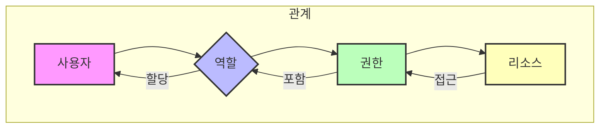

소프트웨어 시스템에서 **접근 제어(Access Control)**는 사용자가 특정 리소스나 기능에 접근할 수 있는 권한을 관리하는 핵심적인 보안 메커니즘입니다. 다양한 접근 제어 모델 중 **역할 기반 접근 제어(Role-Based Access Control, RBAC)**는 오늘날 가장 널리 사용되고 효과적인 모델 중 하나입니다.

## RBAC란 무엇인가?

RBAC는 개별 사용자에게 직접 권한을 부여하는 대신, **역할(Role)**에 권한을 할당하고 사용자에게는 하나 이상의 역할을 부여하는 방식입니다. 사용자는 자신에게 할당된 역할에 부여된 권한을 자동으로 상속받게 됩니다.

예를 들어, 회사 시스템에서 '개발자', '기획자', '관리자'와 같은 역할을 정의할 수 있습니다.
- '개발자' 역할에는 코드 저장소 접근, 개발 서버 배포 등의 권한을 부여합니다.
- '기획자' 역할에는 기획 문서 작성, 요구사항 관리 시스템 접근 등의 권한을 부여합니다.
- '관리자' 역할에는 사용자 계정 관리, 시스템 설정 변경 등의 권한을 부여합니다.

새로운 직원이 입사하면, 해당 직무에 맞는 역할(예: '개발자')을 부여하기만 하면 필요한 모든 권한이 자동으로 할당됩니다. 직무가 변경될 경우에도 역할만 변경하면 되므로 권한 관리가 매우 효율적입니다.

## RBAC의 주요 구성 요소

RBAC 모델은 일반적으로 다음과 같은 세 가지 핵심 구성 요소로 이루어집니다.

1.  **사용자(User)**: 시스템에 접근하려는 개별 주체입니다. 사람, 애플리케이션, 서비스 등이 될 수 있습니다.
2.  **역할(Role)**: 특정 직무 기능이나 책임에 따라 정의된 권한의 집합입니다. 역할은 '개발자', '회계사', '매니저' 등과 같이 조직의 구조와 비즈니스 기능에 맞춰 생성됩니다.
3.  **권한(Permission)**: 특정 리소스(예: 파일, 데이터베이스 테이블, API 엔드포인트)에 대해 수행할 수 있는 특정 작업(예: 읽기, 쓰기, 실행, 삭제)을 정의합니다.

이 세 가지 구성 요소는 다음과 같은 관계를 가집니다.
-   사용자는 역할에 할당됩니다. (User-Role Assignment)
-   역할은 권한에 할당됩니다. (Role-Permission Assignment)
-   결과적으로 사용자는 자신이 할당된 역할을 통해 권한을 얻게 됩니다.

## RBAC의 장점

RBAC는 다음과 같은 여러 가지 이점을 제공합니다.

-   **관리 효율성**: 개별 사용자마다 권한을 관리하는 대신, 역할에 권한을 부여하고 사용자에게 역할을 할당하므로 대규모 조직에서 권한 관리가 훨씬 효율적입니다. 인사이동이나 직무 변경 시에도 역할만 변경하면 되므로 관리 부담이 줄어듭니다.
-   **보안 강화**: [[최소 권한 원칙]]을 쉽게 적용할 수 있습니다. 각 역할에 필요한 최소한의 권한만 부여함으로써, 사용자가 불필요하게 과도한 권한을 가지는 것을 방지하고 잠재적인 보안 위험을 줄일 수 있습니다.
-   **정책 일관성**: 역할에 부여된 권한은 해당 역할을 가진 모든 사용자에게 일관되게 적용되므로, 보안 정책의 일관성을 유지하기 용이합니다.
-   **확장성**: 새로운 사용자나 직무가 추가될 때 기존 역할을 재활용하거나 새로운 역할을 정의하여 유연하게 대응할 수 있습니다.
-   **감사 및 규정 준수**: 역할과 권한의 관계가 명확하여 누가 어떤 리소스에 접근할 수 있는지 쉽게 파악하고 감사할 수 있습니다. 이는 GDPR, HIPAA 등 다양한 규정 준수에 도움이 됩니다.

## RBAC의 단점 및 고려사항

RBAC는 강력한 모델이지만, 다음과 같은 단점과 고려사항도 존재합니다.

-   **역할 폭발(Role Explosion)**: 너무 많은 역할을 정의하거나 역할 간의 중복이 심해지면 관리 복잡성이 증가할 수 있습니다. 이는 RBAC의 장점을 상쇄시킬 수 있습니다.
-   **세분화된 제어의 한계**: 역할 기반이므로 특정 상황이나 속성(예: 시간, 위치, 데이터 민감도)에 따른 매우 세분화된 동적 접근 제어에는 한계가 있습니다. 이러한 경우에는 [[속성 기반 접근 제어(ABAC)]]와 같은 다른 모델과의 조합을 고려할 수 있습니다.
-   **초기 설계 복잡성**: 조직의 직무와 권한을 분석하여 적절한 역할을 정의하는 초기 설계 단계가 복잡하고 시간이 소요될 수 있습니다.

## RBAC의 활용 사례

RBAC는 다양한 시스템과 환경에서 널리 활용됩니다.

-   **운영체제**: 사용자 그룹(예: Administrators, Users, Guests)을 통해 파일 및 시스템 리소스 접근 권한을 관리합니다.
-   **데이터베이스**: 데이터베이스 사용자에게 '읽기 전용', '데이터 입력', '스키마 관리' 등의 역할을 부여하여 테이블, 뷰, 프로시저 등에 대한 접근을 제어합니다.
-   **클라우드 서비스**: AWS IAM, Azure AD 등 클라우드 서비스의 접근 관리 시스템은 RBAC 개념을 기반으로 사용자 및 서비스에 대한 권한을 부여합니다.
-   **엔터프라이즈 애플리케이션**: ERP, CRM, 그룹웨어 등 복잡한 비즈니스 로직을 가진 애플리케이션에서 사용자 직무에 따른 기능 접근을 제어합니다.
-   **웹 애플리케이션**: Spring Security와 같은 프레임워크를 사용하여 웹 페이지, API 엔드포인트 등에 대한 사용자 접근 권한을 관리합니다.

## 다른 접근 제어 모델과의 관계

RBAC는 [[접근 제어 모델]] 중 하나이며, 다른 모델들과 상호 보완적으로 사용될 수 있습니다.

-   **DAC (Discretionary Access Control)**: 소유자가 직접 권한을 제어하는 모델로, RBAC보다 유연하지만 보안 수준이 낮을 수 있습니다.
-   **MAC (Mandatory Access Control)**: 시스템 관리자가 강제적으로 보안 등급에 따라 접근을 제어하는 모델로, 높은 보안이 요구되는 환경에서 사용됩니다. RBAC보다 엄격합니다.
-   **ABAC (Attribute-Based Access Control)**: 사용자, 리소스, 환경의 속성을 기반으로 동적인 접근 제어를 제공합니다. RBAC의 한계를 보완하여 더 세분화된 제어가 필요할 때 함께 사용될 수 있습니다. 많은 경우, RBAC로 기본적인 틀을 잡고 ABAC로 예외적인 세분화된 제어를 구현하는 하이브리드 방식이 효과적입니다.

## 결론

역할 기반 접근 제어(RBAC)는 현대 소프트웨어 시스템에서 효율적이고 안전한 권한 관리를 위한 핵심적인 모델입니다. 명확한 역할 정의와 최소 권한 원칙의 적용을 통해 시스템의 보안을 강화하고 관리 복잡성을 줄일 수 있습니다. 시스템의 특성과 요구사항을 고려하여 RBAC를 적절히 설계하고 구현하는 것이 중요하며, 필요한 경우 다른 접근 제어 모델과의 조합을 통해 더욱 견고한 보안 아키텍처를 구축할 수 있습니다.

## 개발 가이드

RBAC를 실제 시스템에 구현하는 방법에 대한 자세한 내용은 [[RBAC 개발 가이드]] 문서를 참고해주세요.

## 참고 자료

-   NIST Special Publication 800-162, Role-Based Access Control (RBAC)
-   [[접근 제어 모델]]
-   [[최소 권한 원칙]]
-   [[속성 기반 접근 제어(ABAC)]]
