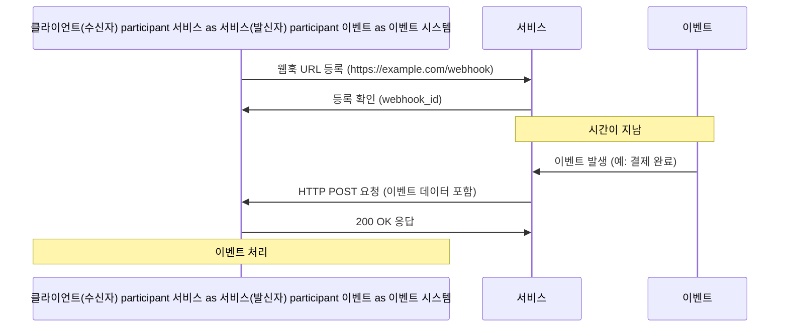

---
웹훅(Webhook)은 현대 웹 애플리케이션 개발에서 필수적인 요소로 자리잡았습니다. 이 글에서는 웹훅의 개념, 작동 원리, 구현 방법 및 보안 고려사항에 대해 자세히 살펴보겠습니다. 웹훅을 통해 실시간 데이터 통합이 얼마나 효율적으로 이루어질 수 있는지, 그리고 이를 어떻게 자신의 애플리케이션에 적용할 수 있는지 알아보겠습니다.

## 웹훅이란?

웹훅은 한 시스템에서 특정 이벤트가 발생했을 때 다른 시스템에 자동으로 알림을 보내는 방법입니다. 일반적인 API와 달리, 웹훅은 '역방향 API' 또는 '[[콜백 URL]]'이라고도 불립니다. 전통적인 API에서는 클라이언트가 서버에 요청을 보내고 응답을 기다리지만, 웹훅에서는 이벤트가 발생했을 때 서버가 클라이언트에게 데이터를 푸시합니다.

### 웹훅 vs 전통적인 API 요청

전통적인 API 요청 방식은 클라이언트가 서버에 주기적으로 데이터를 요청하는 [[폴링(Polling)]] 방식을 사용합니다. 이 방식은 실시간 데이터가 필요하지 않은 경우에는 효과적이지만, 다음과 같은 단점이 있습니다:

1. 불필요한 요청 증가: 변경사항이 없어도 계속해서 요청을 보냅니다.
2. 리소스 낭비: 서버와 클라이언트 모두 불필요한 요청 처리로 리소스를 소모합니다.
3. 지연 시간: 폴링 간격에 따라 실시간성이 제한됩니다.

반면, 웹훅은 이벤트 기반 방식으로 작동합니다. 이벤트가 발생했을 때만 데이터를 전송하기 때문에 더 효율적이고 실시간성이 높습니다.

## 웹훅의 작동 원리

웹훅의 기본 작동 원리는 비교적 단순합니다:

1. 수신자(Receiver)가 이벤트 발신자(Sender)에게 콜백 URL을 등록합니다.
2. 이벤트 발신자에서 특정 이벤트가 발생하면 등록된 URL로 HTTP POST 요청을 보냅니다.
3. 수신자는 이 요청을 처리하고 적절한 응답을 반환합니다.



## 웹훅 구현하기

웹훅을 구현하는 과정은 크게 두 가지 측면으로 나눌 수 있습니다:

1. 웹훅 제공자(Provider) 구현: 이벤트 발생 시 등록된 URL로 알림을 보내는 시스템
2. 웹훅 소비자(Consumer) 구현: 웹훅 이벤트를 수신하고 처리하는 시스템

### 웹훅 소비자(Consumer) 구현

웹훅을 수신하는 엔드포인트를 구현하는 방법을 살펴보겠습니다. 이 예제에서는 스프링 부트를 사용하여 간단한 웹훅 수신기를 만들겠습니다:

```java
@RestController
public class WebhookController {

    private static final Logger logger = LoggerFactory.getLogger(WebhookController.class);

    @PostMapping("/webhook")
    public ResponseEntity<String> receiveWebhook(@RequestBody String payload,
                                               @RequestHeader HttpHeaders headers) {
        // 웹훅 페이로드 로깅
        logger.info("웹훅 수신: {}", payload);
        
        // 시그니처 검증 (선택 사항)
        if (!verifySignature(payload, headers)) {
            return ResponseEntity.status(HttpStatus.UNAUTHORIZED).body("Invalid signature");
        }
        
        try {
            // 페이로드 처리 로직
            processWebhookPayload(payload);
            
            // 성공 응답
            return ResponseEntity.ok("Webhook received successfully");
        } catch (Exception e) {
            logger.error("웹훅 처리 오류", e);
            return ResponseEntity.status(HttpStatus.INTERNAL_SERVER_ERROR).body("Error processing webhook");
        }
    }
    
    private boolean verifySignature(String payload, HttpHeaders headers) {
        // 서명 검증 로직 (보안 섹션에서 자세히 설명)
        return true; // 예시 구현
    }
    
    private void processWebhookPayload(String payload) {
        // 실제 비즈니스 로직 처리
        // 예: 결제 확인, 데이터베이스 업데이트, 알림 전송 등
    }
}
```

### 웹훅 제공자(Provider) 구현

웹훅을 제공하는 시스템을 구현할 때는 다음과 같은 요소들을 고려해야 합니다:

1. 웹훅 등록 API
2. 웹훅 저장 시스템
3. 이벤트 감지 및 처리
4. 웹훅 전송 메커니즘

아래는 스프링 부트를 사용한 간단한 웹훅 제공자 구현의 예시입니다:

```java
@Service
public class WebhookService {

    private final WebhookRepository webhookRepository;
    private final RestTemplate restTemplate;
    
    public WebhookService(WebhookRepository webhookRepository, RestTemplate restTemplate) {
        this.webhookRepository = webhookRepository;
        this.restTemplate = restTemplate;
    }
    
    public void registerWebhook(String url, String event) {
        Webhook webhook = new Webhook(url, event);
        webhookRepository.save(webhook);
    }
    
    public void triggerWebhook(String event, Object data) {
        List<Webhook> webhooks = webhookRepository.findByEvent(event);
        
        for (Webhook webhook : webhooks) {
            try {
                // 웹훅 페이로드 생성
                WebhookPayload payload = createPayload(event, data);
                
                // 서명 생성 (보안 섹션에서 자세히 설명)
                String signature = generateSignature(payload);
                
                // HTTP 헤더 설정
                HttpHeaders headers = new HttpHeaders();
                headers.set("Content-Type", "application/json");
                headers.set("X-Webhook-Signature", signature);
                
                // 웹훅 전송
                HttpEntity<WebhookPayload> request = new HttpEntity<>(payload, headers);
                ResponseEntity<String> response = restTemplate.postForEntity(webhook.getUrl(), request, String.class);
                
                // 응답 처리 (재시도 로직 등)
                if (response.getStatusCode().is2xxSuccessful()) {
                    // 성공 로깅
                } else {
                    // 실패 처리
                }
            } catch (Exception e) {
                // 예외 처리 및 재시도 로직
            }
        }
    }
    
    private WebhookPayload createPayload(String event, Object data) {
        return new WebhookPayload(event, data, System.currentTimeMillis());
    }
    
    private String generateSignature(WebhookPayload payload) {
        // 서명 생성 로직
        return "signature"; // 예시 구현
    }
}
```

## 웹훅 보안

웹훅을 사용할 때는 보안에 특히 주의해야 합니다. 웹훅 엔드포인트는 외부에 노출되어 있어 공격의 대상이 될 수 있습니다. 다음은 웹훅 보안을 위한 핵심 사항들입니다:

### 서명 검증

웹훅 요청이 실제로 신뢰할 수 있는 소스에서 온 것인지 확인하기 위해 서명 검증을 구현합니다. 일반적인 방법은 [[HMAC(Hash-based Message Authentication Code)]]를 사용하는 것입니다:

```java
private boolean verifySignature(String payload, HttpHeaders headers) {
    String receivedSignature = headers.getFirst("X-Webhook-Signature");
    if (receivedSignature == null) {
        return false;
    }
    
    String secretKey = "your_secret_key"; // 안전하게 저장된 비밀키
    
    try {
        Mac mac = Mac.getInstance("HmacSHA256");
        SecretKeySpec secretKeySpec = new SecretKeySpec(secretKey.getBytes(), "HmacSHA256");
        mac.init(secretKeySpec);
        byte[] hmacBytes = mac.doFinal(payload.getBytes());
        String calculatedSignature = Base64.getEncoder().encodeToString(hmacBytes);
        
        return MessageDigest.isEqual(calculatedSignature.getBytes(), receivedSignature.getBytes());
    } catch (Exception e) {
        return false;
    }
}
```

### 추가 보안 조치

1. **HTTPS 사용**: 모든 웹훅 통신은 반드시 HTTPS를 통해 이루어져야 합니다.
2. **IP 필터링**: 알려진 IP 주소에서만 웹훅을 수신하도록 구성할 수 있습니다.
3. **요청 제한(Rate Limiting)**: 짧은 시간 동안 과도한 요청을 방지합니다.
4. **타임스탬프 검증**: 오래된 요청을 차단하여 재생 공격을 방지합니다.
5. **비밀 토큰**: URL에 비밀 토큰을 포함시켜 추가 보안 계층을 제공합니다.

## 웹훅 모범 사례

웹훅을 효과적으로 사용하기 위한 몇 가지 모범 사례를 소개합니다:

### 1. 멱등성 보장

웹훅 요청은 동일한 이벤트에 대해 여러 번 전송될 수 있습니다(재시도 등의 이유로). 이러한 경우에도 시스템이 올바르게 동작하도록 [[멱등성(Idempotency)]]을 보장해야 합니다.

### 2. 재시도 메커니즘 구현

웹훅 전송이 실패할 경우 적절한 재시도 메커니즘을 구현하는 것이 중요합니다. 지수 백오프(exponential backoff) 전략을 사용하면 효과적입니다.

```java
private void sendWithRetry(String url, WebhookPayload payload, int maxRetries) {
    int retries = 0;
    boolean success = false;
    
    while (!success && retries < maxRetries) {
        try {
            // 웹훅 전송 로직
            ResponseEntity<String> response = restTemplate.postForEntity(url, payload, String.class);
            if (response.getStatusCode().is2xxSuccessful()) {
                success = true;
            } else {
                // 재시도 전 대기 (지수 백오프)
                long waitTime = (long) Math.pow(2, retries) * 1000;
                Thread.sleep(waitTime);
                retries++;
            }
        } catch (Exception e) {
            // 재시도 전 대기 (지수 백오프)
            long waitTime = (long) Math.pow(2, retries) * 1000;
            try {
                Thread.sleep(waitTime);
            } catch (InterruptedException ie) {
                Thread.currentThread().interrupt();
            }
            retries++;
        }
    }
    
    if (!success) {
        // 모든 재시도 실패 처리
        // 예: 실패 로그 기록, 알림 전송, 데드 레터 큐에 추가 등
    }
}
```
