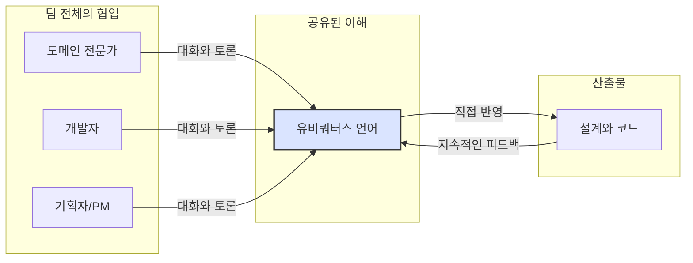

**유비쿼터스 언어(Ubiquitous Language)**는 소프트웨어 개발 프로젝트에 참여하는 모든 구성원(개발자, 도메인 전문가, 기획자, 관리자 등)이 도메인(비즈니스 영역)에 관해 이야기할 때 사용하는 **공통의, 명시적인 단일 언어**입니다. 이 개념은 [[도메인 주도 설계(DDD,Domain Driven Design)]] 핵심적인 구성 요소로, 복잡한 비즈니스 문제를 해결하기 위한 첫걸음입니다.

많은 프로젝트가 실패하는 근본적인 원인 중 하나는 '소통의 실패'입니다. 기획자는 '고객 등급별 할인 정책'을 이야기하는데, 개발자는 `UserTypeDiscountCalculator`라는 기술 용어로 이해하고 코드를 작성합니다. 이 미묘한 차이는 시간이 지나며 눈덩이처럼 불어나 유지보수하기 어렵고, 비즈니스 요구사항을 제대로 반영하지 못하는 소프트웨어를 만들게 됩니다.

유비쿼터스 언어는 바로 이 간극을 메우기 위한 강력한 도구입니다. 팀 전체가 **하나의 언어로 소통하고, 그 언어를 코드에까지 그대로 반영**함으로써 오해의 소지를 없애고 도메인 모델의 정확성을 극대화하는 것이 핵심 목표입니다.

---

## 유비쿼터스 언어는 왜 중요한가요?

유비쿼터스 언어를 도입하면 다음과 같은 명확한 이점을 얻을 수 있습니다.

1. **오해와 번역 비용 감소**: 도메인 전문가의 요구사항을 개발자가 기술 용어로 '번역'하고, 다시 개발자의 질문을 도메인 전문가가 이해할 수 있는 말로 '번역'하는 과정에서 발생하는 모든 오해와 비용이 사라집니다. 모든 회의, 문서, 코드에서 동일한 용어를 사용하므로 소통이 명확해집니다.
    
2. **도메인 모델의 정확성 향상**: 비즈니스 로직의 미묘한 뉘앙스가 언어에 담겨 코드에 직접 표현됩니다. 예를 들어 '고객'이 '손님(Guest)'과 '회원(Member)'으로 구분된다면, 코드에도 `Guest`와 `Member` 클래스가 존재하게 됩니다. 이는 소프트웨어가 비즈니스 자체를 정확하게 모델링하도록 돕습니다. 모델-코드-언어의 일치 원칙을 따르게 됩니다.
    
3. **팀의 협업 강화 및 지식 공유 촉진**: 개발자는 비즈니스에 대한 이해가 깊어지고, 도메인 전문가는 시스템의 구현 방식을 더 쉽게 이해할 수 있습니다. 이는 팀 전체의 공유된 정신 모델(Shared Mental Model)을 형성하여 더 나은 의사결정과 긴밀한 협업을 가능하게 합니다.
    
4. **신규 참여자의 적응 속도 향상**: 새로운 팀원이 프로젝트에 합류했을 때, 잘 정의된 유비쿼터스 언어와 그 언어가 반영된 코드는 최고의 가이드 문서가 됩니다. 복잡한 코드를 분석하는 대신, 비즈니스 용어를 통해 시스템의 구조와 동작을 빠르게 파악할 수 있습니다.
    

---

## 유비쿼터스 언어의 구축과정

유비쿼터스 언어는 어느 한 명이 정의하고 선포하는 것이 아니라, 팀 전체가 함께 만들어나가는 살아있는 언어입니다.



위 그림처럼 도메인 전문가, 개발자, 기획자 등 모든 관계자가 끊임없이 대화하며 용어를 정의하고 다듬습니다. 그리고 이 언어는 설계와 코드에 직접 반영되며, 코드를 통해 발견된 새로운 통찰력은 다시 언어를 개선하는 데 사용됩니다. 이 과정을 돕는 구체적인 방법은 유비쿼터스 언어 구축 방법에서 더 자세히 다룹니다.

---

## 유비쿼터스 언어의 코드 반영 예시 (Java & Spring)

유비쿼터스 언어는 개념에만 머물러서는 안 되며, 반드시 코드로 표현되어야 합니다. 온라인 쇼핑몰의 '주문' 도메인을 예로 들어보겠습니다.

**상황**: 팀의 논의를 통해 "고객(Customer)이 장바구니(Cart)에 담긴 상품들을 기반으로 주문(Order)을 생성한다. 단, 재고(Stock)가 부족한 상품이 있으면 주문은 실패해야 한다." 라는 규칙과 용어를 합의했습니다.

**잘못된 예시 (기술 중심적 용어 사용)**

```java
// Service Layer
public class OrderManager {
    public void processNewBizRequest(UserRequest req, List<ItemData> items) {
        // 'UserRequest'나 'ItemData'는 비즈니스 용어가 아닌, 데이터 전달을 위한 기술 용어에 가깝습니다.
        // 'processNewBizRequest' 라는 메서드명은 무슨 일을 하는지 전혀 알 수 없습니다.
        for (ItemData item : items) {
            boolean result = checkInventory(item.getId(), item.getQuantity());
            if (!result) {
                throw new RuntimeException("Item unavailable");
            }
        }
        // ... 주문 처리 로직 ...
    }

    private boolean checkInventory(Long id, int count) {
        // ... 재고 확인 로직 ...
    }
}
```

**좋은 예시 (유비쿼터스 언어 반영)**

도메인 클래스와 서비스 메서드에 합의된 용어를 그대로 사용합니다.

```java
// Domain Layer
public class Order {
    private CustomerId customerId;
    private List<OrderLine> orderLines;

    // '주문을 생성한다'는 비즈니스 행위를 명확히 표현
    public static Order place(CustomerId customerId, Cart cart) {
        // '재고를 확인한다'가 아닌 '재고가 충분한지 검증한다'는 비즈니스 규칙을 표현
        cart.validateStockAvailability();
        return new Order(customerId, cart.toOrderLines());
    }

    // ...
}

public class Cart {
    private List<CartItem> items;

    public void validateStockAvailability() {
        for (CartItem item : items) {
            if (!item.hasSufficientStock()) {
                // 예외 메시지에도 비즈니스 용어를 사용
                throw new InsufficientStockException(item.getName() + "의 재고가 부족합니다.");
            }
        }
    }
    // ...
}

// Application Service Layer (e.g., Spring @Service)
@Service
@RequiredArgsConstructor
public class OrderPlacementService {

    private final CustomerRepository customerRepository;
    private final CartRepository cartRepository;
    private final OrderRepository orderRepository;

    // 'placeOrder' 라는 메서드명은 '주문을 한다'는 비즈니스 용어와 정확히 일치합니다.
    @Transactional
    public OrderId placeOrder(CustomerId customerId, CartId cartId) {
        Customer customer = customerRepository.findById(customerId);
        Cart cart = cartRepository.findById(cartId);

        Order newOrder = Order.place(customer.getId(), cart);
        orderRepository.save(newOrder);

        return newOrder.getId();
    }
}
```

좋은 예시의 코드는 비즈니스 지식이 없는 개발자가 보더라도 `placeOrder`라는 서비스가 `Order`를 `place`하는 행위를 하며, 그 과정에서 `Cart`의 `validateStockAvailability`가 호출될 것이라고 쉽게 유추할 수 있습니다. 이처럼 코드가 비즈니스 스토리를 말해주게 됩니다.

---

## 유비쿼터스 언어와 바운디드 컨텍스트

프로젝트의 규모가 커지면 모든 영역에서 단 하나의 언어만 사용하는 것은 오히려 비효율적일 수 있습니다. 예를 들어, 쇼핑몰에서 '상품'이라는 단어는 **상품 전시 컨텍스트**에서는 '판매 가격', '리뷰' 정보가 중요하지만, **재고 관리 컨텍스트**에서는 '창고 위치', '공급자' 정보가 더 중요합니다.

이처럼 특정 도메인 모델이 일관성을 유지하는 경계를 [[바운디드 컨텍스트(Bounded Context)]]라고 부릅니다. 각 바운디드 컨텍스트는 자신만의 명확한 유비쿼터스 언어를 가질 수 있습니다. 이를 통해 모델의 복잡도를 관리하고 각 팀이 맡은 영역에 더 집중할 수 있게 됩니다.

---

## 결론

유비쿼터스 언어는 단순히 용어를 통일하는 활동을 넘어, **프로젝트의 성공을 좌우하는 핵심적인 문화이자 전략**입니다. 이는 개발자와 비즈니스 전문가 사이의 벽을 허물고, 모두가 같은 목표를 향해 나아가도록 돕는 나침반과 같습니다.

코드는 비즈니스의 요구사항을 해결하기 위해 존재합니다. 따라서 우리의 코드는 비즈니스를 가장 잘 아는 사람들의 언어로 작성되어야 합니다. 지금 여러분의 코드베이스는 팀의 공통 언어를 명확하게 반영하고 있나요? 만약 그렇지 않다면, 오늘 팀원들과 함께 작은 용어부터 정의해보는 것은 어떨까요?

---

## 참고 자료

- Domain-Driven Design: Tackling Complexity in the Heart of Software - Eric Evans