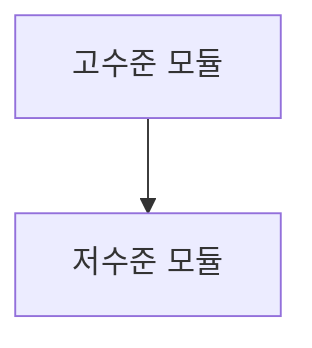
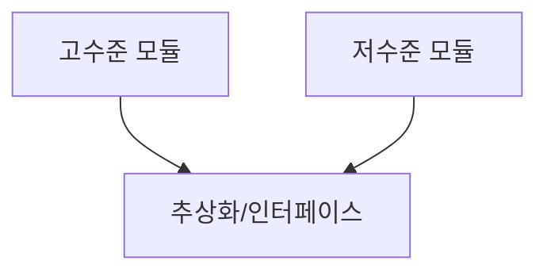

의존성 역전 원칙은 객체 지향 설계의 핵심 원칙 중 하나로, [[SOLID 원칙]]의 마지막 'D'에 해당합니다. 이 원칙은 소프트웨어 모듈 간의 의존성 방향을 제어하여 시스템의 유연성, 재사용성, 그리고 테스트 용이성을 크게 향상시킵니다. 의존성 역전 원칙은 현대 소프트웨어 아키텍처의 근간이 되는 개념으로, 특히 대규모 엔터프라이즈 애플리케이션 개발에서 매우 중요한 역할을 합니다.

## 의존성 역전 원칙의 정의

의존성 역전 원칙은 다음 두 가지 핵심 개념을 포함합니다:

1. **고수준 모듈은 저수준 모듈에 의존해서는 안 됩니다. 두 모듈 모두 추상화에 의존해야 합니다.**
2. **추상화는 구체적인 사항에 의존해서는 안 됩니다. 구체적인 사항이 추상화에 의존해야 합니다.**

여기서 고수준 모듈이란 비즈니스 로직을 포함하는 모듈을, 저수준 모듈이란 구체적인 작업을 수행하는 모듈을 의미합니다. 자세한 내용은 고수준 모듈과 저수준 모듈의 이해를 참고해주세요.

## 전통적인 의존성과 역전된 의존성

### 전통적인 의존성 방향

전통적인 절차적 프로그래밍에서는 고수준 모듈이 저수준 모듈에 직접 의존합니다. 이는 고수준 모듈이 저수준 모듈의 변경에 취약하게 만들고, 시스템의 재사용성과 유연성을 저하시킵니다.



### 의존성 역전 후

의존성 역전 원칙을 적용하면, 고수준 모듈과 저수준 모듈 모두 추상화(인터페이스)에 의존하게 됩니다. 이를 통해 모듈 간 결합도를 낮추고 시스템의 유연성을 높일 수 있습니다.



## 의존성 역전 원칙 적용 방법

의존성 역전 원칙을 적용하는 가장 일반적인 방법은 [[인터페이스(Interface)]]를 활용하는 것입니다. 다음과 같은 단계로 적용할 수 있습니다:

1. 고수준 모듈의 요구사항에 맞는 [[추상화(Abstraction)]](인터페이스)를 정의합니다.
2. 저수준 모듈이 이 추상화를 구현하도록 합니다.
3. 고수준 모듈은 구체적인 저수준 모듈이 아닌 추상화에 의존하도록 설계합니다.

의존성 역전 원칙 적용에 대한 자세한 방법론은 [[의존성 역전 원칙 적용 전략]]을 참고해주세요.

## Java에서의 의존성 역전 원칙 구현 예시

다음은 Java에서 의존성 역전 원칙을 구현한 간단한 예시입니다:

### 의존성 역전 원칙을 적용하지 않은 경우

```java
// 저수준 모듈
public class MySQLDatabase {
    public void save(String data) {
        System.out.println("데이터를 MySQL에 저장: " + data);
    }
}

// 고수준 모듈
public class UserService {
    private MySQLDatabase database;
    
    public UserService() {
        this.database = new MySQLDatabase();
    }
    
    public void addUser(String userData) {
        database.save(userData);
    }
}
```

위 코드에서 `UserService`(고수준 모듈)는 `MySQLDatabase`(저수준 모듈)에 직접 의존하고 있습니다. 만약 데이터베이스를 MongoDB로 변경하거나 테스트를 위해 가짜 데이터베이스를 사용하고 싶다면, `UserService` 코드를 수정해야 합니다.

### 의존성 역전 원칙을 적용한 경우

```java
// 추상화 (인터페이스)
public interface Database {
    void save(String data);
}

// 저수준 모듈 (구현체)
public class MySQLDatabase implements Database {
    @Override
    public void save(String data) {
        System.out.println("데이터를 MySQL에 저장: " + data);
    }
}

// 추가 구현체
public class MongoDatabase implements Database {
    @Override
    public void save(String data) {
        System.out.println("데이터를 MongoDB에 저장: " + data);
    }
}

// 고수준 모듈
public class UserService {
    private Database database;
    
    // 의존성 주입을 통해 구체적인 데이터베이스 구현체 제공
    public UserService(Database database) {
        this.database = database;
    }
    
    public void addUser(String userData) {
        database.save(userData);
    }
}
```

이제 `UserService`는 구체적인 데이터베이스 구현체가 아닌 `Database` 인터페이스(추상화)에 의존합니다. 이를 통해 다양한 데이터베이스 구현체를 쉽게 교체할 수 있으며, 테스트 시에도 가짜 구현체를 사용할 수 있게 됩니다.

## 스프링 프레임워크에서의 의존성 역전 원칙

스프링 프레임워크는 의존성 역전 원칙을 기반으로 한 의존성 주입(Dependency Injection) 기법을 핵심 기능으로 제공합니다. 스프링의 IoC(Inversion of Control) 컨테이너는 객체의 생성과 의존성 관리를 담당하여 개발자가 의존성 역전 원칙을 쉽게 적용할 수 있도록 도와줍니다.

```java
@Service
public class UserServiceImpl implements UserService {
    private final UserRepository userRepository;
    
    // 생성자 주입을 통한 의존성 주입
    @Autowired
    public UserServiceImpl(UserRepository userRepository) {
        this.userRepository = userRepository;
    }
    
    @Override
    public void saveUser(User user) {
        userRepository.save(user);
    }
}
```

스프링에서 `@Autowired` 어노테이션을 사용하면 구체적인 `UserRepository` 구현체를 직접 생성하는 대신, 스프링 컨테이너가 적절한 구현체를 주입해줍니다. 이를 통해 코드는 추상화(인터페이스)에 의존하게 되며, 구체적인 구현체와의 결합도가 낮아집니다.

스프링 프레임워크의 의존성 주입에 대한 자세한 내용은 스프링 의존성 주입을 참고해주세요.

## 의존성 역전 원칙의 장단점

### 장점

- **유연성 향상**: 구현체를 쉽게 교체할 수 있어 시스템의 유연성이 크게 향상됩니다.
- **테스트 용이성**: 실제 구현체 대신 테스트용 모의(Mock) 객체를 사용하여 단위 테스트를 쉽게 수행할 수 있습니다.
- **재사용성 증가**: 고수준 모듈이 저수준 모듈에 직접 의존하지 않기 때문에, 다양한 상황에서 재사용할 수 있습니다.
- **관심사의 분리**: 각 모듈은 자신의 책임에만 집중할 수 있어, 코드의 가독성과 유지보수성이 향상됩니다.
- **확장성 개선**: 기존 코드를 수정하지 않고도 새로운 기능을 추가할 수 있습니다([[개방-폐쇄 원칙 (Open-Closed Principle)]] 과의 시너지).

### 단점

- **설계 복잡성 증가**: 추상화 계층이 추가됨에 따라 설계의 복잡성이 증가할 수 있습니다.
- **초기 개발 시간 증가**: 인터페이스 설계와 구현에 추가적인 시간이 소요될 수 있습니다.
- **이해하기 어려운 코드**: 시스템의 흐름이 직관적이지 않을 수 있어 초보 개발자가 이해하기 어려울 수 있습니다.
- **과도한 추상화 위험**: 모든 것을 추상화하려는 경향은 불필요한 복잡성을 야기할 수 있습니다.

## 실제 사용 사례

의존성 역전 원칙은 다양한 소프트웨어 시스템에서 활용됩니다:

1. **웹 애플리케이션 아키텍처**: MVC, MVP, MVVM 등의 아키텍처 패턴에서 컨트롤러/프레젠터가 모델과 뷰 사이의 추상화 계층 역할을 합니다.
2. **데이터 접근 계층**: 데이터 접근 객체(DAO) 패턴이나 리포지토리 패턴에서 비즈니스 로직이 구체적인 데이터베이스 구현이 아닌 인터페이스에 의존합니다.
3. **플러그인 시스템**: 핵심 애플리케이션이 플러그인 인터페이스에 의존하고, 다양한 플러그인들이 이 인터페이스를 구현합니다.
4. **이벤트 기반 시스템**: 이벤트 발행자가 구체적인 구독자가 아닌 이벤트 리스너 인터페이스에 의존합니다.
5. **테스트 주도 개발(TDD)**: 인터페이스를 먼저 정의하고 테스트를 작성한 후, 실제 구현을 개발합니다.

## 의존성 역전 원칙과 다른 설계 원칙의 관계

의존성 역전 원칙은 다른 설계 원칙들과 밀접한 관련이 있습니다:

- **단일 책임 원칙(SRP)**: 각 모듈이 단일 책임을 가질 때 추상화가 명확해지므로 DIP 적용이 용이해집니다.
- **개방-폐쇄 원칙(OCP)**: 추상화에 의존함으로써 기존 코드를 수정하지 않고도 새로운 기능을 추가할 수 있습니다.
- **리스코프 치환 원칙(LSP)**: 인터페이스의 구현체들이 올바르게 동작해야 DIP가 효과적으로 적용됩니다.
- **인터페이스 분리 원칙(ISP)**: 작고 응집도 높은 인터페이스가 DIP를 더 효과적으로 만듭니다.

## 결론

의존성 역전 원칙은 현대 소프트웨어 개발에서 중요한 설계 원칙입니다. 이 원칙을 적용함으로써 모듈 간의 결합도를 낮추고, 코드의 유연성, 재사용성, 테스트 용이성을 크게 향상시킬 수 있습니다. 특히 대규모 시스템과 장기적으로 유지보수될 시스템에서는 의존성 역전 원칙의 적용이 필수적입니다.

그러나 모든 상황에서 의존성 역전 원칙을 적용하는 것이 최선은 아닙니다. 시스템의 복잡성, 개발 시간, 팀의 이해도 등을 고려하여 적절한 수준의 추상화를 결정해야 합니다. 중요한 것은 특정 원칙을 맹목적으로 따르는 것이 아니라, 각 상황에 맞는 균형 잡힌 설계 결정을 내리는 것입니다.

의존성 역전 원칙은 단순한 코딩 기법을 넘어, 소프트웨어 설계에 대한 사고방식의 전환을 의미합니다. 높은 품질의 소프트웨어를 개발하기 위해서는 DIP와 같은 기본 원칙을 잘 이해하고 적절히 적용하는 능력이 필수적입니다.

## 참고 자료

- Clean Architecture: A Craftsman's Guide to Software Structure and Design - Robert C. Martin
- Dependency Injection: Principles, Practices, and Patterns - Mark Seemann & Steven van Deursen
- 스프링 공식 문서 (https://docs.spring.io/spring-framework/docs/current/reference/html/core.html#beans-dependencies)
- GoF의 디자인 패턴 - Erich Gamma, Richard Helm, Ralph Johnson, John Vlissides