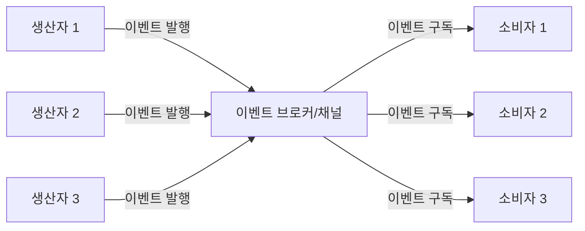
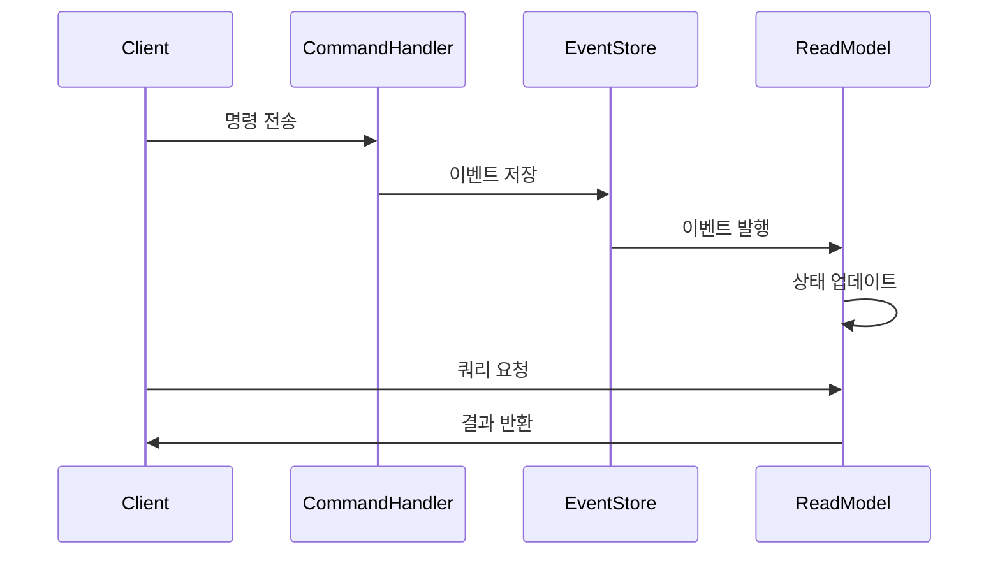
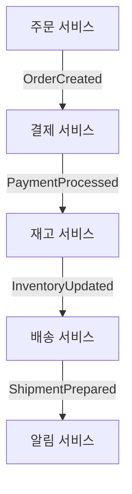
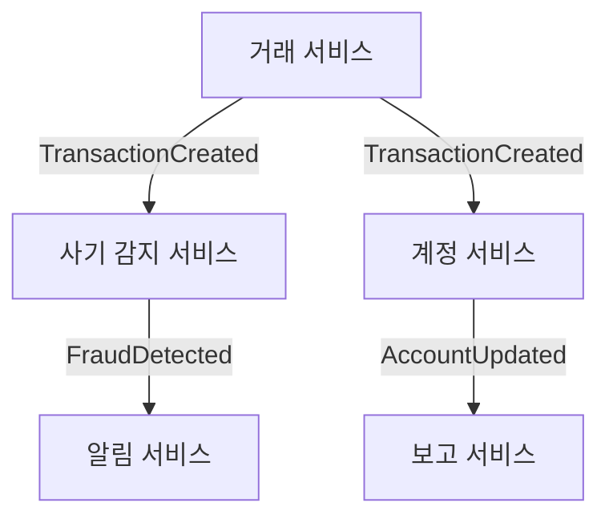
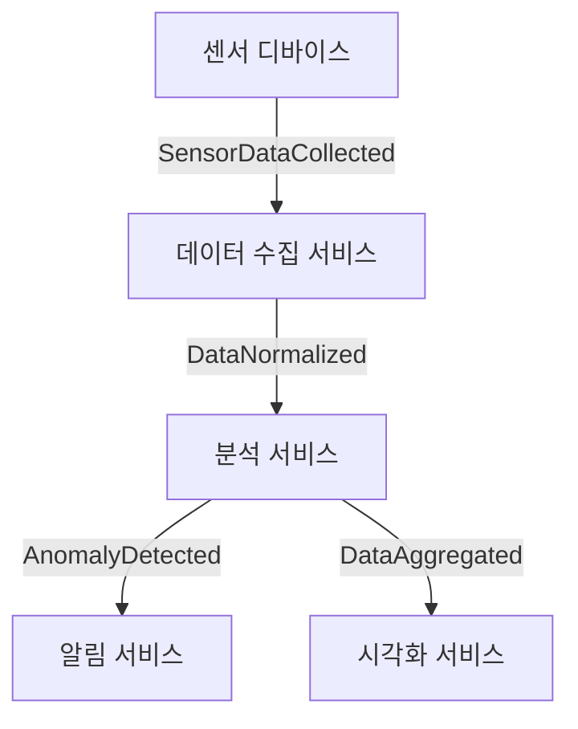

이벤트 기반 아키텍처(Event-Driven Architecture, EDA)는 시스템 컴포넌트 간의 통신이 이벤트의 생성, 감지 및 소비를 통해 이루어지는 소프트웨어 설계 방식입니다. 이 아키텍처에서는 한 컴포넌트에서 발생한 상태 변화나 중요한 사건(이벤트)이 다른 컴포넌트에 비동기적으로 전달되어 처리됩니다.

## 이벤트 기반 아키텍처의 핵심 개념

이벤트 기반 아키텍처를 이해하기 위해서는 몇 가지 핵심 개념을 파악하는 것이 중요합니다:

1. **이벤트(Event)**: 시스템 내에서 발생한 상태 변화나 중요한 사건을 나타내는 데이터 패킷입니다. 이벤트는 일반적으로 이벤트 이름과 관련 데이터로 구성됩니다.
    
2. **이벤트 생산자(Event Producer)**: 이벤트를 감지하고 생성하는 컴포넌트입니다.
    
3. **이벤트 소비자(Event Consumer)**: 이벤트를 수신하고 처리하는 컴포넌트입니다.
    
4. **이벤트 채널(Event Channel)**: 이벤트 생산자와 소비자 간의 통신 매체입니다(예: 메시지 큐, 이벤트 버스).
    
5. **이벤트 브로커(Event Broker)**: 이벤트 생산자와 소비자 사이에서 이벤트의 라우팅, 필터링, 변환 등을 담당하는 미들웨어입니다.
    

## 아키텍처 구성 요소

이벤트 기반 아키텍처는 일반적으로 다음과 같은 구성 요소로 이루어집니다:



### 1. 이벤트 생산자(Event Producer)

이벤트 생산자는 비즈니스 로직의 일부로서 이벤트를 감지하고 생성합니다. 이벤트 생산자는 이벤트를 발행(publish)한 후 이벤트의 처리 여부나 결과에 관심을 두지 않습니다.

```java
@Service
public class OrderService {
    
    @Autowired
    private EventPublisher eventPublisher;
    
    public Order createOrder(OrderRequest request) {
        // 주문 생성 로직
        Order order = orderRepository.save(new Order(request));
        
        // 주문 생성 이벤트 발행
        OrderCreatedEvent event = new OrderCreatedEvent(order.getId(), order.getCustomerId(), order.getAmount());
        eventPublisher.publish(event);
        
        return order;
    }
}
```

### 2. 이벤트 채널(Event Channel)

이벤트 채널은 이벤트 생산자와 소비자 간의 통신 매체입니다. 주요 유형으로는 다음과 같은 것들이 있습니다:

- **메시지 큐(Message Queue)**: 이벤트를 순서대로 처리합니다(예: RabbitMQ, ActiveMQ).
- **발행/구독 채널(Pub/Sub Channel)**: 이벤트를 여러 소비자에게 브로드캐스트합니다(예: Kafka, Google Pub/Sub).
- **이벤트 스트림(Event Stream)**: 이벤트의 순서가 있는 무한한 시퀀스로 관리합니다(예: Kafka Streams, AWS Kinesis).

### 3. 이벤트 소비자(Event Consumer)

이벤트 소비자는 이벤트를 수신하고 처리하는 컴포넌트입니다. 소비자는 관심 있는 이벤트만 구독(subscribe)하여 처리합니다.

```java
@Service
public class InventoryService {
    
    @EventListener
    public void handleOrderCreatedEvent(OrderCreatedEvent event) {
        // 주문 생성 이벤트에 대응하여 재고 감소 처리
        inventoryRepository.reduceStock(event.getProductId(), event.getQuantity());
        
        // 재고 변경 이벤트 발행 가능
        // ...
    }
}
```

## 이벤트 기반 아키텍처의 패턴

이벤트 기반 아키텍처는 다양한 패턴으로 구현될 수 있습니다:

### 1. 발행/구독(Publish/Subscribe) 패턴

가장 기본적인 패턴으로, 생산자는 이벤트를 발행하고 소비자는 관심 있는 이벤트를 구독합니다. 이 패턴은 생산자와 소비자 간의 느슨한 결합을 제공합니다.

### 2. 이벤트 소싱(Event Sourcing) 패턴

시스템의 상태 변화를 일련의 이벤트로 저장하고, 이벤트 스트림을 재생하여 현재 상태를 재구성합니다. 이 패턴은 [[CQRS(Command Query Responsibility Segregation)]] 패턴과 자주 함께 사용됩니다.



### 3. 메디에이터(Mediator) 패턴

중앙 메디에이터가 이벤트 라우팅을 관리하여 시스템의 결합도를 줄입니다.

### 4. 이벤트 스트림 처리(Event Stream Processing)

연속적인 이벤트 스트림을 실시간으로 처리하여 분석, 집계, 변환 등을 수행합니다.

## 이벤트 기반 아키텍처의 장점

이벤트 기반 아키텍처는 다음과 같은 이점을 제공합니다:

1. **느슨한 결합(Loose Coupling)**: 컴포넌트 간의 직접적인 의존성이 줄어들어 시스템의 유연성과 확장성이 향상됩니다.
    
2. **확장성(Scalability)**: 컴포넌트를 독립적으로 확장할 수 있습니다.
    
3. **유연성(Flexibility)**: 새로운 기능이나 서비스를 기존 시스템에 영향을 미치지 않고 추가할 수 있습니다.
    
4. **회복력(Resilience)**: 한 컴포넌트의 장애가 다른 컴포넌트에 직접적인 영향을 미치지 않습니다.
    
5. **비동기 처리(Asynchronous Processing)**: 이벤트는 비동기적으로 처리되므로 응답성이 향상됩니다.
    

## 이벤트 기반 아키텍처의 단점

이벤트 기반 아키텍처는 다음과 같은 도전과제도 가지고 있습니다:

1. **복잡성 증가**: 비동기 통신과 이벤트 흐름을 추적하고 디버깅하기 어려울 수 있습니다.
    
2. **데이터 일관성**: 분산 환경에서 데이터 일관성을 유지하기 어려울 수 있습니다.
    
3. **중복 이벤트**: 메시지 브로커의 "최소 한 번 전달" 보장으로 인해 중복 이벤트가 발생할 수 있습니다.
    
4. **이벤트 순서**: 이벤트의 순서 보장이 어려울 수 있습니다.
    
5. **학습 곡선**: 개발자가 비동기 프로그래밍 패러다임에 익숙해져야 합니다.
    

## 마이크로서비스와 이벤트 기반 아키텍처

이벤트 기반 아키텍처는 [[마이크로서비스 아키텍처]]와 특히 잘 어울립니다:

1. **서비스 간 통신**: 마이크로서비스 간의 비동기 통신을 가능하게 합니다.
    
2. **서비스 자율성**: 각 서비스가 독립적으로 작동할 수 있게 하여 자율성을 강화합니다.
    
3. **데이터 일관성**: [[사가 패턴(Saga Pattern)]]을 통해 분산 트랜잭션을 관리합니다.
    
4. **데이터 복제**: 각 서비스가 필요한 데이터를 이벤트를 통해 복제하고 유지할 수 있습니다.
    

## 이벤트 기반 아키텍처 구현 기술

이벤트 기반 아키텍처를 구현하기 위한 다양한 기술과 도구가 있습니다:

### 1. 메시지 브로커 및 스트리밍 플랫폼

- **Apache Kafka**: 고성능 분산 이벤트 스트리밍 플랫폼
- **RabbitMQ**: 메시지 큐잉 시스템
- **Amazon SNS/SQS**: AWS의 메시징 서비스
- **Google Pub/Sub**: GCP의 메시징 서비스
- **Azure Event Hubs/Service Bus**: Azure의 메시징 서비스

### 2. 통합 프레임워크

- **Spring Cloud Stream**: 메시지 브로커 기반 애플리케이션 개발을 위한 프레임워크
- **Apache Camel**: 통합 패턴 구현을 위한 프레임워크
- **MuleSoft**: 엔터프라이즈 통합을 위한 플랫폼

### 3. Spring 기반 구현 예제

Spring Framework에서 이벤트 기반 아키텍처를 구현하는 방법:

#### Spring Cloud Stream을 사용한 구현

```java
// 생산자 서비스
@EnableBinding(Source.class)
public class OrderService {
    
    @Autowired
    private Source source;
    
    public void createOrder(Order order) {
        // 주문 생성 로직
        
        // 이벤트 발행
        OrderCreatedEvent event = new OrderCreatedEvent(order.getId(), order.getItems());
        source.output().send(MessageBuilder.withPayload(event).build());
    }
}

// 소비자 서비스
@EnableBinding(Sink.class)
public class InventoryService {
    
    @StreamListener(Sink.INPUT)
    public void handleOrderCreated(OrderCreatedEvent event) {
        // 주문 생성 이벤트 처리 로직
        for (OrderItem item : event.getItems()) {
            inventoryRepository.reduceStock(item.getProductId(), item.getQuantity());
        }
    }
}
```

#### Spring ApplicationEventPublisher를 사용한 로컬 이벤트 처리

```java
@Service
public class OrderService {
    
    @Autowired
    private ApplicationEventPublisher eventPublisher;
    
    @Transactional
    public Order createOrder(OrderRequest request) {
        Order order = orderRepository.save(new Order(request));
        
        // 애플리케이션 이벤트 발행
        eventPublisher.publishEvent(new OrderCreatedEvent(order));
        
        return order;
    }
}

@Component
public class InventoryEventListener {
    
    @Autowired
    private InventoryService inventoryService;
    
    @EventListener
    public void handleOrderCreatedEvent(OrderCreatedEvent event) {
        inventoryService.updateInventory(event.getOrder());
    }
}
```

## 이벤트 스키마 관리

이벤트 기반 아키텍처에서는 이벤트 스키마의 일관성과 호환성을 유지하는 것이 중요합니다:

### 1. 스키마 레지스트리

- **Apache Avro**: 데이터 직렬화 시스템과 스키마 관리
- **Confluent Schema Registry**: Kafka와 함께 사용되는 스키마 관리 도구
- **JSON Schema**: JSON 기반 스키마 정의 및 검증

### 2. 스키마 버전 관리

이벤트 스키마를 변경할 때는 호환성을 유지하기 위한 전략이 필요합니다:

- **하위 호환성(Backward Compatibility)**: 새 스키마가 이전 버전의 데이터를 읽을 수 있음
- **상위 호환성(Forward Compatibility)**: 이전 스키마가 새 버전의 데이터를 읽을 수 있음
- **전체 호환성(Full Compatibility)**: 상위 및 하위 호환성 모두 보장

## 이벤트 기반 아키텍처의 모범 사례

이벤트 기반 아키텍처를 효과적으로 구현하기 위한 모범 사례는 다음과 같습니다:

### 1. 이벤트 설계

- **명확한 이벤트 이름**: 이벤트 이름은 과거 시제를 사용하여 작명(예: OrderCreated, PaymentProcessed)
- **충분한 컨텍스트 포함**: 이벤트에는 소비자가 필요로 하는 모든 정보를 포함
- **불변성 유지**: 이벤트는 생성 후 변경되지 않아야 함

### 2. 오류 처리 및 회복

- **데드 레터 큐(Dead Letter Queue)**: 처리할 수 없는 이벤트를 저장하는 큐 구현
- **재시도 메커니즘**: 일시적인 오류에 대한 재시도 로직 구현
- **멱등성(Idempotence)**: 동일한 이벤트가 여러 번 처리되어도 결과가 동일하도록 구현

### 3. 모니터링 및 추적

- **이벤트 로깅**: 이벤트의 생성, 전송, 처리를 로깅
- **분산 추적**: 여러 서비스에 걸친 이벤트 흐름 추적(예: Zipkin, Jaeger)
- **메트릭 수집**: 이벤트 처리 시간, 실패율 등의 메트릭 모니터링

## 실제 사용 사례

이벤트 기반 아키텍처는 다양한 도메인에서 활용됩니다:

### 1. 전자상거래 시스템

주문 처리 과정에서 여러 서비스 간의 조정이 필요한 경우:



### 2. 금융 시스템

트랜잭션 처리, 사기 감지, 보고 등 다양한 프로세스가 필요한 경우:



### 3. IoT 시스템

센서 데이터 수집 및 처리가 필요한 경우:



## 이벤트 기반 아키텍처와 도메인 주도 설계

[[도메인 주도 설계(DDD,Domain Driven Design)]]와 이벤트 기반 아키텍처는 자연스럽게 결합됩니다:

- **도메인 이벤트(Domain Events)**: DDD의 핵심 개념 중 하나로, 도메인 내에서 발생한 중요한 변화를 나타냅니다.
- **집합체(Aggregate)**: 트랜잭션 일관성 경계로, 도메인 이벤트의 발생 지점입니다.
- **경계 컨텍스트(Bounded Context)**: 서로 다른 컨텍스트 간의 통합에 이벤트가 사용됩니다.

```java
@Entity
@DomainEvents
public class Order {
    // ...
    
    @DomainEvents
    public Collection<Object> domainEvents() {
        List<Object> events = new ArrayList<>();
        if (this.status == OrderStatus.PLACED) {
            events.add(new OrderPlacedEvent(this));
        }
        return events;
    }
    
    @AfterDomainEventPublication
    public void clearEvents() {
        // 이벤트 발행 후 정리 로직
    }
}
```

## 결론

이벤트 기반 아키텍처는 현대적인 분산 시스템, 특히 마이크로서비스 환경에서 컴포넌트 간의 효과적인 통신과 느슨한 결합을 제공하는 강력한 접근 방식입니다. 비동기 통신, 확장성, 유연성 같은 이점을 제공하지만, 복잡성 증가와 데이터 일관성 관리 같은 도전과제도 수반합니다.

성공적인 이벤트 기반 아키텍처 구현을 위해서는 이벤트 설계, 오류 처리, 모니터링 등에 대한 모범 사례를 적용하고, 적절한 도구와 기술을 선택하는 것이 중요합니다. 또한, 도메인 주도 설계와 같은 보완적인 접근 방식을 함께 활용하면 더욱 효과적인 시스템을 구축할 수 있습니다.

이벤트 기반 접근 방식을 도입할 때는 비즈니스 요구사항, 시스템의 크기와 복잡성, 그리고 팀의 기술적 역량을 고려하여 적합한 수준에서 시작하고 점진적으로 확장해 나가는 것이 바람직합니다.

## 참고 자료

- Enterprise Integration Patterns - Gregor Hohpe, Bobby Woolf
- Building Event-Driven Microservices - Adam Bellemare
- Domain-Driven Design - Eric Evans
- Designing Event-Driven Systems - Ben Stopford
- Spring in Action - Craig Walls
- Spring Cloud Stream 공식 문서(https://spring.io/projects/spring-cloud-stream)