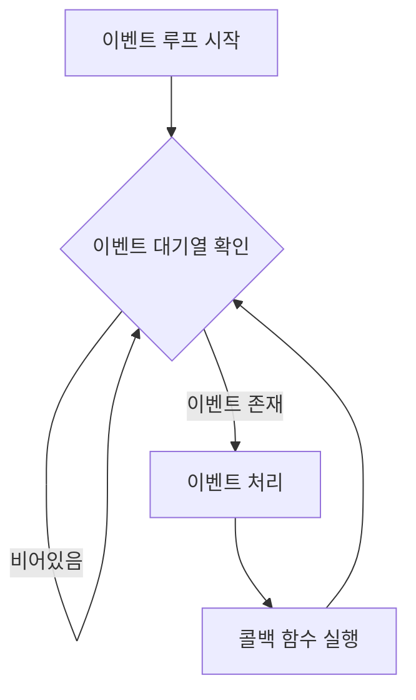

이벤트 루프는 [[비동기(Asynchronous)]] 프로그래밍의 핵심 메커니즘으로, 단일 스레드 환경에서도 효율적인 동시성 처리를 가능하게 하는 디자인 패턴입니다. 특히 JavaScript, Node.js, 그리고 최근의 많은 현대적 프레임워크에서 널리 사용되는 이 개념은 높은 동시성을 요구하는 애플리케이션에서 필수적인 요소입니다.

## 이벤트 루프의 개념

이벤트 루프는 프로그램이 이벤트를 기다리고, 이벤트가 발생했을 때 해당 이벤트를 처리하는 메커니즘입니다. 이름 그대로 '루프'처럼 계속해서 실행되면서 새로운 이벤트를 감지하고 처리합니다.

기본적인 구조는 다음과 같습니다:

1. 이벤트 대기열(Event Queue)에서 이벤트를 확인합니다.
2. 이벤트가 있으면 해당 이벤트와 연결된 콜백 함수를 실행합니다.
3. 이벤트 처리가 완료되면 다시 대기열을 확인합니다.

이러한 루프 구조는 단일 스레드에서 동작하지만, 비동기 I/O 작업을 통해 높은 처리량과 효율성을 제공합니다.

## 이벤트 루프의 작동 방식

이벤트 루프의 작동 방식을 더 자세히 살펴보겠습니다.



1. **이벤트 등록**: 프로그램에서 비동기 작업(네트워크 요청, 타이머, 사용자 입력 등)을 시작하고 콜백 함수를 등록합니다.
2. **비동기 작업 실행**: 운영체제나 브라우저의 백그라운드 스레드에서 비동기 작업이 실행됩니다.
3. **이벤트 대기열에 추가**: 비동기 작업이 완료되면, 관련 이벤트와 콜백이 이벤트 대기열에 추가됩니다.
4. **이벤트 루프 실행**: 메인 스레드의 이벤트 루프가 대기열에서 이벤트를 가져와 연결된 콜백을 실행합니다.

이러한 메커니즘을 통해 단일 스레드에서도 여러 작업을 동시에 처리하는 것처럼 보이게 됩니다.

## 이벤트 루프와 [[콜 스택(Call Stack)]]

이벤트 루프를 이해하려면 [[콜 스택(Call Stack)]]의 개념도 함께 이해해야 합니다. 콜 스택은 프로그램 실행 중에 함수 호출을 추적하는 데이터 구조입니다.

이벤트 루프와 콜 스택의 상호작용은 다음과 같습니다:

1. 콜 스택이 비어있는지 확인합니다.
2. 콜 스택이 비어있다면, 이벤트 대기열에서 이벤트를 가져옵니다.
3. 해당 이벤트의 콜백 함수를 콜 스택에 추가합니다.
4. 콜백 함수가 실행되고 완료되면 콜 스택에서 제거됩니다.
5. 다시 1번으로 돌아갑니다.

이 과정을 통해 비동기 작업이 메인 스레드를 차단하지 않고 효율적으로 처리됩니다.

## 이벤트 루프의 주요 구성 요소

이벤트 루프 시스템은 여러 구성 요소로 이루어져 있습니다:

1. **이벤트 루프(Event Loop)**: 전체 시스템의 핵심으로, 지속적으로 실행되면서 대기열을 확인합니다.
2. **콜 스택(Call Stack)**: 함수 호출의 실행 컨텍스트를 관리합니다.
3. **콜백 대기열(Callback Queue)**: 처리할 이벤트와 콜백 함수가 대기하는 공간입니다. 여러 종류의 대기열이 존재할 수 있습니다.
4. **Web API/Node API**: 브라우저나 Node.js 환경에서 제공하는 비동기 API(setTimeout, fetch, I/O 등)입니다.

각 구성 요소는 서로 유기적으로 작동하여 비동기 프로그래밍 모델을 지원합니다.

## 자바에서의 이벤트 루프

자바는 기본적으로 이벤트 루프 패턴을 내장하고 있지 않지만, Java 9에 도입된 Flow API나 외부 라이브러리를 통해 이벤트 루프 패턴을 구현할 수 있습니다.

### 기본 이벤트 루프 구현 예제

```java
import java.util.concurrent.BlockingQueue;
import java.util.concurrent.LinkedBlockingQueue;

public class SimpleEventLoop {
    private final BlockingQueue<Runnable> eventQueue = new LinkedBlockingQueue<>();
    private volatile boolean running = true;
    
    public void start() {
        // 이벤트 루프를 별도 스레드에서 실행
        new Thread(() -> {
            while (running) {
                try {
                    // 이벤트 대기열에서 다음 작업을 가져와 실행
                    Runnable event = eventQueue.take();
                    event.run();
                } catch (InterruptedException e) {
                    Thread.currentThread().interrupt();
                    break;
                } catch (Exception e) {
                    // 예외 처리
                    System.err.println("이벤트 처리 중 오류 발생: " + e.getMessage());
                }
            }
        }).start();
    }
    
    public void stop() {
        running = false;
    }
    
    public void submit(Runnable event) {
        if (running) {
            eventQueue.offer(event);
        }
    }
}
```

이 예제는 이벤트 루프의 개념을 간단히 구현한 것으로, 실제 프로덕션 환경에서는 더 복잡한 구현이 필요합니다.

## 스프링 프레임워크에서의 이벤트 처리

스프링 프레임워크는 ApplicationEventPublisher를 통해 이벤트 기반 프로그래밍을 지원합니다. 이는 이벤트 루프와 직접적으로 동일하지는 않지만, 유사한 패턴을 구현할 수 있습니다.

```java
@Service
public class OrderService {
    
    @Autowired
    private ApplicationEventPublisher eventPublisher;
    
    public void processOrder(Order order) {
        // 주문 처리 로직
        
        // 주문 완료 이벤트 발행
        eventPublisher.publishEvent(new OrderCompletedEvent(order));
    }
}

@Component
public class OrderEventListener {
    
    @EventListener
    public void handleOrderCompletedEvent(OrderCompletedEvent event) {
        // 주문 완료 후 처리 로직 (이메일 발송, 재고 업데이트 등)
    }
}
```

이러한 방식은 이벤트 발행자와 처리자 사이의 결합도를 낮추고, 관심사를 분리할 수 있습니다.

더 복잡한 비동기 이벤트 처리는 Spring WebFlux를 사용하여 구현할 수 있습니다. 자세한 내용은 Spring WebFlux와 리액티브 프로그래밍을 참고해주세요.

## 이벤트 루프의 장단점

### 장점

1. **효율적인 리소스 사용**: 단일 스레드로 여러 작업을 처리하여 스레드 생성 및 컨텍스트 전환 비용을 줄입니다.
2. **높은 확장성**: 적은 수의 스레드로 많은 동시 요청을 처리할 수 있습니다.
3. **단순한 프로그래밍 모델**: 멀티스레딩의 복잡한 동기화 문제를 피할 수 있습니다.
4. **자원 효율성**: I/O 대기 시간에 CPU를 다른 작업에 활용할 수 있습니다.

### 단점

1. **CPU 집약적 작업에 부적합**: 단일 스레드 모델에서 오래 걸리는 계산 작업은 전체 시스템을 차단할 수 있습니다.
2. **콜백 지옥(Callback Hell)**: 중첩된 비동기 호출이 코드의 가독성을 해칠 수 있습니다(최신 비동기 패턴으로 해결 가능).
3. **디버깅 어려움**: 비동기 코드의 실행 흐름을 추적하기 어려울 수 있습니다.
4. **오류 처리 복잡성**: 비동기 작업의 예외 처리가 동기 코드보다 복잡할 수 있습니다.

이러한 단점들은 Promise, async/await, [[반응형 프로그래밍(Reactive Programming)]]등의 현대적인 패턴으로 대부분 해결 가능합니다.

## 주요 사용 사례

이벤트 루프 패턴은 다음과 같은 상황에서 특히 유용합니다:

1. **웹 서버**: Node.js와 같은 환경에서 많은 동시 연결을 처리할 때
2. **GUI 애플리케이션**: 사용자 인터페이스의 반응성을 유지하면서 백그라운드 작업을 수행할 때
3. **네트워크 서비스**: 많은 동시 네트워크 연결을 관리할 때
4. **게임 개발**: 게임 루프와 유사한 패턴으로 이벤트 기반 로직을 구현할 때

## 자바와 다른 언어에서의 이벤트 루프

이벤트 루프는 여러 언어와 환경에서 다양한 방식으로 구현됩니다:

1. **JavaScript/Node.js**: 가장 대표적인 이벤트 루프 구현을 가지고 있으며, 기본 실행 모델입니다.
2. **Python**: asyncio 라이브러리를 통해 이벤트 루프 기반 비동기 프로그래밍을 지원합니다.
3. **Java**: [[Netty]], Vert.x, 그리고 Spring WebFlux 등의 프레임워크가 이벤트 루프 패턴을 구현합니다. Netty의 이벤트 루프 구현에 대한 자세한 내용은 [[Netty EventLoop]]를 참고하세요.
4. **Go**: 고루틴과 채널을 통해 다른 형태의 동시성을 제공하지만, 이벤트 루프와 유사한 패턴을 구현할 수 있습니다.

자바에서의 이벤트 루프 구현에 대한 자세한 내용은 자바 비동기 프레임워크 비교를 참고해주세요.

## 자바 기반 이벤트 루프 프레임워크

### [[Netty]]

[[Netty]]는 비동기 이벤트 기반 네트워크 애플리케이션 프레임워크로, 효율적인 이벤트 루프 구현을 제공합니다. Netty는 [[Reactor 패턴]]을 기반으로 [[Netty EventLoop]]를 통해 고성능 이벤트 처리를 수행합니다.

```java
public class NettyServer {
    public static void main(String[] args) throws Exception {
        EventLoopGroup bossGroup = new NioEventLoopGroup(1);
        EventLoopGroup workerGroup = new NioEventLoopGroup();
        
        try {
            ServerBootstrap b = new ServerBootstrap();
            b.group(bossGroup, workerGroup)
             .channel(NioServerSocketChannel.class)
             .childHandler(new ChannelInitializer<SocketChannel>() {
                 @Override
                 public void initChannel(SocketChannel ch) {
                     ch.pipeline().addLast(new EchoServerHandler());
                 }
             });
            
            ChannelFuture f = b.bind(8080).sync();
            f.channel().closeFuture().sync();
        } finally {
            workerGroup.shutdownGracefully();
            bossGroup.shutdownGracefully();
        }
    }
}
```

### Vert.x

Vert.x는 JVM 상에서 동작하는 리액티브 애플리케이션 프레임워크로, 이벤트 루프를 핵심으로 하는 비동기 프로그래밍 모델을 제공합니다.

```java
public class VertxHttpServer extends AbstractVerticle {
    @Override
    public void start() {
        vertx.createHttpServer().requestHandler(req -> {
            req.response()
               .putHeader("content-type", "text/plain")
               .end("Hello from Vert.x!");
        }).listen(8080);
    }
    
    public static void main(String[] args) {
        Vertx vertx = Vertx.vertx();
        vertx.deployVerticle(new VertxHttpServer());
    }
}
```

자세한 내용은 Vert.x를 이용한 리액티브 프로그래밍을 참고해주세요.

## 스프링 WebFlux와 이벤트 루프

스프링 5부터 도입된 WebFlux는 리액티브 프로그래밍 모델을 지원하며, Project Reactor를 기반으로 이벤트 루프 패턴을 구현합니다.

```java
@RestController
public class ReactiveController {
    
    @GetMapping("/events")
    public Flux<ServerSentEvent<String>> streamEvents() {
        return Flux.interval(Duration.ofSeconds(1))
                   .map(sequence -> ServerSentEvent.<String>builder()
                           .id(String.valueOf(sequence))
                           .event("periodic-event")
                           .data("Event #" + sequence)
                           .build());
    }
}
```

WebFlux는 Netty의 이벤트 루프를 기반으로 동작하며, 비동기-논블로킹 방식으로 요청을 처리합니다. 이를 통해 적은 수의 스레드로 많은 동시 연결을 효율적으로 처리할 수 있습니다.

자세한 내용은 Spring WebFlux 기초를 참고해주세요.

## 결론

이벤트 루프는 현대적인 비동기 프로그래밍의 핵심 메커니즘으로, 단일 스레드 환경에서도 효율적인 동시성 처리를 가능하게 합니다. JavaScript와 Node.js에서 가장 널리 알려졌지만, 자바를 포함한 다양한 언어와 플랫폼에서도 이 패턴을 활용할 수 있습니다.

자바 생태계에서는 Netty, Vert.x, Spring WebFlux 등의 프레임워크를 통해 이벤트 루프 기반의 비동기-논블로킹 프로그래밍을 구현할 수 있으며, 이를 통해 높은 확장성과 효율성을 갖춘 애플리케이션을 개발할 수 있습니다.

이벤트 루프의 개념을 제대로 이해하고 적절히 활용한다면, 더 효율적이고 확장성 있는 애플리케이션을 개발할 수 있을 것입니다.

## 참고 자료

- Node.js 공식 문서(https://nodejs.org/en/docs/guides/event-loop-timers-and-nexttick/)
- Spring WebFlux 공식 문서(https://docs.spring.io/spring-framework/docs/current/reference/html/web-reactive.html)
- Netty 공식 문서(https://netty.io/wiki/user-guide-for-4.x.html)
- Vert.x 공식 문서(https://vertx.io/docs/)
- Java Concurrency in Practice - Brian Goetz