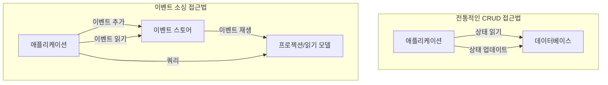

이벤트 소싱(Event Sourcing)은 애플리케이션의 상태 변화를 일련의 이벤트로 저장하는 설계 패턴입니다. 전통적인 데이터 저장 방식과는 달리, 이벤트 소싱은 객체나 엔티티의 현재 상태만 저장하지 않고, 해당 상태에 이르게 된 모든 변경 이벤트의 시퀀스를 저장합니다. 이는 시스템의 완전한 감사 기록(audit trail)을 제공하고, 상태의 어느 시점으로든 재구성할 수 있는 능력을 부여합니다.

## 이벤트 소싱의 핵심 개념

이벤트 소싱을 이해하기 위해서는 몇 가지 핵심 개념을 파악해야 합니다.

### [[이벤트(Event)]]

이벤트 소싱에서 이벤트는 시스템에서 발생한 중요한 변경을 나타내는 불변(immutable)의 기록입니다. 이벤트는 다음과 같은 특성을 갖습니다:

1. **과거 시제로 명명**: OrderPlaced, UserRegistered, PaymentReceived 등
2. **불변성**: 한번 생성된 이벤트는 절대 변경되지 않습니다
3. **완전성**: 이벤트는 변경을 완전히 이해하는 데 필요한 모든 데이터를 포함합니다
4. **시간 순서**: 모든 이벤트는 발생 시간이 기록되어 시간 순서대로 처리됩니다

### 이벤트 스트림(Event Stream)

특정 엔티티나 [[애그리게이트(Aggregate)]]에 관련된 모든 이벤트의 시간 순서 컬렉션을 이벤트 스트림이라고 합니다. 예를 들어, 주문 엔티티의 이벤트 스트림은 주문 생성, 결제 확인, 배송 시작 등의 일련의 이벤트로 구성될 수 있습니다.

### 이벤트 스토어(Event Store)

이벤트 스토어는 모든 이벤트를 영구적으로 저장하고 검색하는 특수 데이터베이스입니다. 주요 기능은 다음과 같습니다:

1. 이벤트 스트림 저장 및 조회
2. 특정 시점까지의 이벤트 재생(replay)
3. 이벤트 구독(subscription) 지원
4. 동시성 충돌 감지 및 해결

### 프로젝션(Projection)

프로젝션은 이벤트 스트림을 처리하여 읽기에 최적화된 뷰를 생성하는 과정입니다. 프로젝션은 질의(query)에 효율적으로 응답하기 위해 이벤트 데이터를 변환합니다.

## 전통적인 상태 기반 접근법과의 비교

이벤트 소싱과 전통적인 상태 기반 저장 방식의 차이점을 이해하기 위해 다음 다이어그램을 살펴보겠습니다.



### 주요 차이점

1. **데이터 저장 방식**
    
    - 전통적 방식: 현재 상태만 저장하며, 이전 상태는 덮어씁니다
    - 이벤트 소싱: 모든 상태 변경 이벤트를 시간 순서대로 저장합니다
2. **업데이트 처리**
    
    - 전통적 방식: 상태를 직접 수정합니다(UPDATE)
    - 이벤트 소싱: 새 이벤트를 추가하여 상태 변경을 표현합니다(APPEND)
3. **히스토리 및 감사**
    
    - 전통적 방식: 별도의 감사 테이블이 필요하며, 완전한 이력 보존이 어렵습니다
    - 이벤트 소싱: 모든 변경의 완전한 이력이 기본적으로 보존됩니다
4. **시간 질의**
    
    - 전통적 방식: 과거 상태 조회가 복잡하거나 불가능합니다
    - 이벤트 소싱: 특정 시점의 상태를 이벤트 재생을 통해 쉽게 재구성할 수 있습니다

## 이벤트 소싱 아키텍처

이벤트 소싱 아키텍처는 다음과 같은 구성 요소로 이루어집니다.

### 명령 처리(Command Processing)

1. **명령(Command)**: 시스템에 상태 변경을 요청하는 객체
2. **명령 핸들러(Command Handler)**: 명령의 유효성을 검증하고 처리하는 컴포넌트
3. **도메인 모델(Domain Model)**: 비즈니스 규칙을 강제하고 이벤트를 발생시키는 엔티티

### 이벤트 처리(Event Processing)

1. **이벤트 핸들러(Event Handler)**: 이벤트에 반응하여 부수 효과를 처리하는 컴포넌트
2. **이벤트 발행자(Event Publisher)**: 이벤트를 이벤트 스토어에 저장하고 구독자에게 알리는 컴포넌트
3. **이벤트 구독자(Event Subscriber)**: 이벤트를 수신하고 처리하는 컴포넌트

### 쿼리 처리(Query Processing)

1. **프로젝터(Projector)**: 이벤트를 처리하여 읽기 모델을 업데이트하는 컴포넌트
2. **읽기 모델(Read Model)**: 쿼리에 최적화된 데이터 표현
3. **쿼리 처리기(Query Processor)**: 읽기 모델에서 데이터를 조회하는 컴포넌트

이러한 구성 요소들의 상호작용은 종종 [[CQRS(Command Query Responsibility Segregation)]] 패턴과 함께 구현됩니다.

## Java와 Spring에서의 이벤트 소싱 구현

Java와 Spring에서 이벤트 소싱을 구현하는 간단한 예시를 살펴보겠습니다.

### 이벤트 정의

```java
// 기본 이벤트 인터페이스
public interface DomainEvent {
    UUID getEventId();
    UUID getAggregateId();
    LocalDateTime getTimestamp();
    long getVersion();
}

// 구체적인 이벤트 클래스
public class OrderCreatedEvent implements DomainEvent {
    private final UUID eventId;
    private final UUID orderId; // 애그리게이트 ID
    private final LocalDateTime timestamp;
    private final long version;
    private final String customerName;
    private final List<OrderItemDto> items;
    
    // 생성자, 게터 메서드 등
}
```

### 이벤트 스토어

```java
@Repository
public class EventStoreRepository {
    private final JdbcTemplate jdbcTemplate;
    
    @Autowired
    public EventStoreRepository(JdbcTemplate jdbcTemplate) {
        this.jdbcTemplate = jdbcTemplate;
    }
    
    public void saveEvent(DomainEvent event) {
        jdbcTemplate.update(
            "INSERT INTO event_store (event_id, aggregate_id, event_type, version, timestamp, payload) VALUES (?, ?, ?, ?, ?, ?)",
            event.getEventId(),
            event.getAggregateId(),
            event.getClass().getSimpleName(),
            event.getVersion(),
            event.getTimestamp(),
            serializeEvent(event)
        );
    }
    
    public List<DomainEvent> getEventsForAggregate(UUID aggregateId) {
        return jdbcTemplate.query(
            "SELECT * FROM event_store WHERE aggregate_id = ? ORDER BY version",
            new Object[]{aggregateId},
            (rs, rowNum) -> deserializeEvent(rs)
        );
    }
    
    // 직렬화 및 역직렬화 메서드
}
```

### 애그리게이트 구현

```java
public class Order {
    private UUID id;
    private String customerName;
    private List<OrderItem> items = new ArrayList<>();
    private OrderStatus status;
    private long version;
    
    // 이벤트 소싱을 위한 메서드
    public static Order recreateFromEvents(List<DomainEvent> events) {
        Order order = new Order();
        events.forEach(order::apply);
        return order;
    }
    
    // 이벤트 적용 메서드
    private void apply(DomainEvent event) {
        if (event instanceof OrderCreatedEvent) {
            apply((OrderCreatedEvent) event);
        } else if (event instanceof OrderPaidEvent) {
            apply((OrderPaidEvent) event);
        }
        // 다른 이벤트 타입 처리
        this.version = event.getVersion();
    }
    
    private void apply(OrderCreatedEvent event) {
        this.id = event.getAggregateId();
        this.customerName = event.getCustomerName();
        this.items = event.getItems().stream()
            .map(dto -> new OrderItem(dto.getProductId(), dto.getQuantity(), dto.getPrice()))
            .collect(Collectors.toList());
        this.status = OrderStatus.CREATED;
    }
    
    // 다른 이벤트 적용 메서드들
}
```

### 명령 처리기

```java
@Service
public class OrderCommandHandler {
    private final EventStoreRepository eventStore;
    private final EventPublisher eventPublisher;
    
    @Autowired
    public OrderCommandHandler(EventStoreRepository eventStore, EventPublisher eventPublisher) {
        this.eventStore = eventStore;
        this.eventPublisher = eventPublisher;
    }
    
    public UUID handleCreateOrder(CreateOrderCommand command) {
        // 새 주문 ID 생성
        UUID orderId = UUID.randomUUID();
        
        // 이벤트 생성
        OrderCreatedEvent event = new OrderCreatedEvent(
            UUID.randomUUID(),
            orderId,
            LocalDateTime.now(),
            1, // 버전
            command.getCustomerName(),
            command.getItems()
        );
        
        // 이벤트 저장 및 발행
        eventStore.saveEvent(event);
        eventPublisher.publish(event);
        
        return orderId;
    }
    
    public void handlePayOrder(PayOrderCommand command) {
        // 주문의 모든 이벤트 조회
        List<DomainEvent> events = eventStore.getEventsForAggregate(command.getOrderId());
        
        // 이벤트에서 주문 재구성
        Order order = Order.recreateFromEvents(events);
        
        // 비즈니스 규칙 검증
        if (order.getStatus() != OrderStatus.CREATED) {
            throw new IllegalStateException("Cannot pay for an order that is not in CREATED state");
        }
        
        // 새 이벤트 생성
        OrderPaidEvent event = new OrderPaidEvent(
            UUID.randomUUID(),
            command.getOrderId(),
            LocalDateTime.now(),
            events.size() + 1, // 다음 버전
            command.getPaymentId()
        );
        
        // 이벤트 저장 및 발행
        eventStore.saveEvent(event);
        eventPublisher.publish(event);
    }
}
```

더 복잡한 구현에 대해서는 [[Spring에서 이벤트 소싱 구현하기]]를 참고해주세요.

## 이벤트 소싱의 이점

### 1. 완전한 감사 기록(Audit Trail)

모든 변경사항이 이벤트로 저장되므로, 어떤 변경이 언제, 왜, 누구에 의해 이루어졌는지 정확히 알 수 있습니다. 이는 규제가 엄격한 산업에서 특히 중요합니다.

### 2. 시간 여행(Time Travel)

이벤트 스트림을 특정 시점까지만 재생함으로써, 과거의 어느 시점의 시스템 상태도 정확히 재구성할 수 있습니다. 이는 디버깅과 문제 분석에 매우 유용합니다.

### 3. 도메인 이벤트 활용

이벤트 소싱은 자연스럽게 [[도메인 이벤트(Domain Events)]]를 활용하므로, [[도메인 주도 설계(Domain-Driven Design)]]와 잘 어울립니다.

### 4. 성능과 확장성

이벤트는 항상 추가만 되므로(append-only), 고성능 스토리지 패턴을 활용할 수 있고, 동시성 충돌이 줄어듭니다. 또한 이벤트 저장과 쿼리 처리를 분리하여 확장성을 높일 수 있습니다.

### 5. 진화하는 비즈니스 요구사항 대응

새로운 비즈니스 인사이트나 요구사항이 생기면, 저장된 이벤트를 다시 처리하여 새로운 뷰나 모델을 생성할 수 있습니다. 이는 시스템의 유연성을 크게 높입니다.

## 이벤트 소싱의 도전 과제

### 1. 학습 곡선

이벤트 소싱은 전통적인 CRUD 기반 개발과 큰 차이가 있어, 팀에 새로운 학습이 필요합니다.

### 2. 이벤트 스키마 진화

시간이 지남에 따라 이벤트 구조가 변경될 수 있으며, 이를 관리하는 것은 복잡할 수 있습니다. 이에 대한 대응 방법은 [[이벤트 스키마 버전 관리]]를 참고해주세요.

### 3. 쿼리 성능

복잡한 쿼리 처리를 위해서는 별도의 읽기 모델이 필요하며, 이는 [[CQRS 패턴]]을 함께 사용해야 함을 의미합니다.

### 4. 이벤트 저장소 관리

대량의 이벤트가 누적됨에 따라 저장소 관리가 중요해집니다. [[이벤트 스냅샷(Event Snapshot)]] 기법을 사용하여 성능을 개선할 수 있습니다.

### 5. 결과적 일관성(Eventual Consistency)

프로젝션 업데이트가 비동기적으로 이루어지므로, 시스템은 [[결과적 일관성(Eventual Consistency)]]을 가집니다. 이는 일부 사용 사례에서 복잡성을 증가시킬 수 있습니다.

## 이벤트 소싱의 실제 사용 사례

### 1. 금융 시스템

은행 거래, 결제 처리 등의 금융 시스템은 모든 금융 활동의 완전한 감사 기록이 필요하므로 이벤트 소싱에 적합합니다.

### 2. 재고 관리 시스템

재고 움직임을 이벤트로 추적하면 재고 변동의 정확한 이력을 유지하고, 재고 불일치 문제를 해결하는 데 도움이 됩니다.

### 3. 규제가 엄격한 산업

의료, 법률, 금융 등 규제가 엄격한 산업에서는 데이터 변경의 완전한 추적이 필요하므로 이벤트 소싱이 유용합니다.

### 4. IoT 시스템

센서 데이터와 장치 상태 변경을 이벤트로 저장하여 시간에 따른 분석 및 장치 동작 이해에 활용할 수 있습니다.

### 5. 고객 관계 관리(CRM)

고객과의 모든 상호작용을 이벤트로 기록하여 고객 여정을 완전히 이해하고 개인화된 서비스를 제공할 수 있습니다.

## 이벤트 소싱과 관련 패턴

### CQRS(Command Query Responsibility Segregation)

이벤트 소싱은 종종 CQRS 패턴과 함께 사용됩니다. CQRS는 명령(쓰기 작업)과 쿼리(읽기 작업)의 책임을 분리하는 패턴으로, 이벤트 소싱과 자연스럽게 어울립니다. 자세한 내용은 [[CQRS 패턴]]을 참고해주세요.

### 이벤트 드리븐 아키텍처(Event-Driven Architecture)

이벤트 소싱은 [[이벤트 드리븐 아키텍처(Event-Driven Architecture)]]의 한 형태로 볼 수 있으며, 시스템 컴포넌트 간의 느슨한 결합을 제공합니다.

### 마이크로서비스 아키텍처(Microservices Architecture)

이벤트 소싱은 [[마이크로서비스 아키텍처(Microservices Architecture)]]에서 서비스 간 데이터 일관성 유지와 통신에 유용하게 활용될 수 있습니다.

## 이벤트 소싱 구현 시 고려사항

### 1. 이벤트 설계

이벤트는 비즈니스 의미를 명확히 표현하고, 자체 완결적(self-contained)이어야 합니다. 이벤트 이름은 과거 시제를 사용하고, 이벤트 속성은 해당 시점의 변경을 완전히 이해하는 데 필요한 모든 정보를 포함해야 합니다.

### 2. 버전 관리

시간이 지남에 따라 이벤트 구조가 변경될 수 있으므로, 효과적인 버전 관리 전략이 필요합니다. 이에 대한 접근 방법으로는 [[이벤트 업캐스팅(Event Upcasting)]], 버전 필드 추가 등이 있습니다.

### 3. 스냅샷(Snapshot)

매우 긴 이벤트 스트림의 성능 문제를 해결하기 위해, 주기적으로 애그리게이트의 현재 상태를 스냅샷으로 저장할 수 있습니다. 이후 재구성 시 스냅샷부터 시작하여 이후 이벤트만 적용하면 됩니다.

### 4. 멱등성(Idempotency)

동일한 이벤트가 여러 번 처리되더라도 시스템 상태가 일관되게 유지되도록 이벤트 처리는 멱등성을 갖도록 설계해야 합니다.

### 5. 병렬 처리와 순서 보장

확장성을 위해 이벤트 처리를 병렬화할 수 있지만, 동일 애그리게이트에 대한 이벤트는 순서대로 처리되어야 합니다.

더 자세한 구현 가이드는 [[이벤트 소싱 모범 사례]]를 참고해주세요.

## 결론

이벤트 소싱은 애플리케이션의 상태 변화를 이벤트의 시퀀스로 저장하는 강력한 패턴입니다. 이 접근 방식은 완전한 감사 기록, 시간 여행 기능, 도메인 이벤트 활용, 성능 및 확장성, 그리고 진화하는 비즈니스 요구사항에 대한 유연한 대응 등 다양한 이점을 제공합니다.

그러나 이벤트 소싱은 학습 곡선, 이벤트 스키마 관리, 쿼리 성능, 이벤트 저장소 관리, 결과적 일관성 등의 도전 과제도 함께 가지고 있습니다. 따라서 모든 시스템에 적합한 것은 아니며, 프로젝트의 특성과 요구사항을 고려하여 적용 여부를 결정해야 합니다.

이벤트 소싱은 특히 금융, 규제가 엄격한 산업, 복잡한 비즈니스 프로세스, 그리고 시간에 따른 데이터 분석이 중요한 도메인에서 가치를 발휘합니다. CQRS, 이벤트 드리븐 아키텍처, 마이크로서비스 아키텍처 등의 관련 패턴과 함께 사용될 때 그 효과가 극대화됩니다.

올바르게 구현된 이벤트 소싱 시스템은 시간이 지남에 따라 진화하는 비즈니스 요구사항에 유연하게 대응하면서, 데이터의 완전한 이력을 보존하는 견고한 기반을 제공합니다.

## 참고 자료

- Event Sourcing Basics - Martin Fowler
- Implementing Domain-Driven Design - Vaughn Vernon
- CQRS Documents - Greg Young
- Practical Event Sourcing with Axon Framework - Allard Buijze
- Spring 공식 문서 (https://spring.io/blog/2017/03/15/spring-tips-event-sourcing-with-axon-framework)