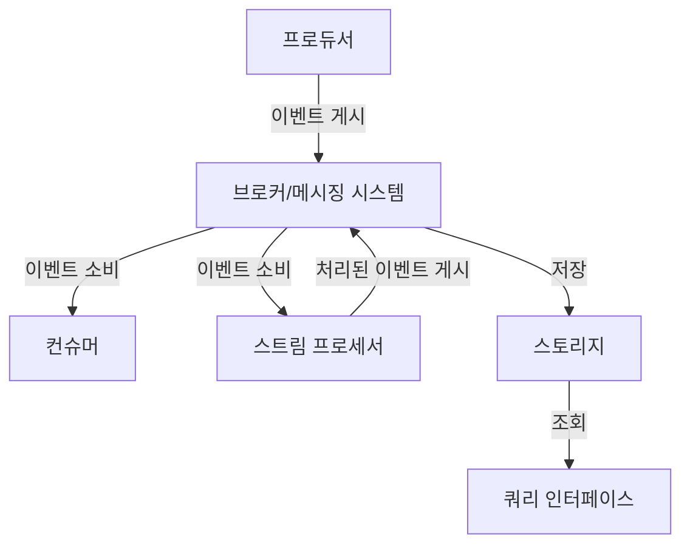

이벤트 스트리밍은 실시간으로 발생하는 데이터를 지속적으로 생성, 수집, 처리, 저장 및 분석하는 데이터 관리 패러다임입니다. 이벤트 스트리밍에서 '이벤트'란 비즈니스, 시스템, 디바이스 등에서 발생하는 모든 형태의 데이터 변경이나 상태 업데이트를 의미합니다.

이벤트 스트리밍은 데이터를 일괄 처리(batch processing)하는 기존 방식과 달리, 데이터가 발생하는 즉시 [[실시간 데이터 처리]]하는 것이 특징입니다. 이는 빠른 의사 결정과 반응이 필요한 현대 비즈니스 환경에 적합합니다.

## 2. 이벤트 스트리밍의 핵심 개념

### 2.1 이벤트(Event)

이벤트는 시스템에서 발생한 사건이나 상태 변화를 나타내는 데이터 레코드입니다. 일반적으로 다음과 같은 속성을 포함합니다:

- **이벤트 ID**: 이벤트를 고유하게 식별하는 식별자
- **이벤트 타입**: 이벤트의 종류(예: 구매, 클릭, 로그인)
- **타임스탬프**: 이벤트가 발생한 시간
- **데이터 페이로드**: 이벤트와 관련된 실제 데이터
- **메타데이터**: 이벤트에 대한 추가 정보

### 2.2 스트림(Stream)

스트림은 시간에 따라 순차적으로 정렬된 이벤트의 연속적인 흐름입니다. 이벤트 스트림은 무한대로 계속될 수 있으며, 각 이벤트는 스트림에 추가만 가능하고 변경은 불가능한 특성(append-only, immutable)을 가집니다.

### 2.3 프로듀서(Producer)와 컨슈머(Consumer)

- **프로듀서**: 이벤트를 생성하여 스트림에 게시(publish)하는 애플리케이션이나 서비스입니다.
- **컨슈머**: 스트림에서 이벤트를 구독(subscribe)하고 처리하는 애플리케이션이나 서비스입니다.

### 2.4 프로세서(Processor)

스트림 프로세서는 하나 이상의 스트림에서 이벤트를 소비하고, 이를 처리한 후 결과를 다른 스트림에 게시하는 컴포넌트입니다. 이를 통해 이벤트 데이터를 변환, 필터링, 집계, 조인 등의 작업을 수행할 수 있습니다.

## 3. 이벤트 스트리밍 플랫폼 아키텍처

이벤트 스트리밍 플랫폼은 일반적으로 다음과 같은 구성 요소를 포함합니다:

1. **브로커/메시징 시스템**: 이벤트를 수신하고 저장하며 구독자에게 전달하는 중앙 컴포넌트입니다. 대표적인 예로는 Apache Kafka, Amazon Kinesis, RabbitMQ 등이 있습니다.
    
2. **스토리지**: 이벤트 데이터를 지속적으로 저장하는 시스템입니다. 이벤트 스트리밍 플랫폼은 종종 이벤트 로그(event log)라는 특수한 형태의 스토리지를 사용합니다.
    
3. **스트림 처리 엔진**: 이벤트 스트림을 실시간으로 처리하기 위한 컴퓨팅 엔진입니다. Apache Flink, Apache Spark Streaming, Kafka Streams 등이 여기에 해당합니다.
    
4. **쿼리 인터페이스**: 저장된 이벤트 데이터에 대한 조회 기능을 제공합니다.
    

## 4. 이벤트 스트리밍의 주요 특징

### 4.1 실시간 처리

이벤트가 발생하는 즉시 처리하여 실시간 인사이트와 반응을 가능하게 합니다.

### 4.2 분산 아키텍처

대규모 이벤트 처리를 위해 수평적으로 확장 가능한 분산 아키텍처를 채택합니다.

### 4.3 내구성과 신뢰성

이벤트는 영구적으로 저장되며, 시스템 장애 시에도 데이터 손실을 방지합니다.

### 4.4 순서 보장

동일한 파티션 내에서는 이벤트의 순서가 보장됩니다.

### 4.5 재생 가능성(Replayability)

과거에 발생한 이벤트를 다시 재생하여 처리할 수 있습니다. 이는 시스템 복구, 새로운 분석 모델 적용, 버그 수정 등에 유용합니다.

## 5. 이벤트 스트리밍의 사용 사례

### 5.1 실시간 분석

사용자 행동, 시스템 성능, 비즈니스 메트릭 등을 실시간으로 분석하여 즉각적인 인사이트를 제공합니다.

### 5.2 데이터 통합(Data Integration)

다양한 소스에서 생성되는 데이터를 통합하고 일관된 형태로 변환하여 저장합니다.

### 5.3 마이크로서비스 통신

마이크로서비스 아키텍처에서 서비스 간 비동기 통신을 위한 메시징 백본으로 활용됩니다.

### 5.4 IoT 데이터 처리

수많은 IoT 디바이스에서 생성되는 센서 데이터를 수집하고 처리합니다.

### 5.5 실시간 모니터링 및 알림

시스템 상태, 비즈니스 지표, 보안 위협 등을 모니터링하고 이상 징후 발생 시 즉시 알림을 제공합니다.

### 5.6 사기 탐지(Fraud Detection)

금융 거래, 사용자 행동 등을 실시간으로 분석하여 사기 패턴을 탐지합니다.

## 6. 대표적인 이벤트 스트리밍 기술

### 6.1 Apache Kafka

LinkedIn에서 개발된 분산 이벤트 스트리밍 플랫폼으로, 높은 처리량, 내구성, 확장성을 제공합니다. 카프카는 현재 이벤트 스트리밍 분야에서 사실상의 표준으로 자리 잡았습니다.

### 6.2 Amazon Kinesis

AWS에서 제공하는 관리형 스트리밍 데이터 서비스로, 실시간 데이터 스트리밍 수집 및 처리를 지원합니다.

### 6.3 Apache Pulsar

Yahoo에서 개발된 분산 메시징 및 스트리밍 플랫폼으로, 멀티 테넌시, 지역 간 복제, 계층형 스토리지 등의 기능을 제공합니다.

### 6.4 RabbitMQ

AMQP(Advanced Message Queuing Protocol) 기반의 오픈소스 메시지 브로커로, 다양한 메시징 패턴을 지원합니다.

### 6.5 Google Pub/Sub

Google Cloud Platform에서 제공하는 완전 관리형 메시징 서비스입니다.

## 7. 이벤트 스트리밍 구현 시 고려사항

### 7.1 확장성

시스템이 증가하는 이벤트 볼륨과 프로듀서/컨슈머 수를 처리할 수 있는지 확인해야 합니다.

### 7.2 데이터 일관성

분산 환경에서 이벤트의 순서와 일관성을 보장하는 메커니즘이 필요합니다.

### 7.3 내결함성

시스템 장애 시에도 데이터 손실을 방지하고 신속하게 복구할 수 있는 능력이 중요합니다.

### 7.4 지연 시간(Latency)

실시간 처리를 위해 낮은 지연 시간을 유지해야 합니다.

### 7.5 데이터 스키마 관리

이벤트 데이터의 스키마 변화를 효과적으로 관리하는 전략이 필요합니다.

### 7.6 보안

이벤트 데이터의 보안과 개인정보 보호를 위한 암호화, 인증, 권한 관리 등이 구현되어야 합니다.

## 8. 이벤트 스트리밍과 관련 개념의 비교

### 8.1 이벤트 스트리밍 vs 배치 처리

|이벤트 스트리밍|배치 처리|
|---|---|
|실시간 처리|주기적 처리|
|지속적인 데이터 흐름|고정된 데이터 집합|
|낮은 지연 시간|높은 처리량에 최적화|
|실시간 의사 결정에 적합|복잡한 분석에 적합|

### 8.2 이벤트 스트리밍 vs 메시지 큐

|이벤트 스트리밍|메시지 큐|
|---|---|
|이벤트 보존 및 재생|메시지 소비 후 삭제|
|다수의 컨슈머 그룹 지원|일반적으로 단일 컨슈머|
|높은 처리량에 최적화|신뢰성 있는 전달에 초점|
|이벤트 기록으로 활용|작업 큐로 활용|

## 9. 결론

이벤트 스트리밍은 실시간 데이터 처리의 핵심 패러다임으로, 현대 데이터 중심 애플리케이션과 비즈니스에 필수적인 기술이 되었습니다. 분산 아키텍처, 실시간 처리 능력, 내구성, 확장성 등의 특징을 바탕으로 다양한 산업과 사용 사례에 적용되고 있습니다.

효과적인 이벤트 스트리밍 시스템을 구현하기 위해서는 적절한 기술 선택과 함께 확장성, 데이터 일관성, 내결함성, 지연 시간, 스키마 관리, 보안 등 다양한 측면을 고려해야 합니다.

## 10. 관련 노트

- 분산 시스템 설계
- 아파치 카프카
- [[이벤트 소싱(Event Sourcing)]]
- 마이크로서비스 아키텍처
- [[실시간 데이터 처리]]
- 비동기 메시징 패턴