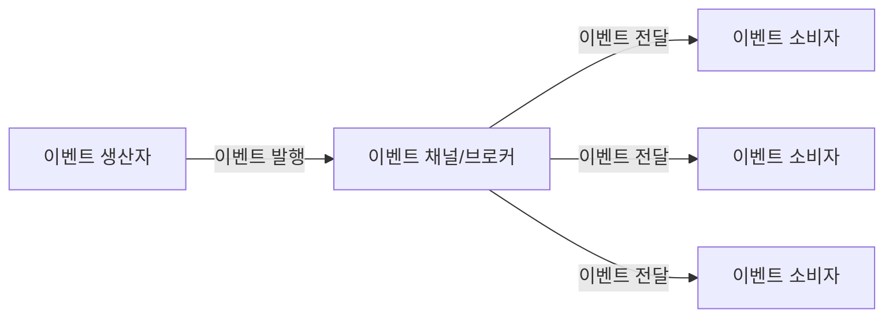
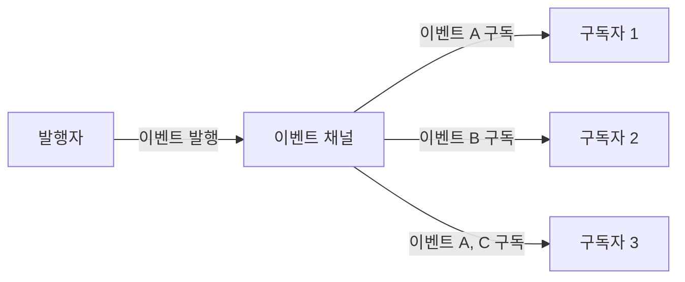
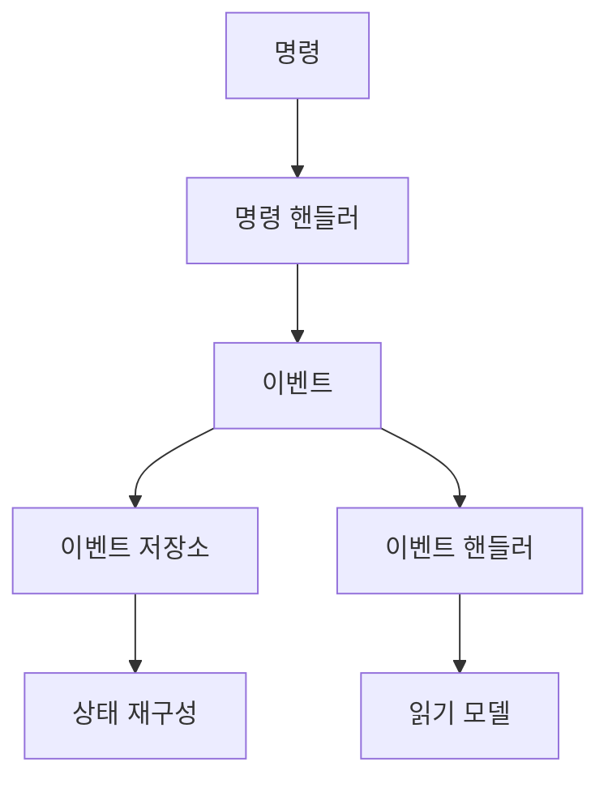
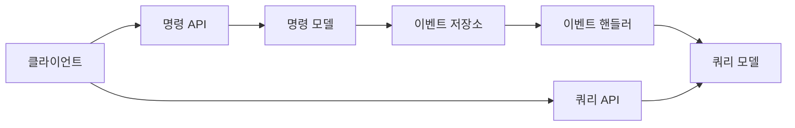
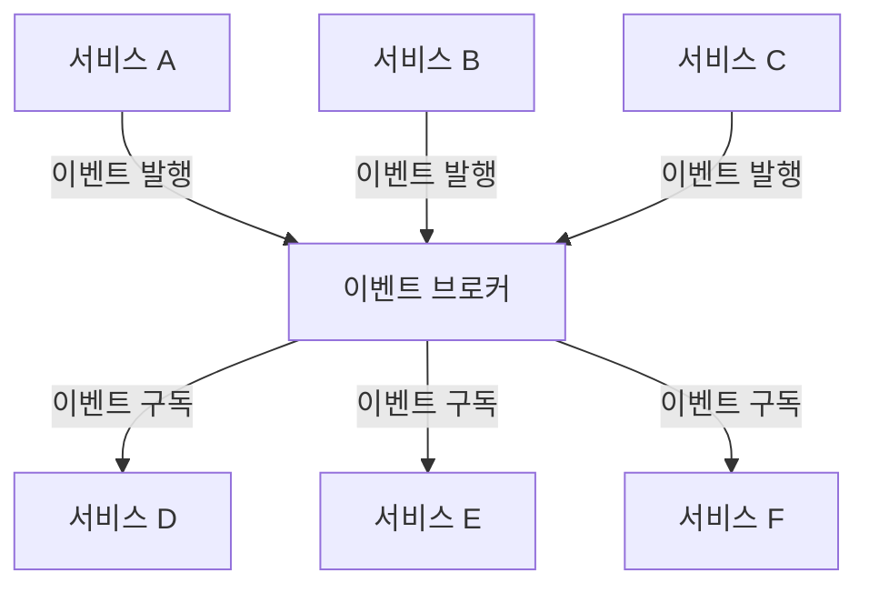

이벤트(Event)는 소프트웨어 시스템에서 발생한 중요한 상태 변화나 행위를 나타내는 개념입니다. 시스템의 특정 부분에서 발생한 일을 다른 부분에 알리는 메커니즘으로, 현대 소프트웨어 아키텍처에서 핵심적인 역할을 담당합니다. 이벤트 기반 프로그래밍은 시스템 컴포넌트 간의 결합도를 낮추고 확장성을 높이는 효과적인 방법입니다.

## 이벤트의 특성

이벤트는 다음과 같은 주요 특성을 가집니다:

1. **알림 메커니즘**: 시스템의 한 부분에서 발생한 변화를 다른 부분에 알립니다.
2. **비동기성**: 대부분의 경우 이벤트는 비동기적으로 처리됩니다.
3. **단방향 흐름**: 이벤트는 발생지(발행자)에서 수신지(구독자)로 단방향으로 흐릅니다.
4. **분리된 책임**: 이벤트 발행자와 구독자는 서로의 내부 구현을 알 필요가 없습니다.
5. **불변성**: 발행된 이벤트는 일반적으로 변경할 수 없습니다.

## 이벤트 vs 명령(Command)

이벤트와 명령은 자주 혼동되는 개념이지만 명확한 차이가 있습니다. 자세한 내용은 [[이벤트와 명령의 차이]]를 참고해주세요.

## 이벤트 기반 아키텍처

이벤트 기반 아키텍처(Event-Driven Architecture, EDA)는 이벤트의 생성, 감지, 소비 및 반응을 중심으로 설계된 소프트웨어 아키텍처 패턴입니다. 이 아키텍처는 다음과 같은 주요 구성 요소를 가집니다:



1. **이벤트 생산자(Event Producer)**: 이벤트를 생성하고 발행하는 주체입니다.
2. **이벤트 채널/브로커(Event Channel/Broker)**: 이벤트를 전달하는 중간 매개체입니다.
3. **이벤트 소비자(Event Consumer)**: 이벤트를 수신하고 처리하는 주체입니다.
4. **이벤트 처리기(Event Handler)**: 특정 이벤트에 대한 응답으로 실행되는 코드입니다.

이벤트 기반 아키텍처의 세부 구현 패턴에 대해서는 [[이벤트 기반 아키텍처(Event-Driven Architecture)]]을 참고해주세요.

## 이벤트 기반 프로그래밍 모델

이벤트 기반 프로그래밍은 프로그램의 흐름이 이벤트에 의해 결정되는 프로그래밍 패러다임입니다. 기본적인 구현 방식으로는 다음과 같은 패턴들이 있습니다:

### 1. 옵저버 패턴(Observer Pattern)

옵저버 패턴은 객체 간의 일대다 종속성을 정의하여, 한 객체의 상태가 변경되면 의존하는 모든 객체에 자동으로 알림이 가도록 하는 디자인 패턴입니다.

```java
public interface Observer {
    void update(String event);
}

public class Subject {
    private List<Observer> observers = new ArrayList<>();
    
    public void addObserver(Observer observer) {
        observers.add(observer);
    }
    
    public void removeObserver(Observer observer) {
        observers.remove(observer);
    }
    
    public void notifyObservers(String event) {
        for(Observer observer : observers) {
            observer.update(event);
        }
    }
}
```

자세한 내용은 [[옵저버 패턴]]을 참고해주세요.

### 2. 발행-구독 패턴(Publish-Subscribe Pattern)

발행-구독 패턴은 옵저버 패턴을 확장한 형태로, 이벤트 채널이라는 중간 매개체를 두어 발행자와 구독자 간의 결합도를 더욱 낮춥니다.



발행-구독 패턴에 대한 자세한 내용은 [[발행-구독 패턴]]을 참고해주세요.

## Java에서의 이벤트 처리

Java에서는 다양한 방식으로 이벤트를 처리할 수 있습니다.

### 1. Java 내장 이벤트 모델

Java AWT와 Swing과 같은 UI 프레임워크에서는 리스너(Listener) 인터페이스를 기반으로 하는 이벤트 모델을 제공합니다.

```java
button.addActionListener(new ActionListener() {
    @Override
    public void actionPerformed(ActionEvent e) {
        System.out.println("버튼이 클릭되었습니다.");
    }
});
```

### 2. Java 9 Flow API

Java 9에서는 반응형 프로그래밍을 지원하는 `java.util.concurrent.Flow` API를 도입했습니다. 이 API는 발행-구독 모델을 기반으로 합니다.

```java
@Service
public class OrderEventPublisher {
    private final List<Flow.Subscriber<OrderEvent>> subscribers = new CopyOnWriteArrayList<>();
    
    public void subscribe(Flow.Subscriber<OrderEvent> subscriber) {
        subscribers.add(subscriber);
        subscriber.onSubscribe(new OrderSubscription(subscriber));
    }
    
    public void publishOrderCreated(Order order) {
        OrderEvent event = new OrderCreatedEvent(order);
        notifySubscribers(event);
    }
    
    private void notifySubscribers(OrderEvent event) {
        subscribers.forEach(subscriber -> {
            try {
                subscriber.onNext(event);
            } catch (Exception e) {
                subscriber.onError(e);
            }
        });
    }
}
```

Flow API에 대한 자세한 내용은 [[Java Flow API]]를 참고해주세요.

## 스프링 프레임워크에서의 이벤트 처리

스프링 프레임워크는 이벤트 처리를 위한 다양한 기능을 제공합니다.

### 1. 애플리케이션 이벤트(ApplicationEvent)

스프링의 `ApplicationEvent`와 `ApplicationListener` 인터페이스를 사용하여 이벤트를 발행하고 구독할 수 있습니다.

```java
// 이벤트 정의
public class OrderCreatedEvent extends ApplicationEvent {
    private final Order order;
    
    public OrderCreatedEvent(Object source, Order order) {
        super(source);
        this.order = order;
    }
    
    public Order getOrder() {
        return order;
    }
}

// 이벤트 발행
@Service
public class OrderService {
    private final ApplicationEventPublisher eventPublisher;
    
    @Autowired
    public OrderService(ApplicationEventPublisher eventPublisher) {
        this.eventPublisher = eventPublisher;
    }
    
    public void createOrder(Order order) {
        // 주문 처리 로직
        // ...
        
        // 이벤트 발행
        eventPublisher.publishEvent(new OrderCreatedEvent(this, order));
    }
}

// 이벤트 구독
@Component
public class OrderEventListener implements ApplicationListener<OrderCreatedEvent> {
    @Override
    public void onApplicationEvent(OrderCreatedEvent event) {
        Order order = event.getOrder();
        // 주문 생성 이벤트에 대한 처리 로직
        System.out.println("새로운 주문이 생성되었습니다: " + order.getId());
    }
}
```

### 2. @EventListener 어노테이션

스프링 4.2부터는 `@EventListener` 어노테이션을 사용하여 더 간편하게 이벤트 리스너를 정의할 수 있습니다.

```java
@Component
public class OrderEventHandler {
    @EventListener
    public void handleOrderCreatedEvent(OrderCreatedEvent event) {
        Order order = event.getOrder();
        System.out.println("새로운 주문이 생성되었습니다: " + order.getId());
    }
    
    @EventListener
    @Async
    public void sendOrderConfirmationEmail(OrderCreatedEvent event) {
        // 비동기적으로 이메일 전송
    }
}
```

### 3. 트랜잭션 이벤트

스프링에서는 `@TransactionalEventListener` 어노테이션을 사용하여 트랜잭션의 특정 단계와 연결된 이벤트 리스너를 정의할 수 있습니다.

```java
@Component
public class OrderTransactionalEventHandler {
    @TransactionalEventListener(phase = TransactionPhase.AFTER_COMMIT)
    public void handleOrderCreatedEvent(OrderCreatedEvent event) {
        // 트랜잭션이 성공적으로 커밋된 후에만 실행됩니다.
    }
}
```

스프링 이벤트 처리에 대한 자세한 내용은 [[스프링 이벤트(Spring Event)]]를 참고해주세요.

## 이벤트 소싱(Event Sourcing)

이벤트 소싱은 시스템의 상태 변화를 일련의 이벤트로 저장하고, 필요할 때 이벤트를 재생하여 상태를 재구성하는 패턴입니다.



이벤트 소싱의 주요 개념과 구현 방법에 대해서는 [[이벤트 소싱 패턴]]을 참고해주세요.

## CQRS(Command Query Responsibility Segregation)

CQRS는 명령(상태를 변경하는 작업)과 쿼리(데이터를 읽는 작업)의 책임을 분리하는 아키텍처 패턴입니다. 이벤트 소싱과 함께 사용되는 경우가 많습니다.



CQRS에 대한 자세한 내용은 [[CQRS 패턴]]을 참고해주세요.

## 분산 시스템에서의 이벤트

분산 시스템에서는 이벤트가 시스템 간의 통합과 데이터 일관성 유지에 중요한 역할을 합니다.

### 이벤트 브로커

분산 시스템에서는 Apache Kafka, RabbitMQ, Amazon SNS/SQS와 같은 이벤트 브로커를 사용하여 이벤트를 안정적으로 전달합니다.



분산 시스템에서의 이벤트 처리에 대한 자세한 내용은 [[분산 이벤트 처리]]를 참고해주세요.

### 이벤트 스키마 진화

분산 시스템에서는 이벤트 스키마의 변경이