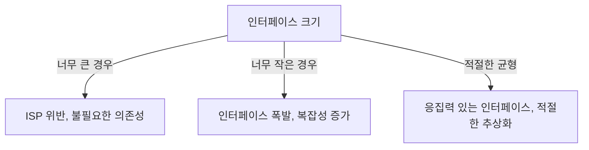

인터페이스 분리 원칙(Interface Segregation Principle, ISP)은 [[SOLID 원칙]] 중 하나로, "클라이언트는 자신이 사용하지 않는 메서드에 의존하지 않아야 한다"는 [[객체 지향 프로그래밍(OOP)]]의 핵심 원칙입니다. 이 원칙은 로버트 마틴(Robert C. Martin)에 의해 제안되었으며, 인터페이스를 적절히 분리하여 클라이언트가 필요한 기능만 알 수 있도록 하는 데 중점을 둡니다.

## 인터페이스 분리 원칙의 핵심

인터페이스 분리 원칙의 핵심은 다음과 같습니다:

1. **큰 인터페이스보다 작은 인터페이스를 선호합니다.** 하나의 거대한 인터페이스보다는 목적에 맞는 여러 개의 작은 인터페이스로 분리하는 것이 좋습니다.
2. **클라이언트는 자신이 사용하는 메서드만 알아야 합니다.** 클라이언트가 사용하지 않는 메서드에 의존하게 되면, 불필요한 결합도가 증가합니다.
3. **인터페이스는 클라이언트의 관점에서 설계되어야 합니다.** 구현 클래스의 편의가 아닌, 클라이언트의 요구사항에 맞게 인터페이스를 설계해야 합니다.

## 인터페이스 분리 원칙을 위반하는 경우

다음은 인터페이스 분리 원칙을 위반하는 전형적인 예입니다:

```java
// ISP 위반: 너무 많은 책임을 가진 인터페이스
public interface Worker {
    void work();
    void eat();
    void sleep();
}

// 로봇 클래스는 eat()와 sleep() 메서드가 불필요함
public class Robot implements Worker {
    @Override
    public void work() {
        // 작업 수행
    }
    
    @Override
    public void eat() {
        // 로봇은 먹지 않음 - 불필요한 메서드
        throw new UnsupportedOperationException();
    }
    
    @Override
    public void sleep() {
        // 로봇은 잠자지 않음 - 불필요한 메서드
        throw new UnsupportedOperationException();
    }
}
```

위 예제에서 `Robot` 클래스는 필요하지 않은 `eat()`와 `sleep()` 메서드를 구현해야 하는 상황에 놓이게 됩니다. 이는 인터페이스 분리 원칙을 위반하는 사례입니다.

## 인터페이스 분리 원칙에 따른 개선

앞선 예제를 인터페이스 분리 원칙에 따라 개선해보겠습니다:

```java
// 작업 관련 인터페이스
public interface Workable {
    void work();
}

// 식사 관련 인터페이스
public interface Eatable {
    void eat();
}

// 수면 관련 인터페이스
public interface Sleepable {
    void sleep();
}

// 사람은 모든 기능이 필요함
public class Human implements Workable, Eatable, Sleepable {
    @Override
    public void work() {
        System.out.println("인간이 일합니다.");
    }
    
    @Override
    public void eat() {
        System.out.println("인간이 식사합니다.");
    }
    
    @Override
    public void sleep() {
        System.out.println("인간이 잠을 잡니다.");
    }
}

// 로봇은 작업 기능만 필요함
public class Robot implements Workable {
    @Override
    public void work() {
        System.out.println("로봇이 작업을 수행합니다.");
    }
}
```

이처럼 인터페이스를 분리함으로써 `Robot` 클래스는 필요한 `work()` 메서드만 구현하면 됩니다. 이로써 클래스는 자신에게 필요한 메서드만 알게 되며, 불필요한 의존성이 제거됩니다.

## 실제 개발에서의 인터페이스 분리 원칙

실제 소프트웨어 개발에서 인터페이스 분리 원칙을 적용하는 방법을 살펴보겠습니다:

### 스프링 프레임워크에서의 적용

스프링 프레임워크는 인터페이스 분리 원칙을 적극적으로 활용합니다. 예를 들어, 스프링 데이터의 리포지토리 인터페이스는 목적에 따라 다양하게 분리되어 있습니다:

```java
// 기본 CRUD 작업을 위한 인터페이스
public interface CrudRepository<T, ID> extends Repository<T, ID> {
    <S extends T> S save(S entity);
    Optional<T> findById(ID id);
    boolean existsById(ID id);
    Iterable<T> findAll();
    long count();
    void deleteById(ID id);
    void delete(T entity);
}

// 페이징 및 정렬을 위한 별도 인터페이스
public interface PagingAndSortingRepository<T, ID> extends CrudRepository<T, ID> {
    Iterable<T> findAll(Sort sort);
    Page<T> findAll(Pageable pageable);
}

// JPA 특화 기능을 위한 별도 인터페이스
public interface JpaRepository<T, ID> extends PagingAndSortingRepository<T, ID> {
    List<T> findAll();
    List<T> findAll(Sort sort);
    List<T> findAllById(Iterable<ID> ids);
    <S extends T> List<S> saveAll(Iterable<S> entities);
    void flush();
    <S extends T> S saveAndFlush(S entity);
    void deleteInBatch(Iterable<T> entities);
    void deleteAllInBatch();
    T getOne(ID id);
}
```

이러한 설계 덕분에 개발자는 필요한 기능만 제공하는 인터페이스를 선택하여 사용할 수 있습니다. 만약 단순한 CRUD 작업만 필요하다면 `CrudRepository`만 사용하면 됩니다.

## 인터페이스 분리 원칙의 이점

인터페이스 분리 원칙을 적용함으로써 얻을 수 있는 이점은 다음과 같습니다:

1. **낮은 결합도**: 클라이언트는 필요한 기능만 알게 되므로 결합도가 낮아집니다.
2. **높은 응집도**: 각 인터페이스는 특정 목적을 위한 메서드만 포함하므로 응집도가 높아집니다.
3. **변경의 영향 최소화**: 하나의 인터페이스 변경이 다른 클라이언트에 미치는 영향이 최소화됩니다.
4. **리팩토링 용이성**: 작고 집중된 인터페이스는 리팩토링이 더 쉽습니다.
5. **테스트 용이성**: 목적별로 분리된 인터페이스는 모의 객체(mock) 생성과 테스트가 더 쉽습니다.

## 인터페이스 분리 원칙 적용 시 고려사항

인터페이스 분리 원칙을 적용할 때 고려해야 할 사항들입니다:

### 1. 인터페이스 크기의 적절한 균형

인터페이스를 너무 작게 분리하면 인터페이스의 수가 폭발적으로 증가할 수 있습니다. 따라서 적절한 균형을 찾는 것이 중요합니다. 일반적으로 함께 변경되는 메서드들은 같은 인터페이스에 두는 것이 좋습니다.



### 2. 인터페이스 진화 관리

시간이 지남에 따라 요구사항이 변경되면 인터페이스도 함께 변경되어야 할 수 있습니다. 이때 기존 클라이언트에 영향을 최소화하면서 새로운 기능을 추가하는 방법을 고려해야 합니다. Java 8의 디폴트 메서드는 이러한 상황에서 유용하게 사용될 수 있습니다.

### 3. 다른 SOLID 원칙과의 균형

인터페이스 분리 원칙은 다른 SOLID 원칙, 특히 [[단일 책임 원칙(Single Responsibility Principle)]]과 [[개방-폐쇄 원칙(OCP)]]과 함께 고려되어야 합니다. 때로는 이러한 원칙들 간에 균형을 맞추는 것이 필요합니다.

## 인터페이스 분리 원칙과 마이크로서비스 아키텍처

인터페이스 분리 원칙은 마이크로서비스 아키텍처와도 관련이 있습니다. 마이크로서비스는 큰 애플리케이션을 작고 독립적인 서비스로 분리하는 방식입니다. 이는 본질적으로 거대한 "서비스 인터페이스"를 더 작고 집중된 인터페이스로 분리하는 것과 비슷합니다.

## 인터페이스 분리 원칙 적용 체크리스트

프로젝트에서 인터페이스 분리 원칙을 잘 적용하고 있는지 확인하기 위한 체크리스트입니다:

1. 인터페이스가 단일 책임을 갖는가?
2. 구현 클래스가 사용하지 않는 메서드를 구현하고 있는가?
3. 클라이언트가 사용하지 않는 메서드에 의존하고 있는가?
4. 인터페이스가 특정 클라이언트의 요구에 맞게 설계되었는가?
5. 인터페이스 변경이 다른 클라이언트에 불필요한 영향을 미치는가?

## 결론

인터페이스 분리 원칙은 객체 지향 설계에서 중요한 원칙 중 하나입니다. 이 원칙을 적용함으로써 더 유연하고, 유지보수하기 쉬우며, 변경에 강한 소프트웨어를 구축할 수 있습니다. 인터페이스를 클라이언트의 필요에 맞게 적절히 분리하면, 불필요한 의존성이 제거되고 각 컴포넌트는 자신의 책임에만 집중할 수 있게 됩니다.

효과적인 인터페이스 설계는 단순히 기술적인 결정이 아니라, 시스템의 경계를 정의하고 컴포넌트 간의 커뮤니케이션을 명확히 하는 아키텍처적 결정입니다. 인터페이스 분리 원칙을 이해하고 적용함으로써, 더 모듈화되고 확장 가능한 소프트웨어 시스템을 구축할 수 있습니다.

## 참고 자료

- Clean Architecture - Robert C. Martin
- Agile Software Development: Principles, Patterns, and Practices - Robert C. Martin
- 스프링 프레임워크 공식 문서 (https://docs.spring.io/spring-framework/docs/current/reference/html/)
- Head First Design Patterns - Eric Freeman, Elisabeth Robson