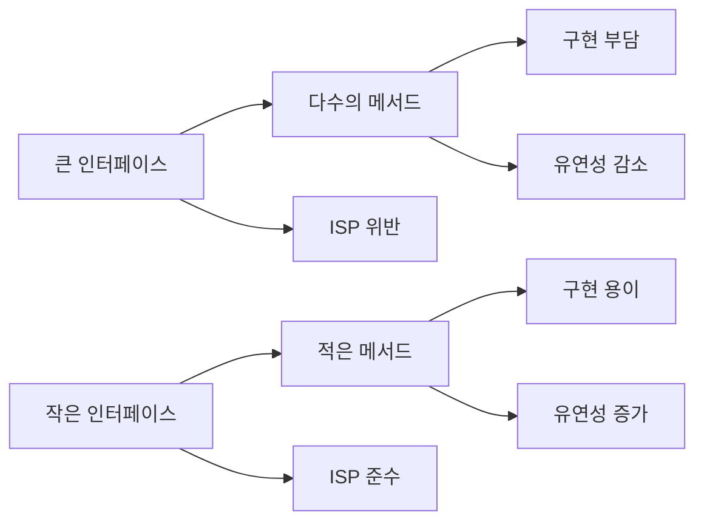

인터페이스(Interface)는 [[객체 지향 프로그래밍(OOP)]]에서 가장 강력한 도구 중 하나입니다.  인터페이스는 유연하고 확장 가능한 소프트웨어를 설계하는 데 핵심적인 역할을 합니다. 이 글에서는 인터페이스의 개념부터 실제 활용까지 깊이 있게 살펴보겠습니다.

## 인터페이스란?

인터페이스는 클래스가 구현해야 하는 메서드의 시그니처(서명)를 정의한 계약(contract)입니다. 인터페이스 자체는 메서드의 구현을 포함하지 않으며, 단지 "무엇을 해야 하는가"를 정의할 뿐, "어떻게 할 것인가"는 구현 클래스에 맡깁니다. 이러한 특성이 바로 [[추상화(Abstraction)]]의 핵심입니다.

## 인터페이스의 중요성

인터페이스가 중요한 이유는 다음과 같습니다:

1. **결합도 감소**: 인터페이스를 통해 구현체 간의 직접적인 의존을 줄일 수 있습니다.
2. **유연성 증가**: 구현체를 쉽게 교체할 수 있어 유연한 설계가 가능합니다.
3. **테스트 용이성**: 인터페이스를 활용하면 Mock Object를 사용한 테스트가 용이해집니다.
4. **다형성 지원**: 하나의 인터페이스, 다양한 구현을 통해 다형성을 실현할 수 있습니다.
5. **API 설계의 명확성**: 인터페이스는 명확한 API 계약을 정의합니다.

## 인터페이스 설계 원칙

효과적인 인터페이스 설계를 위해서는 몇 가지 중요한 원칙을 따라야 합니다:

### 1. 인터페이스 분리 원칙(ISP)

[[인터페이스 분리 원칙(Interface Segregation Principle)]]은 클라이언트가 자신이 사용하지 않는 메서드에 의존하지 않아야 한다는 원칙입니다. 큰 인터페이스보다는 특정 클라이언트를 위한 여러 개의 작은 인터페이스로 분리하는 것이 좋습니다.

### 2. 단일 책임 원칙(SRP)

인터페이스도 [[단일 책임 원칙(Single Responsibility Principle)]]을 따라야 합니다. 하나의 인터페이스는 하나의 책임, 즉 변경의 이유가 하나만 있어야 합니다.

### 3. 역할 기반 설계

인터페이스는 특정 객체가 "무엇을 할 수 있는지"를 나타내는 역할을 정의합니다. 예를 들어, `Comparable` 인터페이스는 객체가 "비교 가능하다"는 역할을 정의합니다.

## Java에서의 인터페이스

Java에서 인터페이스는 다음과 같이 정의합니다:

```java
public interface PaymentProcessor {
    boolean processPayment(double amount);
    Receipt generateReceipt(double amount);
    void refund(double amount);
}
```

### Java 8 이후의 인터페이스 변화

Java 8부터 인터페이스에 몇 가지 중요한 변화가 있었습니다:

#### 1. 디폴트 메서드(Default Methods)

인터페이스에 구현을 포함한 메서드를 정의할 수 있게 되었습니다:

```java
public interface PaymentProcessor {
    boolean processPayment(double amount);
    
    // 디폴트 메서드
    default Receipt generateReceipt(double amount) {
        return new StandardReceipt(amount);
    }
}
```

디폴트 메서드는 인터페이스의 하위 호환성을 유지하면서 새로운 기능을 추가할 수 있게 해줍니다.

#### 2. 정적 메서드(Static Methods)

인터페이스에 정적 메서드를 추가할 수 있게 되었습니다:

```java
public interface PaymentProcessor {
    boolean processPayment(double amount);
    
    // 정적 메서드
    static PaymentProcessor getDefaultProcessor() {
        return new DefaultPaymentProcessor();
    }
}
```

#### 3. private 메서드(Java 9 이후)

Java 9부터는 인터페이스에 private 메서드를 추가할 수 있어, 디폴트 메서드 간의 코드 중복을 제거할 수 있게 되었습니다:

```java
public interface PaymentProcessor {
    boolean processPayment(double amount);
    
    default Receipt generateReceipt(double amount) {
        log("생성 중: " + amount);
        return createReceipt(amount);
    }
    
    default Receipt generatePremiumReceipt(double amount) {
        log("프리미엄 생성 중: " + amount);
        return createReceipt(amount * 1.1);
    }
    
    // private 메서드
    private Receipt createReceipt(double amount) {
        return new StandardReceipt(amount);
    }
    
    private void log(String message) {
        System.out.println(message);
    }
}
```

자세한 내용은 Java 8 이후의 인터페이스 변화를 참고해주세요.

## 인터페이스의 활용 패턴

인터페이스를 활용한 주요 디자인 패턴들이 있습니다:

### 1. 전략 패턴(Strategy Pattern)

[[전략 패턴 (Strategy Pattern)]]은 알고리즘을 인터페이스로 정의하고 각 알고리즘을 별도 클래스로 구현하여, 알고리즘을 교체 가능하게 만듭니다.

```java
// 인터페이스 정의
public interface SortStrategy {
    void sort(int[] array);
}

// 구현 클래스들
public class QuickSort implements SortStrategy {
    @Override
    public void sort(int[] array) {
        // 퀵소트 구현
    }
}

public class BubbleSort implements SortStrategy {
    @Override
    public void sort(int[] array) {
        // 버블소트 구현
    }
}

// 컨텍스트 클래스
public class SortContext {
    private SortStrategy strategy;
    
    public void setStrategy(SortStrategy strategy) {
        this.strategy = strategy;
    }
    
    public void sort(int[] array) {
        strategy.sort(array);
    }
}
```

### 2. 어댑터 패턴(Adapter Pattern)

[[어댑터 패턴(Adapter Pattern)]]은 호환되지 않는 인터페이스들을 함께 작동하게 해줍니다.

### 3. 팩토리 패턴(Factory Pattern)

[[팩토리 메소드 패턴(Factory Method Pattern)]]은 객체 생성 로직을 클라이언트 코드로부터 분리합니다.

## 스프링 프레임워크에서의 인터페이스

스프링 프레임워크는 인터페이스를 적극적으로 활용하는 프레임워크입니다. 스프링의 핵심 개념인 의존성 주입(Dependency Injection)은 인터페이스를 통해 구현체의 결합도를 낮추는 데 중점을 둡니다.

### 스프링에서의 인터페이스 활용 예시

```java
// 서비스 인터페이스
public interface UserService {
    User findById(Long id);
    List<User> findAll();
    User save(User user);
}

// 구현 클래스
@Service
public class UserServiceImpl implements UserService {
    
    private final UserRepository userRepository;
    
    @Autowired
    public UserServiceImpl(UserRepository userRepository) {
        this.userRepository = userRepository;
    }
    
    @Override
    public User findById(Long id) {
        return userRepository.findById(id)
            .orElseThrow(() -> new UserNotFoundException(id));
    }
    
    @Override
    public List<User> findAll() {
        return userRepository.findAll();
    }
    
    @Override
    public User save(User user) {
        return userRepository.save(user);
    }
}

// 컨트롤러에서의 사용
@RestController
@RequestMapping("/api/users")
public class UserController {
    
    private final UserService userService;
    
    @Autowired
    public UserController(UserService userService) {
        this.userService = userService;
    }
    
    @GetMapping("/{id}")
    public User getUser(@PathVariable Long id) {
        return userService.findById(id);
    }
    
    // 다른 엔드포인트들...
}
```

스프링에서 인터페이스를 사용하면 다음과 같은 이점이 있습니다:

1. **테스트 용이성**: 인터페이스를 통해 모의 객체(mock)를 주입하여 단위 테스트가 쉬워집니다.
2. **AOP 지원**: 스프링의 AOP(Aspect-Oriented Programming)는 인터페이스를 기반으로 프록시를 생성합니다.
3. **유연한 구성**: 다양한 환경(개발, 테스트, 프로덕션)에 따라 다른 구현체를 주입할 수 있습니다.

자세한 내용은 스프링에서의 인터페이스 활용을 참고해주세요.

## 인터페이스 설계 시 고려사항

효과적인 인터페이스 설계를 위한 고려사항입니다:

### 인터페이스 응집도

인터페이스의 모든 메서드는 논리적으로 연관되어 있어야 합니다. 응집도가 높은 인터페이스는 이해하기 쉽고 유지보수하기 쉽습니다.

### 인터페이스 크기

"인터페이스가 작을수록 좋다"는 원칙을 기억하세요. 큰 인터페이스는 구현 클래스에 부담을 주고, ISP를 위반할 가능성이 높습니다.



### 인터페이스 안정성

인터페이스는 한 번 공개되면 변경하기 어렵습니다. 따라서 인터페이스를 설계할 때는 장기적인 안정성을 고려해야 합니다.

## 인터페이스의 실제 사용 사례

인터페이스는 다양한 상황에서 활용됩니다:

1. **데이터 접근 계층**: Repository 인터페이스를 통해 데이터 접근 방식을 추상화합니다.
2. **서비스 계층**: 비즈니스 로직을 인터페이스로 정의하여 여러 구현을 가능하게 합니다.
3. **플러그인 시스템**: 확장 가능한 아키텍처를 위해 플러그인 API를 인터페이스로 정의합니다.
4. **프레임워크 통합**: 서로 다른 프레임워크 간의 통합을 위한 어댑터를 인터페이스로 정의합니다.

### 대표적인 자바 인터페이스 예시

Java 표준 라이브러리에는 많은 유용한 인터페이스가 있습니다:

- **Comparable**: 객체의 자연 순서를 정의합니다.
- **Comparator**: 객체의 커스텀 정렬 기준을 정의합니다.
- **Runnable**: 스레드에서 실행할 작업을 정의합니다.
- **Callable**: 결과를 반환하는 비동기 작업을 정의합니다.
- **Iterator**: 컬렉션 요소에 순차적으로 접근하는 방법을 정의합니다.

## 함수형 인터페이스

Java 8에서 도입된 함수형 인터페이스(Functional Interface)는 단 하나의 추상 메서드만을 가진 인터페이스로, 람다 표현식과 함께 사용됩니다.

```java
@FunctionalInterface
public interface Predicate<T> {
    boolean test(T t);
    
    // 디폴트 메서드는 여러 개 가질 수 있음
    default Predicate<T> and(Predicate<? super T> other) {
        Objects.requireNonNull(other);
        return (t) -> test(t) && other.test(t);
    }
    
    default Predicate<T> negate() {
        return (t) -> !test(t);
    }
}

// 사용 예시
Predicate<String> isEmpty = String::isEmpty;
Predicate<String> isNotEmpty = isEmpty.negate();
```

자바의 주요 함수형 인터페이스:

- **Function<T, R>**: T 타입을 받아 R 타입을 반환하는 함수
- **Consumer<T>**: T 타입을 받아 처리하고 반환값이 없는 함수
- **Supplier<T>**: 입력 없이 T 타입 결과를 제공하는 함수
- **Predicate<T>**: T 타입에 대한 조건 검사 함수

자세한 내용은 자바 함수형 인터페이스를 참고해주세요.

## 인터페이스와 추상 클래스의 차이

인터페이스와 추상 클래스(Abstract Class)는 모두 추상화를 위한 도구지만, 중요한 차이점이 있습니다:

1. **다중 구현/상속**: 클래스는 여러 인터페이스를 구현할 수 있지만, 하나의 클래스만 상속할 수 있습니다.
2. **상태 관리**: 인터페이스는 상태(필드)를 가질 수 없지만, 추상 클래스는 가질 수 있습니다.
3. **구현 제공**: 인터페이스는 (Java 8 이전) 구현을 제공할 수 없지만, 추상 클래스는 일부 메서드에 구현을 제공할 수 있습니다.
4. **목적**: 인터페이스는 "할 수 있는 것"을 정의하고, 추상 클래스는 "무엇인지"를 정의합니다.

자세한 내용은 인터페이스 vs 추상 클래스를 참고해주세요.

## 결론

"All you need is interface"라는 말은 과장이 있을 수 있지만, 인터페이스가 객체 지향 설계에서 차지하는 중요성을 잘 보여줍니다. 인터페이스는 코드의 결합도를 낮추고, 유연성과 확장성을 높이며, 테스트 용이성을 제공합니다.

효과적인 인터페이스 설계는 단순히 기술적인 문제가 아니라, 시스템의 경계를 정의하고 컴포넌트 간의 상호작용을 명확히 하는 아키텍처적 결정입니다. 인터페이스를 통해 변경에 강한 유연한 시스템을 구축할 수 있습니다.

좋은 소프트웨어 설계를 위해 인터페이스의 원칙과 패턴을 이해하고 적절하게 활용하는 것이 중요합니다. 인터페이스는 단순한 언어 기능을 넘어, 좋은 소프트웨어 설계의 핵심 요소입니다.

## 참고 자료

- Effective Java, 3rd Edition - Joshua Bloch
- Clean Code - Robert C. Martin
- Design Patterns - Erich Gamma, Richard Helm, Ralph Johnson, John Vlissides
- Spring Framework 공식 문서(https://docs.spring.io/spring-framework/docs/current/reference/html/)