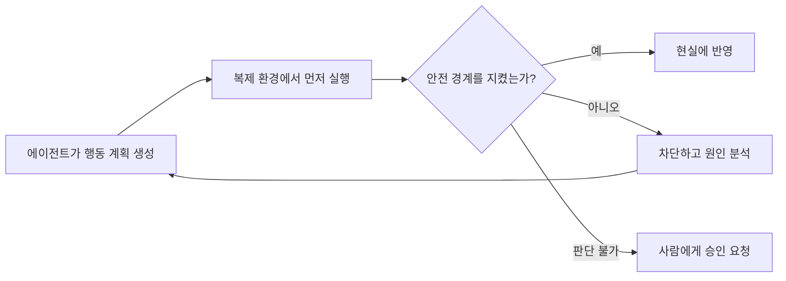

LLM에 도구가 붙으면서 AI는 현실에 영향을 줄 수 있게 됐다. 이제 에이전트는 답변만 만드는 것이 아니라 파일을 지우고, 코드를 배포하고, 이메일을 보내고, 결제를 실행할 수 있다. 사람이 승인을 누르지 않아도 행동할 수 있는 자동 모드라면 그 영향은 더 직접적이다.

Claude Code나 Codex 같은 에이전트 하네스에는 사람이 도구 실행을 승인하는 절차가 있다. 안전을 위해 필요한 장치다. 하지만 에이전트가 행동할 때마다 사람이 내용을 읽고 승인해야 한다면, 자동화로 얻으려던 속도는 다시 사람의 처리량에 묶인다. 승인이 반복될수록 사람은 내용을 꼼꼼히 보기보다 습관적으로 허용하게 되고, 결국 자동 승인으로 기울기 쉽다.

그렇다면 자동 모드는 안전할까.

나는 이 질문에 모델이 더 똑똑해지면 된다고 답하기 어렵다고 생각한다. [[LLM의 한계|LLM은 확률적으로 다음 행동을 선택하며]], 사람 역시 판단을 틀릴 수 있다. 실수를 완전히 없애는 주체는 없다. 더구나 에이전트는 사람보다 훨씬 많은 행동을 짧은 시간에 실행할 수 있다. 한 번의 실수보다 빠르게 반복되는 실수가 더 큰 문제가 된다.

그래서 에이전트 시대의 위험 관리는 매번 올바른 판단을 기대하는 방식이 아니라, 잘못 판단해도 피해가 현실로 넘어오지 못하게 만드는 방식이어야 한다.

## 매뉴얼은 사람의 속도에 맞춰 발전해 왔다

사람은 실패를 겪을 때마다 절차를 만들었다. 사고가 나면 원인을 찾고, 같은 사고를 막기 위한 확인 항목을 추가하고, 다음부터는 정해진 순서에 따라 일하도록 했다. 매뉴얼과 시스템은 이런 식으로 조금씩 두꺼워졌다.

이 방식은 행동의 속도가 사람의 처리량에 머물 때 잘 작동했다. 새로운 실패가 생기면 원인을 분석하고 절차를 보완할 시간이 있었다.

에이전트는 이 주기를 바꾼다. 하나의 에이전트가 여러 작업을 동시에 처리하고, 다시 여러 에이전트에게 일을 나누면 행동의 양은 빠르게 늘어난다. 실패를 발견하고 매뉴얼을 고치는 동안에도 다음 행동은 계속 실행된다. 모든 행동의 올바른 순서를 미리 정하고 사람이 확인하는 방식은 안전장치인 동시에 병목이 된다.

문제는 매뉴얼이 쓸모없어졌다는 데 있지 않다. 행동을 하나씩 지시하는 방식만으로는 에이전트의 속도를 감당하기 어려워졌다는 데 있다.

## 행동의 순서보다 넘어서는 안 되는 경계

기존 매뉴얼은 주로 무엇을 어떤 순서로 해야 하는지를 정한다. 에이전트에게도 같은 방법을 적용하면 행동 하나하나를 규정해야 한다. 새로운 도구와 행동이 추가될 때마다 절차도 다시 작성해야 한다.

나는 이 방식을 뒤집어야 한다고 생각한다. 해야 할 행동을 모두 적는 대신, 어떤 결과도 침범해서는 안 되는 경계를 먼저 정하는 것이다.

예를 들어 코드 배포라면 다음과 같은 경계를 둘 수 있다.

- 기존 기능의 결과가 달라지지 않아야 한다.
- 권한 범위가 넓어져서는 안 된다.
- 정해진 성능과 비용 한도를 넘어서는 안 된다.
- 문제가 생겼을 때 이전 상태로 돌아갈 수 있어야 한다.

경계 안에서는 에이전트가 방법을 자유롭게 찾도록 한다. 어떤 파일을 먼저 고칠지, 테스트를 몇 번 반복할지, 실패한 접근을 버리고 다른 방법을 시도할지는 일일이 승인하지 않는다. 대신 경계를 넘는 결과는 현실에 반영되지 못하게 한다.

이것은 단순히 금지 목록에 없는 행동을 모두 허용하자는 뜻은 아니다. 우리가 예상하지 못한 위험은 금지 목록에도 없기 때문이다. 중요한 것은 개별 행동을 열거하는 것이 아니라, 데이터 보존이나 권한 제한처럼 어떤 실행에서도 지켜져야 할 조건을 정하고 시스템이 그 조건을 검사하게 만드는 데 있다.

## 첫 번째 실행은 복제된 현실에서 일어나야 한다

경계를 검사하려면 에이전트의 행동이 현실에 도달하기 전에 결과를 볼 수 있어야 한다. 그래서 필요한 것이 디지털 트윈 바운더리다.

현실과 가능한 한 같은 환경을 복제하고, 에이전트의 첫 번째 행동은 항상 그 안에서 실행한다. 소프트웨어라면 스테이징 환경이나 샌드박스가 될 수 있다. 물리적인 작업이라면 안전장치가 적용된 실험실이나 시뮬레이터가 될 수 있다.

복제 환경에서 실행한 뒤에는 결과가 미리 정한 경계를 지켰는지 확인한다. 데이터가 사라지지 않았는지, 기존 기능이 그대로 동작하는지, 예상하지 않은 외부 요청을 보내지 않았는지, 비용과 자원 사용량이 허용 범위 안에 있는지를 검사한다. 문제가 없다면 같은 행동을 현실에 반영한다. 검증에 실패하거나 판단할 수 없다면 멈추고 사람에게 넘긴다.

나는 현실에 영향을 줄 수 있는 행동이 반드시 이 경계를 통과해야 한다고 생각한다. 에이전트가 자유롭게 움직일 수 있는 공간과 실제 피해가 생길 수 있는 공간 사이에 검증 계층을 두는 것이다. 사람이 모든 과정을 지켜보지 않아도 되지만, 검증되지 않은 행동이 곧바로 현실에 닿아서도 안 된다.

## 현실을 복제할 수 없다면 결과를 예측한다

모든 현실을 똑같이 복제할 수는 없다. 실제 사용자 반응, 시장의 변화, 복잡한 물리 환경처럼 스테이징 환경으로 옮기기 어려운 대상도 많다. 복제 환경을 만들 수 있더라도 현실과 완전히 같게 유지하는 데 큰 비용이 들 수 있다.

이때는 예측 모델이 필요하다. 에이전트의 행동이 어떤 결과를 만들 가능성이 있는지, 실패 확률과 피해 규모가 어느 정도인지 계산해 현실에 반영할지를 결정하는 방식이다. 한 가지 결과를 맞히는 모델보다는 가능한 결과의 범위와 불확실성을 함께 보여 주는 모델이어야 한다. 예측하기 어려울수록 허용 범위를 줄이거나 사람에게 판단을 넘겨야 한다.

가장 현실적인 방법은 둘 중 하나만 고르는 것이 아니라 함께 쓰는 것이다. 복제할 수 있는 부분은 디지털 트윈에서 직접 실행하고, 복제할 수 없는 차이는 예측 모델로 추정한다. 그리고 두 방법으로도 불확실성이 충분히 줄어들지 않는 행동만 사람이 승인한다.

## 디지털 트윈도 현실은 아니다

복제 환경에서 성공했다고 현실에서도 반드시 성공하는 것은 아니다. 스테이징에는 실제와 다른 데이터가 있고, 시뮬레이터는 현실의 변수를 모두 담지 못한다. 예측 모델 역시 보지 못한 상황에서는 틀릴 수 있다.

따라서 디지털 트윈 바운더리는 안전을 증명하는 장치가 아니라, 실패가 곧바로 현실의 피해가 되는 것을 줄이는 장치에 가깝다. 현실에 반영할 때도 한 번에 전체를 바꾸기보다 영향 범위를 제한하고, 결과를 관찰하며, 이상이 생기면 즉시 멈추거나 되돌릴 수 있어야 한다. 삭제, 결제, 외부 공개처럼 되돌리기 어려운 행동에는 여전히 사람의 승인이 필요할 수 있다.

에이전트의 자율성은 신뢰의 선언으로 얻어지는 것이 아니다. 실패해도 감당할 수 있는 범위가 시스템으로 보장될 때 얻어진다.

## 에이전트 시대의 위험 관리

기존의 위험 관리는 사람이 따라야 할 절차를 늘리는 방식으로 발전해 왔다. 하지만 에이전트의 처리량이 계속 늘어나면 모든 행동을 사람이 확인하는 방식은 오래 버티기 어렵다. 그렇다고 자동 모드에 현실의 권한을 그대로 넘기는 것도 답이 아니다.

앞으로의 위험 관리는 행동의 절차보다 행동이 넘어서는 안 되는 경계를 설계하는 일이 되어야 한다. 에이전트는 그 경계 안에서 자유롭게 시도하고, 실패하고, 다시 시도한다. 현실과 같은 환경을 만들 수 있다면 그곳에서 먼저 실행한다. 만들 수 없다면 예측 모델로 결과와 불확실성을 계산한다. 그래도 위험을 판단할 수 없거나 되돌릴 수 없다면 사람이 결정한다.

목표는 실패를 완전히 없애는 것이 아니다. 실패가 허용된 공간 안에서 일어나게 하고, 검증된 결과만 현실로 넘기는 것이다. 그래야 에이전트의 속도를 죽이지 않으면서도 현실을 지킬 수 있다.
