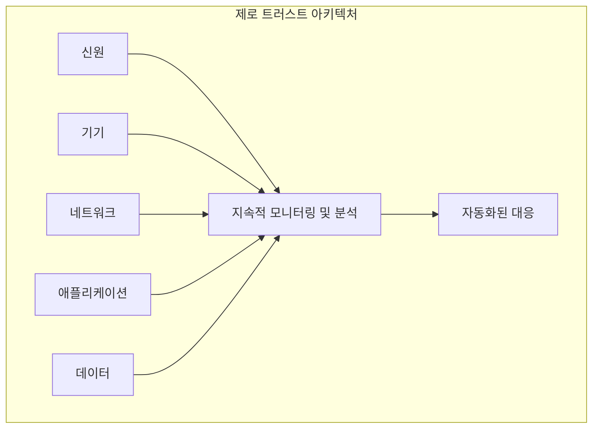

**제로 트러스트(Zero Trust)**는 "**절대 신뢰하지 말고, 항상 검증하라 (Never Trust, Always Verify)**"는 원칙에 기반한 현대적인 보안 모델입니다.

기존의 경계 기반 보안 모델(Perimeter-based Security)이 내부 네트워크는 안전하다고 가정하는 것과 달리, 제로 트러스트는 네트워크의 내외부를 막론하고 모든 사용자, 기기, 애플리케이션을 잠재적 위협으로 간주합니다. 따라서 모든 접근 요청에 대해 신원, 기기 상태, 위치 등 다양한 요소를 종합적으로 평가하여 명시적으로 검증하고 권한을 부여합니다.

## 제로 트러스트의 3가지 핵심 원칙

제로 트러스트 모델은 다음과 같은 세 가지 핵심 원칙을 기반으로 합니다.

1.  **명시적인 확인 (Verify Explicitly)**
    모든 접근 요청을 신뢰하지 않고, 가능한 모든 데이터 포인트(사용자 신원, 위치, 기기 상태, 서비스, 데이터 분류 등)를 기반으로 항상 인증하고 권한을 부여합니다. 다단계 인증(MFA)은 이 원칙의 기본적인 구현 요소입니다.

2.  **[[최소 권한 원칙]] 적용 (Use Least-Privilege Access)**
    사용자가 자신의 업무를 수행하는 데 꼭 필요한 최소한의 리소스에만 접근할 수 있도록 제한합니다. 이는 '적시(Just-in-Time)' 및 '충분한(Just-Enough)' 접근(JIT/JEA) 원칙을 통해 구현되며, 사용자의 권한이 과도하게 부여되는 것을 막아 잠재적인 위협 범위를 줄입니다.

3.  **침해를 가정 (Assume Breach)**
    공격자가 이미 내부에 침투했을 가능성을 전제로 보안 전략을 수립합니다. 이를 통해 잠재적 피해 범위를 최소화하고, 네트워크를 작은 단위로 나누는 **마이크로세그멘테이션(Micro-segmentation)**을 적용하여 위협의 내부 확산을 방지합니다. 모든 통신은 암호화하여 중간자 공격을 막습니다.

## 제로 트러스트 구현의 핵심 요소 (Pillars)

제로 트러스트 아키텍처를 성공적으로 구현하기 위해서는 여러 기술적 요소(Pillar)들을 종합적으로 고려해야 합니다.

1.  **신원 (Identity)**: 모든 사용자(사람과 기계 모두)의 신원을 강력하게 인증하고 관리합니다. (예: MFA, SSO)
2.  **기기 (Devices)**: 네트워크에 접근하는 모든 기기(회사 소유, 개인 소유 포함)의 보안 상태를 지속적으로 확인하고 관리합니다.
3.  **네트워크 (Networks)**: 네트워크를 마이크로세그멘테이션하여 내부 위협 확산을 제한하고, 모든 통신을 암호화합니다.
4.  **애플리케이션 및 워크로드 (Applications & Workloads)**: 애플리케이션과 클라우드 워크로드에 대한 접근을 안전하게 관리하고 모니터링합니다.
5.  **데이터 (Data)**: 모든 데이터를 분류하고, 암호화하며, [[접근 제어 모델]]을 적용하여 보호합니다.
6.  **지속적인 모니터링 및 분석 (Continuous Monitoring & Analytics)**: 시스템 전반의 활동을 지속적으로 모니터링하고 분석하여 이상 징후와 위협을 실시간으로 탐지합니다.
7.  **자동화 및 오케스트레이션 (Automation & Orchestration)**: 탐지된 위협에 신속하고 확장 가능하게 대응하기 위해 보안 정책과 대응 절차를 자동화합니다.

## 결론

제로 트러스트는 특정 기술이나 제품이 아닌, 지속적인 프로세스이자 보안 철학입니다. 클라우드와 원격 근무가 보편화된 현대 IT 환경에서 더 이상 내부와 외부의 경계는 무의미해졌습니다. 따라서 모든 것을 잠재적 위협으로 간주하고 철저히 검증하는 제로 트러스트 모델은 이제 선택이 아닌 필수가 되어가고 있습니다.

## 참고 자료
- [NIST - Zero Trust Architecture (SP 800-207)](https://csrc.nist.gov/publications/detail/sp/800-207/final)
- [Microsoft - Zero Trust Guidance Center](https://learn.microsoft.com/en-us/security/zero-trust/)
- [Google Cloud - BeyondCorp](https://cloud.google.com/beyondcorp?hl=ko)
