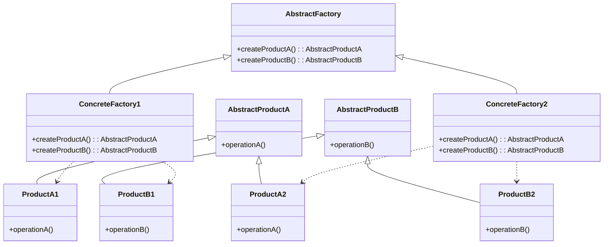

 팩토리 패턴은 관련 있는 객체들의 집합을 생성하기 위한 인터페이스를 제공하는 [[생성 패턴(Creational Pattern)]]입니다. 이 패턴은 구체적인 클래스를 지정하지 않고도 연관된 객체들의 집합을 생성할 수 있게 해주며, 객체 생성 로직을 클라이언트 코드로부터 분리하는 데 큰 도움이 됩니다.

## 추상 팩토리 패턴이 해결하는 문제

소프트웨어 개발에서 관련된 객체 집합(제품군)을 생성해야 하는 상황이 자주 발생합니다. 예를 들어, 다양한 운영체제에서 동작하는 UI 컴포넌트를 만들어야 한다고 가정해보겠습니다. 각 운영체제(Windows, macOS, Linux)마다 버튼, 체크박스, 라디오 버튼 등의 룩앤필이 다릅니다.

이런 상황에서 클라이언트 코드가 구체적인 클래스에 의존하게 되면:

1. 코드가 특정 구현에 강하게 결합됩니다.
2. 시스템 환경이 변경될 때마다 객체 생성 로직을 수정해야 합니다.
3. 새로운 제품군을 추가하기 어려워집니다.

추상 팩토리 패턴은 이러한 문제를 해결하기 위해 "관련된 객체들의 팩토리"를 추상화하여 제공합니다.

## 패턴의 구조

추상 팩토리 패턴의 구조는 다음과 같습니다:



구성 요소:

1. **AbstractFactory**: 제품군을 생성하기 위한 인터페이스를 정의합니다.
2. **ConcreteFactory**: 구체적인 제품을 생성하는 팩토리를 구현합니다.
3. **AbstractProduct**: 제품의 인터페이스를 정의합니다.
4. **ConcreteProduct**: 구체적인 제품을 구현합니다.
5. **Client**: 추상 팩토리와 추상 제품 인터페이스를 사용합니다.

## Java에서의 구현

UI 컴포넌트를 예로 들어 Java로 추상 팩토리 패턴을 구현해 보겠습니다:

### 1. 추상 제품 인터페이스 정의

```java
// 버튼 인터페이스
public interface Button {
    void render();
    void onClick();
}

// 체크박스 인터페이스
public interface Checkbox {
    void render();
    void onSelect();
}
```

### 2. 구체적인 제품 구현

```java
// Windows 스타일 버튼
public class WindowsButton implements Button {
    @Override
    public void render() {
        System.out.println("Windows 스타일의 버튼을 렌더링합니다.");
    }
    
    @Override
    public void onClick() {
        System.out.println("Windows 버튼 클릭 효과를 표시합니다.");
    }
}

// macOS 스타일 버튼
public class MacOSButton implements Button {
    @Override
    public void render() {
        System.out.println("macOS 스타일의 버튼을 렌더링합니다.");
    }
    
    @Override
    public void onClick() {
        System.out.println("macOS 버튼 클릭 효과를 표시합니다.");
    }
}

// Windows 스타일 체크박스
public class WindowsCheckbox implements Checkbox {
    @Override
    public void render() {
        System.out.println("Windows 스타일의 체크박스를 렌더링합니다.");
    }
    
    @Override
    public void onSelect() {
        System.out.println("Windows 체크박스 선택 효과를 표시합니다.");
    }
}

// macOS 스타일 체크박스
public class MacOSCheckbox implements Checkbox {
    @Override
    public void render() {
        System.out.println("macOS 스타일의 체크박스를 렌더링합니다.");
    }
    
    @Override
    public void onSelect() {
        System.out.println("macOS 체크박스 선택 효과를 표시합니다.");
    }
}
```

### 3. 추상 팩토리 인터페이스 정의

```java
public interface GUIFactory {
    Button createButton();
    Checkbox createCheckbox();
}
```

### 4. 구체적인 팩토리 구현

```java
public class WindowsFactory implements GUIFactory {
    @Override
    public Button createButton() {
        return new WindowsButton();
    }
    
    @Override
    public Checkbox createCheckbox() {
        return new WindowsCheckbox();
    }
}

public class MacOSFactory implements GUIFactory {
    @Override
    public Button createButton() {
        return new MacOSButton();
    }
    
    @Override
    public Checkbox createCheckbox() {
        return new MacOSCheckbox();
    }
}
```

### 5. 클라이언트 코드 작성

```java
public class Application {
    private Button button;
    private Checkbox checkbox;
    
    public Application(GUIFactory factory) {
        button = factory.createButton();
        checkbox = factory.createCheckbox();
    }
    
    public void render() {
        button.render();
        checkbox.render();
    }
    
    public static void main(String[] args) {
        // 운영체제 확인
        String osName = System.getProperty("os.name").toLowerCase();
        GUIFactory factory;
        
        // 운영체제에 따라 적절한 팩토리 선택
        if (osName.contains("windows")) {
            factory = new WindowsFactory();
        } else {
            factory = new MacOSFactory();
        }
        
        Application app = new Application(factory);
        app.render();
    }
}
```

## 스프링 프레임워크에서의 활용

스프링 프레임워크에서는 추상 팩토리 패턴을 직접 구현하기보다 스프링의 IoC 컨테이너와 빈 설정을 통해 유사한 효과를 얻을 수 있습니다.

```java
@Configuration
public class UIConfig {

    @Bean
    @Profile("windows")
    public GUIFactory windowsFactory() {
        return new WindowsFactory();
    }
    
    @Bean
    @Profile("macos")
    public GUIFactory macosFactory() {
        return new MacOSFactory();
    }
    
    @Bean
    public Application application(GUIFactory factory) {
        return new Application(factory);
    }
}
```

이렇게 하면 활성화된 프로필에 따라 적절한 팩토리가 자동으로 주입됩니다. 스프링의 이러한 기능은 [[의존성 주입(Dependency Injection)]]과 [[제어의 역전(Inversion of Control)]]을 기반으로 합니다.

스프링에서의 패턴 활용에 대한 자세한 내용은 [[스프링 디자인 패턴 활용법]]을 참고해주세요.

## 실제 사용 사례

추상 팩토리 패턴은 다양한 상황에서 활용됩니다:

1. **크로스 플랫폼 UI 라이브러리**: 여러 운영체제에서 일관된 모양과 기능을 제공
2. **데이터베이스 드라이버**: 다양한 DBMS에 대한 통일된 인터페이스 제공
3. **테마 시스템**: 다양한 테마에 따른 UI 컴포넌트 생성
4. **테스트 환경**: 실제 객체 대신 테스트용 객체를 생성

## 다른 생성 패턴과의 비교

추상 팩토리 패턴은 다른 생성 패턴과 목적과 구현 방식에서 차이가 있습니다:

### 팩토리 메서드 패턴과의 비교

[[팩토리 메서드 패턴(Factory Method Pattern)]]은 단일 제품을 생성하는 메서드를 정의하는 반면, 추상 팩토리 패턴은 관련된 제품군을 생성하는 인터페이스를 제공합니다. 팩토리 메서드는 상속을 통해 구현되고, 추상 팩토리는 객체 합성을 통해 구현됩니다.

### 빌더 패턴과의 비교

[[빌더 패턴(Builder Pattern)]]은 복잡한 객체를 단계적으로 생성하는 데 중점을 두는 반면, 추상 팩토리는 관련된 객체들의 집합을 생성하는 데 중점을 둡니다.

자세한 비교는 [[생성 패턴 비교 분석]]을 참고해주세요.

## 장점과 단점

### 장점

1. **구체 클래스 분리**: 클라이언트 코드는 추상 인터페이스만 사용하므로, 구체적인 구현과 분리됩니다.
2. **제품 일관성 보장**: 같은 팩토리에서 생성된 제품은 함께 작동하도록 설계되었기 때문에 일관성이 보장됩니다.
3. **단일 책임 원칙**: 객체 생성 코드를 한 곳으로 모아 관리할 수 있습니다.
4. **개방/폐쇄 원칙**: 기존 코드를 수정하지 않고 새로운 제품군을 추가할 수 있습니다.

### 단점

1. **복잡성 증가**: 새로운 추상화 계층이 추가되어 코드가 복잡해질 수 있습니다.
2. **새로운 제품 추가의 어려움**: 추상 팩토리에 새로운 종류의 제품을 추가하려면 모든 구체 팩토리를 수정해야 합니다.
3. **과도한 설계**: 제품군이 작거나 변경이 적은 경우 불필요하게 복잡한 설계가 될 수 있습니다.

## 적용 시 고려사항

추상 팩토리 패턴을 적용할 때 다음 사항을 고려해야 합니다:

1. **제품군의 명확한 정의**: 함께 사용될 제품들을 명확히 식별해야 합니다.
2. **확장성 고려**: 향후 추가될 수 있는 제품이나 제품군을 고려하여 설계합니다.
3. **적절한 추상화 수준**: 너무 세부적이거나 너무 일반적인 추상화를 피합니다.
4. **테스트 용이성**: 목 객체나 테스트 팩토리를 쉽게 생성할 수 있어야 합니다.

자세한 적용 방법은 [[디자인 패턴 적용 전략]]을 참고해주세요.

## 결론

추상 팩토리 패턴은 관련된 객체들의 집합을 생성하기 위한 강력한 디자인 패턴입니다. 이 패턴은 객체 생성 로직을 클라이언트 코드로부터 효과적으로 분리하여 시스템의 유지보수성과 확장성을 높여줍니다. 특히 여러 환경이나 플랫폼에서 동작해야 하는 애플리케이션에서 큰 가치를 발휘합니다.

하지만 모든 상황에 적합한 것은 아니며, 작은 시스템이나 변경이 적은 환경에서는 오히려 설계를 복잡하게 만들 수 있습니다. 따라서 시스템의 요구사항과 앞으로의 변경 가능성을 고려하여 적절하게 적용하는 것이 중요합니다.

더 복잡한 객체 생성 시나리오에서는 [[팩토리 메서드 패턴(Factory Method Pattern)]], [[빌더 패턴(Builder Pattern)]], [[프로토타입 패턴(Prototype Pattern)]]과 같은 다른 생성 패턴과 함께 사용하는 것도 고려할 수 있습니다.

## 참고 자료

- Design Patterns: Elements of Reusable Object-Oriented Software - Erich Gamma, Richard Helm, Ralph Johnson, John Vlissides
- Head First Design Patterns - Eric Freeman, Elisabeth Robson
- Effective Java, 3rd Edition - Joshua Bloch
- 스프링 프레임워크 공식 문서(https://docs.spring.io/spring-framework/docs/current/reference/html/)