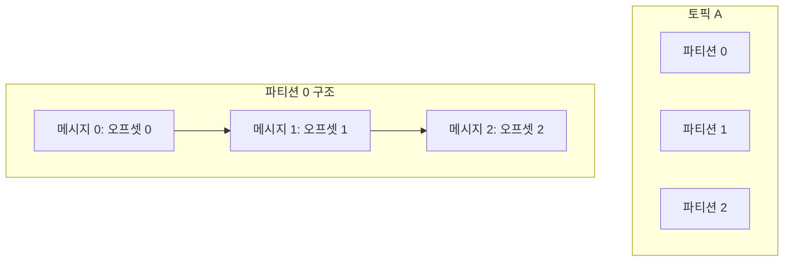

카프카 토픽(Topic)은 아파치 카프카에서 데이터 스트림을 관리하는 핵심 개념입니다. 토픽은 메시지가 저장되고 관리되는 논리적인 채널로, 특정 주제나 카테고리에 관련된 데이터를 구분하는 데 사용됩니다. 쉽게 말하자면, 토픽은 메시지를 발행하고 구독하기 위한 이름이 지정된 목적지라고 볼 수 있습니다.

## 토픽의 구조와 특징

### 파티션 기반 구조

토픽은 하나 이상의 파티션(Partition)으로 구성됩니다. 각 파티션은 순서가 보장된 불변의 메시지 시퀀스입니다.



### 주요 특징

1. **분산 저장**: 토픽의 파티션은 여러 브로커에 분산 저장될 수 있어 고가용성과 확장성을 제공합니다.
2. **순서 보장**: 하나의 파티션 내에서는 메시지의 순서가 보장됩니다. 단, 파티션 간의 순서는 보장되지 않습니다.
3. **내구성**: 토픽에 저장된 데이터는 설정된 보존 기간 동안 유지됩니다.
4. **불변성**: 토픽에 한번 저장된 메시지는 수정할 수 없습니다(append-only).
5. **식별자**: 각 메시지는 파티션 내에서 고유한 오프셋(offset)을 갖습니다.

## 토픽 관리

### 토픽 생성

토픽은 명시적으로 생성하거나, `auto.create.topics.enable` 설정이 활성화된 경우 프로듀서가 존재하지 않는 토픽에 메시지를 발행할 때 자동으로 생성됩니다.

```bash
# 명령행에서 토픽 생성
bin/kafka-topics.sh --create --bootstrap-server localhost:9092 --replication-factor 3 --partitions 6 --topic my-topic
```

### 주요 설정 파라미터

1. **파티션 수(partitions)**: 토픽을 얼마나 많은 파티션으로 나눌지 결정합니다. 파티션 수가 많을수록 처리량과 병렬성이 향상되지만, 관리 오버헤드가 증가합니다.
    
2. **복제 팩터(replication factor)**: 각 파티션의 복제본 수를 지정합니다. 높은 복제 팩터는 내구성과 가용성을 향상시키지만 더 많은 디스크 공간이 필요합니다.
    
3. **보존 정책(retention policy)**:
    
    - `retention.ms`: 메시지 보존 기간 (밀리초)
    - `retention.bytes`: 파티션당 최대 크기
    
    ```bash
    # 토픽의 보존 정책 설정
    bin/kafka-configs.sh --bootstrap-server localhost:9092 --entity-type topics --entity-name my-topic --alter --add-config retention.ms=86400000
    ```
    

### 토픽의 파티션 확장

토픽의 파티션 수는 증가시킬 수는 있지만, 감소시킬 수는 없습니다.

```bash
# 파티션 수 증가
bin/kafka-topics.sh --bootstrap-server localhost:9092 --alter --topic my-topic --partitions 8
```

## 토픽 디자인 모범 사례

### 토픽 이름 지정 규칙

일관된 토픽 이름 규칙을 사용하면 관리가 용이해집니다:

```
<환경>.<서비스>.<데이터타입>
예: prod.order-service.orders
    dev.user-service.events
```

### 파티션 수 결정 요소

파티션 수를 결정할 때 고려해야 할 요소:

1. **처리량 요구사항**: 예상되는 토픽의 처리량이 높을수록 더 많은 파티션이 필요합니다.
2. **컨슈머 병렬성**: 최대 컨슈머 병렬 처리 수는 파티션 수에 제한됩니다.
3. **메시지 순서**: 순서가 중요한 경우, 관련 메시지가 같은 파티션에 들어가도록 계획해야 합니다.
4. **브로커 리소스**: 각 파티션은 브로커의 리소스를 소비합니다.

경험적으로, 시작 파티션 수는 다음과 같이 계산할 수 있습니다:

```
파티션 수 = max(예상 처리량 ÷ 단일 파티션 처리량, 컨슈머 수)
```

### 토픽 컴팩션

카프카는 로그 컴팩션(log compaction)이라는 특별한 보존 정책을 제공합니다. 컴팩션을 사용하면 동일한 키를 가진 메시지 중 가장 최신 값만 유지됩니다. 이 기능은 변경 로그나 상태 저장소로 토픽을 사용할 때 유용합니다.

```bash
# 토픽 생성 시 컴팩션 설정
bin/kafka-topics.sh --create --bootstrap-server localhost:9092 --replication-factor 3 --partitions 6 --topic compacted-topic --config cleanup.policy=compact
```

## 자바에서 토픽 관리

다음은 자바 코드에서 AdminClient를 사용하여 토픽을 관리하는 예제입니다:

```java
import org.apache.kafka.clients.admin.*;
import org.apache.kafka.common.config.ConfigResource;
import org.apache.kafka.common.config.ConfigResource.Type;

import java.util.*;
import java.util.concurrent.ExecutionException;

public class KafkaTopicManager {
    private final AdminClient adminClient;
    
    public KafkaTopicManager(String bootstrapServers) {
        Properties props = new Properties();
        props.put(AdminClientConfig.BOOTSTRAP_SERVERS_CONFIG, bootstrapServers);
        this.adminClient = AdminClient.create(props);
    }
    
    public void createTopic(String topicName, int partitions, short replicationFactor) 
            throws ExecutionException, InterruptedException {
        NewTopic newTopic = new NewTopic(topicName, partitions, replicationFactor);
        CreateTopicsResult result = adminClient.createTopics(Collections.singleton(newTopic));
        result.all().get(); // 작업 완료 대기
        System.out.println("토픽 " + topicName + "이(가) 생성되었습니다.");
    }
    
    public void createTopicWithConfig(String topicName, int partitions, short replicationFactor, 
                                      Map<String, String> configs) 
            throws ExecutionException, InterruptedException {
        NewTopic newTopic = new NewTopic(topicName, partitions, replicationFactor);
        newTopic.configs(configs);
        CreateTopicsResult result = adminClient.createTopics(Collections.singleton(newTopic));
        result.all().get(); // 작업 완료 대기
        System.out.println("토픽 " + topicName + "이(가) 설정과 함께 생성되었습니다.");
    }
    
    public void listTopics() throws ExecutionException, InterruptedException {
        ListTopicsResult result = adminClient.listTopics();
        Set<String> topicNames = result.names().get();
        System.out.println("토픽 목록: " + topicNames);
    }
    
    public void describeTopic(String topicName) throws ExecutionException, InterruptedException {
        DescribeTopicsResult result = adminClient.describeTopics(Collections.singleton(topicName));
        Map<String, TopicDescription> topicDescriptionMap = result.all().get();
        
        TopicDescription topicDescription = topicDescriptionMap.get(topicName);
        System.out.println("토픽 이름: " + topicDescription.name());
        System.out.println("토픽 ID: " + topicDescription.topicId());
        System.out.println("파티션 수: " + topicDescription.partitions().size());
        
        for (TopicPartitionInfo partition : topicDescription.partitions()) {
            System.out.println("파티션 " + partition.partition() + 
                              ", 리더: " + partition.leader().id() + 
                              ", 복제본: " + partition.replicas().size());
        }
    }
    
    public void updateTopicConfig(String topicName, Map<String, String> updateConfigs) 
            throws ExecutionException, InterruptedException {
        ConfigResource resource = new ConfigResource(Type.TOPIC, topicName);
        
        List<ConfigEntry> configEntries = new ArrayList<>();
        for (Map.Entry<String, String> entry : updateConfigs.entrySet()) {
            configEntries.add(new ConfigEntry(entry.getKey(), entry.getValue()));
        }
        
        Config config = new Config(configEntries);
        Map<ConfigResource, Config> configs = Collections.singletonMap(resource, config);
        
        AlterConfigsResult result = adminClient.alterConfigs(configs);
        result.all().get(); // 작업 완료 대기
        System.out.println("토픽 " + topicName + "의 설정이 업데이트되었습니다.");
    }
    
    public void deleteTopic(String topicName) throws ExecutionException, InterruptedException {
        DeleteTopicsResult result = adminClient.deleteTopics(Collections.singleton(topicName));
        result.all().get(); // 작업 완료 대기
        System.out.println("토픽 " + topicName + "이(가) 삭제되었습니다.");
    }
    
    public void close() {
        if (adminClient != null) {
            adminClient.close();
        }
    }
    
    public static void main(String[] args) {
        KafkaTopicManager manager = new KafkaTopicManager("localhost:9092");
        
        try {
            // 토픽 생성
            manager.createTopic("example-topic", 3, (short) 1);
            
            // 설정과 함께 토픽 생성
            Map<String, String> configs = new HashMap<>();
            configs.put("retention.ms", "86400000"); // 1일
            configs.put("segment.bytes", "1073741824"); // 1GB
            manager.createTopicWithConfig("example-topic-with-config", 6, (short) 3, configs);
            
            // 토픽 목록 조회
            manager.listTopics();
            
            // 토픽 상세 정보 조회
            manager.describeTopic("example-topic");
            
            // 토픽 설정 업데이트
            Map<String, String> updateConfigs = new HashMap<>();
            updateConfigs.put("retention.ms", "172800000"); // 2일로 변경
            manager.updateTopicConfig("example-topic", updateConfigs);
            
            // 토픽 삭제
            manager.deleteTopic("example-topic");
            
        } catch (Exception e) {
            e.printStackTrace();
        } finally {
            manager.close();
        }
    }
}
```

## 스프링 부트에서 토픽 관리

스프링 부트에서는 `KafkaAdmin` 클래스를 사용하여 토픽을 관리할 수 있습니다:

```java
import org.apache.kafka.clients.admin.NewTopic;
import org.springframework.boot.autoconfigure.condition.ConditionalOnProperty;
import org.springframework.context.annotation.Bean;
import org.springframework.context.annotation.Configuration;
import org.springframework.kafka.config.TopicBuilder;
import org.springframework.kafka.core.KafkaAdmin;

import java.util.HashMap;
import java.util.Map;

@Configuration
public class KafkaTopicConfig {

    @Bean
    public KafkaAdmin kafkaAdmin() {
        Map<String, Object> configs = new HashMap<>();
        configs.put("bootstrap.servers", "localhost:9092");
        return new KafkaAdmin(configs);
    }

    @Bean
    public NewTopic topic1() {
        return TopicBuilder.name("topic1")
                .partitions(6)
                .replicas(3)
                .build();
    }

    @Bean
    public NewTopic topic2() {
        return TopicBuilder.name("topic2")
                .partitions(3)
                .replicas(1)
                .config("retention.ms", "86400000") // 1일
                .build();
    }

    @Bean
    public NewTopic compactedTopic() {
        return TopicBuilder.name("compacted-topic")
                .partitions(1)
                .replicas(1)
                .config("cleanup.policy", "compact")
                .build();
    }
}
```

스프링 부트 애플리케이션이 시작되면, `KafkaAdmin`은 정의된 뉴토픽 빈들을 자동으로 생성합니다.

## 토픽 모니터링

카프카 토픽의 상태와 성능을 모니터링하는 데 유용한 몇 가지 명령과 도구가 있습니다:

### 1. 토픽 상태 확인

```bash
# 토픽 상세 정보 조회
bin/kafka-topics.sh --describe --bootstrap-server localhost:9092 --topic my-topic

# 토픽 파티션 상태 확인
bin/kafka-topics.sh --describe --bootstrap-server localhost:9092 --topic my-topic --under-replicated-partitions
```

### 2. 토픽 메시지 소비

```bash
# 토픽의 메시지 확인
bin/kafka-console-consumer.sh --bootstrap-server localhost:9092 --topic my-topic --from-beginning
```

### 3. JMX 메트릭 모니터링

카프카는 다양한 JMX 메트릭을 제공합니다. 토픽과 관련된 주요 메트릭:

- `kafka.server:type=BrokerTopicMetrics,name=MessagesInPerSec`: 초당 수신 메시지 수
- `kafka.server:type=BrokerTopicMetrics,name=BytesInPerSec`: 초당 수신 바이트 수
- `kafka.server:type=BrokerTopicMetrics,name=BytesOutPerSec`: 초당 송신 바이트 수

이러한 메트릭을 Prometheus와 Grafana 같은 도구로 시각화할 수 있습니다.

## 결론

카프카 토픽은 분산 이벤트 스트리밍의 기본 구성 요소로, 메시지를 논리적으로 구성하고 관리하는 역할을 합니다. 토픽을 효과적으로 설계하고 구성하면 카프카 시스템의 성능, 확장성, 안정성을 크게 향상시킬 수 있습니다. 각 애플리케이션의 요구사항에 맞게 파티션 수, 복제 팩터, 보존 정책 등의 설정을 최적화하는 것이 중요합니다.