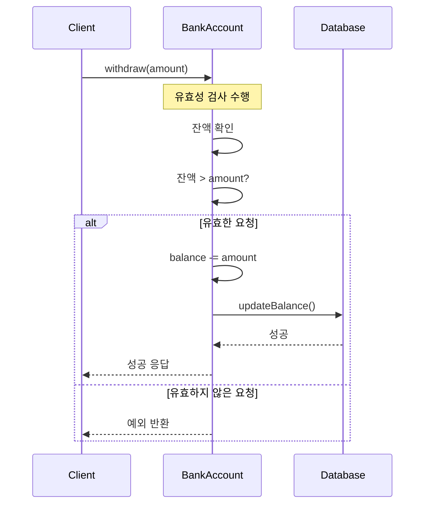

캡슐화는 객체 지향 프로그래밍의 네 가지 핵심 원칙 중 하나로, 데이터(속성)와 해당 데이터를 처리하는 메서드(행위)를 하나의 단위로 묶고 외부로부터 객체의 내부 구현을 숨기는 메커니즘입니다. 캡슐화는 '정보 은닉(Information Hiding)'과 밀접한 관련이 있으며, 객체의 내부 상태를 보호하고 객체 간의 결합도를 낮추는 데 중요한 역할을 합니다.

## 캡슐화의 기본 원리

캡슐화는 다음과 같은 기본 원리를 바탕으로 합니다:

1. **데이터와 메서드의 결합**: 관련된 데이터와 해당 데이터를 조작하는 메서드를 하나의 단위(클래스)로 묶습니다.
2. **접근 제어**: 객체의 구성 요소에 대한 접근을 제한하여 외부에서 직접적인 조작을 방지합니다.
3. **인터페이스 제공**: 객체와의 상호작용을 위한 명확하고 안전한 인터페이스를 제공합니다.

캡슐화는 [[객체 지향 프로그래밍의 4대 원칙]] 중 하나로, 다른 원칙인 [[추상화(Abstraction)]], [[상속(Inheritance)]], [[다형성(Polymorphism)]]과 함께 OOP의 근간을 이루고 있습니다.

## 캡슐화의 구현 방법

캡슐화는 주로 다음과 같은 방법으로 구현됩니다:

### 1. 접근 제어자(Access Modifier) 활용

Java에서는 접근 제어자를 사용하여 클래스 멤버(필드, 메서드)에 대한 접근 수준을 지정할 수 있습니다:

- **private**: 같은 클래스 내에서만 접근 가능
- **default(package-private)**: 같은 패키지 내에서만 접근 가능
- **protected**: 같은 패키지 내 또는 하위 클래스에서 접근 가능
- **public**: 어디서든 접근 가능

자세한 내용은 Java 접근 제어자를 참고해주세요.

### 2. 게터와 세터 메서드 활용

객체의 내부 상태를 직접 접근하지 않고, 메서드를 통해 간접적으로 접근하도록 합니다:

```java
public class BankAccount {
    // 캡슐화된 필드 (private으로 선언)
    private String accountNumber;
    private double balance;
    
    // 생성자
    public BankAccount(String accountNumber, double initialBalance) {
        this.accountNumber = accountNumber;
        this.balance = initialBalance;
    }
    
    // Getter 메서드: 필드 값을 읽을 수 있는 공개 인터페이스
    public String getAccountNumber() {
        return accountNumber;
    }
    
    public double getBalance() {
        return balance;
    }
    
    // Setter 메서드: 필드 값을 설정할 수 있는 공개 인터페이스
    // 필요한 유효성 검사와 비즈니스 로직을 포함할 수 있음
    public void setAccountNumber(String accountNumber) {
        // 계좌번호 형식 검증 로직
        if (isValidAccountNumber(accountNumber)) {
            this.accountNumber = accountNumber;
        } else {
            throw new IllegalArgumentException("유효하지 않은 계좌번호입니다.");
        }
    }
    
    // 입금 메서드: 잔액을 직접 수정하지 않고 메서드를 통해 조작
    public void deposit(double amount) {
        if (amount > 0) {
            balance += amount;
        } else {
            throw new IllegalArgumentException("입금액은 0보다 커야 합니다.");
        }
    }
    
    // 출금 메서드
    public void withdraw(double amount) {
        if (amount > 0 && amount <= balance) {
            balance -= amount;
        } else {
            throw new IllegalArgumentException("유효하지 않은 출금액이거나 잔액이 부족합니다.");
        }
    }
    
    // 계좌번호 유효성 검사 메서드
    private boolean isValidAccountNumber(String accountNumber) {
        // 계좌번호 유효성 검사 로직
        return accountNumber != null && accountNumber.matches("\\d{10}");
    }
}
```

이 예제에서 `balance`와 `accountNumber` 필드는 private으로 선언되어 외부에서 직접 접근할 수 없습니다. 대신, 공개 메서드인 getter와 setter, 그리고 특수 목적의 메서드(`deposit`, `withdraw`)를 통해 접근하도록 함으로써 캡슐화를 구현하고 있습니다.

## 캡슐화의 이점

캡슐화는 다음과 같은 이점을 제공합니다:

### 1. 데이터 보호 및 유효성 검증

객체의 내부 상태를 직접 접근할 수 없게 함으로써, 메서드를 통한 접근 과정에서 유효성 검증을 수행할 수 있습니다. 이를 통해 객체가 항상 유효한 상태를 유지하도록 보장할 수 있습니다.

### 2. 유지보수성 향상

내부 구현을 외부로부터 숨김으로써, 내부 구현을 변경하더라도 외부 인터페이스를 유지할 수 있습니다. 이는 코드의 유지보수성을 크게 향상시킵니다.

### 3. 복잡성 감소

객체와의 상호작용을 명확한 인터페이스로 제한함으로써, 시스템의 복잡성을 줄이고 개발자가 객체의 사용법을 더 쉽게 이해할 수 있게 합니다.

### 4. 결합도 감소

캡슐화는 객체 간의 결합도를 낮추어 한 객체의 변경이 다른 객체에 미치는 영향을 최소화합니다. 이는 시스템의 유연성과 확장성을 향상시킵니다.

자세한 내용은 캡슐화의 이점과 활용 전략을 참고해주세요.

## 캡슐화와 정보 은닉의 차이

캡슐화와 정보 은닉은 종종 혼용되지만, 정확히는 다른 개념입니다:

- **캡슐화(Encapsulation)**: 데이터와 해당 데이터를 처리하는 메서드를 하나의 단위로 묶는 것입니다.
- **정보 은닉(Information Hiding)**: 구현 세부 정보를 외부에서 숨기는 것입니다.

캡슐화는 정보 은닉을 포함하는 더 넓은 개념이라고 볼 수 있습니다. 이에 대한 자세한 비교는 캡슐화와 정보 은닉의 비교를 참고해주세요.

## 캡슐화의 예시와 패턴

캡슐화는 다양한 디자인 패턴에서도 중요한 역할을 합니다:

### 1. DTO(Data Transfer Object) 패턴

서로 다른 계층 간에 데이터를 전송할 때 사용되는 객체로, 내부 도메인 모델을 외부에 노출하지 않고 필요한 데이터만 캡슐화하여 전달합니다.

```java
public class UserDTO {
    private String username;
    private String email;
    
    // 생성자, getter, setter
}
```

### 2. 빌더(Builder) 패턴

복잡한 객체의 생성 과정을 캡슐화하여 객체 생성의 유연성을 높이는 패턴입니다.

```java
public class Person {
    private final String name;
    private final int age;
    private final String address;
    
    private Person(Builder builder) {
        this.name = builder.name;
        this.age = builder.age;
        this.address = builder.address;
    }
    
    public static class Builder {
        private String name;
        private int age;
        private String address;
        
        public Builder name(String name) {
            this.name = name;
            return this;
        }
        
        public Builder age(int age) {
            this.age = age;
            return this;
        }
        
        public Builder address(String address) {
            this.address = address;
            return this;
        }
        
        public Person build() {
            return new Person(this);
        }
    }
}

// 사용 예시
Person person = new Person.Builder()
    .name("홍길동")
    .age(30)
    .address("서울시 강남구")
    .build();
```

다양한 디자인 패턴과 캡슐화의 관계에 대한 자세한 내용은 캡슐화를 활용한 디자인 패턴을 참고해주세요.

## 스프링 프레임워크에서의 캡슐화

스프링 프레임워크는 캡슐화 원칙을 적극적으로 활용합니다:

### 1. 의존성 주입(Dependency Injection)

스프링의 DI는 객체 간의 의존성을 외부에서 주입함으로써, 객체가 의존 객체의 구체적인 구현에 직접 의존하지 않도록 합니다. 이는 캡슐화와 느슨한 결합(Loose Coupling)을 촉진합니다.

```java
@Service
public class UserService {
    private final UserRepository userRepository;
    
    @Autowired
    public UserService(UserRepository userRepository) {
        this.userRepository = userRepository;
    }
    
    // 서비스 메서드
}
```

### 2. AOP(관점 지향 프로그래밍)

스프링의 AOP는 횡단 관심사(로깅, 트랜잭션 등)를 모듈화하여 비즈니스 로직과 분리합니다. 이는 코드의 캡슐화를 향상시키는 또 다른 접근 방식입니다.

```java
@Aspect
@Component
public class LoggingAspect {
    @Before("execution(* com.example.service.*.*(..))")
    public void logBeforeMethodExecution(JoinPoint joinPoint) {
        // 메서드 실행 전 로깅 로직
    }
}
```

스프링에서의 캡슐화 활용에 관한 자세한 내용은 스프링 프레임워크와 캡슐화를 참고해주세요.

## 캡슐화의 원칙과 가이드라인

효과적인 캡슐화를 위한 몇 가지 원칙과 가이드라인입니다:

1. **필드는 항상 private으로 선언하기**: 객체의 내부 상태는 항상 private으로 선언하여 외부에서 직접 접근할 수 없도록 합니다.
    
2. **인터페이스를 최소화하기**: 객체의 공개 인터페이스는 필요한 기능만 제공하도록 최소화합니다.
    
3. **불변(Immutable) 객체 활용하기**: 가능하면 객체의 상태가 생성 후 변경되지 않도록 설계하여 더 견고한 캡슐화를 제공합니다.
    
4. **setter 메서드 최소화하기**: setter 메서드는 객체의 캡슐화를 약화시킬 수 있으므로, 꼭 필요한 경우에만 제공합니다.
    
5. **내부 구현 숨기기**: 구현 세부 사항은 가능한 한 숨기고, 클라이언트가 추상화된 인터페이스에만 의존하도록 합니다.
    

자세한 원칙과 가이드라인은 효과적인 캡슐화 전략을 참고해주세요.

## 캡슐화의 예시 흐름

다음은 캡슐화가 어떻게 동작하는지 보여주는 간단한 흐름도입니다:



이 다이어그램은 캡슐화된 `BankAccount` 객체와의 상호작용을 보여줍니다. 클라이언트는 `withdraw()` 메서드만 호출하고, 내부 구현 세부 사항(유효성 검사, 상태 변경, 데이터베이스 상호작용)은 모두 캡슐화되어 있습니다.

## 캡슐화의 어려움과 일반적인 오류

캡슐화를 구현할 때 자주 발생하는 어려움과 오류입니다:

1. **과도한 getter/setter 사용**: 모든 필드에 대해 무분별하게 getter와 setter를 제공하면 캡슐화의 이점이 크게 감소합니다.
    
2. **중요한 세부 정보 노출**: 내부 구현 세부 사항을 메서드 시그니처나 반환 값으로 노출하면 캡슐화가 약화됩니다.
    
3. **불완전한 유효성 검사**: setter 메서드에서 적절한 유효성 검사를 수행하지 않으면 객체가 잘못된 상태가 될 수 있습니다.
    
4. **캡슐화 경계 설정 오류**: 클래스의 책임 범위를 부적절하게 설정하면 너무 많거나 너무 적은 기능이 캡슐화될 수 있습니다.
    

이러한 문제점과 해결 방법에 대한 자세한 내용은 캡슐화의 일반적인 오류와 해결책을 참고해주세요.

## 캡슐화와 다른 OOP 원칙의 관계

캡슐화는 다른 객체 지향 프로그래밍 원칙과 밀접한 관련이 있습니다:

- **추상화와 캡슐화**: 추상화는 객체의 본질적인 특성만 나타내고, 캡슐화는 그 구현을 숨깁니다. 이 둘은 상호 보완적입니다.
    
- **상속과 캡슐화**: 부모 클래스의 캡슐화된 필드는 접근 제어자에 따라 자식 클래스에서 접근할 수 있는 범위가 결정됩니다.
    
- **다형성과 캡슐화**: 다형성은 인터페이스를 통한 상호작용을 촉진하며, 이는 구현 세부 사항을 캡슐화하는 데 도움이 됩니다.
    
- **SOLID 원칙과 캡슐화**: 특히 단일 책임 원칙(SRP)과 개방-폐쇄 원칙(OCP)은 캡슐화와 밀접하게 관련되어 있습니다.
    

이러한 관계에 대한 자세한 내용은 캡슐화와 OOP 원칙의 상호작용을 참고해주세요.

## 실제 사용 사례

캡슐화는 다양한 소프트웨어 개발 분야에서 광범위하게 활용됩니다:

1. **금융 시스템**: 금융 거래나 계좌 정보와 같은 민감한 데이터 보호
2. **웹 애플리케이션**: 사용자 인증 및 권한 부여 메커니즘
3. **게임 개발**: 게임 상태 및 규칙의 일관성 유지
4. **기업용 소프트웨어**: 비즈니스 로직 및 데이터 접근 제어

각 사례에 대한 자세한 내용은 캡슐화의 실제 적용 사례를 참고해주세요.

## 결론

캡슐화는 객체 지향 프로그래밍의 핵심 원칙 중 하나로, 데이터와 해당 데이터를 처리하는 메서드를 하나의 단위로 묶고 내부 구현을 외부로부터 숨깁니다. 이를 통해 데이터 보호, 코드 유지보수성 향상, 복잡성 감소, 객체 간 결합도 감소 등 다양한 이점을 제공합니다.

효과적인 캡슐화를 위해서는 접근 제어자를 적절히 활용하고, 객체의 상태를 직접 노출하지 않으며, 불필요한 setter를 제한하는 등의 가이드라인을 따르는 것이 중요합니다. 또한 캡슐화는 다른 객체 지향 원칙과 함께 적용될 때 그 효과가 극대화됩니다.

Java와 같은 객체 지향 언어와 스프링 프레임워크와 같은 도구는 캡슐화를 효과적으로 구현할 수 있는 다양한 메커니즘을 제공합니다. 이러한 메커니즘을 적절히 활용하여 더 견고하고 유지보수가 용이한 소프트웨어를 개발할 수 있습니다.

## 참고 자료

- Effective Java, 3rd Edition - Joshua Bloch
- Clean Code - Robert C. Martin
- Head First Design Patterns - Eric Freeman, Elisabeth Robson
- 객체지향의 사실과 오해 - 조영호
- 스프링 프레임워크 공식 문서(https://docs.spring.io/spring-framework/docs/current/reference/html/)