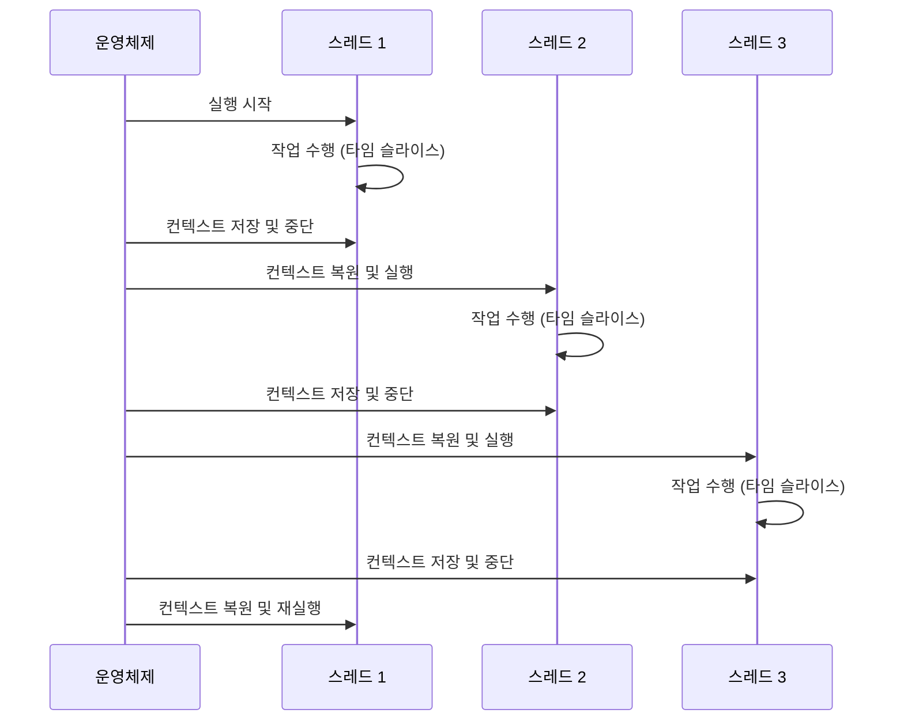
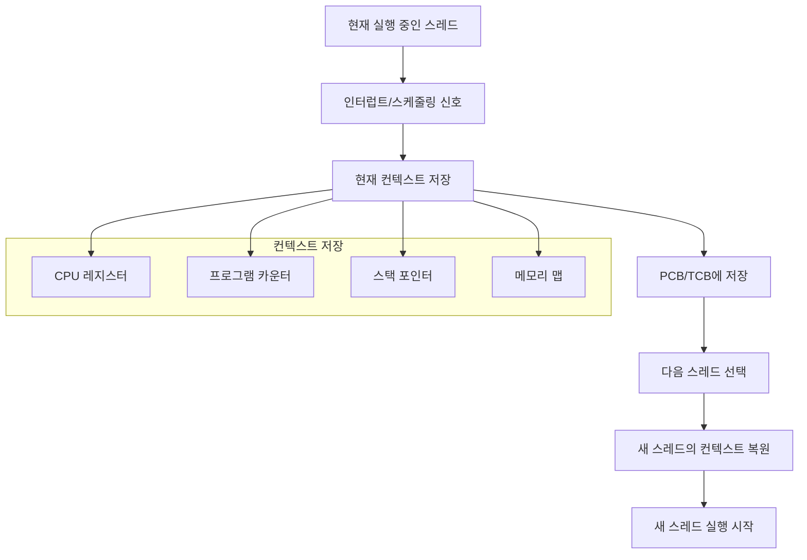

컨텍스트 스위칭(Context Switching)은 운영체제가 현재 실행 중인 프로세스나 스레드를 중단하고 다른 프로세스나 스레드로 CPU 제어권을 넘기는 과정을 의미합니다. 이는 멀티태스킹을 가능하게 하는 핵심 메커니즘이지만, 동시에 시스템 성능에 중요한 영향을 미치는 요소이기도 합니다.

현대 컴퓨터 시스템에서 컨텍스트 스위칭은 선점형 멀티태스킹의 핵심 동작 원리이며, [[비선점형 멀티태스킹(Non-preemptive Multitasking)]]에서는 이 비용을 크게 줄일 수 있습니다. 특히 [[코루틴(Coroutine)]]과 같은 현대적인 동시성 모델에서는 컨텍스트 스위칭 비용을 최소화하여 높은 성능을 달성합니다.

## 컨텍스트 스위칭이 필요한 이유

### 멀티태스킹의 필수 요소

현대 운영체제는 여러 작업을 동시에 실행하는 것처럼 보이게 하기 위해 매우 빠른 속도로 작업들 사이를 전환합니다. 하나의 CPU 코어는 한 번에 하나의 작업만 실행할 수 있지만, 컨텍스트 스위칭을 통해 시분할(time-sharing)로 여러 작업을 처리합니다.



### 응답성 향상

컨텍스트 스위칭이 없다면 하나의 작업이 완료될 때까지 다른 모든 작업이 대기해야 합니다. 이는 특히 I/O 작업이나 사용자 인터페이스에서 심각한 문제가 됩니다.

```java
// 컨텍스트 스위칭이 없다면 발생할 수 있는 문제
public class WithoutContextSwitching {
    
    public void problematicSequentialExecution() {
        // 이런 식으로 실행되면 사용자 인터페이스가 멈춤
        longRunningTask1(); // 10초 소요
        longRunningTask2(); // 15초 소요
        longRunningTask3(); // 8초 소요
        
        // 사용자는 33초 동안 아무것도 할 수 없음
    }
    
    private void longRunningTask1() {
        // 긴 계산 작업
        for (int i = 0; i < 1_000_000_000; i++) {
            // 복잡한 연산
        }
    }
    
    private void longRunningTask2() {
        // 네트워크 I/O 작업
        try {
            Thread.sleep(15000); // 네트워크 대기
        } catch (InterruptedException e) {
            Thread.currentThread().interrupt();
        }
    }
    
    private void longRunningTask3() {
        // 파일 I/O 작업
        try {
            Thread.sleep(8000); // 파일 읽기 대기
        } catch (InterruptedException e) {
            Thread.currentThread().interrupt();
        }
    }
}
```

## 컨텍스트 스위칭의 동작 원리

### 컨텍스트란?

컨텍스트는 프로세스나 스레드의 실행 상태를 나타내는 모든 정보를 포함합니다:

1. **CPU 레지스터 값들**: 프로그램 카운터(PC), 스택 포인터, 범용 레지스터 등
2. **메모리 관리 정보**: 페이지 테이블, 세그먼트 정보
3. **프로세스 상태**: 실행, 준비, 대기 등의 상태 정보
4. **파일 디스크립터**: 열린 파일들의 정보
5. **우선순위 정보**: 스케줄링을 위한 우선순위

### 컨텍스트 스위칭 과정



#### 1. 컨텍스트 저장 (Context Save)

```java
// 컨텍스트 저장 과정의 개념적 표현
public class ContextSaveExample {
    
    static class ThreadContext {
        private Map<String, Object> registers = new HashMap<>();
        private long programCounter;
        private long stackPointer;
        private ProcessState state;
        private int priority;
        
        public void saveContext(Thread thread) {
            // CPU 레지스터 값들 저장
            registers.put("EAX", getCurrentRegisterValue("EAX"));
            registers.put("EBX", getCurrentRegisterValue("EBX"));
            registers.put("ECX", getCurrentRegisterValue("ECX"));
            
            // 프로그램 카운터 저장
            programCounter = getCurrentProgramCounter();
            
            // 스택 포인터 저장
            stackPointer = getCurrentStackPointer();
            
            // 스레드 상태 저장
            state = thread.getState() == Thread.State.RUNNABLE ? 
                    ProcessState.RUNNING : ProcessState.WAITING;
            
            System.out.println("컨텍스트 저장 완료: " + thread.getName());
        }
        
        private Object getCurrentRegisterValue(String register) {
            // 실제로는 JNI를 통해 시스템 호출
            return "0x" + Integer.toHexString((int)(Math.random() * 0xFFFF));
        }
        
        private long getCurrentProgramCounter() {
            return System.nanoTime(); // 실제로는 현재 명령어 주소
        }
        
        private long getCurrentStackPointer() {
            return Runtime.getRuntime().freeMemory(); // 실제로는 스택 주소
        }
    }
    
    enum ProcessState {
        RUNNING, READY, WAITING, TERMINATED
    }
}
```

#### 2. 스케줄링 결정

운영체제 스케줄러가 다음에 실행할 스레드를 결정합니다.

#### 3. 컨텍스트 복원 (Context Restore)

```java
public class ContextRestoreExample {
    
    static class ThreadContext {
        // ... (이전 코드와 동일)
        
        public void restoreContext(Thread thread) {
            // CPU 레지스터 값들 복원
            setRegisterValue("EAX", registers.get("EAX"));
            setRegisterValue("EBX", registers.get("EBX"));
            setRegisterValue("ECX", registers.get("ECX"));
            
            // 프로그램 카운터 복원
            setProgramCounter(programCounter);
            
            // 스택 포인터 복원
            setStackPointer(stackPointer);
            
            System.out.println("컨텍스트 복원 완료: " + thread.getName());
        }
        
        private void setRegisterValue(String register, Object value) {
            // 실제로는 시스템 호출을 통해 레지스터 설정
            System.out.println(register + " = " + value);
        }
        
        private void setProgramCounter(long pc) {
            // 프로그램 카운터 설정
            System.out.println("PC = 0x" + Long.toHexString(pc));
        }
        
        private void setStackPointer(long sp) {
            // 스택 포인터 설정
            System.out.println("SP = 0x" + Long.toHexString(sp));
        }
    }
}
```

## 컨텍스트 스위칭의 비용

### 직접적인 비용

1. **CPU 사이클 소모**: 레지스터 저장/복원에 필요한 시간
2. **메모리 접근**: PCB(Process Control Block) 또는 TCB(Thread Control Block) 읽기/쓰기
3. **캐시 미스**: 새로운 스레드의 데이터가 캐시에 없어서 발생하는 지연

```java
public class ContextSwitchCostDemo {
    
    public void demonstrateContextSwitchCost() {
        int iterations = 1_000_000;
        
        // 단일 스레드 작업 시간 측정
        long singleThreadStart = System.nanoTime();
        for (int i = 0; i < iterations; i++) {
            performSimpleTask();
        }
        long singleThreadTime = System.nanoTime() - singleThreadStart;
        
        // 다중 스레드 작업 시간 측정 (컨텍스트 스위칭 포함)
        long multiThreadStart = System.nanoTime();
        ExecutorService executor = Executors.newFixedThreadPool(4);
        CountDownLatch latch = new CountDownLatch(iterations);
        
        for (int i = 0; i < iterations; i++) {
            executor.submit(() -> {
                performSimpleTask();
                latch.countDown();
            });
        }
        
        try {
            latch.await();
        } catch (InterruptedException e) {
            Thread.currentThread().interrupt();
        }
        
        long multiThreadTime = System.nanoTime() - multiThreadStart;
        executor.shutdown();
        
        System.out.println("단일 스레드 시간: " + singleThreadTime / 1_000_000 + "ms");
        System.out.println("다중 스레드 시간: " + multiThreadTime / 1_000_000 + "ms");
        System.out.println("컨텍스트 스위칭 오버헤드: " + 
                          (multiThreadTime - singleThreadTime) / 1_000_000 + "ms");
    }
    
    private void performSimpleTask() {
        // 간단한 계산 작업
        int sum = 0;
        for (int i = 0; i < 100; i++) {
            sum += i;
        }
    }
}
```

### 간접적인 비용

1. **캐시 지역성 손실**: 새로운 스레드가 다른 데이터를 사용하여 캐시 효율성 저하
2. **TLB(Translation Lookaside Buffer) 플러시**: 메모리 주소 변환 정보 무효화
3. **브랜치 예측 실패**: 새로운 실행 흐름으로 인한 CPU 파이프라인 지연

## 스레드 vs 프로세스의 컨텍스트 스위칭

### 프로세스 컨텍스트 스위칭

프로세스 간 컨텍스트 스위칭은 더 많은 비용이 발생합니다:

```java
public class ProcessContextSwitching {
    
    static class ProcessContext {
        private Map<String, Object> cpuRegisters;
        private MemoryMap memoryMap;
        private List<FileDescriptor> fileDescriptors;
        private SecurityContext securityContext;
        
        public void saveProcessContext(Process process) {
            // CPU 레지스터 저장
            saveCpuRegisters();
            
            // 메모리 맵 저장 (가상 메모리 주소 공간)
            saveMemoryMap();
            
            // 열린 파일 디스크립터들 저장
            saveFileDescriptors();
            
            // 보안 컨텍스트 저장
            saveSecurityContext();
            
            // 페이지 테이블 전환 (매우 비용이 큰 작업)
            switchPageTable();
        }
        
        private void switchPageTable() {
            // 프로세스마다 독립적인 가상 메모리 공간을 가지므로
            // 페이지 테이블을 완전히 교체해야 함
            System.out.println("페이지 테이블 전환 - 높은 비용!");
        }
        
        private void saveCpuRegisters() { /* ... */ }
        private void saveMemoryMap() { /* ... */ }
        private void saveFileDescriptors() { /* ... */ }
        private void saveSecurityContext() { /* ... */ }
    }
    
    static class MemoryMap { /* 메모리 매핑 정보 */ }
    static class FileDescriptor { /* 파일 디스크립터 정보 */ }
    static class SecurityContext { /* 보안 컨텍스트 정보 */ }
}
```

### 스레드 컨텍스트 스위칭

같은 프로세스 내의 스레드 간 컨텍스트 스위칭은 상대적으로 가볍습니다:

```java
public class ThreadContextSwitching {
    
    static class ThreadContext {
        private Map<String, Object> cpuRegisters;
        private long stackPointer;
        private long programCounter;
        // 메모리 공간은 공유하므로 저장할 필요 없음
        
        public void saveThreadContext(Thread thread) {
            // CPU 레지스터만 저장
            saveCpuRegisters();
            
            // 스택 포인터 저장 (각 스레드는 독립적인 스택을 가짐)
            saveStackPointer();
            
            // 프로그램 카운터 저장
            saveProgramCounter();
            
            // 메모리 공간은 공유하므로 페이지 테이블 전환 불필요
            System.out.println("스레드 컨텍스트 저장 - 상대적으로 빠름");
        }
        
        private void saveCpuRegisters() { /* ... */ }
        private void saveStackPointer() { /* ... */ }
        private void saveProgramCounter() { /* ... */ }
    }
}
```

## 컨텍스트 스위칭 최적화 기법

### 1. 스레드 풀 사용

스레드 생성/소멸 비용을 줄이고 컨텍스트 스위칭 횟수를 제어합니다:

```java
public class ThreadPoolOptimization {
    
    public void optimizedExecution() {
        // 스레드 풀 사용으로 컨텍스트 스위칭 최적화
        int coreCount = Runtime.getRuntime().availableProcessors();
        ExecutorService executor = Executors.newFixedThreadPool(coreCount);
        
        // CPU 집약적 작업은 코어 수만큼의 스레드로 제한
        List<Future<Integer>> futures = new ArrayList<>();
        
        for (int i = 0; i < 1000; i++) {
            final int taskId = i;
            futures.add(executor.submit(() -> {
                return performCpuIntensiveTask(taskId);
            }));
        }
        
        // 결과 수집
        futures.forEach(future -> {
            try {
                future.get();
            } catch (Exception e) {
                e.printStackTrace();
            }
        });
        
        executor.shutdown();
    }
    
    private Integer performCpuIntensiveTask(int taskId) {
        // CPU 집약적 작업 시뮬레이션
        int result = 0;
        for (int i = 0; i < 1_000_000; i++) {
            result += i * taskId;
        }
        return result;
    }
}
```

### 2. 작업 배치 처리

작은 작업들을 배치로 묶어서 컨텍스트 스위칭 횟수를 줄입니다:

```java
public class BatchProcessingOptimization {
    
    public void batchProcessing() {
        List<Task> tasks = generateTasks(10000);
        int batchSize = 100;
        
        // 작업을 배치로 나누어 처리
        for (int i = 0; i < tasks.size(); i += batchSize) {
            int end = Math.min(i + batchSize, tasks.size());
            List<Task> batch = tasks.subList(i, end);
            
            // 하나의 스레드가 여러 작업을 연속으로 처리
            CompletableFuture.runAsync(() -> processBatch(batch));
        }
    }
    
    private void processBatch(List<Task> batch) {
        // 컨텍스트 스위칭 없이 연속으로 처리
        for (Task task : batch) {
            task.execute();
        }
    }
    
    private List<Task> generateTasks(int count) {
        return IntStream.range(0, count)
                       .mapToObj(i -> new Task("Task-" + i))
                       .collect(Collectors.toList());
    }
    
    static class Task {
        private final String name;
        
        Task(String name) {
            this.name = name;
        }
        
        void execute() {
            // 작업 실행
            System.out.println("Executing: " + name);
        }
    }
}
```

### 3. 논블로킹 I/O 사용

I/O 대기로 인한 불필요한 컨텍스트 스위칭을 방지합니다:

```java
import java.nio.channels.AsynchronousFileChannel;
import java.nio.file.Paths;
import java.nio.file.StandardOpenOption;
import java.nio.ByteBuffer;
import java.util.concurrent.CompletableFuture;

public class NonBlockingIOOptimization {
    
    public CompletableFuture<String> readFileNonBlocking(String filePath) {
        CompletableFuture<String> future = new CompletableFuture<>();
        
        try {
            AsynchronousFileChannel channel = AsynchronousFileChannel.open(
                Paths.get(filePath), StandardOpenOption.READ
            );
            
            ByteBuffer buffer = ByteBuffer.allocate(1024);
            
            // 논블로킹 I/O - 스레드가 블록되지 않음
            channel.read(buffer, 0, buffer, new java.nio.channels.CompletionHandler<Integer, ByteBuffer>() {
                @Override
                public void completed(Integer result, ByteBuffer attachment) {
                    attachment.flip();
                    byte[] data = new byte[attachment.remaining()];
                    attachment.get(data);
                    future.complete(new String(data));
                    
                    try {
                        channel.close();
                    } catch (Exception e) {
                        future.completeExceptionally(e);
                    }
                }
                
                @Override
                public void failed(Throwable exc, ByteBuffer attachment) {
                    future.completeExceptionally(exc);
                    try {
                        channel.close();
                    } catch (Exception e) {
                        // 로그 기록
                    }
                }
            });
            
        } catch (Exception e) {
            future.completeExceptionally(e);
        }
        
        return future;
    }
}
```

## 현대적 대안: 코루틴과 경량 스레드

### 코루틴의 컨텍스트 스위칭

코루틴은 운영체제 수준의 컨텍스트 스위칭 대신 함수 호출 수준의 전환을 사용합니다:

```kotlin
class CoroutineContextSwitching {
    
    suspend fun demonstrateCoroutineEfficiency() {
        // 10,000개의 코루틴을 생성해도 운영체제 스레드는 몇 개만 사용
        val jobs = (1..10_000).map { i ->
            GlobalScope.launch {
                // suspend 함수에서 자발적으로 양보
                delay(1000) // 다른 코루틴이 실행될 기회 제공
                println("코루틴 $i 완료")
            }
        }
        
        jobs.forEach { it.join() }
    }
    
    suspend fun efficientSequentialTasks(): String {
        // 각 suspend 지점에서 경량 컨텍스트 스위칭
        val user = fetchUser() // 컨텍스트 전환 가능 지점
        val profile = fetchProfile(user.id) // 컨텍스트 전환 가능 지점
        val settings = fetchSettings(profile.id) // 컨텍스트 전환 가능 지점
        
        return "User: ${user.name}, Settings: ${settings.theme}"
    }
    
    private suspend fun fetchUser(): User {
        delay(100) // 실제로는 네트워크 호출
        return User(1, "Alice")
    }
    
    private suspend fun fetchProfile(userId: Int): Profile {
        delay(200)
        return Profile(userId, "profile_$userId")
    }
    
    private suspend fun fetchSettings(profileId: String): Settings {
        delay(150)
        return Settings("dark")
    }
    
    data class User(val id: Int, val name: String)
    data class Profile(val userId: Int, val id: String)
    data class Settings(val theme: String)
}
```

### 가상 스레드 (Java 21+)

Java 21에서 도입된 가상 스레드는 컨텍스트 스위칭 비용을 크게 줄입니다:

```java
public class VirtualThreadExample {
    
    public void demonstrateVirtualThreads() {
        // 가상 스레드를 사용한 경량 동시성
        try (ExecutorService executor = Executors.newVirtualThreadPerTaskExecutor()) {
            // 수백만 개의 가상 스레드도 효율적으로 처리
            List<Future<String>> futures = new ArrayList<>();
            
            for (int i = 0; i < 1_000_000; i++) {
                final int taskId = i;
                futures.add(executor.submit(() -> {
                    try {
                        // 블로킹 I/O도 효율적으로 처리
                        Thread.sleep(1000);
                        return "Task " + taskId + " completed";
                    } catch (InterruptedException e) {
                        Thread.currentThread().interrupt();
                        return "Task " + taskId + " interrupted";
                    }
                }));
            }
            
            // 결과 수집
            System.out.println("Started " + futures.size() + " virtual threads");
        }
    }
}
```

## 컨텍스트 스위칭 모니터링 및 분석

### 시스템 수준 모니터링

```java
import java.lang.management.ManagementFactory;
import java.lang.management.ThreadMXBean;

public class ContextSwitchMonitoring {
    
    public void monitorContextSwitches() {
        ThreadMXBean threadBean = ManagementFactory.getThreadMXBean();
        
        // 스레드 정보 수집
        long[] threadIds = threadBean.getAllThreadIds();
        
        System.out.println("현재 활성 스레드 수: " + threadIds.length);
        
        for (long threadId : threadIds) {
            if (threadBean.getThreadInfo(threadId) != null) {
                String threadName = threadBean.getThreadInfo(threadId).getThreadName();
                long cpuTime = threadBean.getThreadCpuTime(threadId);
                long userTime = threadBean.getThreadUserTime(threadId);
                
                System.out.printf("스레드: %s, CPU 시간: %d ns, 사용자 시간: %d ns%n",
                                threadName, cpuTime, userTime);
            }
        }
    }
    
    public void measureContextSwitchImpact() {
        int iterations = 100_000;
        
        // 높은 컨텍스트 스위칭 시나리오
        long highSwitchStart = System.nanoTime();
        ExecutorService highSwitchExecutor = Executors.newFixedThreadPool(100);
        
        for (int i = 0; i < iterations; i++) {
            highSwitchExecutor.submit(() -> {
                // 짧은 작업 - 높은 컨텍스트 스위칭 비율
                Math.sqrt(Math.random());
            });
        }
        
        highSwitchExecutor.shutdown();
        try {
            highSwitchExecutor.awaitTermination(10, TimeUnit.SECONDS);
        } catch (InterruptedException e) {
            Thread.currentThread().interrupt();
        }
        long highSwitchTime = System.nanoTime() - highSwitchStart;
        
        // 낮은 컨텍스트 스위칭 시나리오
        long lowSwitchStart = System.nanoTime();
        ExecutorService lowSwitchExecutor = Executors.newFixedThreadPool(4);
        
        for (int i = 0; i < iterations / 1000; i++) {
            lowSwitchExecutor.submit(() -> {
                // 긴 작업 - 낮은 컨텍스트 스위칭 비율
                for (int j = 0; j < 1000; j++) {
                    Math.sqrt(Math.random());
                }
            });
        }
        
        lowSwitchExecutor.shutdown();
        try {
            lowSwitchExecutor.awaitTermination(10, TimeUnit.SECONDS);
        } catch (InterruptedException e) {
            Thread.currentThread().interrupt();
        }
        long lowSwitchTime = System.nanoTime() - lowSwitchStart;
        
        System.out.println("높은 컨텍스트 스위칭: " + highSwitchTime / 1_000_000 + "ms");
        System.out.println("낮은 컨텍스트 스위칭: " + lowSwitchTime / 1_000_000 + "ms");
        System.out.println("성능 차이: " + (highSwitchTime - lowSwitchTime) / 1_000_000 + "ms");
    }
}
```

## 실전 최적화 전략

### 1. 작업 특성에 따른 스레드 풀 설계

```java
public class OptimalThreadPoolDesign {
    
    // CPU 집약적 작업용 스레드 풀
    private final ExecutorService cpuBoundExecutor = 
        Executors.newFixedThreadPool(Runtime.getRuntime().availableProcessors());
    
    // I/O 집약적 작업용 스레드 풀
    private final ExecutorService ioBoundExecutor = 
        Executors.newFixedThreadPool(Runtime.getRuntime().availableProcessors() * 2);
    
    public void processWorkload(List<Task> tasks) {
        List<Task> cpuTasks = new ArrayList<>();
        List<Task> ioTasks = new ArrayList<>();
        
        // 작업 분류
        for (Task task : tasks) {
            if (task.isCpuBound()) {
                cpuTasks.add(task);
            } else {
                ioTasks.add(task);
            }
        }
        
        // 적절한 스레드 풀에 할당
        cpuTasks.forEach(task -> cpuBoundExecutor.submit(task::execute));
        ioTasks.forEach(task -> ioBoundExecutor.submit(task::execute));
    }
    
    static class Task {
        private final boolean cpuBound;
        
        Task(boolean cpuBound) {
            this.cpuBound = cpuBound;
        }
        
        boolean isCpuBound() {
            return cpuBound;
        }
        
        void execute() {
            if (cpuBound) {
                performCpuIntensiveWork();
            } else {
                performIOWork();
            }
        }
        
        private void performCpuIntensiveWork() {
            // CPU 집약적 작업
            for (int i = 0; i < 1_000_000; i++) {
                Math.sqrt(i);
            }
        }
        
        private void performIOWork() {
            // I/O 작업 시뮬레이션
            try {
                Thread.sleep(100);
            } catch (InterruptedException e) {
                Thread.currentThread().interrupt();
            }
        }
    }
}
```

### 2. 작업 지속성 최적화

```java
public class WorkContinuityOptimization {
    
    public void optimizeWorkContinuity() {
        BlockingQueue<Runnable> taskQueue = new LinkedBlockingQueue<>();
        int threadCount = Runtime.getRuntime().availableProcessors();
        
        // 커스텀 스레드 풀로 작업 연속성 보장
        ExecutorService executor = new ThreadPoolExecutor(
            threadCount, threadCount,
            0L, TimeUnit.MILLISECONDS,
            taskQueue,
            new ThreadFactory() {
                private int threadNumber = 0;
                
                @Override
                public Thread newThread(Runnable r) {
                    Thread thread = new Thread(r, "Worker-" + threadNumber++);
                    thread.setDaemon(false);
                    return thread;
                }
            },
            new ThreadPoolExecutor.CallerRunsPolicy() // 큐가 가득 찰 경우 호출자 스레드에서 실행
        );
        
        // 배치 단위로 작업 제출
        for (int batch = 0; batch < 100; batch++) {
            final int batchId = batch;
            executor.submit(() -> processBatch(batchId, 50));
        }
        
        executor.shutdown();
    }
    
    private void processBatch(int batchId, int taskCount) {
        System.out.println("배치 " + batchId + " 시작 - 스레드: " + 
                          Thread.currentThread().getName());
        
        // 컨텍스트 스위칭 없이 연속 처리
        for (int i = 0; i < taskCount; i++) {
            processTask(batchId * 1000 + i);
        }
        
        System.out.println("배치 " + batchId + " 완료");
    }
    
    private void processTask(int taskId) {
        // 개별 작업 처리
        double result = Math.sqrt(taskId * Math.PI);
    }
}
```

## 결론

컨텍스트 스위칭은 현대 멀티태스킹 시스템의 핵심 메커니즘이지만, 성능에 중요한 영향을 미치는 요소입니다. 프로세스 간 컨텍스트 스위칭은 스레드 간 스위칭보다 훨씬 비용이 크며, 과도한 컨텍스트 스위칭은 시스템 성능을 크게 저하시킬 수 있습니다.

효율적인 성능을 위해서는 적절한 스레드 풀 설계, 작업 배치 처리, 논블로킹 I/O 활용 등의 최적화 기법을 사용해야 합니다. 특히 [[코루틴(Coroutine)]]이나 가상 스레드와 같은 현대적인 동시성 모델은 운영체제 수준의 컨텍스트 스위칭 대신 더 경량한 대안을 제공하여 높은 성능과 확장성을 달성할 수 있습니다.

컨텍스트 스위칭의 특성을 이해하고 적절한 최적화 전략을 적용하면, 높은 동시성을 요구하는 현대 애플리케이션에서도 우수한 성능을 달성할 수 있습니다. 이는 특히 CPU 바운드 vs IO 바운드 작업, 스레드 풀 최적화, [[비동기(Asynchronous)]] 프로그래밍과 밀접한 관련이 있습니다.

## 참고 자료

- Operating System Concepts - Abraham Silberschatz, Peter Galvin, Greg Gagne
- Java Concurrency in Practice - Brian Goetz
- Modern Operating Systems - Andrew S. Tanenbaum
- Understanding the Linux Kernel - Daniel P. Bovet, Marco Cesati
- Java Performance: The Definitive Guide - Scott Oaks
