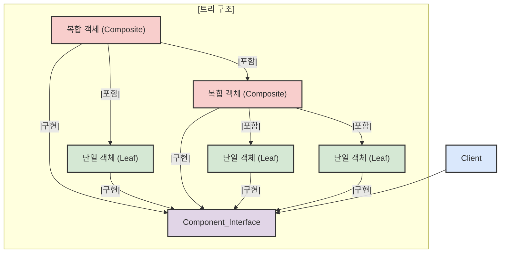
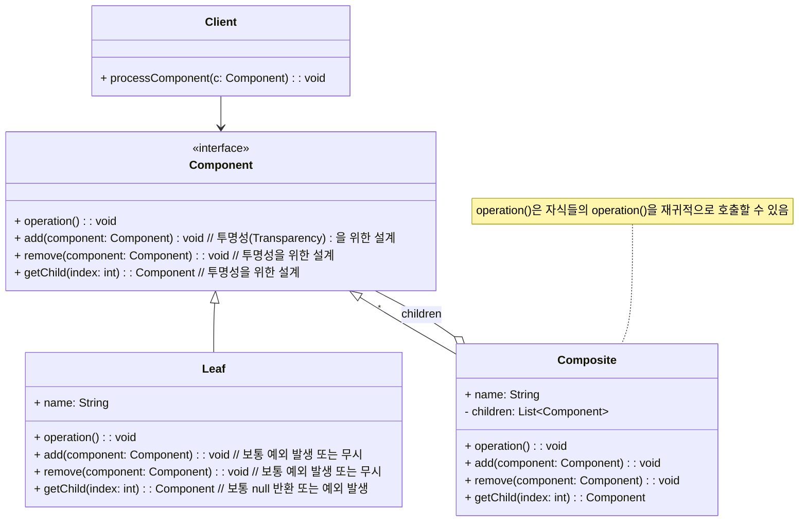

마치 러시아 전통 인형인 마트료시카처럼, 큰 인형 안에 작은 인형이 있고 그 안에 또 더 작은 인형이 들어있는 구조를 상상해 보세요. 혹은 우리가 매일 사용하는 컴퓨터의 파일 시스템에서 폴더 안에 또 다른 폴더나 파일이 들어있는 모습을 떠올려도 좋습니다. 컴포지트 패턴은 바로 이러한 **부분-전체 계층(Part-Whole Hierarchy)** 또는 트리 구조(Tree Structure)를 표현하고, 개별 객체(잎, Leaf)와 복합 객체(가지, Composite)를 클라이언트 입장에서 동일한 방식으로 다룰 수 있도록 해줍니다.

## 컴포지트 패턴이란 무엇인가요?

**컴포지트 패턴 (Composite Pattern)** 은 **객체들을 트리 구조로 구성하여 부분-전체 계층을 표현하는 패턴**입니다. 이 패턴의 핵심은 클라이언트가 **단일 객체(Leaf)와 복합 객체(Composite)를 구분하지 않고 동일한 인터페이스를 통해 일관되게 다룰 수 있도록 하는 것**입니다.



클라이언트는 `Component` 인터페이스를 통해 모든 객체와 상호작용하며, 이 객체가 단순한 '잎'인지, 아니면 다른 객체들을 포함하는 '가지'인지를 신경 쓸 필요가 없습니다.

## 왜 컴포지트 패턴을 사용할까요?

컴포지트 패턴은 다음과 같은 상황에서 빛을 발합니다:

1. **계층적 자료구조 표현**: 파일 시스템, 조직도, GUI 컴포넌트 트리 등과 같이 객체들이 자연스럽게 계층 구조를 형성할 때 유용합니다.
2. **클라이언트 코드의 단순화**: 클라이언트가 개별 객체(Leaf)와 복합 객체(Composite)를 구별하지 않고 동일한 방식으로 처리하기를 원할 때 사용합니다. 예를 들어, "전체 크기 계산"이라는 작업을 단일 파일에 하든 폴더 전체에 하든 동일한 메서드 호출로 처리할 수 있습니다.
3. **유연한 구조**: 새로운 종류의 단일 객체나 복합 객체를 쉽게 추가할 수 있습니다.
4. **재귀(Recursion)적인 작업 처리**: 트리의 모든 노드에 대해 특정 작업을 수행해야 할 때, 재귀적인 방식으로 코드를 간결하게 작성할 수 있습니다.

## 컴포지트 패턴의 구조

컴포지트 패턴을 구성하는 주요 참여자는 다음과 같습니다:

- **Component (컴포넌트)**: 모든 객체들(단일 객체와 복합 객체 모두)이 공유하는 공통 인터페이스입니다. 이 인터페이스는 클라이언트가 트리 내의 모든 객체를 일관되게 다룰 수 있도록 해주는 연산(operation)들을 선언합니다. 또한, 자식 객체를 관리(추가, 삭제, 접근)하는 메서드를 포함할지 여부에 따라 설계 방식이 나뉩니다. (이는 컴포지트 패턴의 투명성과 안전성에서 자세히 다룹니다.)
- **Leaf (리프, 단일 객체)**: 트리 구조의 말단 노드에 해당하는 객체입니다. `Component` 인터페이스를 구현하며, 자식을 가질 수 없습니다. 따라서 자식 관리 메서드에 대해서는 보통 예외를 발생시키거나 아무 작업도 하지 않도록 구현합니다.
- **Composite (컴포지트, 복합 객체)**: 트리 구조에서 내부 노드, 즉 다른 `Component` 객체들을 자식으로 가질 수 있는 객체입니다. `Component` 인터페이스를 구현하며, 자식들을 관리하는 메서드(add, remove, getChild 등)와 함께 `Component` 인터페이스의 연산(operation)을 자식들에게 위임(delegate)하는 역할을 합니다.
- **Client (클라이언트)**: `Component` 인터페이스를 통해 트리 구조 내의 객체들(Leaf 또는 Composite)과 상호작용합니다.




위 다이어그램은 자식 관리 메서드를 `Component` 인터페이스에 포함시키는 **투명한(Transparent) 방식**을 보여줍니다.

## 컴포지트 패턴 예시 (Java 코드)

파일 시스템에서 파일과 디렉토리의 크기를 계산하는 예시를 통해 컴포지트 패턴을 살펴보겠습니다.

Java

```
import java.util.ArrayList;
import java.util.List;

// Component 인터페이스
interface FileSystemNode {
    String getName();
    int getSize(); // 크기를 반환하는 연산
    void print(String indent); // 구조를 출력하는 연산 (예시용)

    // 투명성을 위해 자식 관리 메서드를 여기에 둘 수 있지만, Leaf에서 구현 문제가 생길 수 있음.
    // 여기서는 간단히 핵심 연산만 포함. 자식 관리는 Composite에서만. (안전한 방식에 가까움)
}

// Leaf 클래스: 파일
class File implements FileSystemNode {
    private String name;
    private int size;

    public File(String name, int size) {
        this.name = name;
        this.size = size;
    }

    @Override
    public String getName() {
        return name;
    }

    @Override
    public int getSize() {
        return size;
    }

    @Override
    public void print(String indent) {
        System.out.println(indent + "- " + name + " (" + size + "KB)");
    }
}

// Composite 클래스: 디렉토리
class Directory implements FileSystemNode {
    private String name;
    private List<FileSystemNode> children = new ArrayList<>();

    public Directory(String name) {
        this.name = name;
    }

    public void addNode(FileSystemNode node) {
        children.add(node);
    }

    public void removeNode(FileSystemNode node) {
        children.remove(node);
    }

    @Override
    public String getName() {
        return name;
    }

    @Override
    public int getSize() {
        int totalSize = 0;
        for (FileSystemNode node : children) {
            totalSize += node.getSize(); // 자식들의 크기를 재귀적으로 합산
        }
        return totalSize;
    }

    @Override
    public void print(String indent) {
        System.out.println(indent + "+ " + name + " (total " + getSize() + "KB)");
        for (FileSystemNode node : children) {
            node.print(indent + "  ");
        }
    }
}

// Client
public class FileSystemClient {
    public static void main(String[] args) {
        Directory root = new Directory("root");
        Directory users = new Directory("users");
        Directory home = new Directory("home");
        Directory music = new Directory("music");

        File file1 = new File("profile.txt", 10);
        File file2 = new File("photo.jpg", 150);
        File song1 = new File("song1.mp3", 3000);
        File song2 = new File("song2.aac", 4500);
        File doc1 = new File("document.docx", 250);

        root.addNode(users);
        root.addNode(doc1);

        users.addNode(home);
        home.addNode(file1);
        home.addNode(file2);
        home.addNode(music);

        music.addNode(song1);
        music.addNode(song2);

        System.out.println("--- File System Structure ---");
        root.print("");

        System.out.println("\n--- Size Calculations ---");
        System.out.println("Size of '" + song1.getName() + "': " + song1.getSize() + "KB");
        System.out.println("Size of directory '" + music.getName() + "': " + music.getSize() + "KB");
        System.out.println("Size of directory '" + home.getName() + "': " + home.getSize() + "KB");
        System.out.println("Size of directory '" + root.getName() + "': " + root.getSize() + "KB");

        // 클라이언트는 File이든 Directory든 FileSystemNode 인터페이스를 통해 동일하게 getSize() 호출
        FileSystemNode nodeToGetSize = music;
        System.out.println("Size of node '" + nodeToGetSize.getName() + "' (treated as FileSystemNode): " + nodeToGetSize.getSize() + "KB");

        nodeToGetSize = file1;
        System.out.println("Size of node '" + nodeToGetSize.getName() + "' (treated as FileSystemNode): " + nodeToGetSize.getSize() + "KB");
    }
}
```

위 예시 코드에서는 `FileSystemNode`가 `Component` 역할을, `File`이 `Leaf` 역할을, `Directory`가 `Composite` 역할을 합니다. `Directory`의 `getSize()` 메서드는 자신이 포함하는 모든 자식 노드들의 `getSize()`를 재귀적으로 호출하여 전체 크기를 계산합니다.

## 컴포지트 패턴의 장점

- **클라이언트 코드 단순화**: 클라이언트는 개별 객체(Leaf)와 복합 객체(Composite)를 동일한 인터페이스(`Component`)로 다룰 수 있어 코드가 간결해지고 이해하기 쉬워집니다.
- **새로운 `Component` 타입 추가 용이**: 새로운 종류의 `Leaf`나 `Composite` 클래스를 기존 코드 변경 없이 쉽게 추가할 수 있습니다. `Component` 인터페이스만 구현하면 됩니다.
- **유연한 구조**: 복잡한 트리 구조를 쉽게 만들고 조작할 수 있습니다.
- **재사용성 향상**: `Component` 인터페이스를 따르는 모든 객체는 동일한 방식으로 처리될 수 있으므로, 알고리즘이나 로직을 재사용하기 좋습니다.

## 컴포지트 패턴의 단점

- **지나친 일반화의 위험 (투명성 디자인의 경우)**: `Component` 인터페이스에 자식 관리 메서드(`add`, `remove`, `getChild` 등)를 포함시키면(투명성), `Leaf` 클래스는 이 메서드들을 의미 없게 구현해야 합니다 (예: 예외 발생, 아무것도 안 함). 이는 [[단일 책임 원칙(Single Responsibility Principle)]]에 어긋날 수 있고, `Leaf` 객체에 부적절한 인터페이스를 강요하는 셈이 됩니다.
- **안전성 디자인의 경우 클라이언트 복잡도 증가**: `Component` 인터페이스에서 자식 관리 메서드를 제거하고 `Composite` 클래스에만 두면(안전성), 클라이언트는 객체가 `Leaf`인지 `Composite`인지 구분하여 자식 관리 메서드를 호출해야 하므로, 클라이언트 코드가 복잡해질 수 있고 타입 캐스팅이 필요할 수 있습니다.
- **런타임에만 구조적 제약 검사 가능**: 특정 `Composite` 객체에는 특정 타입의 `Leaf`만 추가되어야 한다는 등의 제약 조건은 컴파일 시점이 아닌 런타임에 검사해야 할 수 있습니다.

이러한 장단점 때문에, `Component` 인터페이스를 어떻게 설계할 것인지(투명성 vs 안전성)는 상황에 따라 신중히 결정해야 합니다. 자세한 내용은 컴포지트 패턴의 투명성과 안전성에서 다루겠습니다.

## 실생활 및 프레임워크 예시

컴포지트 패턴은 우리 주변의 많은 시스템에서 발견됩니다:

- **GUI 툴킷**: Java Swing 이나 JavaFX, 웹 브라우저의 DOM(Document Object Model) 등에서 UI 요소(컨트롤)와 컨테이너는 컴포지트 패턴으로 구성됩니다. 예를 들어, `JPanel`(Composite)은 다른 `JPanel`이나 `JButton`(Leaf), `JTextField`(Leaf) 등을 포함할 수 있으며, `paint()`와 같은 연산은 전체 트리에 걸쳐 재귀적으로 호출됩니다.
- **운영체제의 파일 시스템**: 앞선 예제처럼 파일(Leaf)과 디렉토리(Composite) 구조가 대표적입니다.
- **그래픽 편집기**: 기본적인 도형(선, 원, 사각형 - Leaf)들과 이들을 그룹화한 객체(Composite)를 동일하게 처리할 수 있습니다. (예: 이동, 크기 변경, 색상 변경 등)
- **회사 조직도**: 일반 직원(Leaf)과 부서(Composite)로 구성된 조직 구조를 표현하고, 특정 연산(예: 총 급여 계산)을 전체 조직에 대해 수행할 수 있습니다.

## 결론

컴포지트 패턴은 부분과 전체를 나타내는 계층적 구조를 다루는 데 매우 효과적인 방법입니다. 클라이언트가 개별 객체와 복합 객체를 동일하게 취급할 수 있도록 함으로써 시스템의 유연성과 확장성을 높여줍니다.

물론, 어떤 설계든 트레이드오프가 따르듯이, 컴포지트 패턴도 인터페이스 설계(투명성 vs 안전성)에 대한 고민이 필요합니다. 하지만 그 구조적 아름다움과 강력함 덕분에 많은 시스템에서 사랑받는 패턴 중 하나입니다.
