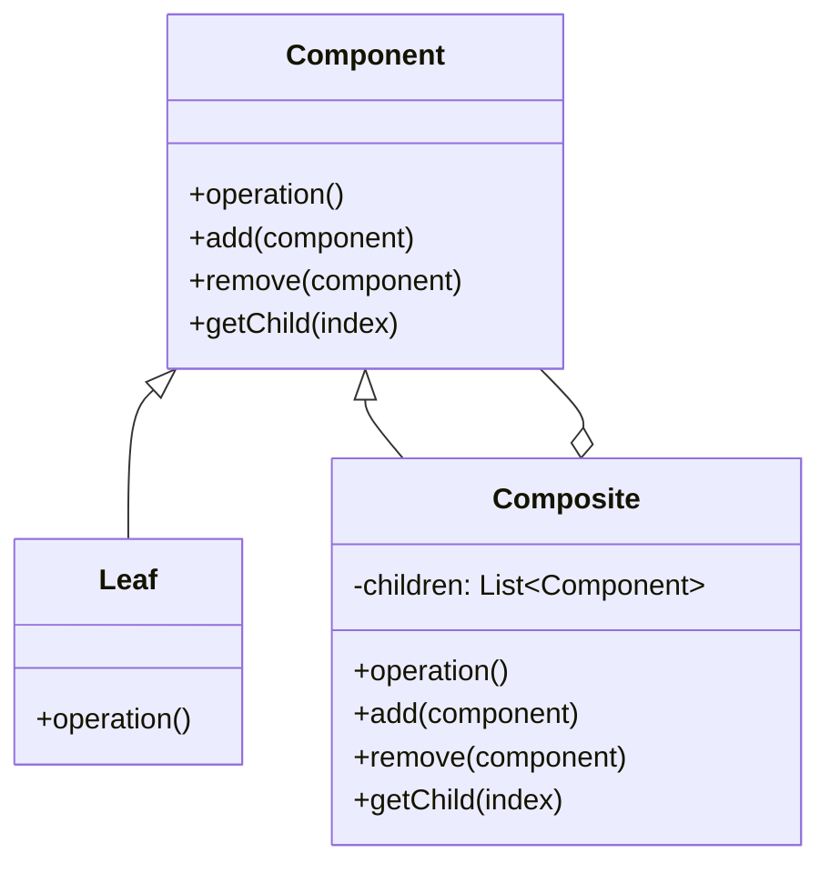

컴포지트 패턴은 객체들을 트리 구조로 구성하여 부분-전체 계층 구조를 표현하는 구조적 디자인 패턴입니다. 이 패턴을 사용하면 클라이언트가 개별 객체와 객체 그룹을 동일한 방식으로 다룰 수 있어, 코드의 일관성과 유연성이 향상됩니다.

## 컴포지트 패턴의 목적

컴포지트 패턴의 주요 목적은 다음과 같습니다:

1. 객체들의 계층적 구조를 표현
2. 개별 객체와 복합 객체를 동일하게 다룰 수 있는 일관된 방법 제공
3. 클라이언트 코드를 단순화하고 객체 구조 변경에 유연하게 대응
4. 재귀적인 트리 구조의 효율적인 관리

## 컴포지트 패턴의 구조

컴포지트 패턴은 다음과 같은 주요 구성 요소로 이루어집니다:

1. **Component(컴포넌트)**: 모든 객체에 대한 공통 인터페이스 정의. 복합 객체와 단일 객체 모두 이 인터페이스를 구현
2. **Leaf(리프)**: 자식이 없는 개별 객체. Component 인터페이스를 구현하지만 자식을 가질 수 없음
3. **Composite(복합체)**: 자식을 가질 수 있는 복합 객체. Component 인터페이스를 구현하고 자식 컴포넌트들을 관리



## 자바에서의 컴포지트 패턴 구현

다음은 파일 시스템 구조를 표현하는 컴포지트 패턴의 구현 예시입니다:

```java
// Component
public abstract class FileSystemComponent {
    protected String name;
    
    public FileSystemComponent(String name) {
        this.name = name;
    }
    
    public String getName() {
        return name;
    }
    
    public abstract void showDetails();
    
    // 기본 구현은 예외를 발생시키거나 아무 작업도 하지 않음
    public void add(FileSystemComponent component) {
        throw new UnsupportedOperationException();
    }
    
    public void remove(FileSystemComponent component) {
        throw new UnsupportedOperationException();
    }
    
    public FileSystemComponent getChild(int index) {
        throw new UnsupportedOperationException();
    }
}

// Leaf
public class File extends FileSystemComponent {
    private long size;
    
    public File(String name, long size) {
        super(name);
        this.size = size;
    }
    
    public long getSize() {
        return size;
    }
    
    @Override
    public void showDetails() {
        System.out.println("파일: " + name + " (" + size + " bytes)");
    }
}

// Composite
public class Directory extends FileSystemComponent {
    private List<FileSystemComponent> children = new ArrayList<>();
    
    public Directory(String name) {
        super(name);
    }
    
    @Override
    public void showDetails() {
        System.out.println("디렉토리: " + name);
        
        for (FileSystemComponent component : children) {
            component.showDetails();
        }
    }
    
    @Override
    public void add(FileSystemComponent component) {
        children.add(component);
    }
    
    @Override
    public void remove(FileSystemComponent component) {
        children.remove(component);
    }
    
    @Override
    public FileSystemComponent getChild(int index) {
        return children.get(index);
    }
    
    public long getTotalSize() {
        long totalSize = 0;
        
        for (FileSystemComponent component : children) {
            if (component instanceof File) {
                totalSize += ((File) component).getSize();
            } else if (component instanceof Directory) {
                totalSize += ((Directory) component).getTotalSize();
            }
        }
        
        return totalSize;
    }
}

// 클라이언트 코드
public class Client {
    public static void main(String[] args) {
        Directory rootDir = new Directory("root");
        Directory docsDir = new Directory("documents");
        Directory picturesDir = new Directory("pictures");
        
        File readmeFile = new File("readme.txt", 1024);
        File configFile = new File("config.xml", 2048);
        File imageFile1 = new File("image1.jpg", 5120);
        File imageFile2 = new File("image2.jpg", 6144);
        
        rootDir.add(docsDir);
        rootDir.add(picturesDir);
        
        docsDir.add(readmeFile);
        docsDir.add(configFile);
        
        picturesDir.add(imageFile1);
        picturesDir.add(imageFile2);
        
        // 전체 구조 출력
        rootDir.showDetails();
        
        // 총 용량 계산
        System.out.println("총 용량: " + rootDir.getTotalSize() + " bytes");
    }
}
```

이 예시에서 `FileSystemComponent`는 Component 역할, `File`은 Leaf 역할, `Directory`는 Composite 역할을 합니다. 클라이언트는 개별 파일과 디렉토리를 동일한 방식으로 다룰 수 있습니다.

## 컴포지트 패턴의 변형

### 1. 안전한 컴포지트 패턴

안전한 접근법에서는 자식 관리 메서드(add, remove, getChild)를 Composite 클래스에만 선언하고, Component에는 포함시키지 않습니다. 이 방식은 타입 안전성을 높이지만, 클라이언트가 객체의 유형을 확인해야 할 수도 있습니다.

```java
// 안전한 컴포지트 패턴의 Component
public abstract class SafeComponent {
    protected String name;
    
    public SafeComponent(String name) {
        this.name = name;
    }
    
    public String getName() {
        return name;
    }
    
    public abstract void showDetails();
}

// 안전한 컴포지트 패턴의 Composite
public class SafeComposite extends SafeComponent {
    private List<SafeComponent> children = new ArrayList<>();
    
    public SafeComposite(String name) {
        super(name);
    }
    
    @Override
    public void showDetails() {
        System.out.println("Composite: " + name);
        for (SafeComponent component : children) {
            component.showDetails();
        }
    }
    
    // 자식 관리 메서드는 Composite에만 존재
    public void add(SafeComponent component) {
        children.add(component);
    }
    
    public void remove(SafeComponent component) {
        children.remove(component);
    }
    
    public SafeComponent getChild(int index) {
        return children.get(index);
    }
}
```

### 2. 투명한 컴포지트 패턴

투명한 접근법에서는 Component 인터페이스에 모든 메서드를 선언하여 클라이언트가 Leaf와 Composite를 동일하게 다룰 수 있게 합니다. 앞서 보여드린 예시는 투명한 접근법을 사용했지만, Leaf에서는 자식 관리 메서드에 예외를 발생시키도록 구현했습니다.

## 스프링 프레임워크에서의 컴포지트 패턴

스프링 프레임워크에서도 컴포지트 패턴을 찾아볼 수 있습니다.

### 1. 스프링 시큐리티의 AccessDecisionVoter

스프링 시큐리티의 인가 시스템에서 `AccessDecisionVoter` 인터페이스는 Component 역할을 합니다. `CompositeAccessDecisionManager`는 여러 `AccessDecisionManager`를 조합하여 인가 결정을 내립니다.

```java
// 스프링 시큐리티 설정 예시
@Configuration
@EnableWebSecurity
public class SecurityConfig extends WebSecurityConfigurerAdapter {
    
    @Override
    protected void configure(HttpSecurity http) throws Exception {
        http
            .authorizeRequests()
            .antMatchers("/admin/**").hasRole("ADMIN")
            .antMatchers("/user/**").hasRole("USER")
            .anyRequest().authenticated()
            .accessDecisionManager(accessDecisionManager());
    }
    
    @Bean
    public AccessDecisionManager accessDecisionManager() {
        List<AccessDecisionVoter<?>> voters = new ArrayList<>();
        voters.add(new RoleVoter());
        voters.add(new AuthenticatedVoter());
        voters.add(new WebExpressionVoter());
        
        return new UnanimousBased(voters);
    }
}
```

### 2. 스프링 MVC의 ViewResolver

스프링 MVC에서 `ViewResolver` 인터페이스는 Component 역할을 합니다. `ChainedViewResolver`는 여러 ViewResolver를 함께 구성하여 뷰 이름을 실제 뷰 객체로 변환합니다.

## 컴포지트 패턴의 실제 활용 사례

컴포지트 패턴은 다양한 실제 상황에서 유용하게 활용됩니다:

### 1. 그래픽 시스템

UI 라이브러리나 그래픽 시스템에서 컴포넌트 계층 구조를 표현할 때 컴포지트 패턴이 사용됩니다. 예를 들어, Swing 라이브러리의 JComponent는 Component 역할을, JPanel은 Composite 역할을, JButton은 Leaf 역할을 합니다.

### 2. 메뉴 시스템

애플리케이션의 메뉴 시스템은 메뉴, 서브메뉴, 메뉴 항목으로 구성된 계층 구조를 가지고 있습니다. 컴포지트 패턴을 사용하면 이러한 구조를 효과적으로 표현할 수 있습니다.

### 3. 조직 구조

회사의 조직 구조(부서, 팀, 직원)를 표현할 때 컴포지트 패턴을 사용할 수 있습니다.

### 4. XML/HTML DOM

XML이나 HTML 문서의 DOM 구조는 컴포지트 패턴을 따릅니다. 요소 노드는 Composite 역할을, 텍스트 노드는 Leaf 역할을 합니다.

## 컴포지트 패턴의 장단점

### 장점

1. **단일 책임 원칙(SRP)**: 복합 객체와 단일 객체의 클래스 계층을 명확하게 분리합니다.
2. **개방 폐쇄 원칙(OCP)**: 기존 코드를 수정하지 않고 새로운 타입의 Component를 추가할 수 있습니다.
3. **일관된 인터페이스**: 클라이언트가 개별 객체와 복합 객체를 동일하게 다룰 수 있습니다.
4. **복잡한 트리 구조 관리**: 재귀적인 구조를 쉽게 구축하고 관리할 수 있습니다.
5. **코드 유연성**: 객체 계층 구조가 변경되어도 클라이언트 코드는 수정할 필요가 없습니다.

### 단점

1. **설계의 일반화**: 모든 객체에 공통 인터페이스를 적용하는 것이 어색할 수 있습니다.
2. **제약 설정의 어려움**: 컴포넌트 트리에 특정 타입의 컴포넌트만 추가하도록 제한하기 어려울 수 있습니다.
3. **복잡성 증가**: 패턴 적용으로 인해 클래스 수가 증가하고 시스템이 복잡해질 수 있습니다.
4. **성능 영향**: 깊은 트리 구조에서 재귀적 연산은 성능에 영향을 줄 수 있습니다.

## 컴포지트 패턴 vs 다른 패턴

### 컴포지트 vs 데코레이터

- **컴포지트 패턴**: 객체들을 트리 구조로 구성하여 부분-전체 계층을 표현합니다.
- **데코레이터 패턴**: 객체에 동적으로 새로운 책임을 추가합니다.

두 패턴은 종종 함께 사용됩니다. 데코레이터는 복합 객체와 단일 객체 모두에 추가 기능을 부여할 수 있습니다.

### 컴포지트 vs 전략

- **컴포지트 패턴**: 객체 구조를 구성하는 구조적 패턴입니다.
- **전략 패턴**: 알고리즘을 교체 가능하게 만드는 행동 패턴입니다.

## 컴포지트 패턴 적용 시 고려사항

컴포지트 패턴을 적용할 때 다음 사항들을 고려해야 합니다:

1. **투명성 vs 안전성**: 투명한 접근법과 안전한 접근법 중 어떤 것을 선택할지 결정해야 합니다. 투명성을 높이면 안전성이 낮아지고, 안전성을 높이면 투명성이 낮아집니다.
    
2. **부모 참조**: 트리 구조에서 자식에서 부모로 탐색해야 하는 경우, 부모 참조를 유지하는 것을 고려해야 합니다.
    
3. **순서 관리**: 자식 컴포넌트의 순서가 중요한 경우, 적절한 자료구조(예: LinkedList)를 사용하여 순서를 유지해야 합니다.
    
4. **캐싱**: 재귀적 연산의 성능 개선을 위해 결과를 캐싱하는 것을 고려해야 합니다.
    
5. **방문자 패턴 활용**: 컴포지트 구조에 다양한 연산을 적용해야 할 경우, [[방문자 패턴(Visitor Pattern)]]과 함께 사용하는 것을 고려할 수 있습니다.
    

## 컴포지트 패턴을 사용하기 좋은 상황

다음과 같은 상황에서 컴포지트 패턴 적용을 고려해 볼 수 있습니다:

1. 객체들이 부분-전체 계층 구조를 형성하는 경우
2. 클라이언트가 개별 객체와 복합 객체를 구분하지 않고 동일하게 다루기를 원하는 경우
3. 트리 구조에 대한 재귀적 연산이 필요한 경우
4. 구조가 동적으로 변경될 수 있는 경우

## 결론

컴포지트 패턴은 복잡한 트리 구조를 효과적으로 관리하고 클라이언트 코드를 단순화하는 강력한 디자인 패턴입니다. 이 패턴을 사용하면 개별 객체와 복합 객체를 일관되게 다룰 수 있어, 코드의 유연성과 확장성이 향상됩니다.

그러나 패턴 적용 시 설계의 일반화와 타입 안전성 간의 균형을 고려해야 하며, 컴포넌트 트리의 깊이가 깊어질 경우 성능 문제에 주의해야 합니다.

컴포지트 패턴은 UI 시스템, 파일 시스템, 메뉴 구조, 조직 구조 등 다양한 계층적 구조를 가진 시스템에서 널리 활용됩니다. 적절하게 적용된다면, 복잡한 구조를 다루는 코드의 가독성과 유지보수성을 크게 향상시킬 수 있습니다.

## 참고 자료

- Design Patterns: Elements of Reusable Object-Oriented Software - Erich Gamma, Richard Helm, Ralph Johnson, John Vlissides
- Head First Design Patterns - Elisabeth Freeman, Eric Freeman, Bert Bates, Kathy Sierra
- Spring Framework Documentation - https://docs.spring.io/spring-framework/docs/current/reference/html/
- Effective Java - Joshua Bloch