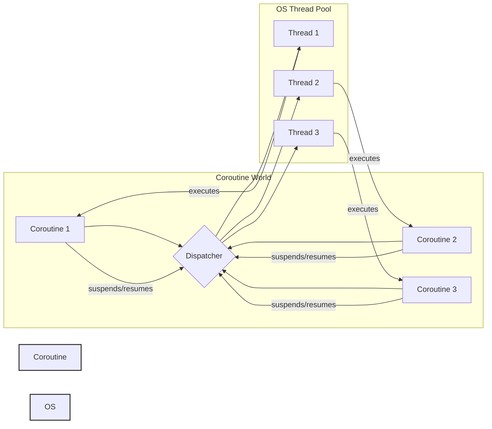
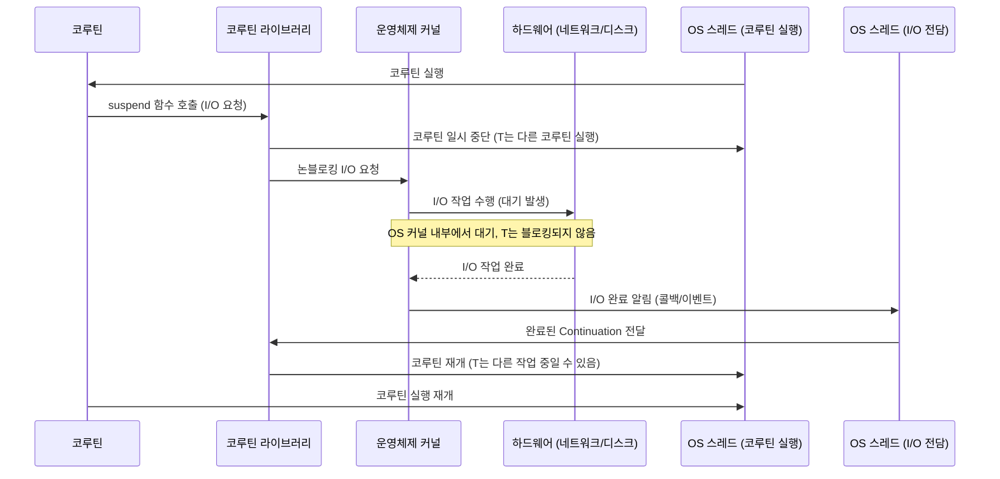

## 코루틴 동작 방식 (하드웨어 및 OS 레벨)

코루틴은 비동기 프로그래밍을 위한 강력한 추상화이지만, 그 내부 동작은 운영체제(OS) 스레드와 하드웨어의 상호작용 방식과는 다소 차이가 있습니다. 코루틴이 '경량 스레드'라고 불리는 이유와 그 효율성의 근원을 이해하기 위해서는 OS 및 하드웨어 레벨에서의 동작 방식을 살펴보는 것이 중요합니다.

### 1. 스레드와 코루틴의 컨텍스트 스위칭 비교

가장 큰 차이점은 **컨텍스트 스위칭(Context Switching)** 방식과 비용에 있습니다.

*   **OS 스레드 (커널 레벨 스레드)**:
    *   OS 스케줄러에 의해 관리됩니다.
    *   스레드 컨텍스트(레지스터 값, 프로그램 카운터, 스택 포인터 등)는 커널에 의해 저장되고 복원됩니다.
    *   컨텍스트 스위칭이 발생하면, CPU는 현재 스레드의 상태를 저장하고 다른 스레드의 상태를 로드하는 작업을 수행합니다. 이 과정은 커널 모드(Kernel Mode)로의 전환을 포함하며, 이는 상대적으로 높은 오버헤드를 발생시킵니다. TLB(Translation Lookaside Buffer) 무효화, 캐시 미스 증가 등 하드웨어적인 비용도 수반됩니다.
    *   스레드 스택은 일반적으로 수 MB 단위로 할당되어 메모리 사용량이 많습니다.

*   **코루틴 (사용자 레벨 스레드)**:
    *   코루틴 라이브러리(예: Kotlin의 `kotlinx.coroutines`)에 의해 관리됩니다. OS 스케줄러는 코루틴의 존재를 알지 못하며, 코루틴은 OS 스레드 위에서 실행됩니다.
    *   코루틴의 일시 중단(suspension) 및 재개(resumption)는 사용자 모드(User Mode)에서 이루어집니다. 즉, 커널로의 전환 없이 현재 코루틴의 상태(지역 변수, 프로그램 카운터 등)를 저장하고 다른 코루틴의 상태를 로드합니다.
    *   이 상태 저장은 주로 힙(Heap) 메모리에 할당된 객체(Continuation 객체)에 이루어지며, 스택을 통째로 저장할 필요가 없어 메모리 사용량이 훨씬 적습니다.
    *   컨텍스트 스위칭 비용이 OS 스레드에 비해 매우 낮아 수십만 개의 코루틴을 동시에 생성하고 관리할 수 있습니다.

### 2. `suspend` 함수의 내부 동작 (상태 머신 변환)

Kotlin 코루틴의 핵심은 `suspend` 키워드입니다. `suspend` 함수는 컴파일러에 의해 특별하게 처리됩니다.

*   **컴파일러 변환**: `suspend` 함수는 컴파일 시점에 **상태 머신(State Machine)**으로 변환됩니다. 각 `suspend` 호출 지점은 상태 머신의 한 상태가 됩니다.
*   **`Continuation` 객체**: `suspend` 함수가 호출될 때마다, 컴파일러는 현재 코루틴의 실행 상태(지역 변수, 다음 실행할 코드 위치 등)를 캡슐화하는 `Continuation` 객체를 생성합니다. 이 `Continuation` 객체는 힙에 할당됩니다.
*   **일시 중단 및 재개**:
    *   `suspend` 함수 내부에서 비동기 작업(예: 네트워크 요청)을 시작하고, 그 결과가 준비될 때까지 현재 코루틴의 실행을 `Continuation` 객체에 저장한 후 일시 중단합니다. 이때, 해당 코루틴을 실행하던 OS 스레드는 블로킹되지 않고 다른 코루틴을 실행하거나 다른 작업을 수행할 수 있습니다.
    *   비동기 작업이 완료되면, 해당 작업의 결과와 함께 저장된 `Continuation` 객체가 다시 활성화됩니다. 코루틴 라이브러리는 이 `Continuation` 객체를 사용하여 코루틴의 실행을 중단되었던 지점부터 재개합니다.

이러한 상태 머신 변환과 `Continuation` 객체 사용 덕분에, 코루틴은 스택을 통째로 복사하거나 저장할 필요 없이 필요한 최소한의 상태만 저장하고 복원하여 효율적인 일시 중단 및 재개가 가능합니다.

### 3. 코루틴 디스패처와 스레드 풀

코루틴은 OS 스레드 위에서 실행되므로, 어떤 OS 스레드에서 코루틴이 실행될지를 결정하는 메커니즘이 필요합니다. 이것이 바로 **코루틴 디스패처(Coroutine Dispatcher)**의 역할입니다.

*   **디스패처의 역할**: 디스패처는 코루틴을 실행할 스레드를 결정하고, 코루틴의 일시 중단 및 재개 시 스레드 전환을 관리합니다.
*   **스레드 풀 활용**: 대부분의 디스패처는 내부적으로 스레드 풀(Thread Pool)을 사용합니다.
    *   `Dispatchers.Default`: CPU 집약적인 작업에 최적화된 공유 스레드 풀을 사용합니다. 이 스레드 풀의 크기는 일반적으로 CPU 코어 수에 비례합니다.
    *   `Dispatchers.IO`: I/O 바운드 작업에 최적화된 공유 스레드 풀을 사용합니다. I/O 작업은 대부분 대기 시간이므로, 이 스레드 풀은 더 많은 스레드를 가질 수 있습니다.
    *   `Dispatchers.Main`: UI 애플리케이션(예: 안드로이드)에서 UI 업데이트를 위한 메인 스레드를 나타냅니다.
*   **스레드 전환**: `withContext`와 같은 함수를 사용하여 코루틴의 실행 컨텍스트를 변경할 수 있습니다. 예를 들어, `Dispatchers.Default`에서 실행되던 코루틴이 `withContext(Dispatchers.IO)` 블록에 진입하면, 해당 블록 내의 코드는 `Dispatchers.IO`가 관리하는 스레드 풀의 스레드에서 실행됩니다. 블록이 완료되면 다시 원래의 컨텍스트로 돌아옵니다. 이 과정에서 OS 스레드 간의 전환이 발생할 수 있지만, 코루틴 라이브러리가 이를 효율적으로 관리합니다.

### 4. 메모리 효율성

코루틴은 스레드에 비해 메모리 사용량이 훨씬 적습니다.

*   **스택 vs 힙**: OS 스레드는 고정된 크기(수 MB)의 스택 메모리를 할당받는 반면, 코루틴은 실행 상태를 힙에 할당된 작은 `Continuation` 객체에 저장합니다. 필요한 경우에만 스택 프레임을 힙으로 옮기는(stackless vs stackful) 방식으로 구현될 수 있습니다. Kotlin 코루틴은 기본적으로 스택리스(stackless)에 가깝게 동작하여 스택 메모리 사용을 최소화합니다.
*   **수십만 개의 코루틴**: 이러한 메모리 효율성 덕분에 단일 OS 스레드 위에서 수십만 개 이상의 코루틴을 동시에 실행하는 것이 가능합니다. 이는 스레드 기반의 동시성 모델에서는 상상하기 어려운 규모입니다.

### 5. I/O 작업 처리 흐름 (비블로킹 I/O)

코루틴이 네트워크 요청이나 파일 읽기/쓰기와 같은 I/O 작업을 처리할 때, 해당 코루틴을 실행하는 OS 스레드가 블로킹되지 않는 것이 중요합니다. 이는 비블로킹 I/O 메커니즘과 코루틴 라이브러리의 효율적인 스레드 관리를 통해 가능합니다.

1.  **코루틴의 I/O 요청**: 코루틴이 `suspend` 함수를 통해 네트워크 요청(`withContext(Dispatchers.IO) { ... }` 내부의 작업 등)을 시작합니다.
2.  **코루틴 일시 중단**: 코루틴은 자신의 실행 상태를 `Continuation` 객체에 저장하고 일시 중단됩니다. 이때, 코루틴을 실행하던 OS 스레드는 I/O 작업이 완료되기를 기다리지 않고 다른 코루틴을 실행하거나 다른 작업을 처리할 수 있도록 해제됩니다.
3.  **OS로의 논블로킹 I/O 요청**: 코루틴 라이브러리(또는 그 하위의 JVM/OS)는 운영체제에 논블로킹 방식으로 I/O 작업을 요청합니다. OS는 이 요청을 받아 실제 네트워크 통신이나 디스크 I/O를 수행합니다. 이 과정에서 OS 커널 내부에서 대기가 발생하지만, 애플리케이션의 스레드를 직접 블로킹하지 않습니다.
4.  **I/O 완료 알림**: I/O 작업이 완료되면, 운영체제는 I/O 멀티플렉싱 메커니즘(예: Linux의 `epoll`, macOS의 `kqueue`, Windows의 `IOCP`)을 통해 애플리케이션에 완료를 알립니다.
5.  **코루틴 재개**: 코루틴 라이브러리 내부의 전용 I/O 스레드 풀에 속한 스레드 중 하나가 이 완료 알림을 받습니다. 이 스레드는 이전에 일시 중단되었던 코루틴의 `Continuation` 객체를 코루틴 디스패처에게 전달하고, 디스패처는 해당 코루틴을 다시 실행 가능한 상태로 만들어 스레드 풀의 사용 가능한 스레드에 스케줄링하여 재개시킵니다.

이러한 과정을 통해, 애플리케이션의 메인 스레드나 작업 스레드는 I/O 대기 시간 동안 유휴 상태로 있지 않고 다른 유용한 작업을 계속 수행할 수 있어 전체적인 시스템의 응답성과 처리량이 향상됩니다.

### 결론

코루틴은 OS 스레드의 무거운 컨텍스트 스위칭과 메모리 오버헤드를 회피하기 위해 사용자 레벨에서 스케줄링되고 관리되는 경량 동시성 단위입니다. 컴파일러의 상태 머신 변환과 `Continuation` 객체, 그리고 효율적인 디스패처를 통해 비동기 작업을 동기 코드처럼 간결하게 작성하면서도 높은 성능과 확장성을 제공합니다. 이러한 내부 동작 방식의 이해는 코루틴을 더욱 효과적으로 활용하고 복잡한 비동기 시스템을 설계하는 데 큰 도움이 됩니다.

## 참고 자료

*   Kotlin Coroutines: Deep Dive into Coroutine Context and Dispatchers: [https://proandroiddev.com/kotlin-coroutines-deep-dive-into-coroutine-context-and-dispatchers-120237272196](https://proandroiddev.com/kotlin-coroutines-deep-dive-into-coroutine-context-and-dispatchers-120237272196)
*   Understanding Kotlin Coroutines: [https://medium.com/androiddevelopers/understanding-kotlin-coroutines-part-1-a8725162b61c](https://medium.com/androiddevelopers/understanding-kotlin-coroutines-part-1-a8725162b61c)
*   [[코루틴 (Coroutines)]]
*   [[스레드(Thread)]]
*   [[동시성(Concurrency)]]
*   [[비동기(Asynchronous)]]