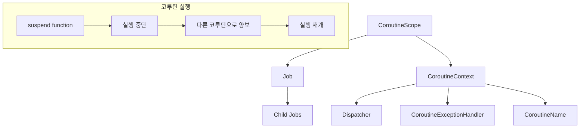
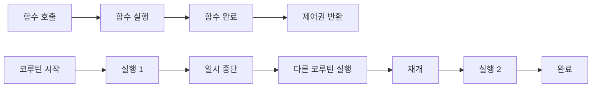

코루틴(Coroutine)은 [[비선점형 멀티태스킹(Non-preemptive Multitasking)]]을 지원하는 프로그래밍 개념으로, 함수가 실행 도중에 잠시 중단되었다가 나중에 다시 시작할 수 있는 기능을 제공합니다. 일반적인 함수와 달리 코루틴은 여러 번의 진입점(entry point)과 종료점(exit point)을 가질 수 있어, 협력적 멀티태스킹을 통해 효율적인 비동기 프로그래밍을 가능하게 합니다.

코루틴은 특히 [[비동기(Asynchronous)]]에서 콜백 지옥(callback hell)이나 복잡한 스레드 관리 없이도 동시성을 구현할 수 있는 강력한 도구입니다. 최근 많은 프로그래밍 언어에서 코루틴을 지원하고 있으며, 특히 Kotlin에서는 코루틴을 언어 차원에서 지원하여 간편하고 안전한 비동기 프로그래밍을 제공합니다.

## 코루틴이 등장한 배경

### 기존 비동기 프로그래밍의 문제점

현대 애플리케이션에서는 네트워크 통신, 파일 I/O, 데이터베이스 접근 등 많은 작업이 비동기적으로 처리되어야 합니다. 하지만 기존의 비동기 프로그래밍 방식들은 다음과 같은 문제점들을 가지고 있었습니다.

#### 1. 콜백 지옥 (Callback Hell)

전통적인 콜백 방식은 비동기 작업이 중첩될수록 코드가 복잡해집니다:

```kotlin
// 콜백 지옥의 예시
fun fetchUserData(userId: String, callback: (UserData?) -> Unit) {
    fetchUser(userId) { user ->
        if (user != null) {
            fetchProfile(user.id) { profile ->
                if (profile != null) {
                    fetchSettings(profile.id) { settings ->
                        if (settings != null) {
                            callback(UserData(user, profile, settings))
                        } else {
                            callback(null)
                        }
                    }
                } else {
                    callback(null)
                }
            }
        } else {
            callback(null)
        }
    }
}
```

#### 2. 스레드 관리의 복잡성

기존의 스레드 기반 방식은 많은 리소스를 소모하고 관리가 복잡합니다. 특히 [[컨텍스트 스위칭(Context Switching)]] 비용이 높아서 성능 저하가 발생합니다

```kotlin
// 스레드 기반 방식의 문제점
class ThreadBasedExample {
    fun processMultipleRequests() {
        // 각 요청마다 새로운 스레드 생성 (리소스 낭비)
        repeat(10000) { i ->
            Thread {
                try {
                    // 네트워크 요청 처리
                    processRequest(i)
                } catch (e: Exception) {
                    // 예외 처리도 복잡
                    handleError(e)
                }
            }.start()
        }
        // 스레드 생명주기 관리, 동기화 등이 복잡
    }
}
```

#### 3. 예외 처리의 어려움

비동기 코드에서는 예외가 발생한 지점과 처리해야 하는 지점이 다르기 때문에 예외 처리가 복잡합니다. 이는 다음과 같은 이유들 때문입니다:

**실행 컨텍스트의 분리**: 비동기 작업은 다른 스레드에서 실행되므로, 호출한 스레드의 try-catch 블록으로 예외를 잡을 수 없습니다.

```kotlin
// 문제가 있는 예외 처리
fun problematicAsyncCall() {
    try {
        // 이 try-catch는 비동기 작업의 예외를 잡을 수 없음
        Thread {
            throw RuntimeException("비동기 작업에서 발생한 예외")
        }.start()
    } catch (e: Exception) {
        // 이 블록은 실행되지 않음
        println("예외 처리: ${e.message}")
    }
}
```

**콜백 체인에서의 예외 전파**: 각 콜백마다 별도의 예외 처리가 필요하며, 예외가 체인을 따라 전파되지 않습니다.

```kotlin
fun callbackExceptionExample() {
    fetchUser { user, error ->
        if (error != null) {
            // 첫 번째 단계에서 예외 처리
            handleError(error)
            return@fetchUser
        }
        
        fetchProfile(user.id) { profile, profileError ->
            if (profileError != null) {
                // 두 번째 단계에서 또 다른 예외 처리
                handleError(profileError)
                return@fetchProfile
            }
            
            fetchSettings(profile.id) { settings, settingsError ->
                if (settingsError != null) {
                    // 세 번째 단계에서 또 다른 예외 처리
                    handleError(settingsError)
                    return@fetchSettings
                }
                
                // 성공 케이스 처리
                processUserData(user, profile, settings)
            }
        }
    }
}
```

**스택 트레이스의 손실**: 비동기 작업에서 예외가 발생하면 원래 호출 지점의 스택 트레이스 정보가 손실됩니다.

### 코루틴이 제시하는 해결책

코루틴은 이러한 문제점들을 해결하기 위해 다음과 같은 접근 방식을 제시합니다:

| 기존 문제점 | 코루틴 해결책 | 설명 |
|-------------|---------------|------|
| 콜백 지옥 | 순차적 코드로 비동기 처리 | suspend 함수를 통해 비동기 작업을 마치 동기 코드처럼 작성하여 중첩된 콜백을 제거 |
| 스레드 리소스 낭비 | 경량 동시성 | 적은 수의 스레드로 수천 개의 코루틴을 효율적으로 관리하여 메모리 사용량 대폭 감소 |
| 복잡한 예외 처리 | 향상된 예외 처리 | 일반적인 try-catch 문법으로 비동기 예외를 처리하여 예외 전파와 처리가 직관적 |
| 낮은 코드 가독성 | 구조화된 동시성 | 부모-자식 관계를 통한 생명주기 자동 관리로 코드의 의도가 명확하고 메모리 누수 방지 |

이러한 강력한 해결책들이 어떻게 구현되는지 궁금하지 않으신가요? 코루틴이 위에서 제시한 혁신적인 기능들을 제공할 수 있는 이유는 특별히 설계된 핵심 구성 요소들과 그들 간의 유기적인 협력 때문입니다. 지금부터 이러한 해결책들의 기반이 되는 코루틴의 기본 개념과 구성 요소들을 자세히 살펴보겠습니다.

## 코루틴의 기본 개념

코루틴은 "협력하는 루틴(Cooperative Routine)"의 줄임말로, 여러 작업이 협력적으로 실행을 주고받으며 동작하는 특징을 가집니다. 일반적인 함수는 호출되면 완전히 실행이 끝날 때까지 제어권을 반환하지 않지만, 코루틴은 실행 중간에 다른 코루틴에게 제어권을 양보할 수 있습니다.

코루틴을 이해하기 위해서는 다음과 같은 핵심 구성 요소들과 그들 간의 관계를 파악하는 것이 중요합니다.

### 코루틴의 핵심 구성 요소



#### 1. CoroutineScope (코루틴 스코프)

CoroutineScope는 코루틴의 생명주기를 관리하는 범위를 정의합니다. 모든 코루틴은 특정 스코프 내에서 실행되며, 스코프가 취소되면 그 안의 모든 코루틴도 함께 취소됩니다.

```kotlin
class CoroutineScopeExample {
    // 클래스 레벨 스코프 정의
    private val scope = CoroutineScope(Dispatchers.Default + SupervisorJob())
    
    fun startWork() {
        // 이 스코프 내에서 실행되는 모든 코루틴들
        scope.launch {
            println("작업 1 시작")
            delay(1000)
            println("작업 1 완료")
        }
        
        scope.launch {
            println("작업 2 시작")
            delay(2000)
            println("작업 2 완료")
        }
    }
    
    fun cleanup() {
        // 스코프 취소 시 모든 자식 코루틴도 취소됨
        scope.cancel()
    }
}
```

#### 2. Job (잡)

Job은 코루틴의 생명주기를 나타내는 객체입니다. 코루틴의 시작, 실행, 완료, 취소 상태를 추적하고 제어할 수 있습니다.

```kotlin
class JobExample {
    
    suspend fun jobLifecycle() {
        val job = launch {
            try {
                println("작업 시작")
                delay(5000)
                println("작업 완료")
            } catch (e: CancellationException) {
                println("작업이 취소됨")
                throw e
            }
        }
        
        println("Job 상태: ${job.isActive}")
        
        // 2초 후 작업 취소
        delay(2000)
        job.cancel("시간 초과")
        job.join() // 취소 완료까지 대기
        
        println("Job 최종 상태: ${job.isCancelled}")
    }
}
```

#### 3. CoroutineContext (코루틴 컨텍스트)

CoroutineContext는 코루틴이 실행되는 환경을 정의하는 요소들의 집합입니다. Dispatcher, Job, ExceptionHandler 등이 포함됩니다.

```kotlin
class CoroutineContextExample {
    
    fun contextComposition() {
        // 여러 컨텍스트 요소를 조합
        val context = Dispatchers.IO + 
                     CoroutineName("MyCoroutine") +
                     CoroutineExceptionHandler { _, throwable ->
                         println("예외 발생: ${throwable.message}")
                     }
        
        CoroutineScope(context).launch {
            println("현재 코루틴 이름: ${coroutineContext[CoroutineName]?.name}")
            println("현재 디스패처: ${coroutineContext[ContinuationInterceptor]}")
            
            // I/O 작업 수행
            performIOOperation()
        }
    }
    
    private suspend fun performIOOperation() {
        delay(1000)
        println("I/O 작업 완료")
    }
}
```

#### 4. Dispatcher (디스패처)

Dispatcher는 코루틴이 실행될 스레드 또는 스레드 풀을 결정합니다. 작업의 특성에 따라 적절한 디스패처를 선택할 수 있습니다.

```kotlin
class DispatcherExample {
    
    suspend fun demonstrateDispatchers() = coroutineScope {
        // CPU 집약적 작업
        launch(Dispatchers.Default) {
            val result = performCpuIntensiveTask()
            println("CPU 작업 결과: $result")
        }
        
        // I/O 작업
        launch(Dispatchers.IO) {
            val data = readFromNetwork()
            println("네트워크 데이터: $data")
        }
        
        // 메인 스레드 작업 (Android/JavaFX)
        // launch(Dispatchers.Main) {
        //     updateUI(result)
        // }
    }
    
    private suspend fun performCpuIntensiveTask(): Int {
        return withContext(Dispatchers.Default) {
            var sum = 0
            repeat(1_000_000) { sum += it }
            sum
        }
    }
    
    private suspend fun readFromNetwork(): String {
        return withContext(Dispatchers.IO) {
            delay(1000) // 네트워크 지연 시뮬레이션
            "네트워크에서 받은 데이터"
        }
    }
}
```

### 구성 요소들의 상호작용

이러한 구성 요소들은 서로 밀접하게 연관되어 작동합니다:

```kotlin
class ComponentInteractionExample {
    
    fun demonstrateInteraction() {
        // 1. 스코프 생성 (컨텍스트 포함)
        val scope = CoroutineScope(
            Dispatchers.Default + 
            SupervisorJob() + 
            CoroutineName("MainScope")
        )
        
        // 2. 부모 Job에서 자식 Job들 생성
        val parentJob = scope.launch(CoroutineName("ParentJob")) {
            println("부모 작업 시작")
            
            // 3. 자식 Job들은 부모의 컨텍스트를 상속받음
            val childJob1 = launch(CoroutineName("ChildJob1")) {
                delay(2000)
                println("자식 작업 1 완료")
            }
            
            val childJob2 = async(CoroutineName("ChildJob2")) {
                delay(1000)
                "자식 작업 2 결과"
            }
            
            // 4. 자식 작업들의 완료를 대기
            childJob1.join()
            val result = childJob2.await()
            
            println("모든 자식 작업 완료: $result")
        }
        
        // 5. Job 상태 모니터링
        runBlocking {
            parentJob.join()
            println("모든 작업 완료")
        }
    }
}
```

### 일반 함수와 코루틴의 차이



일반 함수는 호출부터 완료까지 연속적으로 실행되는 반면, 코루틴은 실행 중간에 중단되었다가 나중에 재개될 수 있습니다.

## 코루틴의 핵심 특징

앞서 살펴본 구성 요소들(CoroutineScope, Job, CoroutineContext, Dispatcher)의 유기적인 결합은 코루틴의 다음과 같은 핵심 특징들을 만들어냅니다:

### 1. 비선점형 멀티태스킹

코루틴은 [[비선점형 멀티태스킹(Non-preemptive Multitasking)]]을 지원합니다. 이는 **Job**이 스스로 `delay()`, `yield()` 등의 suspend 함수를 호출하여 제어권을 양보할 때까지 계속 실행되며, 외부에서 강제로 중단시키지 않는다는 의미입니다.

```kotlin
class CooperativeExample {
    suspend fun cooperativeTask() {
        repeat(5) { i ->
            println("작업 진행: $i")
            delay(100) // 자발적 양보 - 다른 코루틴이 실행될 기회 제공
        }
    }
}
```

이러한 특성은 **Dispatcher**가 여러 코루틴 간의 실행을 조율하면서도 각 코루틴이 안전한 지점에서만 중단되도록 보장합니다.

### 2. 경량성

코루틴은 운영체제 스레드보다 훨씬 가볍습니다. 이는 **Dispatcher**가 소수의 스레드 풀을 효율적으로 관리하면서 수천 개의 **Job**을 처리할 수 있기 때문입니다. 각 코루틴은 최소한의 메모리만 사용하며, 운영체제 수준의 [[컨텍스트 스위칭(Context Switching)]] 대신 함수 호출 수준의 경량 전환을 사용하여 비용이 매우 낮습니다.

```kotlin
class LightweightExample {
    suspend fun demonstrateLightweight() {
        // 10,000개의 코루틴을 동시에 실행해도 메모리 사용량이 적음
        val jobs = (1..10_000).map { i ->
            GlobalScope.launch {
                delay(1000)
                println("코루틴 $i 완료")
            }
        }
        
        jobs.forEach { it.join() }
    }
}
```

### 3. 순차적 코드 작성

**CoroutineContext**와 suspend 함수의 조합으로 비동기 작업을 순차적인 코드로 작성할 수 있어 가독성이 높습니다. 콜백이나 [[Future 인터페이스]]를 사용할 때보다 훨씬 직관적인 코드를 작성할 수 있습니다.

```kotlin
class SequentialExample {
    suspend fun sequentialAsyncOperations(): String {
        // 비동기 작업들이 순차적 코드처럼 보임
        val user = fetchUser()
        val profile = fetchProfile(user.id)
        val settings = fetchSettings(profile.id)
        
        return "User: ${user.name}, Theme: ${settings.theme}"
    }
    
    private suspend fun fetchUser(): User {
        delay(100) // 네트워크 지연 시뮬레이션
        return User(1, "Alice")
    }
    
    private suspend fun fetchProfile(userId: Int): Profile {
        delay(200)
        return Profile(userId, "profile_$userId")
    }
    
    private suspend fun fetchSettings(profileId: String): Settings {
        delay(150)
        return Settings("dark")
    }
}
```

### 4. 구조화된 생명주기 관리

**CoroutineScope**와 **Job**의 계층 구조를 통해 코루틴의 생명주기가 자동으로 관리됩니다. 부모 스코프가 취소되면 모든 자식 코루틴도 자동으로 취소되어 메모리 누수를 방지합니다.

```kotlin
class LifecycleExample {
    private val mainScope = CoroutineScope(Dispatchers.Default + SupervisorJob())
    
    fun startBackgroundTasks() {
        mainScope.launch {
            // 부모 Job
            println("메인 작업 시작")
            
            // 자식 Job들 - 부모가 취소되면 모두 취소됨
            launch { longRunningTask1() }
            launch { longRunningTask2() }
            
            delay(5000)
            println("메인 작업 완료")
        }
    }
    
    fun cleanup() {
        // 스코프 취소 시 모든 자식 코루틴 자동 취소
        mainScope.cancel()
    }
    
    private suspend fun longRunningTask1() {
        repeat(100) {
            delay(100)
            println("작업 1 진행: $it")
        }
    }
    
    private suspend fun longRunningTask2() {
        repeat(50) {
            delay(200)
            println("작업 2 진행: $it")
        }
    }
}
```

### 5. 컨텍스트 스위칭의 유연성

**CoroutineContext**를 통해 코루틴 실행 중에도 실행 환경을 유연하게 변경할 수 있습니다. `withContext()` 함수를 사용하여 특정 작업만 다른 **Dispatcher**에서 실행할 수 있습니다.

```kotlin
class ContextSwitchingExample {
    suspend fun flexibleExecution() {
        // 메인 로직은 Default 디스패처에서
        withContext(Dispatchers.Default) {
            val data = processData()
            
            // I/O 작업만 IO 디스패처로 전환
            withContext(Dispatchers.IO) {
                saveToDatabase(data)
            }
            
            // 다시 Default 디스패처로 복귀
            val result = finalizeProcessing(data)
            
            // UI 업데이트는 Main 디스패처로
            // withContext(Dispatchers.Main) {
            //     updateUI(result)
            // }
        }
    }
    
    private fun processData(): String = "처리된 데이터"
    private suspend fun saveToDatabase(data: String) { delay(100) }
    private fun finalizeProcessing(data: String): String = "최종 $data"
}
```

이러한 핵심 특징들은 모두 코루틴의 기본 구성 요소들이 서로 협력하여 만들어내는 결과입니다. **CoroutineScope**가 생명주기를 관리하고, **Job**이 작업 상태를 추적하며, **CoroutineContext**가 실행 환경을 정의하고, **Dispatcher**가 실제 스레드 실행을 담당하는 이 모든 요소들의 조화로운 협력이 코루틴의 강력함을 만들어냅니다.

## Kotlin에서의 코루틴 구현

Kotlin에서는 언어 차원에서 코루틴을 지원하여 매우 직관적이고 안전한 비동기 프로그래밍이 가능합니다. Kotlin의 코루틴은 suspend 키워드, 코루틴 빌더, 디스패처 등의 강력한 기능을 제공하며, 구조화된 동시성을 통해 안전한 코루틴 생명주기 관리를 지원합니다.

Kotlin 코루틴의 구체적인 구현 방법, 코루틴 빌더 사용법, 디스패처 종류, 예외 처리, 취소 메커니즘 등에 대한 자세한 내용은 [[Kotlin 코루틴]]을 참고해주세요.

## 스프링에서의 코루틴 활용

Spring Framework는 5.2 버전부터 Kotlin 코루틴을 지원하기 시작했습니다. Spring WebFlux와 함께 사용하면 매우 효율적인 리액티브 애플리케이션을 구축할 수 있습니다.

```kotlin
// Spring WebFlux에서 코루틴 사용 예시
@RestController
class CoroutineController(
    private val userService: UserService
) {
    
    // 코루틴을 사용한 비동기 핸들러
    @GetMapping("/users/{id}")
    suspend fun getUser(@PathVariable id: Long): User {
        return userService.findByIdAsync(id)
    }
    
    @PostMapping("/users")
    suspend fun createUser(@RequestBody user: User): User {
        return userService.saveAsync(user)
    }
    
    @GetMapping("/users/{id}/profile")
    suspend fun getUserProfile(@PathVariable id: Long): UserProfile {
        // 여러 비동기 작업을 병렬로 실행
        return coroutineScope {
            val userDeferred = async { userService.findByIdAsync(id) }
            val settingsDeferred = async { userService.getSettingsAsync(id) }
            
            val user = userDeferred.await()
            val settings = settingsDeferred.await()
            
            UserProfile(user, settings)
        }
    }
}
```

Spring의 비동기 처리에 대한 자세한 내용은 [[Spring Async]]를 참고해주세요.

## 코루틴의 성능 특성

### 메모리 사용량

코루틴은 JVM 스레드에 비해 매우 적은 메모리를 사용합니다:

- JVM 스레드: 약 1MB의 스택 메모리
- 코루틴: 수십 바이트의 메모리 (필요에 따라 증가)

### 컨텍스트 스위칭 비용

코루틴의 컨텍스트 스위칭은 함수 호출 수준의 비용만 발생하므로, 운영체제 스레드의 컨텍스트 스위칭보다 훨씬 빠릅니다.

```java
public class PerformanceExample {
    
    public void performanceComparison() {
        // 스레드를 사용한 경우
        long startTime = System.currentTimeMillis();
        
        for (int i = 0; i < 10000; i++) {
            new Thread(() -> {
                try {
                    Thread.sleep(1000);
                } catch (InterruptedException e) {
                    Thread.currentThread().interrupt();
                }
            }).start();
        }
        
        // 코루틴을 사용한 경우 (의사 코드)
        CoroutineScope scope = CoroutineScope.INSTANCE;
        for (int i = 0; i < 10000; i++) {
            scope.launch(() -> {
                delay(1000);
                return Unit.INSTANCE;
            });
        }
    }
}
```

## 코루틴의 디버깅

코루틴 디버깅은 일반적인 스레드 디버깅과 다른 접근이 필요합니다. IntelliJ IDEA는 코루틴 디버깅을 위한 전용 도구를 제공합니다.

### 디버깅 기법

1. **코루틴 덤프**: 실행 중인 모든 코루틴의 상태를 확인할 수 있습니다.
2. **로깅**: 각 코루틴의 실행 흐름을 추적할 수 있습니다.
3. **브레이크포인트**: suspend 함수에서 브레이크포인트를 설정할 수 있습니다.

자세한 디버깅 방법은 별도의 코루틴 디버깅 기법 문서를 참고해주세요.

## 코루틴 vs 다른 비동기 기법

### 코루틴 vs 스레드

| 특성 | 코루틴 | 스레드 |
|------|--------|--------|
| 메모리 사용량 | 매우 적음 | 많음 (1MB+) |
| 생성 비용 | 매우 낮음 | 높음 |
| 컨텍스트 스위칭 | 함수 호출 수준 | 운영체제 수준 |
| 동시 실행 가능 수 | 수십만 개 | 수천 개 |

### 코루틴 vs CompletableFuture

코루틴은 [[CompletableFuture]]보다 더 직관적이고 읽기 쉬운 코드를 제공합니다:

```java
// CompletableFuture 사용
public CompletableFuture<String> fetchUserDataWithFuture(Long userId) {
    return userService.findByIdAsync(userId)
        .thenCompose(user -> profileService.getProfileAsync(user.getId()))
        .thenCompose(profile -> settingsService.getSettingsAsync(profile.getUserId()))
        .thenApply(settings -> settings.getDisplayName());
}

// 코루틴 사용 (의사 코드)
public Mono<String> fetchUserDataWithCoroutine(Long userId) {
    return Mono.fromCallable(() -> {
        User user = userService.findByIdAsync(userId).block();
        Profile profile = profileService.getProfileAsync(user.getId()).block();
        Settings settings = settingsService.getSettingsAsync(profile.getUserId()).block();
        return settings.getDisplayName();
    }).subscribeOn(Schedulers.boundedElastic());
}
```

## 코루틴의 실제 사용 사례

### 1. 웹 애플리케이션

높은 동시성이 필요한 웹 애플리케이션에서 코루틴을 사용하면 적은 자원으로 많은 요청을 처리할 수 있습니다.

### 2. 데이터 파이프라인

대용량 데이터를 처리하는 파이프라인에서 코루틴을 사용하면 메모리 효율적인 스트림 처리가 가능합니다.

### 3. 마이크로서비스

여러 외부 서비스를 호출해야 하는 마이크로서비스에서 코루틴을 사용하면 응답 시간을 크게 단축할 수 있습니다.

### 4. 실시간 데이터 처리

WebSocket이나 Server-Sent Events를 사용하는 실시간 애플리케이션에서 코루틴은 매우 유용합니다.

## 코루틴 사용 시 주의사항

### 1. 블로킹 호출 피하기

코루틴 내에서 블로킹 호출을 사용하면 성능상 이점이 사라집니다. 대신 suspend 함수나 비동기 API를 사용해야 합니다.

### 2. 적절한 디스패처 선택

작업의 특성에 맞는 디스패처를 선택하는 것이 중요합니다. I/O 작업에는 Dispatchers.IO를, CPU 집약적 작업에는 Dispatchers.Default를 사용해야 합니다.

### 3. 메모리 누수 방지

장기간 실행되는 코루틴은 적절히 취소하거나 생명주기를 관리해야 메모리 누수를 방지할 수 있습니다.

### 4. 예외 처리

코루틴의 예외는 부모 코루틴으로 전파될 수 있으므로, 적절한 예외 처리 전략이 필요합니다.

## 결론

코루틴은 현대적인 비동기 프로그래밍의 핵심 기술로, 기존의 스레드 기반 방식보다 훨씬 효율적이고 직관적인 개발을 가능하게 합니다. 특히 Kotlin에서 제공하는 코루틴 API는 매우 잘 설계되어 있어, 복잡한 비동기 로직도 순차적인 코드처럼 작성할 수 있습니다.

코루틴을 효과적으로 활용하기 위해서는 구조화된 동시성, 코루틴 스코프 관리, 적절한 디스패처 선택 등의 개념을 잘 이해하고 적용하는 것이 중요합니다. 또한 스프링과 같은 프레임워크에서 코루틴을 활용하면 높은 성능의 리액티브 애플리케이션을 구축할 수 있습니다.

앞으로 더 많은 프로그래밍 언어와 프레임워크에서 코루틴을 지원할 것으로 예상되며, 비동기 프로그래밍의 표준이 될 가능성이 높습니다. 따라서 코루틴의 개념과 활용법을 숙지하는 것은 현대 개발자에게 필수적인 역량이라 할 수 있습니다.

## 참고 자료

- Kotlin Coroutines 공식 문서 (https://kotlinlang.org/docs/coroutines-overview.html)
- Spring Framework Coroutines Support (https://docs.spring.io/spring-framework/docs/current/reference/html/languages.html#coroutines)
- "Kotlin in Action" - Dmitry Jemerov, Svetlana Isakova
- "Concurrency in Kotlin" - Alexey Soshin
