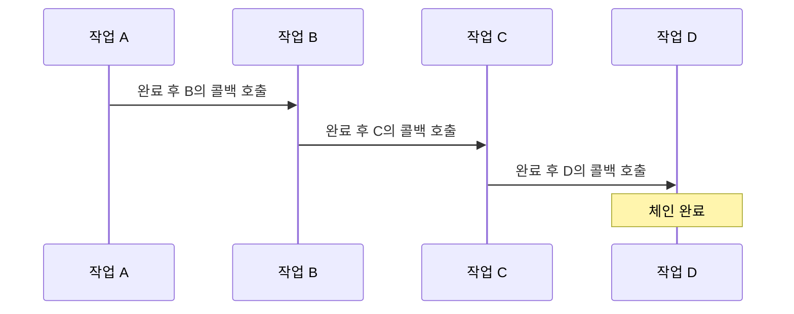

콜백 체인은 [[비동기(Asynchronous)]] 작업을 순차적으로 처리하기 위한 디자인 패턴입니다. 하나의 작업이 완료된 후 다음 작업을 호출하는 방식으로, 각 작업이 콜백 함수를 통해 연결되어 있습니다. 이 패턴은 특히 JavaScript와 같은 [[이벤트 기반 아키텍처(Event-Driven Architecture)]]에서 널리 사용되지만, Java를 비롯한 다양한 언어에서도 활용할 수 있습니다.

## 콜백 패턴의 기본 개념

콜백 체인을 이해하기 위해서는 먼저 [[콜백(Callback)]]의 개념을 이해해야 합니다. 콜백은 다른 코드에 인자로 넘겨주는 실행 가능한 코드 조각으로, 해당 코드가 특정 시점이나 조건에서 실행될 수 있도록 합니다. 비동기 작업이 완료된 후 실행되는 코드를 정의하는 데 주로 사용됩니다.

## 콜백 체인의 구조

콜백 체인은 여러 개의 콜백이 연결된 형태로, 각 콜백은 이전 작업이 완료된 후 호출됩니다. 이러한 구조는 특히 다음과 같은 상황에서 유용합니다:

1. **순차적 비동기 작업**: 한 작업이 완료된 후에만 다음 작업을 시작해야 할 때
2. **데이터 흐름 제어**: 이전 작업의 결과가 다음 작업의 입력으로 필요할 때
3. **조건부 실행**: 특정 조건에 따라 다음 작업의 실행 여부를 결정해야 할 때

콜백 체인의 흐름은 다음과 같이 표현할 수 있습니다:



## Java에서의 콜백 체인 구현

Java에서는 인터페이스를 활용하여 콜백을 구현할 수 있습니다. 다음은 간단한 콜백 인터페이스와 콜백 체인의 예시입니다:

```java
// 콜백 인터페이스 정의
interface Callback<T> {
    void onComplete(T result, Callback<T> nextCallback);
    void onError(Exception e);
}

// 콜백 체인 구현 예시
public class DataProcessor {
    
    public void processData(String data, Callback<String> finalCallback) {
        validateData(data, new Callback<String>() {
            @Override
            public void onComplete(String validatedData, Callback<String> nextCallback) {
                System.out.println("데이터 검증 완료: " + validatedData);
                transformData(validatedData, new Callback<String>() {
                    @Override
                    public void onComplete(String transformedData, Callback<String> nextCallback) {
                        System.out.println("데이터 변환 완료: " + transformedData);
                        saveData(transformedData, finalCallback);
                    }
                    
                    @Override
                    public void onError(Exception e) {
                        System.err.println("데이터 변환 오류: " + e.getMessage());
                        finalCallback.onError(e);
                    }
                });
            }
            
            @Override
            public void onError(Exception e) {
                System.err.println("데이터 검증 오류: " + e.getMessage());
                finalCallback.onError(e);
            }
        });
    }
    
    private void validateData(String data, Callback<String> callback) {
        // 데이터 검증 로직
        if (data == null || data.isEmpty()) {
            callback.onError(new IllegalArgumentException("데이터가 비어 있습니다."));
        } else {
            // 비동기 작업 시뮬레이션
            new Thread(() -> {
                try {
                    Thread.sleep(1000); // 1초 대기
                    callback.onComplete(data.trim(), null);
                } catch (InterruptedException e) {
                    callback.onError(e);
                }
            }).start();
        }
    }
    
    private void transformData(String data, Callback<String> callback) {
        // 데이터 변환 로직
        new Thread(() -> {
            try {
                Thread.sleep(1500); // 1.5초 대기
                String transformed = data.toUpperCase();
                callback.onComplete(transformed, null);
            } catch (InterruptedException e) {
                callback.onError(e);
            }
        }).start();
    }
    
    private void saveData(String data, Callback<String> callback) {
        // 데이터 저장 로직
        new Thread(() -> {
            try {
                Thread.sleep(2000); // 2초 대기
                // 데이터베이스 저장 시뮬레이션
                System.out.println("데이터베이스에 저장: " + data);
                callback.onComplete(data, null);
            } catch (InterruptedException e) {
                callback.onError(e);
            }
        }).start();
    }
}
```

## 람다 표현식을 활용한 간결한 구현

Java 8 이상에서는 람다 표현식을 사용하여 콜백 체인을 더 간결하게 구현할 수 있습니다:

```java
public void processDataWithLambda(String data, Callback<String> finalCallback) {
    validateData(data, (validatedData, next) -> {
        System.out.println("데이터 검증 완료: " + validatedData);
        transformData(validatedData, (transformedData, next2) -> {
            System.out.println("데이터 변환 완료: " + transformedData);
            saveData(transformedData, finalCallback);
        }, finalCallback::onError);
    }, finalCallback::onError);
}
```

## 콜백 체인의 문제점: 콜백 지옥(Callback Hell)

콜백 체인은 작업이 많아질수록 코드가 깊게 중첩되어 가독성이 떨어지고 유지 관리가 어려워지는 [[콜백 지옥(Callback Hell)]] 문제가 발생할 수 있습니다. 이 문제에 대한 자세한 설명과 해결 방법은 [[콜백 지옥 해결 방법]]을 참고해주세요.

## 콜백 체인의 대안

콜백 체인의 문제점을 해결하기 위한 다양한 대안이 존재합니다:

1. **[[Promise 패턴]]**: 비동기 작업의 최종 완료 또는 실패를 나타내는 객체
2. **[[CompletableFuture]]**: Java 8에서 도입된 비동기 작업 처리 API
3. **[[반응형 프로그래밍(Reactive Programming)]]**: 데이터 스트림과 변화 전파에 중점을 둔 프로그래밍 패러다임

자세한 대안 기술에 대한 내용은 [[비동기 프로그래밍 기법]]을 참고해주세요.

## 스프링 프레임워크에서의 콜백 체인

스프링 프레임워크에서는 JdbcTemplate과 같은 클래스에서 콜백 패턴을 활용하고 있습니다. 특히 TransactionTemplate을 사용한 트랜잭션 처리에서 콜백 체인 형태로 코드를 구성할 수 있습니다:

```java
@Service
public class OrderService {
    
    private final TransactionTemplate transactionTemplate;
    private final OrderRepository orderRepository;
    private final PaymentService paymentService;
    private final NotificationService notificationService;
    
    @Autowired
    public OrderService(
            PlatformTransactionManager transactionManager,
            OrderRepository orderRepository,
            PaymentService paymentService,
            NotificationService notificationService) {
        this.transactionTemplate = new TransactionTemplate(transactionManager);
        this.orderRepository = orderRepository;
        this.paymentService = paymentService;
        this.notificationService = notificationService;
    }
    
    public Order processOrder(Order order) {
        return transactionTemplate.execute(status -> {
            try {
                // 주문 저장
                Order savedOrder = orderRepository.save(order);
                
                // 결제 처리
                paymentService.processPayment(savedOrder, paymentResult -> {
                    if (paymentResult.isSuccessful()) {
                        // 결제 성공 시 알림 발송
                        notificationService.sendOrderConfirmation(savedOrder, notificationResult -> {
                            System.out.println("주문 처리 완료: " + savedOrder.getId());
                        });
                    } else {
                        // 결제 실패 시 트랜잭션 롤백
                        status.setRollbackOnly();
                        System.err.println("결제 실패: " + paymentResult.getErrorMessage());
                    }
                });
                
                return savedOrder;
            } catch (Exception e) {
                status.setRollbackOnly();
                throw new RuntimeException("주문 처리 중 오류 발생", e);
            }
        });
    }
}
```

스프링의 비동기 처리에 대한 더 많은 내용은 [[스프링 비동기 처리]]를 참고해주세요.

## 콜백 체인 패턴의 장단점

### 장점

- **순차적 실행 보장**: 비동기 작업들이 순서대로 실행되도록 보장합니다.
- **유연성**: 런타임에 콜백을 동적으로 구성할 수 있습니다.
- **에러 처리**: 각 단계에서 에러를 캡슐화하고 처리할 수 있습니다.
- **확장성**: 새로운 단계를 쉽게 추가하거나 제거할 수 있습니다.

### 단점

- **가독성 저하**: 중첩된 콜백으로 인해 코드의 가독성이 떨어질 수 있습니다.
- **디버깅 어려움**: 중첩된 콜백 구조에서 오류를 추적하고 디버깅하기 어렵습니다.
- **예외 처리 복잡성**: 각 콜백마다 에러 처리 로직을 구현해야 하므로 복잡해질 수 있습니다.
- **메모리 누수 위험**: 콜백이 제대로 해제되지 않으면 메모리 누수가 발생할 수 있습니다.

## 콜백 체인 패턴 모범 사례

효과적인 콜백 체인 구현을 위한 몇 가지 모범 사례는 다음과 같습니다:

1. **명확한 인터페이스 정의**: 콜백 인터페이스를 명확하게 정의하여 일관성을 유지합니다.
2. **에러 처리 통합**: 공통된 에러 처리 메커니즘을 구현하여 중복을 줄입니다.
3. **람다 활용**: 가능한 경우 람다 표현식을 활용하여 코드를 간결하게 유지합니다.
4. **체인 길이 제한**: 콜백 체인이 너무 길어지면 다른 패턴을 고려합니다.
5. **문서화**: 각 콜백의 목적과 책임을 명확히 문서화합니다.

자세한 모범 사례는 [[비동기 패턴 모범 사례]]를 참고해주세요.

## 실제 사용 사례

콜백 체인 패턴은 다양한 상황에서 활용됩니다:

1. **네트워크 요청**: 여러 API를 순차적으로 호출해야 할 때
2. **데이터베이스 작업**: 여러 데이터베이스 작업을 트랜잭션으로 처리할 때
3. **사용자 인증 흐름**: 로그인, 권한 확인, 세션 생성 등의 과정을 순차적으로 처리할 때
4. **파일 처리**: 파일 읽기, 변환, 저장 등의 작업을 순차적으로 처리할 때

## 결론

콜백 체인 패턴은 비동기 작업을 순차적으로 처리하는 강력한 방법이지만, 복잡성이 증가할수록 가독성과 유지 관리성이 저하될 수 있습니다. 현대적인 프로그래밍 환경에서는 Promise, CompletableFuture, 반응형 프로그래밍과 같은 대안을 고려하는 것이 좋습니다.

특히 Java의 경우 Java 8 이후 도입된 CompletableFuture나 스프링의 WebFlux와 같은 반응형 프로그래밍 기법을 활용하여 더 간결하고 유지 관리하기 쉬운 비동기 코드를 작성할 수 있습니다. 하지만 특정 상황에서는 여전히 콜백 체인 패턴이 유용하게 사용될 수 있으므로, 상황에 맞는 적절한 패턴을 선택하는 것이 중요합니다.

## 참고 자료

- Effective Java, 3rd Edition - Joshua Bloch
- Java Concurrency in Practice - Brian Goetz
- 스프링 공식 문서(https://docs.spring.io/spring-framework/docs/current/reference/html/core.html#callback-interfaces)