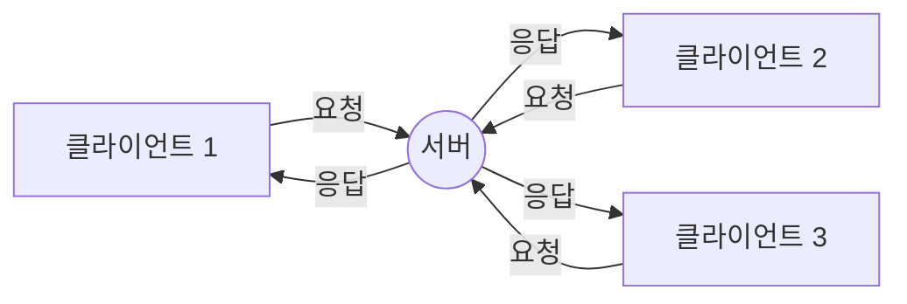
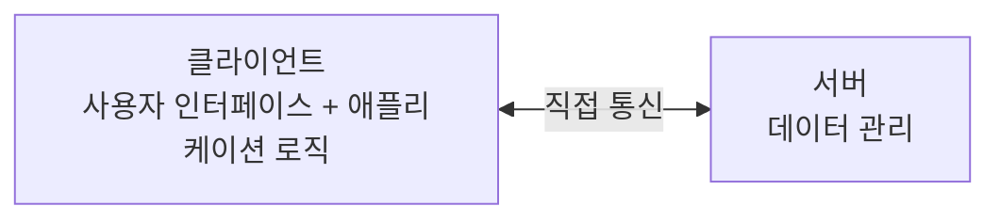
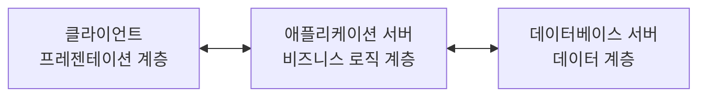

클라이언트-서버 모델은 현대 네트워크 시스템과 웹 애플리케이션의 기본이 되는 분산 애플리케이션 구조입니다. 이 모델은 작업이나 워크로드를 요청하는 측(클라이언트)과 해당 요청을 처리하고 응답을 제공하는 측(서버)으로 나누어 시스템을 설계하는 방식입니다.

## 클라이언트-서버 모델의 기본 구조

클라이언트-서버 모델은 다음 두 가지 주요 구성 요소로 이루어져 있습니다:

1. **클라이언트(Client)**: 서비스를 요청하는 주체입니다. 웹 브라우저, 모바일 앱, 데스크톱 애플리케이션 등이 클라이언트가 될 수 있습니다.
    
2. **서버(Server)**: 클라이언트의 요청을 받아 처리하고, 그 결과를 응답으로 돌려주는 주체입니다. 웹 서버, 데이터베이스 서버, 파일 서버 등 다양한 종류가 있습니다.
    

이 두 구성 요소는 네트워크를 통해 상호작용하며, 명확한 역할 분담을 통해 시스템의 효율성과 확장성을 높입니다.



## 클라이언트-서버 통신 과정

클라이언트와 서버 간의 통신은 다음과 같은 기본 과정을 따릅니다:

1. **연결 수립**: 클라이언트가 서버에 연결을 요청합니다(일반적으로 TCP/IP 프로토콜 사용).
2. **요청 전송**: 클라이언트가 서버에 특정 서비스나 리소스를 요청합니다.
3. **요청 처리**: 서버가 요청을 받아 처리합니다.
4. **응답 반환**: 서버가 처리 결과를 클라이언트에게 응답으로 전송합니다.
5. **연결 종료**: 통신이 완료되면 연결이 종료됩니다(또는 유지됩니다, [[지속 연결]] 참조).

## 클라이언트-서버 모델의 주요 특징

### 1. 역할의 분리

클라이언트와 서버는 각각 독립적인 역할을 수행합니다:

- **클라이언트**: 사용자 인터페이스 제공, 요청 형식화, 응답 데이터 처리 및 표시
- **서버**: 요청 수신 및 검증, 비즈니스 로직 처리, 데이터 관리, 응답 생성

이러한 역할 분리는 시스템의 유지보수와 확장을 용이하게 합니다.

### 2. 집중화된 리소스 관리

서버는 여러 클라이언트가 공유하는 리소스(데이터베이스, 파일 등)를 중앙에서 관리합니다. 이를 통해:

- 리소스 중복을 방지하고 데이터 일관성을 유지할 수 있습니다.
- 보안 정책을 집중적으로 적용할 수 있어 리소스 보호가 용이합니다.
- 리소스 업데이트가 한 곳에서 이루어져 모든 클라이언트에 즉시 반영됩니다.

### 3. 확장성(Scalability)

클라이언트-서버 모델은 높은 확장성을 제공합니다:

- **수평적 확장(Horizontal Scaling)**: 서버의 수를 늘려 부하를 분산시킬 수 있습니다.
- **수직적 확장(Vertical Scaling)**: 서버의 성능을 향상시켜 처리 능력을 증가시킬 수 있습니다.
- **로드 밸런싱(Load Balancing)**: 여러 서버에 요청을 분산하여 시스템 효율성을 높일 수 있습니다.

### 4. 이기종 시스템 지원

클라이언트와 서버는 서로 다른 하드웨어와 소프트웨어 플랫폼에서 운영될 수 있으며, 표준화된 프로토콜(HTTP, FTP 등)을 통해 통신합니다. 이는 다양한 시스템 간의 상호운용성을 가능하게 합니다.

## 클라이언트-서버 아키텍처의 유형

### 1. 2티어 아키텍처(Two-Tier Architecture)

가장 기본적인 형태로, 클라이언트와 서버만으로 구성됩니다.



- **장점**: 구현이 간단하고 빠른 응답 시간
- **단점**: 확장성이 제한되고 유지보수가 어려울 수 있음

### 2. 3티어 아키텍처(Three-Tier Architecture)

클라이언트, 애플리케이션 서버, 데이터베이스 서버로 구성됩니다.



- **장점**: 각 계층이 독립적으로 개발, 관리, 확장될 수 있음
- **단점**: 구현 복잡성 증가

### 3. n티어 아키텍처(N-Tier Architecture)

3티어 이상의 여러 계층으로 구성된 아키텍처입니다. 웹 서버, 캐시 서버, 메시지 큐 등 추가적인 전문화된 서버 계층을 포함할 수 있습니다.

- **장점**: 높은 확장성, 유연성, 내결함성
- **단점**: 복잡성 증가, 관리 어려움, 잠재적 성능 오버헤드

## 클라이언트-서버 모델의 실제 사례

### 1. 웹 애플리케이션

가장 보편적인 클라이언트-서버 모델의 예시입니다:

- **클라이언트**: 웹 브라우저
- **서버**: 웹 서버(Apache, Nginx), 애플리케이션 서버(Tomcat, JBoss), 데이터베이스 서버(MySQL, PostgreSQL)
- **프로토콜**: HTTP/HTTPS

### 2. 이메일 시스템

- **클라이언트**: 이메일 클라이언트(Outlook, Gmail)
- **서버**: 메일 서버(SMTP, POP3, IMAP)

### 3. 파일 공유 시스템

- **클라이언트**: FTP 클라이언트
- **서버**: FTP 서버

## 클라이언트-서버 모델의 장단점

### 장점

1. **집중화된 리소스 관리**: 데이터와 리소스를 중앙에서 관리하여 일관성과 보안성 향상
2. **역할 분리**: 클라이언트와 서버의 책임이 명확하게 구분됨
3. **확장성**: 클라이언트나 서버를 독립적으로 확장할 수 있음
4. **보안성**: 중앙화된 보안 정책 적용 가능
5. **유지보수**: 서버측 업데이트가 모든 클라이언트에 자동으로 적용됨

### 단점

1. **단일 장애점(Single Point of Failure)**: 서버 장애 시 전체 시스템에 영향
2. **네트워크 의존성**: 네트워크 연결이 필수적이며, 연결 문제 시 서비스 이용 불가
3. **서버 과부하**: 동시 접속자 수가 많으면 서버에 부하가 집중될 수 있음
4. **복잡성**: 분산 시스템으로 인한 설계 및 구현의 복잡성 증가
5. **비용**: 서버 인프라 구축 및 유지 비용 발생

## 클라이언트-서버 모델 vs 다른 아키텍처

### 클라이언트-서버 vs [[P2P(Peer-to-Peer)]] 모델

P2P 모델은 모든 참여자가 클라이언트와 서버의 역할을 동시에 수행하는 분산형 아키텍처입니다.

**주요 차이점:**

- 클라이언트-서버: 중앙화된 리소스 관리, 명확한 역할 구분
- P2P: 분산된 리소스 관리, 동등한 참여자, 높은 내결함성

### 클라이언트-서버 vs [[마이크로서비스 아키텍처(Microservice Architecture)]]

마이크로서비스는 애플리케이션을 작고 독립적인 서비스로 분리하는 아키텍처 스타일입니다.

**주요 차이점:**

- 클라이언트-서버: 종종 모놀리식(단일) 서버 애플리케이션
- 마이크로서비스: 작고 독립적인 여러 서비스로 분할된 서버 측 구현

## 클라이언트-서버 모델의 발전과 미래

### 현대적 발전

1. **클라우드 컴퓨팅**: 서버 인프라를 클라우드로 이동하여 확장성과 유연성 향상
2. **컨테이너화**: Docker 등의 기술을 통한 서버 애플리케이션 배포 간소화
3. **서버리스 컴퓨팅**: 서버 관리 없이 코드 실행(AWS Lambda, Azure Functions 등)
4. **에지 컴퓨팅**: 클라이언트에 더 가까운 위치에서 서버 기능 일부 수행

### 미래 전망

1. **분산화 증가**: 블록체인과 같은 기술을 통한 일부 중앙화된 기능의 분산화
2. **인공지능 통합**: 서버와 클라이언트 모두에 AI 기능 내장
3. **실시간 통신 발전**: WebSocket, gRPC 등의 기술을 통한 양방향 실시간 통신 증가
4. **보안 강화**: 제로 트러스트 아키텍처와 같은 고급 보안 접근 방식 적용

## 스프링 프레임워크에서의 클라이언트-서버 모델

스프링 프레임워크는 Java 기반의 애플리케이션 개발을 위한 강력한 프레임워크로, 클라이언트-서버 아키텍처를 쉽게 구현할 수 있는 다양한 기능을 제공합니다.

### RESTful 웹 서비스 구현 예시

```java
import org.springframework.boot.SpringApplication;
import org.springframework.boot.autoconfigure.SpringBootApplication;
import org.springframework.web.bind.annotation.*;

@SpringBootApplication
@RestController
@RequestMapping("/api")
public class SimpleRestServer {

    public static void main(String[] args) {
        SpringApplication.run(SimpleRestServer.class, args);
    }
    
    @GetMapping("/hello")
    public String hello(@RequestParam(value = "name", defaultValue = "World") String name) {
        return String.format("Hello, %s!", name);
    }
    
    @PostMapping("/echo")
    public String echo(@RequestBody String message) {
        return "서버 응답: " + message;
    }
}
```

### 스프링 RestTemplate을 이용한 클라이언트 구현

```java
import org.springframework.boot.CommandLineRunner;
import org.springframework.boot.SpringApplication;
import org.springframework.boot.autoconfigure.SpringBootApplication;
import org.springframework.web.client.RestTemplate;

@SpringBootApplication
public class SimpleRestClient implements CommandLineRunner {

    public static void main(String[] args) {
        SpringApplication.run(SimpleRestClient.class, args);
    }

    @Override
    public void run(String... args) {
        RestTemplate restTemplate = new RestTemplate();
        
        // GET 요청 예시
        String getResponse = restTemplate.getForObject(
            "http://localhost:8080/api/hello?name=Client", String.class);
        System.out.println("GET 응답: " + getResponse);
        
        // POST 요청 예시
        String postResponse = restTemplate.postForObject(
            "http://localhost:8080/api/echo", "Hello from RestTemplate!", String.class);
        System.out.println("POST 응답: " + postResponse);
    }
}
```

## 결론

클라이언트-서버 모델은 네트워크 애플리케이션 개발의 기본 구조로, 명확한 역할 분리와 리소스의 중앙화된 관리를 통해 효율적인 시스템 구축을 가능하게 합니다. 웹 애플리케이션, 이메일, 파일 공유 등 현대 인터넷의 핵심 서비스들이 이 모델을 기반으로 동작하고 있습니다.

클라이언트-서버 아키텍처는 기술의 발전과 함께 계속 진화하고 있으며, 클라우드 컴퓨팅, 마이크로서비스, 서버리스 아키텍처 등 현대적인 접근 방식을 통해 더욱 확장성 있고 유연한 시스템을 구축할 수 있게 되었습니다.

시스템을 설계할 때는 요구사항과 상황에 맞게 적절한 클라이언트-서버 아키텍처 유형을 선택하고, 장단점을 고려하여 최적의 구조를 결정하는 것이 중요합니다.

## 참고 자료

- "분산 시스템: 원리와 패러다임" - Andrew S. Tanenbaum, Maarten Van Steen
- "HTTP: The Definitive Guide" - David Gourley, Brian Totty
- 스프링 공식 문서(https://spring.io/guides)
- "Java Network Programming" - Elliotte Rusty Harold