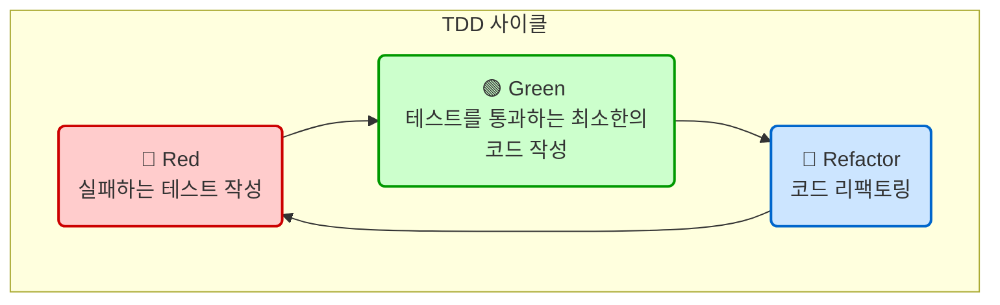

"코드를 작성하기 전에 실패하는 테스트부터 만들라."

이 한 문장은 **테스트 주도 개발(Test-Driven Development, TDD)**의 핵심 철학을 관통합니다. TDD는 단순히 테스트를 먼저 작성하는 행위를 넘어, **테스트가 개발 과정을 주도하는** 소프트웨어 개발 방법론입니다. 즉, 우리가 무엇을 만들어야 하는지, 그리고 그 기능이 완성되었는지를 테스트 코드를 통해 정의하고 검증하며 개발을 진행하는 방식입니다.

이는 전통적인 개발 방식(구현 → 테스트)의 패러다임을 완전히 뒤집는 접근법입니다. TDD는 코드의 안정성을 확보하는 동시에, 더 깔끔하고 유지보수하기 쉬운 설계를 이끌어내는 강력한 도구로 평가받습니다.

---

### TDD의 핵심 사이클: Red-Green-Refactor

TDD는 아주 짧고 명료한 주기를 반복하며 진행됩니다. 이 주기는 신호등의 색깔에 비유하여 'Red-Green-Refactor'라고 불립니다.



1. **🔴 Red - 실패하는 테스트 작성**: 가장 먼저, 새로 구현하고자 하는 기능에 대한 **실패하는 [[단위 테스트(Unit Test)]]**를 작성합니다. 아직 실제 기능 코드가 없기 때문에 이 테스트는 당연히 실패해야 합니다(컴파일 오류도 실패에 해당). 이 단계의 목적은 **'무엇을 만들어야 하는지'**를 명확하게 정의하는 것입니다.
    
2. **🟢 Green - 테스트 통과**: 이제 실패하는 테스트를 통과시킬 수 있는 **가장 단순하고 최소한의 코드**를 작성합니다. 비효율적이거나 지저분한 코드라도 괜찮습니다. 이 단계의 유일한 목표는 오직 '테스트를 통과시켜 녹색 불을 보는 것'입니다. 이를 통해 현재 요구사항을 만족하는 최소한의 기능이 동작함을 보장합니다.
    
3. **🔵 Refactor - 리팩토링**: 테스트가 통과하는 안정적인 상태(Green)에서 코드의 구조를 개선합니다. 중복을 제거하고, 가독성을 높이며, 더 나은 설계로 코드를 다듬습니다. 이 과정 내내 이전에 작성한 테스트는 계속해서 통과해야 합니다. 이를 통해 **기능적 변화 없이** 코드의 품질을 안전하게 향상시킬 수 있습니다.
    

이 짧은 주기를 계속해서 반복하면서 소프트웨어는 점진적으로 성장하게 됩니다. 새로운 기능이 필요하면 다시 'Red' 단계부터 시작하면 됩니다.

---

### TDD를 통한 개발 예시 (Java)

간단한 '덧셈 계산기' 기능을 TDD로 개발하는 과정을 살펴보겠습니다.

#### 1단계: Red - 실패하는 테스트 작성

`add`라는 메서드가 두 숫자를 더한 결과를 반환하는 기능을 원합니다. 먼저 이 기능에 대한 테스트부터 작성합니다.

```java
// CalculatorTest.java
import org.junit.jupiter.api.Test;
import static org.junit.jupiter.api.Assertions.assertEquals;

class CalculatorTest {
    @Test
    void 두_숫자를_더한다() {
        Calculator calculator = new Calculator(); // Calculator 클래스는 아직 없음 (컴파일 에러)
        int result = calculator.add(2, 3);
        assertEquals(5, result); // 2 + 3은 5가 되어야 함
    }
}
```

`Calculator` 클래스와 `add` 메서드가 아직 없으므로 이 코드는 컴파일조차 되지 않습니다. 이것이 바로 'Red' 상태입니다.

#### 2단계: Green - 테스트 통과

이제 테스트를 통과시키기 위한 최소한의 코드를 작성합니다.

```java
// Calculator.java
public class Calculator {
    public int add(int a, int b) {
        // 일단 테스트를 통과시키기 위해 하드코딩
        return 5;
    }
}
```

이제 `CalculatorTest`를 실행하면 `assertEquals(5, 5)`가 되어 테스트가 성공적으로 통과합니다. 가장 빠른 길로 'Green' 상태에 도달했습니다.

#### 3단계: Refactor - 리팩토링

현재 `add` 메서드는 오직 `2+3`의 경우에만 동작하는 엉터리 코드입니다. 하지만 테스트 케이스가 하나뿐이라 리팩토링의 필요성을 느끼기 어렵습니다. 더 나은 구현으로 개선하기 위해 새로운 테스트 케이스를 추가하며 코드를 일반화합니다. (이 과정은 사실상 다음 'Red' 단계로 넘어가는 것과 같습니다.)

**다시 Red:** 새로운 실패 케이스 추가

```java
// CalculatorTest.java에 추가
@Test
void 다른_두_숫자를_더한다() {
    Calculator calculator = new Calculator();
    int result = calculator.add(1, 7);
    assertEquals(8, result); // 1 + 7 = 8을 기대하지만, 현재 코드는 5를 반환하므로 실패
}
```

**다시 Green:** 두 번째 테스트까지 통과하도록 코드 수정

```java
// Calculator.java
public class Calculator {
    public int add(int a, int b) {
        // 이제야 올바른 로직으로 구현
        return a + b;
    }
}
```

이제 두 테스트(`add(2,3)`, `add(1,7)`)가 모두 통과합니다. 현재 코드는 더 이상 개선할 중복이나 비효율이 없으므로 리팩토링 단계는 넘어갈 수 있습니다. 이처럼 TDD는 작은 보폭으로 점진적으로 코드를 완성해나가는 과정입니다.

---

### TDD가 주는 이점

- **[[상세 설계(저수준 설계)]] 개선 효과**: 테스트를 먼저 작성하려면 코드의 인터페이스와 역할을 먼저 고민해야 합니다. 이는 자연스럽게 결합도(Coupling)는 낮고 응집도(Cohesion)는 높은, 즉 테스트하기 쉬운 구조로 설계를 유도합니다.
- **회귀 오류 방지**: 탄탄하게 구축된 테스트 스위트는 새로운 기능을 추가하거나 기존 코드를 [[리팩토링(Refactoring)]]할 때, 의도치 않게 기존 기능이 망가지는 회귀(Regression) 현상을 즉시 발견하고 막아주는 안전망 역할을 합니다.
- **개발 집중도 향상**: 'Red' 단계에서 만들어야 할 기능의 목표가 명확해지고, 'Green' 단계에서는 그 목표 달성에만 집중할 수 있어 개발의 리듬감과 생산성을 높여줍니다.
- **살아있는 문서**: TDD를 통해 작성된 테스트 코드는 그 자체로 시스템의 기능과 동작 방식을 설명하는 가장 정확하고 항상 최신 상태를 유지하는 문서가 됩니다.

---

### TDD에 대한 오해와 도전 과제

- **"개발 시간이 두 배로 걸리지 않나요?"**: TDD에 익숙해지는 초기에는 시간이 더 걸리는 것처럼 느껴질 수 있습니다. 하지만 장기적으로는 디버깅 시간의 단축, 재작업 감소, 유지보수 용이성 증가로 인해 전체 개발 비용을 오히려 줄여주는 효과가 있습니다.
- **"무엇을 테스트해야 할지 막막해요"**: T_D_D는 경험과 훈련이 필요한 기술입니다. 처음에는 간단하고 명확한 요구사항부터 시작하여 점진적으로 적용 범위를 넓혀가는 것이 좋습니다.
- **"모든 것을 TDD로 만들어야 하나요?"**: TDD가 만병통치약은 아닙니다. 사용자 인터페이스(UI)나 예측 불가능한 외부 요인에 크게 의존하는 코드 등, TDD가 비효율적인 영역도 분명히 존재합니다. TDD 적용 전략을 통해 프로젝트의 핵심 로직이나 비즈니스 규칙처럼 안정성이 중요한 부분에 우선적으로 적용하는 지혜가 필요합니다.

---

### 결론

테스트 주도 개발(TDD)은 단순히 테스트 커버리지를 높이는 활동이 아닙니다. 실패하는 테스트를 통해 요구사항을 명확히 하고, 최소한의 코드로 빠르게 구현한 뒤, 테스트의 보호 아래 안전하게 설계를 개선해나가는 **지속 가능한 소프트웨어 개발 철학이자 기술**입니다. TDD 사이클을 통해 개발자는 코드에 대한 자신감을 얻고, 끊임없이 변화하는 요구사항에 유연하게 대처할 수 있는 견고한 소프트웨어를 점진적으로 완성해나갈 수 있습니다.

---

### 참고 자료

- Test Driven Development: By Example - Kent Beck
- Martin Fowler - TestDrivenDevelopment
- The Three Laws of TDD - Uncle Bob (Robert C. Martin)