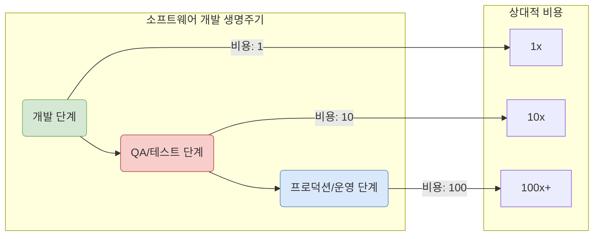

"일단 기능부터 만들고, 테스트는 나중에..."

많은 개발 프로젝트에서 흔히 들을 수 있는 말입니다. 촉박한 일정과 리소스 부족 속에서 테스트 코드 작성은 종종 뒷전으로 밀려나곤 합니다. 하지만 이러한 결정이 당장은 시간을 버는 것처럼 보여도, 장기적으로는 훨씬 더 큰 [[기술 부채(Technical Debt)]]가 되어 돌아온다는 사실을 우리는 경험으로 알고 있습니다.

이 글에서는 왜 "테스트는 미래에 발생할 수 있는 더 큰 비용과 시간을 절약해 주는 가장 확실한 보험"이라는 말이 단순한 비유가 아닌, 경제적이고 논리적인 사실인지에 대해 자세히 살펴보겠습니다.

---

### 버그 수정 비용의 비밀: 1-10-100 규칙

소프트웨어 공학에는 **"1-10-100 규칙"** 이라는 유명한 원칙이 있습니다. 이는 버그를 발견하고 수정하는 데 드는 비용이 개발 수명 주기의 어느 단계에서 발견되느냐에 따라 기하급수적으로 증가한다는 것을 의미합니다.

코드 스니펫

1. **개발 단계에서의 발견 (비용: 1)**
    
    - 개발자가 코드를 작성하는 즉시 [[단위 테스트(Unit Test)]]를 통해 버그를 발견하는 경우입니다.
    - 개발자는 방금 작성한 코드의 맥락을 완벽하게 이해하고 있으므로, 즉시 원인을 파악하고 몇 분 안에 수정할 수 있습니다. **비용이 가장 저렴한 단계**입니다.
2. **QA/테스트 단계에서의 발견 (비용: 10)**
    
    - 개발이 완료되고 통합된 후, QA 팀에 의해 버그가 발견되는 경우입니다.
    - 이제는 버그 리포트를 작성하고, 담당 개발자를 할당하며, 개발자는 다시 해당 코드의 맥락을 파악해야 합니다. 수정 후에는 다시 빌드하고 배포하여 QA 팀이 재확인하는 과정이 필요합니다. **비용과 시간이 눈에 띄게 증가**합니다.
3. **프로덕션/운영 단계에서의 발견 (비용: 100+)**
    
    - 제품이 사용자에게 출시된 후 버그가 발견되는 최악의 경우입니다.
    - 이 단계의 비용은 단순히 코드 수정에 그치지 않습니다.
        - **고객 지원 비용**: 고객 불만 접수 및 응대
        - **긴급 대응 비용**: 원인 분석을 위한 로그 확인, 긴급 핫픽스 배포
        - **기회비용**: 개발팀이 새로운 가치를 창출하는 대신 버그 수정에 매달려야 함
        - **브랜드 신뢰도 하락**: 장애로 인한 고객 이탈, 기업 이미지 손상 등 측정하기 어려운 손실까지 발생합니다.

이처럼, 테스트는 버그를 가능한 한 왼쪽(개발 단계)에서 잡도록 하여, 오른쪽(운영 단계)으로 갈수록 눈덩이처럼 불어나는 **막대한 비용을 근본적으로 차단하는 역할**을 합니다.

---

### 테스트가 미래의 시간을 절약해주는 방법

비용뿐만 아니라 시간의 관점에서도 테스트는 강력한 레버리지 효과를 가집니다.

#### 1. 자신감 있는 리팩토링과 기능 확장

잘 짜인 테스트 코드는 시스템의 특정 부분이 어떻게 동작해야 하는지를 정의하는 '실행 가능한 명세서'입니다. 이 '안전망'이 있다면, 개발자는 기존 코드를 개선하는 [[리팩토링(Refactoring)]]을 하거나 새로운 기능을 추가할 때 매우 자신감 있게 작업할 수 있습니다. "이 코드를 고쳤더니 다른 기능이 죽었어요"와 같은 회귀 버그(Regression Bug)에 대한 두려움 없이, 과감하고 빠른 개선이 가능해집니다.

테스트가 없다면, 작은 변경 하나에도 애플리케이션 전체를 수동으로 다시 점검해야 하는 엄청난 시간 낭비가 발생합니다.

#### 2. 명확한 커뮤니케이션과 문서화

새로운 프로젝트에 투입되거나 다른 동료의 코드를 수정해야 하는 상황을 상상해 보십시오. 코드를 이해하기 위해 수많은 문서를 읽고, 심지어는 원작자에게 물어봐야 하는 경우가 많습니다.

하지만 잘 작성된 테스트 코드는 그 자체로 훌륭한 문서가 됩니다.

- 이 함수는 어떤 파라미터를 받아서 어떤 결과를 반환해야 하는가?
- 이 클래스는 어떤 의존성을 가지고 어떻게 상호작용하는가?
- 엣지 케이스(Edge Case)는 어떻게 처리되는가?

이 모든 정보가 테스트 케이스에 명확히 드러나므로, 코드를 이해하는 데 드는 시간을 극적으로 단축시켜 줍니다.

#### 3. 디버깅 시간의 단축

운영 환경에서 "주문이 정상적으로 처리되지 않아요"라는 막연한 보고가 들어왔다고 가정해 보겠습니다. 테스트가 없다면, 개발자는 어디서부터 잘못되었는지 파악하기 위해 수많은 로그를 뒤지고 전체 시스템을 훑어야 합니다.

반면, 세분화된 테스트가 있다면 문제의 범위를 훨씬 빠르게 좁힐 수 있습니다. 예를 들어, `OrderService` 단위 테스트는 통과하지만 `PaymentGateway`와의 통합 테스트에서 실패한다면, 개발자가 두 시스템의 연동 부분에 있음을 즉시 알 수 있습니다. 이는 망망대해에서 맨손으로 바늘을 찾는 것과, 금속 탐지기를 들고 찾는 것의 차이와 같습니다.

---

## 결론: 오늘 가입하는 미래를 위한 보험

테스트 코드 작성은 당장의 개발 시간을 일부 사용하는 '비용'이 맞습니다. 하지만 이는 사라지는 돈이 아니라, 미래에 10배, 100배의 가치로 돌아올 것이 확실한 **'투자'이자 '보험'** 입니다.

자동차 보험에 가입하는 이유는 사고가 나지 않을 것이라 믿어서가 아니라, 만에 하나 사고가 났을 때 감당할 수 없는 피해를 막기 위함입니다. 소프트웨어 테스트도 마찬가지입니다. 버그는 필연적으로 발생하며, 테스트는 그 버그가 초래할 최악의 상황으로부터 우리의 프로젝트, 우리의 비즈니스, 그리고 우리 자신을 지켜주는 가장 효과적이고 경제적인 방법입니다.

오늘 작성하는 하나의 테스트 케이스가, 1년 뒤 주말 밤에 발생할 긴급 장애를 막아줄 수 있습니다.

---

### 참고 자료

- _Code Complete, 2nd Edition_ - Steve McConnell
- _Shift Left: The Ultimate Guide To A Successful Testing Strategy_ - [https://www.tricentis.com/learn/what-is-shift-left-testing](https://www.google.com/search?q=https://www.tricentis.com/learn/what-is-shift-left-testing)
- IBM - The cost of fixing defects - [https://www.ibm.com/docs/en/dsm?topic=overview-cost-fixing-defects](https://www.google.com/search?q=https://www.ibm.com/docs/en/dsm%3Ftopic%3Doverview-cost-fixing-defects)