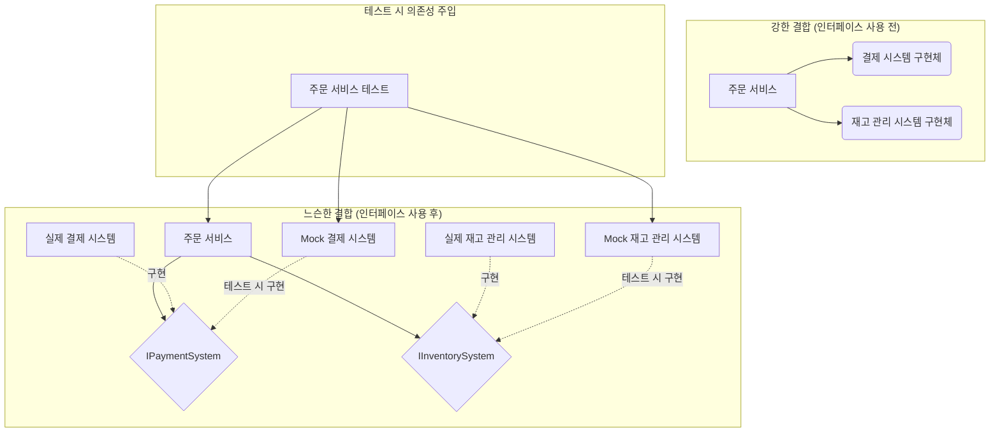

소프트웨어 개발에서 **테스트**는 선택이 아닌 필수입니다. 특히 복잡성이 증가하는 현대 애플리케이션 환경에서 테스트 용이성은 프로젝트의 성공과 직결되는 중요한 요소입니다. 이번 글에서는 테스트 용이성을 높이는 핵심 전략 중 하나인 **테스트를 위한 인터페이스 설계**에 대해 알아보겠습니다. 잘 설계된 인터페이스는 코드의 유연성을 높이고, 단위 테스트 작성을 용이하게 만들어 결과적으로 더 견고하고 유지보수하기 쉬운 소프트웨어를 만드는 데 기여합니다.

---

## 왜 인터페이스가 테스트에 중요할까요?

애플리케이션의 각 컴포넌트(클래스 또는 모듈)가 서로 긴밀하게 연결되어 있다면, 특정 컴포넌트만 독립적으로 테스트하기 매우 어렵습니다. 이를 강한 결합(Tight Coupling)이라고 합니다. 인터페이스는 이러한 강한 결합을 느슨하게 만드는 강력한 도구입니다.

인터페이스를 사용하면 컴포넌트는 구체적인 구현 클래스가 아닌 추상화된 인터페이스에 의존하게 됩니다. 이를 통해 실제 구현 객체 대신 [[테스트 더블(Test Double)]](예: Mock 객체)을 쉽게 주입할 수 있게 되어, 특정 로직을 격리된 환경에서 테스트하는 것이 가능해집니다.

이것이 바로 [[의존성 역전 원칙 (Dependency Inversion Principle)]]의 핵심 아이디어 중 하나이며, 테스트 용이성 향상의 기본 전제가 됩니다.




위 그림은 인터페이스 도입 전후의 의존성 관계 변화를 보여줍니다. 인터페이스를 사용하면, `주문 서비스`는 `IPaymentSystem`과 `IInventorySystem` 인터페이스에 의존하게 됩니다. 따라서 테스트 시에는 이 인터페이스들의 실제 구현 대신 `Mock 결제 시스템`이나 `Mock 재고 관리 시스템`과 같은 테스트 대역을 주입하여 `주문 서비스`의 로직만을 독립적으로 검증할 수 있습니다.

---

## 테스트를 고려한 인터페이스 설계 원칙

테스트 용이성을 극대화하는 인터페이스를 설계하기 위한 몇 가지 핵심 원칙이 있습니다. 이러한 원칙들은 [[SOLID 원칙]]과도 깊은 관련이 있습니다.

### 1. 역할과 책임에 집중 (단일 책임 원칙)

인터페이스는 명확하고 단일한 역할을 가져야 합니다. 너무 많은 기능을 하나의 인터페이스에 담으면, 해당 인터페이스를 구현하는 클래스가 불필요하게 커지고 테스트 범위도 넓어집니다. 이는 [[단일 책임 원칙(Single Responsibility Principle)]]을 따르는 것입니다.

- **나쁜 예**: `IUserService` 인터페이스에 사용자 인증, 프로필 관리, 주문 내역 조회 등 관련성이 적거나 하나의 주된 책임으로 보기 어려운 기능들이 모두 포함된 경우입니다.
- **좋은 예**: `IAuthenticationService`, `IUserProfileService`, `IOrderHistoryService` 등으로 역할을 명확히 분리하여 각 인터페이스가 하나의 주된 책임만을 갖도록 하는 것입니다.

### 2. 작은 단위의 인터페이스 (인터페이스 분리 원칙)

클라이언트가 자신이 사용하지 않는 메서드에 의존하지 않도록 인터페이스를 작게 분리해야 합니다. 이는 [[인터페이스 분리 원칙(Interface Segregation Principle)]]입니다. 클라이언트는 자신이 필요로 하는 최소한의 기능만을 정의한 인터페이스를 사용하는 것이 테스트 대역을 만들 때 더 용이하며, 인터페이스 변경으로 인한 파급 효과도 줄일 수 있습니다.

- 예를 들어, 어떤 클라이언트는 사용자 정보 조회 기능만 필요하고, 다른 클라이언트는 사용자 정보 수정 기능만 필요하다면, `IUserReader`와 `IUserWriter` 인터페이스로 분리하는 것을 고려할 수 있습니다. 인터페이스 분리에 대한 자세한 방법은 인터페이스 분리 원칙 적용 가이드를 참고해주세요.

### 3. 명확한 계약 정의

인터페이스는 해당 인터페이스를 통해 어떤 기능을 제공하고, 어떤 입력값을 받아 어떤 결과(또는 예외)를 반환하는지에 대한 **명확한 계약**을 정의해야 합니다. JavaDoc과 같은 문서 주석 등을 활용하여 각 메서드의 사전 조건(Preconditions), 사후 조건(Postconditions), 불변식(Invariants)을 명시하면, 구현 클래스와 클라이언트 모두 인터페이스를 올바르게 이해하고 사용하는 데 도움이 됩니다. 이는 디자인 바이 컨트랙트(Design by Contract) 개념과 밀접하게 관련되어 있습니다.

### 4. 의존성 주입 용이성

인터페이스는 의존성 주입(Dependency Injection)을 통해 구현체를 외부에서 쉽게 제공받을 수 있도록 설계되어야 합니다. 생성자 주입이나 세터(Setter) 주입 방식을 통해 인터페이스 타입의 의존성을 주입받도록 하면, 운영 환경에서는 실제 구현체를, 테스트 환경에서는 테스트 대역(Mock 객체 등)을 간편하게 주입하여 사용할 수 있습니다.

```java
// 생성자 주입을 통해 IPaymentSystem 인터페이스의 구현체를 주입받는 OrderService
public class OrderService {
    private final IPaymentSystem paymentSystem;
    private final IInventorySystem inventorySystem;

    // 스프링 프레임워크에서는 @Autowired 어노테이션을 생성자에 사용하여 의존성을 자동으로 주입받을 수 있습니다.
    // public OrderService(@Autowired IPaymentSystem paymentSystem, @Autowired IInventorySystem inventorySystem) {
    public OrderService(IPaymentSystem paymentSystem, IInventorySystem inventorySystem) {
        this.paymentSystem = paymentSystem; // 외부에서 구체적인 구현이 아닌 인터페이스 타입으로 주입받습니다.
        this.inventorySystem = inventorySystem;
    }

    public void placeOrder(Order order) {
        // 주문 처리 로직
        // paymentSystem과 inventorySystem은 실제 구현체일 수도 있고, 테스트 시에는 Mock 객체일 수도 있습니다.
        paymentSystem.processPayment(order.getPaymentDetails());
        inventorySystem.updateStock(order.getProductId(), order.getQuantity());
        // ...
    }
}
```

위 코드에서 `OrderService`는 생성자를 통해 `IPaymentSystem`과 `IInventorySystem` 인터페이스의 구현체를 주입받습니다. 이를 통해 `OrderService`는 구체적인 결제 방식이나 재고 관리 방식에 직접 의존하지 않게 됩니다.

### 5. 구현 세부사항 노출 최소화 (정보 은닉)

인터페이스는 "무엇을 하는가(What)"에 집중하고, "어떻게 하는가(How)"는 구현 클래스에 위임해야 합니다. 인터페이스에 구현 세부사항이 노출되면 (예: 특정 기술에 종속적인 메서드 시그니처), 해당 세부사항이 변경될 때 인터페이스 자체와 이를 사용하는 모든 클라이언트 코드가 영향을 받을 수 있습니다. 이는 테스트에도 불필요한 복잡성을 더하며, 인터페이스의 역할을 약화시킵니다. 정보 은닉(Information Hiding) 원칙을 지키는 것이 중요합니다.

---

## Spring 프레임워크에서의 테스트 가능한 인터페이스 설계 예시

스프링 프레임워크는 의존성 주입(DI)과 인터페이스 기반 프로그래밍을 핵심 원칙으로 삼고 있어, 테스트 용이성이 높은 애플리케이션 개발을 자연스럽게 유도합니다.

다음은 스프링 환경에서 주문 처리 서비스의 인터페이스와 구현, 그리고 테스트 코드를 보여주는 예시입니다.

**인터페이스 정의:**

```java
// src/main/java/com/example/myapp/order/OrderService.java
package com.example.myapp.order;

import com.example.myapp.Order; // 주문 정보를 담는 DTO 또는 Entity
import com.example.myapp.PaymentResult; // 결제 결과를 담는 객체

// 주문 처리 서비스의 계약을 정의하는 인터페이스
public interface OrderService {
    PaymentResult processOrder(Order order);
}
```

**구현 클래스:**

```java
// src/main/java/com/example/myapp/order/OrderServiceImpl.java
package com.example.myapp.order;

import com.example.myapp.Order;
import com.example.myapp.PaymentResult;
import com.example.myapp.payment.PaymentGateway; // 외부 결제 시스템 연동을 위한 인터페이스
import com.example.myapp.inventory.InventoryService; // 내부 재고 관리 서비스를 위한 인터페이스

import org.springframework.beans.factory.annotation.Autowired;
import org.springframework.stereotype.Service;

@Service // 이 클래스가 스프링의 서비스 빈(Bean)임을 나타냅니다.
public class OrderServiceImpl implements OrderService {

    private final PaymentGateway paymentGateway;
    private final InventoryService inventoryService;

    // 생성자를 통해 PaymentGateway와 InventoryService 인터페이스의 구현체를 주입받습니다.
    // 스프링이 의존성 주입을 담당합니다.
    @Autowired
    public OrderServiceImpl(PaymentGateway paymentGateway, InventoryService inventoryService) {
        this.paymentGateway = paymentGateway;
        this.inventoryService = inventoryService;
    }

    @Override
    public PaymentResult processOrder(Order order) {
        // 1. 재고 확인 로직 (InventoryService 인터페이스 사용)
        boolean stockAvailable = inventoryService.checkStock(order.getProductId(), order.getQuantity());
        if (!stockAvailable) {
            // 실제로는 사용자 정의 예외를 사용하는 것이 좋습니다.
            throw new RuntimeException("상품 ID '" + order.getProductId() + "'의 재고가 부족합니다.");
        }

        // 2. 결제 시도 로직 (PaymentGateway 인터페이스 사용)
        PaymentResult paymentResult = paymentGateway.attemptPayment(order.getTotalAmount(), order.getPaymentDetails());

        // 3. 결제 성공 시 재고 차감 로직 (InventoryService 인터페이스 사용)
        if (paymentResult.isSuccess()) {
            inventoryService.decreaseStock(order.getProductId(), order.getQuantity());
        } else {
            // 결제 실패 시 로직 (예: 주문 상태 변경 등)
        }

        return paymentResult;
    }
}
```

위 `OrderServiceImpl`은 `PaymentGateway`와 `InventoryService`라는 **다른 인터페이스들**에 의존하고 있습니다. 스프링 컨테이너가 실행될 때 이 인터페이스들의 실제 구현체(스프링 빈으로 등록된)를 주입해줍니다.

**테스트 코드 (JUnit 5와 Mockito 사용):**

```java
// src/test/java/com/example/myapp/order/OrderServiceImplTest.java
package com.example.myapp.order;

import com.example.myapp.Order;
import com.example.myapp.PaymentDetails; // 결제 상세 정보 객체
import com.example.myapp.PaymentResult;
import com.example.myapp.payment.PaymentGateway;
import com.example.myapp.inventory.InventoryService;

import org.junit.jupiter.api.BeforeEach;
import org.junit.jupiter.api.DisplayName;
import org.junit.jupiter.api.Test;
import org.junit.jupiter.api.extension.ExtendWith;
import org.mockito.InjectMocks; // 테스트 대상 클래스에 @Mock으로 생성된 객체들을 주입합니다.
import org.mockito.Mock; // Mock 객체를 생성합니다.
import org.mockito.junit.jupiter.MockitoExtension; // Mockito 기능을 JUnit 5에서 사용하기 위한 확장입니다.

import static org.mockito.Mockito.*; // Mockito의 static 메서드 (when, verify 등)를 사용하기 위함입니다.
import static org.junit.jupiter.api.Assertions.*; // JUnit의 assertions (assertTrue, assertEquals 등)를 사용하기 위함입니다.

@ExtendWith(MockitoExtension.class) // JUnit 5 테스트에서 Mockito 확장을 사용하도록 설정합니다.
class OrderServiceImplTest {

    @Mock // PaymentGateway 인터페이스의 Mock 객체를 생성합니다.
    private PaymentGateway mockPaymentGateway;

    @Mock // InventoryService 인터페이스의 Mock 객체를 생성합니다.
    private InventoryService mockInventoryService;

    @InjectMocks // @Mock으로 선언된 mockPaymentGateway와 mockInventoryService를 orderService 필드에 주입합니다.
    private OrderServiceImpl orderService;

    private Order testOrder;
    private PaymentDetails testPaymentDetails;

    @BeforeEach
    void setUp() {
        // 각 테스트 메서드 실행 전에 공통적으로 사용할 객체들을 초기화합니다.
        testPaymentDetails = new PaymentDetails("1234-5678-9012-3456", "12/25", "789");
        testOrder = new Order("PROD-001", 2, 20000.0, testPaymentDetails); // 상품ID, 수량, 총액, 결제정보
    }

    @Test
    @DisplayName("주문 처리 성공: 재고 확인, 결제 성공, 재고 차감")
    void processOrder_success_whenStockAvailableAndPaymentSucceeds() {
        // given (테스트를 위한 사전 조건 설정)
        // mockInventoryService.checkStock 메서드가 특정 인자로 호출될 때 true를 반환하도록 설정합니다.
        when(mockInventoryService.checkStock("PROD-001", 2)).thenReturn(true);
        // mockPaymentGateway.attemptPayment 메서드가 특정 인자로 호출될 때 성공 결과를 담은 PaymentResult 객체를 반환하도록 설정합니다.
        when(mockPaymentGateway.attemptPayment(20000.0, testPaymentDetails))
                .thenReturn(new PaymentResult(true, "PAYMENT_SUCCESS_ID_001"));

        // when (테스트하려는 실제 동작 실행)
        PaymentResult result = orderService.processOrder(testOrder);

        // then (실행 결과 검증)
        assertNotNull(result);
        assertTrue(result.isSuccess());
        assertEquals("PAYMENT_SUCCESS_ID_001", result.getTransactionId());

        // verify: 특정 메서드가 예상된 횟수만큼 호출되었는지 검증합니다.
        verify(mockInventoryService, times(1)).checkStock("PROD-001", 2);
        verify(mockPaymentGateway, times(1)).attemptPayment(20000.0, testPaymentDetails);
        verify(mockInventoryService, times(1)).decreaseStock("PROD-001", 2); // 재고 차감 메서드 호출 검증
    }

    @Test
    @DisplayName("주문 처리 실패: 재고 부족")
    void processOrder_fail_whenStockNotAvailable() {
        // given
        // 재고가 없는 상황을 가정합니다.
        when(mockInventoryService.checkStock("PROD-001", 2)).thenReturn(false);

        // when & then
        // 예외가 발생하는지, 그리고 그 예외 메시지가 예상과 같은지 검증합니다.
        RuntimeException exception = assertThrows(RuntimeException.class, () -> {
            orderService.processOrder(testOrder);
        });
        assertEquals("상품 ID 'PROD-001'의 재고가 부족합니다.", exception.getMessage());

        // 재고 부족 시 결제 시도나 재고 차감 로직이 실행되지 않아야 합니다.
        verify(mockPaymentGateway, never()).attemptPayment(anyDouble(), any(PaymentDetails.class));
        verify(mockInventoryService, never()).decreaseStock(anyString(), anyInt());
    }
}
```

위 테스트 코드에서 `OrderServiceImplTest`는 `OrderServiceImpl`의 핵심 로직만을 격리하여 테스트합니다. `@Mock` 어노테이션을 사용하여 `PaymentGateway`와 `InventoryService`의 실제 구현 대신 테스트 대역(Mock 객체)을 생성하고, `@InjectMocks` 어노테이션을 통해 이 Mock 객체들을 테스트 대상인 `orderService` 인스턴스에 주입합니다.

이처럼 인터페이스를 통해 의존성을 분리함으로써, `PaymentGateway`의 실제 외부 결제 시스템 연동 로직이나 `InventoryService`의 데이터베이스 접근 로직 없이도 `OrderService`의 비즈니스 로직(예: 재고 확인 -> 결제 시도 -> 결제 성공 시 재고 차감)이 올바르게 동작하는지를 독립적으로, 빠르고, 안정적으로 테스트할 수 있게 됩니다.

---

## 테스트를 저해하는 인터페이스 설계 피하기

올바른 인터페이스 설계는 테스트 용이성을 높이지만, 잘못된 설계는 오히려 테스트를 어렵게 만들 수 있습니다. 주의해야 할 몇 가지 [[테스트를 저해하는 인터페이스 안티패턴]]이 존재합니다. 예를 들어, 하나의 인터페이스가 너무 많은 책임을 갖는 경우(소위 "God Interface"), 또는 인터페이스가 지나치게 구현 세부사항에 의존적인 경우 테스트 작성이 복잡해지고 유지보수가 어려워집니다.

---

## 결론: 테스트 가능한 인터페이스는 모두를 위한 투자입니다 🎉

테스트를 염두에 둔 인터페이스 설계는 단순히 테스트 코드 작성을 쉽게 만드는 것 이상의 가치를 제공합니다. 이는 코드의 **모듈성**, **유연성**, **유지보수성**을 향상시키는 핵심적인 실천 방법입니다.

- **모듈성 향상**: 각 컴포넌트가 명확한 인터페이스를 통해 상호작용하므로, 시스템 전체의 구조가 명확해지고 개별 모듈의 독립적인 개발 및 개선이 용이해집니다.
- **유연성 증대**: 인터페이스를 사용하면 새로운 기능을 제공하는 구현체를 쉽게 추가하거나 기존 구현체를 다른 방식으로 교체할 수 있습니다. 이는 기능 확장이나 기술 스택 변경에 유연하게 대응할 수 있게 합니다.
- **유지보수성 개선**: 잘 정의된 인터페이스는 코드의 의도를 명확히 드러내고, 변경이 발생했을 때 그 파급 효과를 해당 인터페이스와 그 구현체로 제한하여 유지보수를 용이하게 만듭니다.

결국, 테스트 가능한 인터페이스를 설계하는 것은 당장의 테스트 편의성을 넘어, 장기적으로 더 건강하고 발전 가능한 소프트웨어 시스템을 구축하기 위한 중요한 투자입니다. 처음에는 인터페이스를 정의하고 분리하는 과정이 다소 번거롭게 느껴질 수 있지만, 이러한 노력은 프로젝트의 생명주기 전체에 걸쳐 큰 이점으로 돌아올 것입니다. 👍

---

## 참고 자료

- Martin, R. C. (2008). _Clean Code: A Handbook of Agile Software Craftsmanship_. Prentice Hall.
- Fowler, M. (2004). _Refactoring: Improving the Design of Existing Code_. Addison-Wesley.
- Meszaros, G. (2007). _xUnit Test Patterns: Refactoring Test Code_. Addison-Wesley.
- Spring Framework Documentation: [https://docs.spring.io/spring-framework/docs/current/reference/html/](https://docs.spring.io/spring-framework/docs/current/reference/html/)
- Mockito Documentation: [https://site.mockito.org/](https://site.mockito.org/)
- Baeldung - Introduction to Mockito: [https://www.baeldung.com/mockito-core-tutorial](https://www.google.com/search?q=https://www.baeldung.com/mockito-core-tutorial)