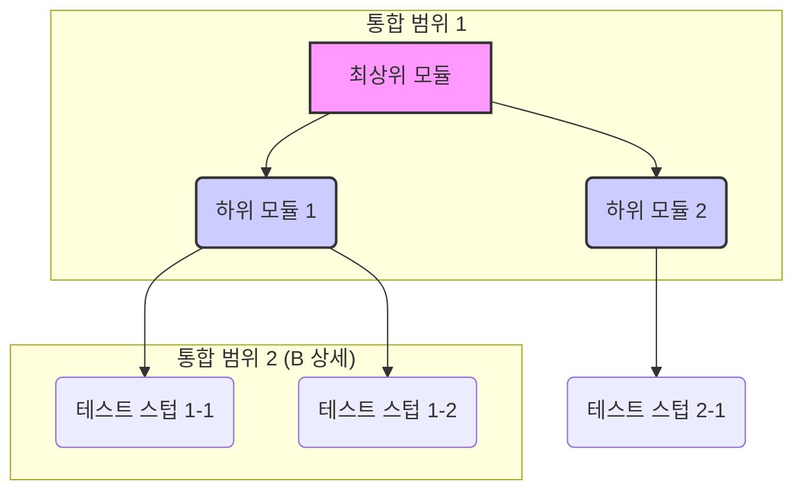

소프트웨어를 개발할 때, 우리가 작성한 코드가 다른 코드와 잘 어우러져 작동하는지 확인하는 과정은 매우 중요합니다. 아무리 개별적으로 잘 만들어진 부품이라도, 막상 조립했을 때 제대로 동작하지 않는다면 아무 소용이 없겠죠. **통합 테스트(Integration Test)**는 바로 이 '조립' 과정에 해당하는 테스트입니다.

통합 테스트는 여러 개의 **개별 단위(Unit) 모듈**을 함께 묶어, 이들의 **상호작용**에 발생하는 결함을 찾아내는 것을 목표로 합니다. [[단위 테스트(Unit Test)]]가 개별 부품의 기능을 검증하는 단계라면, 통합 테스트는 이 부품들이 모여 하나의 완성된 기능을 올바르게 수행하는지 확인하는 단계라고 할 수 있습니다.

소프트웨어의 규모가 커지고 복잡해질수록 통합 테스트의 중요성은 더욱 커집니다. 모듈 간의 데이터 형식 불일치, 예상치 못한 API 호출 방식, 외부 시스템 연동 오류 등 단위 테스트만으로는 발견하기 어려운 문제들을 이 단계에서 찾아낼 수 있기 때문입니다.

이를 [[테스트 피라미드(Test Pyramid)]]에 빗대어 보면, 통합 테스트는 단위 테스트의 상위 계층에 위치하며, 시스템 전체를 검증하는 [[E2E(End-to-End) 테스트]]의 기반이 됩니다.

---

### 통합 테스트의 종류와 전략

통합 테스트는 모듈을 통합하는 방식과 순서에 따라 여러 전략으로 나뉩니다. 어떤 전략을 선택하느냐에 따라 테스트의 효율성과 효과가 달라질 수 있습니다.

주요 전략에 대한 자세한 내용은 [[통합 테스트의 다양한 접근 방식]]노트에서 확인해주세요. 대표적인 전략들은 다음과 같습니다.

1. **빅뱅(Big Bang) 접근법**: 모든 모듈을 한 번에 통합하여 테스트하는 가장 간단한 방법입니다.
2. **상향식(Bottom-up) 접근법**: 가장 낮은 수준의 모듈부터 시작하여 점차 상위 모듈과 통합하며 테스트를 진행합니다.
3. **하향식(Top-down) 접근법**: 최상위 모듈부터 시작하여 점차 하위 모듈과 통합하며 테스트를 진행합니다.
4. **샌드위치(Sandwich) 접근법**: 상향식과 하향식 접근법을 결합한 방식으로, 중간 계층에서부터 통합을 시작하여 위아래로 확장해 나갑니다.

각 전략은 장단점이 명확하므로, 프로젝트의 특성과 상황에 맞는 전략을 선택하는 것이 중요합니다. 예를 들어, 하향식 접근법의 테스트 흐름은 다음과 같이 시각화할 수 있습니다.



위 그림처럼 하향식 테스트에서는 아직 개발되지 않은 하위 모듈의 기능을 흉내 내는 [[테스트 스텁(Test Stub)]]을 사용하여 상위 모듈의 로직을 먼저 검증할 수 있습니다.

---

### 통합 테스트의 대상

통합 테스트는 "어디부터 어디까지"를 통합의 범위로 볼 것인지에 따라 다양한 레벨에서 수행될 수 있습니다. 일반적으로 다음과 같은 상호작용 지점들이 주요 테스트 대상이 됩니다.

- **서비스와 레포지토리(Repository) 계층 간의 연동**: 서비스 로직이 데이터베이스에 정확한 쿼리를 보내고, 원하는 데이터를 올바르게 주고받는지 확인합니다.
- **컨트롤러(Controller)와 서비스(Service) 계층 간의 연동**: 사용자의 HTTP 요청이 컨트롤러를 통해 서비스 로직으로 잘 전달되고, 처리 결과가 의도한 대로 응답되는지 검증합니다.
- **외부 API와의 연동**: 외부 시스템의 API를 호출하고 응답을 받아 처리하는 부분이 정상적으로 동작하는지 확인합니다.
- **메시지 큐(Message Queue) 연동**: 메시지를 발행(Publish)하고 구독(Subscribe)하는 모듈 간의 비동기적 상호작용이 올바르게 이루어지는지 테스트합니다.

---

### 스프링(Spring) 환경에서의 통합 테스트 예시

스프링 프레임워크에서는 통합 테스트를 효율적으로 작성할 수 있도록 강력한 지원을 제공합니다. `@SpringBootTest` 어노테이션을 사용하면 실제 애플리케이션과 거의 동일한 환경에서 테스트를 진행할 수 있습니다.

예를 들어, 사용자 정보를 저장하는 `UserService`와 데이터베이스에 접근하는 `UserRepository` 간의 통합을 테스트하는 코드는 다음과 같이 작성할 수 있습니다.

```java
// UserService.java
@Service
public class UserService {
    private final UserRepository userRepository;

    public UserService(UserRepository userRepository) {
        this.userRepository = userRepository;
    }

    public User join(String username) {
        if (userRepository.findByUsername(username).isPresent()) {
            throw new IllegalStateException("이미 존재하는 회원입니다.");
        }
        User user = new User(username);
        return userRepository.save(user);
    }
}

// UserServiceIntegrationTest.java
@SpringBootTest
@Transactional // 테스트 후 롤백을 위해 사용
class UserServiceIntegrationTest {

    @Autowired
    private UserService userService;

    @Autowired
    private UserRepository userRepository;

    @Test
    void 회원가입_성공() {
        // given
        String username = "testuser";

        // when
        User savedUser = userService.join(username);

        // then
        assertNotNull(savedUser.getId());
        assertEquals(username, savedUser.getUsername());
    }

    @Test
    void 중복_회원_예외_발생() {
        // given
        String username = "duplicateUser";
        userRepository.save(new User(username)); // 미리 같은 이름의 사용자를 저장

        // when & then
        IllegalStateException exception = assertThrows(IllegalStateException.class, () -> {
            userService.join(username); // 동일한 이름으로 가입 시도
        });

        assertEquals("이미 존재하는 회원입니다.", exception.getMessage());
    }
}
```

위 예시 코드는 `UserService`의 `join` 메서드가 `UserRepository`와 상호작용하여 사용자를 성공적으로 저장하는 경우와, 중복된 사용자로 인해 예외가 발생하는 경우를 모두 검증합니다. `@SpringBootTest`를 통해 실제 스프링 컨테이너를 실행하고 의존성을 주입받아 테스트하므로, 두 컴포넌트 간의 통합이 완벽하게 이루어지는지 확인할 수 있습니다.

더 자세한 테스트 기법은 [[스프링 통합 테스트 방법]]에서 다루겠습니다.

---

### 통합 테스트의 장점과 어려운 점

**장점:**

- **높은 신뢰도**: 여러 모듈의 상호작용을 함께 검증하므로, 단위 테스트보다 실제 동작에 가까운 신뢰도를 제공합니다.
- **결함 조기 발견**: 시스템 통합 단계에서 발생할 수 있는 인터페이스 불일치나 데이터 흐름 오류 등의 문제를 조기에 발견할 수 있습니다.
- **리팩토링의 안정성 확보**: 내부 구조를 변경하는 [[리팩토링(Refactoring)]] 이후에도 시스템의 기능이 깨지지 않았는지 통합 테스트를 통해 자신감을 얻을 수 있습니다.

**어려운 점:**

- **느린 실행 속도**: 데이터베이스, 파일 시스템, 네트워크 등 외부 의존성을 포함하는 경우가 많아 단위 테스트보다 실행 속도가 현저히 느립니다.
- **환경 설정의 복잡성**: 테스트를 위해 데이터베이스나 외부 API 같은 특정 환경을 구축해야 하는 번거로움이 있습니다.
- **오류 원인 파악의 어려움**: 테스트가 실패했을 때, 원인이 어떤 모듈의 문제인지 즉시 파악하기 어려울 수 있습니다. (빅뱅 접근법에서 특히 두드러집니다.)

이러한 단점을 보완하고 효과적인 통합 테스트를 구축하는 방법은 [[효과적인 통합 테스트 구축 전략]] 노트를 참고해주세요.

---

### 결론

통합 테스트는 튼튼하고 안정적인 소프트웨어를 만들기 위한 필수적인 과정입니다. 개별 모듈이 아무리 잘 만들어졌더라도, 이들이 유기적으로 연결되어야만 비로소 완전한 가치를 발휘할 수 있습니다.

물론 통합 테스트는 단위 테스트에 비해 작성과 관리가 더 까다롭고 시간도 오래 걸립니다. 하지만 모듈 간의 상호작용에서 발생하는 치명적인 오류를 사전에 방지하고 시스템 전체의 안정성을 높여준다는 점에서 그 가치는 충분합니다. 성공적인 소프트웨어 개발을 위해서는 단위 테스트, 통합 테스트, E2E 테스트가 각자의 역할을 수행하며 조화를 이루는 균형 잡힌 테스트 전략이 반드시 필요합니다.

---

### 참고 자료

- [Martin Fowler - Integration Test](https://martinfowler.com/bliki/IntegrationTest.html)
- [Spring Boot Docs - Testing](https://www.google.com/search?q=https://docs.spring.io/spring-boot/docs/current/reference/html/features.html%23features.testing)
- [The Practical Test Pyramid - Ham Vocke](https://martinfowler.com/articles/practical-test-pyramid.html)