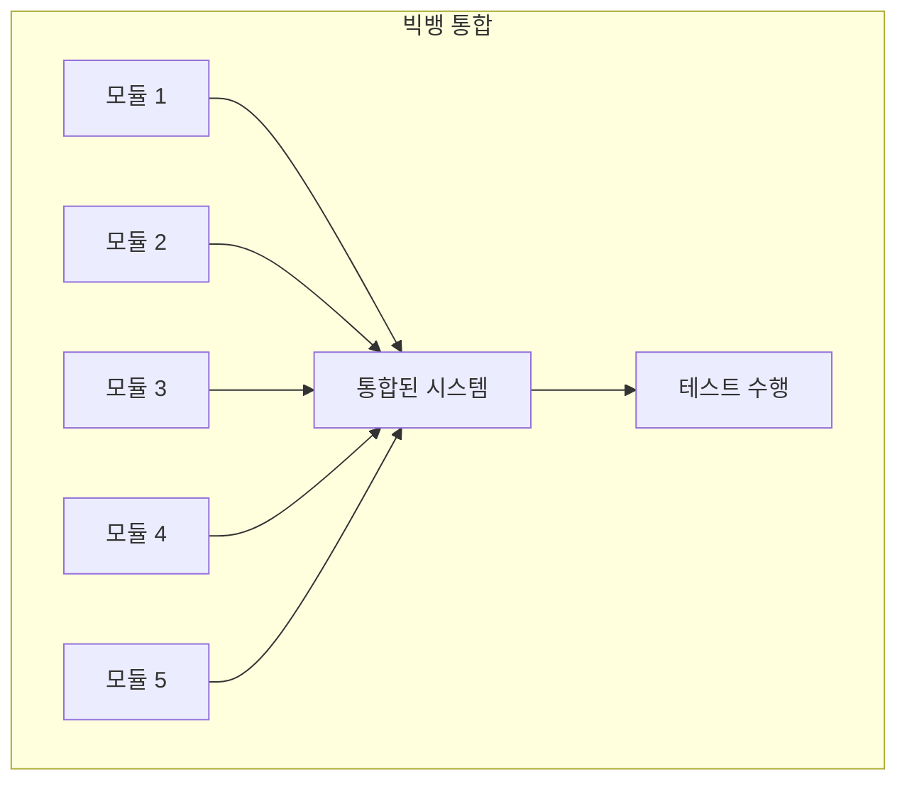
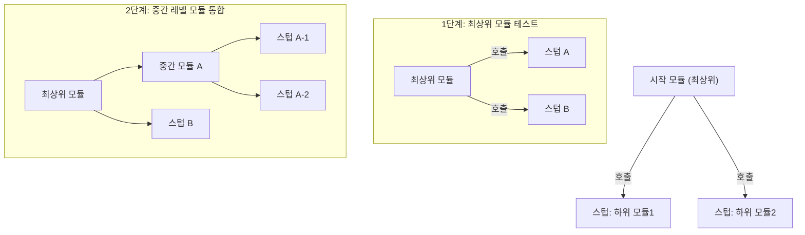
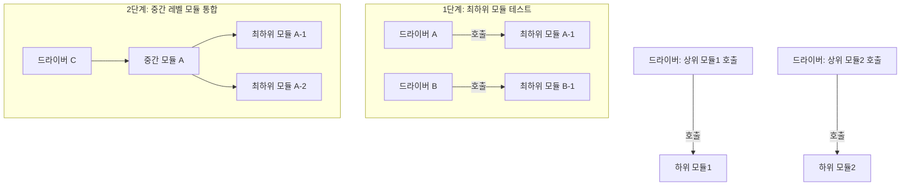
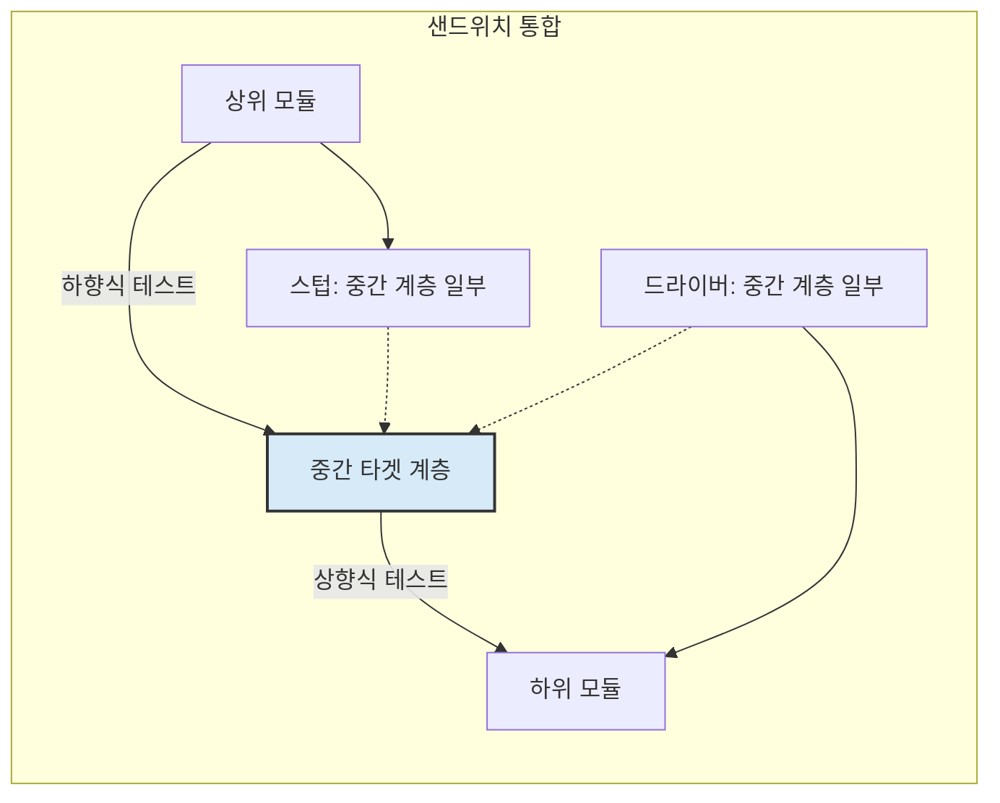

[[통합 테스트(Integration Test)]]는 개별적으로 테스트된 소프트웨어 모듈들이 결합될 때 발생하는 결함을 찾기 위해 수행됩니다. 모듈 간의 인터페이스, 데이터 흐름, 상호작용 등을 검증하는 이 중요한 과정에는 여러 가지 접근 방식이 존재합니다. 프로젝트의 특성, 개발 주기, 가용 리소스 등을 고려하여 가장 적합한 방식을 선택하는 것이 중요합니다.

이번 글에서는 대표적인 통합 테스트 접근 방식들과 각각의 특징, 장단점, 그리고 언제 사용하는 것이 효과적인지에 대해 알아보겠습니다.

## 1. 통합 테스트 접근 방식의 개요

모든 모듈이 한꺼번에 통합되어 테스트되는 경우도 있지만, 대부분의 경우 점진적으로 통합하며 테스트를 진행합니다. 어떤 순서로 모듈을 통합하고 테스트하느냐에 따라 다음과 같은 주요 접근 방식으로 나눌 수 있습니다.

- **빅뱅(Big Bang) 통합 테스트**
- **점진적 통합 테스트 (Incremental Integration Testing)**
    - 하향식(Top-down) 통합 테스트
    - 상향식(Bottom-up) 통합 테스트
    - 샌드위치/하이브리드(Sandwich/Hybrid) 통합 테스트

각 방식은 고유한 장단점을 가지고 있으며, 프로젝트의 상황에 맞춰 전략적으로 선택해야 합니다.

## 2. 빅뱅(Big Bang) 통합 테스트

[[빅뱅 통합 테스트]]은 이름에서 알 수 있듯이, 개발된 모든 모듈 또는 대부분의 모듈을 한 번에 결합하여 전체 시스템 또는 주요 서브시스템을 대상으로 테스트하는 방식입니다.

빅뱅 접근 방식은 모든 컴포넌트가 준비될 때까지 통합을 미루기 때문에, 오류 발생 시 원인 모듈을 특정하기 어렵다는 큰 단점이 있습니다. 따라서 현대적인 개발 방법론에서는 자주 사용되지 않거나 매우 제한적인 상황에서만 고려됩니다.

## 3. 점진적 통합 테스트 (Incremental Integration Testing)

점진적 통합 테스트는 모듈을 단계적으로 결합하면서 테스트를 진행하는 방식입니다. 빅뱅 방식의 단점을 보완하며, 오류를 조기에 발견하고 수정하는 데 용이합니다. 여기에는 크게 하향식, 상향식, 그리고 이 둘을 결합한 샌드위치 방식이 있습니다.

### 3.1. 하향식(Top-down) 통합 테스트

[[하향식 통합 테스트]]는 시스템의 제어 흐름에 따라 상위 레벨의 모듈부터 시작하여 하위 레벨의 모듈로 점차 통합하며 테스트하는 방식입니다. 이때 아직 개발되지 않았거나 테스트에 포함되지 않은 하위 모듈의 기능은 [[테스트 스텁(Test Stub)]]으로 대체됩니다.

### 3.2. 상향식(Bottom-up) 통합 테스트

[[상향식 통합 테스트]]는 시스템의 최하위 레벨 모듈부터 시작하여 점차 상위 레벨의 모듈로 통합하며 테스트하는 방식입니다. 이때 아직 통합되지 않은 상위 모듈의 기능이나 호출은 테스트 드라이버(Test Driver)를 사용하여 시뮬레이션합니다.

- **장점:** [[상향식 통합 테스트]]
- **단점:** [[상향식 통합 테스트]]
- **사용 시나리오:** 상향식 통합 테스트 사용 시나리오 (예: 핵심적인 하위 모듈(라이브러리, 유틸리티 등)의 안정성을 먼저 확보하고 싶을 때, 사용자 인터페이스가 나중에 개발되는 경우)
- 테스트 드라이버(Test Driver)의 역할과 구현에 대한 자세한 내용은 해당 노트를 참고해주세요.

### 3.3. 샌드위치/하이브리드(Sandwich/Hybrid) 통합 테스트

[[샌드위치 통합 테스트 정의 및 특징]]은 하향식과 상향식 접근 방식을 결합한 형태입니다. 시스템을 세 개의 계층(상위, 중간, 하위)으로 보고, 상위 계층에 대해서는 하향식으로, 하위 계층에 대해서는 상향식으로 통합 테스트를 진행하여 중간 계층에서 만나는 방식입니다.

- **장점:** [[샌드위치 통합 테스트]]
- **단점:** [[샌드위치 통합 테스트]]
- **사용 시나리오:** 샌드위치 통합 테스트 사용 시나리오 (예: 크고 복잡한 시스템에서 여러 팀이 동시에 개발을 진행하며 각기 다른 계층을 맡고 있을 때)

이 방식은 상향식과 하향식의 장점을 모두 취하려고 하지만, 중간 계층에 대한 테스트가 마지막까지 지연될 수 있고, 각기 다른 방향에서 진행된 통합 지점을 맞추는 데 복잡성이 따를 수 있습니다.

## 4. 각 접근 방식 비교 및 선택 가이드

어떤 통합 테스트 접근 방식을 선택할지는 프로젝트의 다양한 요소를 고려하여 결정해야 합니다.

|   |   |   |   |   |
|---|---|---|---|---|
|**특징**|**빅뱅 (Big Bang)**|**하향식 (Top-down)**|**상향식 (Bottom-up)**|**샌드위치 (Sandwich)**|
|**통합 시점**|모든 모듈 개발 후 일괄 통합|상위 모듈부터 순차적 통합|하위 모듈부터 순차적 통합|상·하위에서 중간으로 동시 통합|
|**오류 발견**|늦음, 원인 파악 어려움|비교적 빠름, 인터페이스 오류 조기 발견|비교적 빠름, 하위 모듈 안정성 조기 확보|중간 수준|
|**필요 보조 도구**|거의 없음|테스트 스텁 (Test Stubs)|테스트 드라이버 (Test Drivers)|스텁 및 드라이버 모두 필요|
|**초기 프로토타입**|불가능|가능 (주요 흐름 시연)|불가능|부분적으로 가능|
|**주요 장점**|단순함 (작은 시스템)|시스템 구조적 결함 조기 발견|하위 핵심 모듈 집중 테스트|병렬적 테스트, 시간 단축|
|**주요 단점**|오류 위치 파악 어려움, 지연|하위 모듈 테스트 지연, 스텁 개발|시스템 전체 동작 늦게 확인, 드라이버 개발|복잡성 증가, 비용 증가 가능성|

프로젝트 특성에 따른 접근 방식 선택 기준을 수립할 때는 다음 사항들을 고려해볼 수 있습니다:

- **시스템의 아키텍처 및 모듈 간 의존성:** 제어 흐름이 명확한 계층 구조인가, 아니면 분산된 서비스 구조인가?
- **중요 모듈의 위치:** 핵심 로직이 상위에 있는가, 하위에 있는가?
- **개발 우선순위 및 가용성:** 어떤 모듈이 먼저 개발 완료되는가?
- **위험 요소:** 어떤 부분에서 결함이 발생할 가능성이 높은가?
- **팀의 경험 및 리소스:** 스텁이나 드라이버를 개발할 충분한 역량과 시간이 있는가?

## 5. 결론

통합 테스트는 단순히 모듈을 합쳐보는 것을 넘어, 시스템이 유기적으로 동작하는지 확인하는 핵심적인 검증 단계입니다. 빅뱅, 하향식, 상향식, 샌드위치 등 다양한 접근 방식은 각각의 장단점을 가지고 있으며, 만능인 방식은 없습니다.

중요한 것은 프로젝트의 맥락을 정확히 이해하고, 각 접근 방식의 특성을 바탕으로 가장 효과적인 전략을 수립하는 것입니다. 경우에 따라서는 하나의 프로젝트 내에서도 부분적으로 다른 접근 방식을 혼용할 수도 있습니다. 궁극적으로는 조기에 결함을 발견하고 수정하여 고품질의 소프트웨어를 제공하는 것이 통합 테스트의 목표라는 점을 기억해야 합니다.

## 참고 자료

- Software Engineering: A Practitioner's Approach - Roger S. Pressman
- ISTQB Foundation Level Syllabus