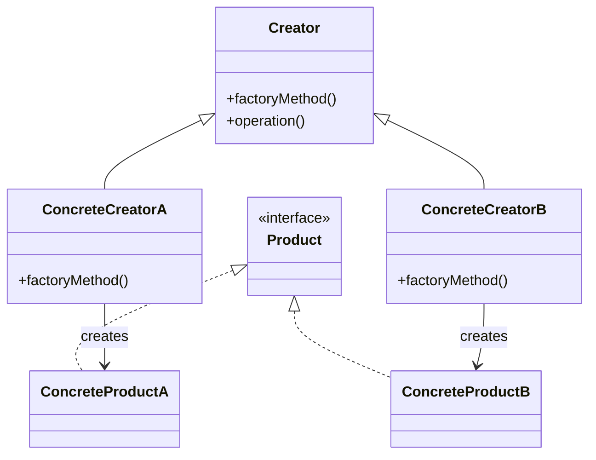
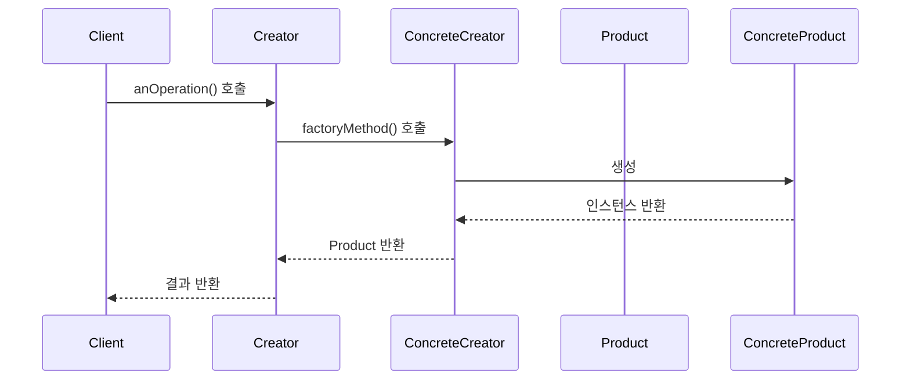

팩토리 메소드 패턴은 객체 생성을 위한 인터페이스를 정의하지만, 어떤 클래스의 인스턴스를 생성할지는 서브클래스가 결정하도록 하는 디자인 패턴입니다. 이 패턴은 객체 생성의 책임을 클라이언트에서 팩토리 클래스로 분리함으로써 객체 생성 로직의 캡슐화를 통해 유연성과 확장성을 제공합니다. 즉, 객체를 생성하는 코드와 그 객체를 사용하는 코드를 분리하는 것이 주요 목적입니다.

팩토리 메소드 패턴은 [[객체 지향 프로그래밍(OOP)]]의 핵심 원칙 중 하나인 개방-폐쇄 원칙(OCP)을 지원하며, [[디자인 패턴]] 중에서도 생성 패턴(Creational Pattern)에 속합니다.

## 팩토리 메소드 패턴의 구조

팩토리 메소드 패턴은 다음과 같은 주요 구성 요소로 이루어집니다:

1. **Product**: 팩토리 메소드가 생성하는 객체의 인터페이스
2. **ConcreteProduct**: Product 인터페이스를 구현하는 구체적인 클래스
3. **Creator**: 팩토리 메소드를 선언하는 추상 클래스
4. **ConcreteCreator**: 팩토리 메소드를 구현하여 ConcreteProduct 인스턴스를 반환하는 클래스

다음 다이어그램은 팩토리 메소드 패턴의 기본 구조를 보여줍니다:



이 구조에서 Creator는 Product 객체를 생성하는 팩토리 메소드를 정의하고, ConcreteCreator는 이 메소드를 구현하여 실제 객체 생성을 담당합니다.

## 팩토리 메소드 패턴의 작동 방식

팩토리 메소드 패턴의 작동 과정은 다음과 같습니다:



1. 클라이언트는 Creator 클래스의 anOperation() 메소드를 호출합니다.
2. Creator 내부에서 factoryMethod()를 호출하여 Product 객체를 생성합니다.
3. ConcreteCreator는 factoryMethod()를 구현하여 ConcreteProduct 인스턴스를 생성하고 반환합니다.
4. Creator는 반환된 Product 객체를 사용하여 작업을 수행합니다.

## Java에서의 팩토리 메소드 패턴 구현

Java에서 팩토리 메소드 패턴을 구현하는 간단한 예제를 살펴보겠습니다:

```java
// Product 인터페이스
public interface Vehicle {
    void drive();
}

// ConcreteProduct 클래스들
public class Car implements Vehicle {
    @Override
    public void drive() {
        System.out.println("자동차를 운전합니다.");
    }
}

public class Motorcycle implements Vehicle {
    @Override
    public void drive() {
        System.out.println("오토바이를 운전합니다.");
    }
}

// Creator 추상 클래스
public abstract class VehicleFactory {
    
    // 팩토리 메소드
    protected abstract Vehicle createVehicle();
    
    // 템플릿 메소드
    public Vehicle orderVehicle() {
        Vehicle vehicle = createVehicle();
        
        // 추가적인 처리 로직
        vehicle.drive();
        
        return vehicle;
    }
}

// ConcreteCreator 클래스들
public class CarFactory extends VehicleFactory {
    @Override
    protected Vehicle createVehicle() {
        return new Car();
    }
}

public class MotorcycleFactory extends VehicleFactory {
    @Override
    protected Vehicle createVehicle() {
        return new Motorcycle();
    }
}

// 클라이언트 코드
public class Client {
    public static void main(String[] args) {
        VehicleFactory carFactory = new CarFactory();
        Vehicle car = carFactory.orderVehicle();
        
        VehicleFactory motorcycleFactory = new MotorcycleFactory();
        Vehicle motorcycle = motorcycleFactory.orderVehicle();
    }
}
```

이 예제에서 `Vehicle`은 Product 인터페이스이고, `Car`와 `Motorcycle`은 ConcreteProduct 클래스입니다. `VehicleFactory`는 Creator 추상 클래스이며, `CarFactory`와 `MotorcycleFactory`는 ConcreteCreator 클래스입니다.

## 팩토리 메소드 패턴의 변형

팩토리 메소드 패턴의 일반적인 변형은 다음과 같습니다:

### 1. 매개변수화된 팩토리 메소드

하나의 팩토리 클래스에서 매개변수에 따라 다른 제품을 생성하는 방식입니다:

```java
public class VehicleFactory {
    public Vehicle createVehicle(String type) {
        if ("car".equalsIgnoreCase(type)) {
            return new Car();
        } else if ("motorcycle".equalsIgnoreCase(type)) {
            return new Motorcycle();
        }
        throw new IllegalArgumentException("Unknown vehicle type: " + type);
    }
}
```

이 변형은 [[단순 팩토리 패턴(Simple Factory Pattern)]]이라고도 불리며, 엄밀히 말하면 GoF 디자인 패턴에는 포함되지 않습니다.

### 2. 정적 팩토리 메소드

정적 메소드를 사용하여 객체를 생성하는 방식입니다:

```java
public class VehicleFactory {
    public static Vehicle createCar() {
        return new Car();
    }
    
    public static Vehicle createMotorcycle() {
        return new Motorcycle();
    }
}
```

정적 팩토리 메소드에 대한 자세한 내용은 [[정적 팩토리 메소드 패턴]]을 참고해주세요.

## 스프링 프레임워크에서의 팩토리 메소드 패턴

스프링 프레임워크는 팩토리 메소드 패턴을 다양한 방식으로 활용합니다:

### BeanFactory

스프링의 `BeanFactory`는 팩토리 메소드 패턴의 대표적인 예시입니다. 이 인터페이스는 빈(Bean) 객체의 생성과 관리를 담당합니다:

```java
@Configuration
public class AppConfig {
    
    @Bean
    public Vehicle car() {
        return new Car();
    }
    
    @Bean
    public Vehicle motorcycle() {
        return new Motorcycle();
    }
}
```

스프링의 IoC 컨테이너는 이러한 팩토리 메소드를 호출하여 빈 객체를 생성하고 관리합니다.

스프링의 DI(의존성 주입)와 IoC(제어의 역전)에 대한 자세한 내용은 [[스프링 DI와 IoC]]를 참고해주세요.

## 팩토리 메소드 패턴의 장단점

### 장점

1. **결합도 감소**: 객체 생성 코드와 사용 코드를 분리하여 결합도를 낮춥니다.
2. **확장성**: 새로운 제품 유형을 추가할 때 기존 코드를 수정하지 않고도 새로운 팩토리를 추가할 수 있습니다.
3. **단일 책임 원칙**: 객체 생성의 책임을 팩토리 클래스로 분리하여 클래스의 책임을 명확히 합니다.
4. **개방-폐쇄 원칙**: 새로운 제품 유형을 추가할 때 기존 코드를 수정하지 않고 확장할 수 있습니다.
5. **명확한 의도 전달**: 생성자 대신 의미 있는 이름의 메소드를 통해 객체 생성의 의도를 명확히 전달할 수 있습니다.

### 단점

1. **복잡성 증가**: 패턴 적용으로 인해 클래스 수가 증가하고 코드가 복잡해질 수 있습니다.
2. **계층 구조 필요**: 패턴을 적용하기 위해서는 제품 클래스 계층 구조가 필요합니다.
3. **오버헤드**: 간단한 객체 생성이 필요한 경우에도 팩토리와 관련된 추가 클래스가 필요하여 오버헤드가 발생할 수 있습니다.

## 팩토리 메소드 패턴과 다른 패턴의 관계

팩토리 메소드 패턴은 다른 디자인 패턴과 다음과 같은 관계가 있습니다:

1. **[[추상 팩토리 패턴(Abstract Factory Pattern)]]**: 팩토리 메소드 패턴이 한 종류의 객체를 생성하는 반면, 추상 팩토리 패턴은 관련된 여러 종류의 객체를 생성하는 인터페이스를 제공합니다.
    
2. **[[템플릿 메소드 패턴(Template Method Pattern)]]**: 팩토리 메소드 패턴은 종종 템플릿 메소드 패턴과 함께 사용되며, 팩토리 메소드 자체가 템플릿 메소드의 한 단계로 사용될 수 있습니다.
    
3. **[[싱글톤 패턴(Singleton Pattern)]]**: 팩토리 메소드는 싱글톤 인스턴스를 반환하도록 구현될 수 있습니다.
    

디자인 패턴 간의 관계와 조합에 대한 자세한 내용은 [[디자인 패턴 조합과 활용]]을 참고해주세요.

## 실제 사용 사례

팩토리 메소드 패턴은 다음과 같은 상황에서 유용하게 사용됩니다:

1. **프레임워크 개발**: 라이브러리나 프레임워크에서 구체적인 클래스를 직접 생성하지 않고, 확장성을 위해 팩토리 메소드를 제공합니다.
    
2. **플러그인 아키텍처**: 응용 프로그램이 플러그인 형태로 확장될 수 있도록 합니다.
    
3. **객체 생성 프로세스의 캡슐화**: 복잡한 객체 생성 과정을 캡슐화하여 클라이언트가 단순하게 객체를 요청할 수 있게 합니다.
    
4. **테스트 주도 개발**: 테스트 시 실제 객체 대신 Mock 객체를 생성하는 팩토리 메소드를 사용할 수 있습니다.
    

## 팩토리 메소드 패턴 구현 시 고려사항

팩토리 메소드 패턴을 구현할 때 다음 사항을 고려해야 합니다:

1. **적절한 추상화 수준**: Product 인터페이스가 너무 일반적이거나 너무 구체적이지 않도록 적절한 추상화 수준을 유지해야 합니다.
    
2. **명명 규칙**: 팩토리 메소드의 이름은 그 메소드가 생성하는 객체의 유형을 명확히 나타내야 합니다.
    
3. **예외 처리**: 잘못된 입력이나 생성 실패에 대한 예외 처리를 고려해야 합니다.
    
4. **성능 고려**: 객체 생성이 자주 발생하는 경우, 객체 풀링이나 캐싱과 같은 최적화 기법을 고려할 수 있습니다.
    

팩토리 메소드 패턴의 효과적인 구현에 대한 자세한 내용은 [[효과적인 팩토리 패턴 구현]]을 참고해주세요.

## 결론

팩토리 메소드 패턴은 객체 생성의 유연성과 확장성을 제공하는 강력한 디자인 패턴입니다. 이 패턴은 객체 생성 로직을 캡슐화하고, 클라이언트 코드에서 구체적인 클래스에 대한 의존성을 제거함으로써 코드의 유지보수성과 재사용성을 향상시킵니다.

팩토리 메소드 패턴은 객체 지향 설계의 기본 원칙을 잘 따르며, 특히 개방-폐쇄 원칙과 의존성 역전 원칙을 지원합니다. 그러나 모든 디자인 패턴과 마찬가지로, 상황에 맞게 적절히 사용해야 하며 불필요한 복잡성을 피해야 합니다.

현대적인 소프트웨어 개발에서는 팩토리 메소드 패턴이 스프링과 같은 프레임워크나 DI(의존성 주입) 컨테이너에 의해 자동화되는 경우가 많지만, 패턴의 기본 원칙과의 구현 방법을 이해하는 것은 여전히 중요합니다.

## 참고 자료

- Design Patterns: Elements of Reusable Object-Oriented Software - Erich Gamma, Richard Helm, Ralph Johnson, John Vlissides
- Effective Java, 3rd Edition - Joshua Bloch
- Head First Design Patterns - Eric Freeman, Elisabeth Robson
- 스프링 공식 문서(https://docs.spring.io/spring-framework/docs/current/reference/html/core.html#beans-factory-class)