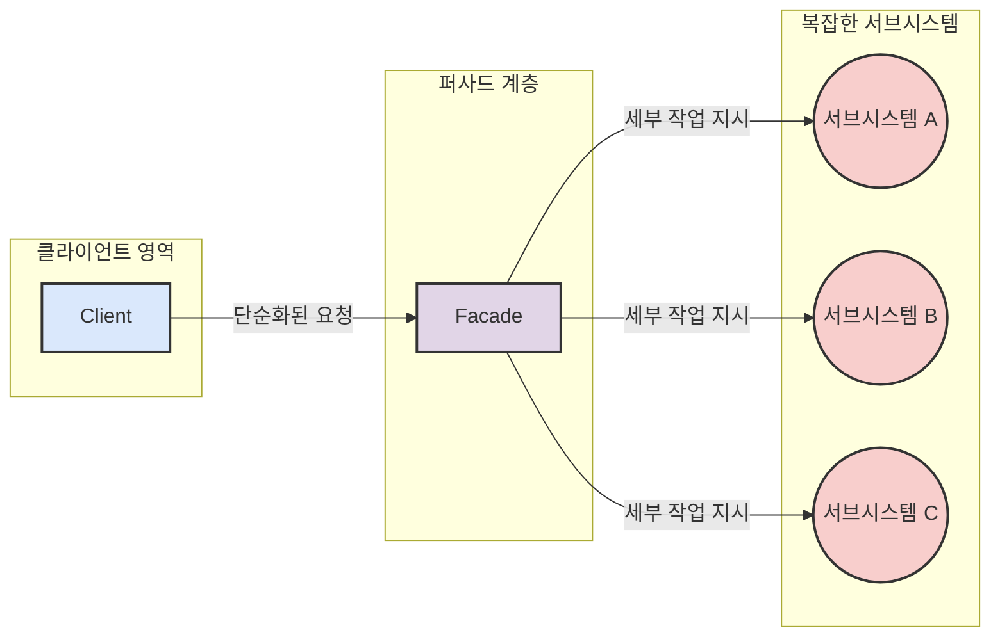
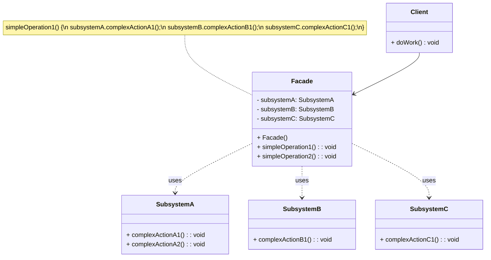

우리가 최신 스마트폰을 사용할 때, 그 내부에는 통신 모듈, 카메라 모듈, 디스플레이 제어, 배터리 관리 등 수많은 [[서브시스템(Subsystem)]]들이 복잡하게 얽혀 돌아가고 있습니다. 하지만 우리는 그저 몇 번의 터치만으로 사진을 찍고, 전화를 걸고, 인터넷을 사용하죠. 바로 이 스마트폰의 사용자 인터페이스가 일종의 '퍼사드' 역할을 하여 복잡한 내부 동작을 몰라도 쉽게 사용할 수 있도록 해주는 것입니다.

## 퍼사드 패턴이란 무엇인가요?

**퍼사드 패턴 (Facade Pattern)** 은 **하나 이상의 복잡한 서브시스템들에 대한 통합되고 단순화된 [[인터페이스(Interface)]]를 제공하는 패턴**입니다. 클라이언트는 이 퍼사드 인터페이스를 통해 서브시스템을 사용하게 되므로, 서브시스템의 내부 클래스들이나 복잡한 상호작용을 직접 알 필요가 없습니다.



퍼사드는 클라이언트와 복잡한 서브시스템 사이의 '중간 계층' 역할을 하며, 특정 작업을 수행하기 위해 필요한 서브시스템들의 여러 메서드 호출을 하나의 편리한 메서드로 묶어서 제공합니다.

## 왜 퍼사드 패턴을 사용할까요?

퍼사드 패턴은 다음과 같은 이점을 제공하여 시스템 설계를 개선합니다:

1. **사용 편의성 증진**: 클라이언트는 복잡한 서브시스템의 내부 구조나 클래스 간의 관계를 알 필요 없이, 퍼사드가 제공하는 단순한 인터페이스만을 통해 필요한 기능을 쉽게 사용할 수 있습니다.
2. **[[결합도(Coupling)]] 감소**: 클라이언트와 서브시스템 간의 의존성을 줄여줍니다. 서브시스템의 내부 구현이 변경되더라도 퍼사드 인터페이스가 그대로 유지된다면 클라이언트 코드는 영향을 받지 않습니다. 이를 통해 시스템의 유지보수성과 유연성이 향상됩니다.
3. **[[캡슐화(Encapsulation)]] 강화**: 서브시스템의 내부 구현을 숨기고, 외부에는 필요한 기능만을 노출함으로써 시스템의 특정 부분을 효과적으로 캡슐화할 수 있습니다.
4. **계층화된 시스템 구축**: 복잡한 시스템을 여러 계층으로 나눌 때, 각 서브시스템 계층의 진입점(Entry Point) 역할을 퍼사드가 수행할 수 있습니다.

## 퍼사드 패턴의 구조

퍼사드 패턴을 구성하는 주요 참여자는 다음과 같습니다:

- **Facade (퍼사드)**:
    - 서브시스템의 기능을 사용하는 클라이언트를 위한 통합 인터페이스를 제공합니다.
    - 클라이언트의 요청을 받아, 해당 요청을 처리하기 위해 필요한 서브시스템 객체들에게 작업을 위임합니다.
    - 어떤 서브시스템이 요청을 처리해야 하는지, 어떤 순서로 처리해야 하는지에 대한 지식을 가지고 있습니다.
- **Subsystem classes (서브시스템 클래스들)**:
    - 실제 기능을 구현하는 하나 또는 그 이상의 클래스들입니다.
    - 퍼사드에 의해 호출되어 작업을 수행하지만, 클라이언트가 이 클래스들을 직접적으로 알 필요는 없습니다. (물론, 클라이언트가 필요하다면 서브시스템 클래스에 직접 접근하는 것을 막지는 않습니다. 퍼사드는 주로 사용 편의성을 높이는 데 목적이 있습니다.)
- **Client (클라이언트)**:
    - 퍼사드 인터페이스를 통해 서브시스템의 기능을 사용합니다.




## 퍼사드 패턴 예시 (Java 코드)

집에서 영화를 보기 위해 홈씨어터 시스템을 작동시키는 상황을 예로 들어보겠습니다. DVD 플레이어, 프로젝터, 앰프, 스크린, 조명 등 여러 장치를 조작해야 하지만, 퍼사드를 사용하면 "영화 보기 시작" 버튼 하나로 모든 것을 처리할 수 있습니다.

```java
// Subsystem 클래스들
class DvdPlayer {
    public void on() { System.out.println("DVD 플레이어 켜짐"); }
    public void off() { System.out.println("DVD 플레이어 꺼짐"); }
    public void play(String movie) { System.out.println("'" + movie + "' 재생 시작"); }
    public void stop() { System.out.println("DVD 재생 중지"); }
    public void eject() { System.out.println("DVD 배출"); }
}

class Projector {
    public void on() { System.out.println("프로젝터 켜짐"); }
    public void off() { System.out.println("프로젝터 꺼짐"); }
    public void wideScreenMode() { System.out.println("프로젝터 와이드 스크린 모드 설정"); }
}

class Amplifier {
    public void on() { System.out.println("앰프 켜짐"); }
    public void off() { System.out.println("앰프 꺼짐"); }
    public void setDvd(DvdPlayer dvd) { System.out.println("앰프 DVD 입력 설정"); }
    public void setSurroundSound() { System.out.println("앰프 서라운드 사운드 설정"); }
    public void setVolume(int level) { System.out.println("앰프 볼륨 " + level + "로 설정"); }
}

class Screen {
    public void up() { System.out.println("스크린 올라감"); }
    public void down() { System.out.println("스크린 내려옴"); }
}

class TheaterLights {
    public void on() { System.out.println("극장 조명 켜짐"); }
    public void off() { System.out.println("극장 조명 꺼짐"); }
    public void dim(int level) { System.out.println("극장 조명 밝기 " + level + "%로 조절"); }
}

// Facade 클래스
class HomeTheaterFacade {
    private DvdPlayer dvd;
    private Projector projector;
    private Amplifier amp;
    private Screen screen;
    private TheaterLights lights;

    public HomeTheaterFacade(DvdPlayer dvd, Projector projector, Amplifier amp, Screen screen, TheaterLights lights) {
        this.dvd = dvd;
        this.projector = projector;
        this.amp = amp;
        this.screen = screen;
        this.lights = lights;
    }

    public void watchMovie(String movie) {
        System.out.println("\n--- 영화 볼 준비 시작 ---");
        lights.dim(10);
        screen.down();
        projector.on();
        projector.wideScreenMode();
        amp.on();
        amp.setDvd(dvd);
        amp.setSurroundSound();
        amp.setVolume(5);
        dvd.on();
        dvd.play(movie);
    }

    public void endMovie() {
        System.out.println("\n--- 영화 관람 종료 ---");
        dvd.stop();
        dvd.eject();
        dvd.off();
        amp.off();
        projector.off();
        screen.up();
        lights.on();
    }
}

// Client
public class HomeTheaterClient {
    public static void main(String[] args) {
        // 서브시스템 객체 생성
        DvdPlayer dvd = new DvdPlayer();
        Projector projector = new Projector();
        Amplifier amp = new Amplifier();
        Screen screen = new Screen();
        TheaterLights lights = new TheaterLights();

        // 퍼사드 객체 생성
        HomeTheaterFacade homeTheater = new HomeTheaterFacade(dvd, projector, amp, screen, lights);

        // 퍼사드를 통해 간단하게 영화 보기 시작
        homeTheater.watchMovie("인셉션");

        // 퍼사드를 통해 간단하게 영화 보기 종료
        homeTheater.endMovie();
    }
}
```

클라이언트는 `HomeTheaterFacade`의 `watchMovie()`와 `endMovie()` 메서드만 호출하면, 복잡한 내부 장치들의 동작 순서나 상호작용을 알 필요 없이 원하는 작업을 수행할 수 있습니다.

## 퍼사드 패턴의 장점

- **사용 용이성**: 복잡한 서브시스템의 사용법을 몰라도 퍼사드가 제공하는 간단한 인터페이스를 통해 쉽게 사용할 수 있습니다.
- **결합도 감소**: 클라이언트와 서브시스템 간의 의존성을 낮춥니다. 서브시스템의 내부 구성 요소가 변경되어도 퍼사드 인터페이스가 변경되지 않는 한 클라이언트 코드는 영향을 받지 않습니다.
- **캡슐화 증진**: 서브시스템의 내부 구현을 클라이언트로부터 숨겨 보호합니다.
- **코드 가독성 및 유지보수성 향상**: 클라이언트 코드가 특정 서브시스템의 세부 사항에 덜 의존하게 되므로 더 단순해지고 유지보수가 용이해집니다.

## 퍼사드 패턴의 단점

- **퍼사드 객체의 비대화 가능성**: 퍼사드가 너무 많은 서브시스템을 다루거나 너무 많은 기능을 제공하려 하면, 퍼사드 클래스 자체가 복잡하고 거대해져서 [[거대 클래스(God Class)]]가 될 수 있습니다. 이는 퍼사드 자체의 유지보수를 어렵게 만들 수 있습니다. (필요하다면 여러 개의 퍼사드를 두거나, 퍼사드를 계층화하는 것을 고려할 수 있습니다.)
- **제한된 기능 제공**: 퍼사드는 주로 자주 사용되는 공통적인 기능을 단순화하여 제공합니다. 따라서 서브시스템이 제공하는 모든 세부 기능을 퍼사드가 노출하지 않을 수 있습니다. (하지만 클라이언트가 필요하다면 여전히 서브시스템의 클래스에 직접 접근하여 세부 기능을 사용할 수 있습니다.)
- **약간의 성능 오버헤드**: 퍼사드를 통해 한 단계 간접적으로 서브시스템을 호출하므로 아주 약간의 성능 오버헤드가 발생할 수 있으나, 대부분의 경우 무시할 만한 수준입니다.

## 실생활 및 프레임워크 예시

퍼사드 패턴은 다양한 소프트웨어와 프레임워크에서 널리 사용됩니다:

- **SLF4J (Simple Logging Facade for Java)**: Java 로깅을 위한 퍼사드 라이브러리입니다. SLF4J API를 사용하면 실제 로깅 구현체(Logback, Log4j, java.util.logging 등)를 직접 사용하지 않고도 일관된 방식으로 로깅 코드를 작성할 수 있으며, 나중에 실제 로깅 구현체를 쉽게 교체할 수 있습니다.
- **[[스프링 프레임워크 (Spring Framework)]]의 `JdbcTemplate`**: Java의 복잡한 JDBC API 사용을 단순화시켜주는 퍼사드 역할을 합니다. 개발자는 `JdbcTemplate`이 제공하는 간편한 메서드를 통해 데이터베이스 연결, SQL 실행, 결과 처리, 예외 처리 등의 반복적이고 복잡한 작업을 쉽게 처리할 수 있습니다.
- **`javax.faces.context.FacesContext` (JSF API)**: JavaServer Faces (JSF)에서 현재 요청에 대한 모든 컨텍스트 정보(요청 파라미터, 세션, 애플리케이션 설정 등)에 접근할 수 있는 통합된 진입점을 제공합니다.
- **많은 라이브러리의 API**: 특정 복잡한 작업을 수행하기 위해 여러 클래스와 메서드를 조합해야 하는 경우, 라이브러리 개발자들은 종종 사용 편의성을 위해 퍼사드 클래스를 제공합니다.

## 결론

퍼사드 패턴은 복잡한 시스템을 다루는 클라이언트의 삶을 훨씬 편하게 만들어주는 유용한 도구입니다. 시스템의 특정 부분에 대한 "단일 창구"를 제공함으로써, 사용자는 내부의 복잡성에 압도되지 않고 필요한 기능에 집중할 수 있게 됩니다.

시스템을 설계할 때, 여러 클래스로 구성된 서브시스템이 있고 이 서브시스템을 외부에서 자주 사용해야 한다면, 퍼사드 패턴을 도입하여 인터페이스를 단순화하고 결합도를 낮추는 것을 고려해 보세요. 분명 개발의 효율성과 코드의 품질을 높이는 데 도움이 될 것입니다.