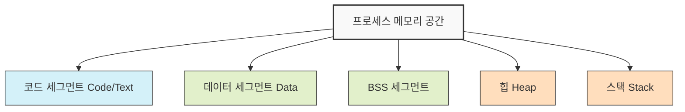
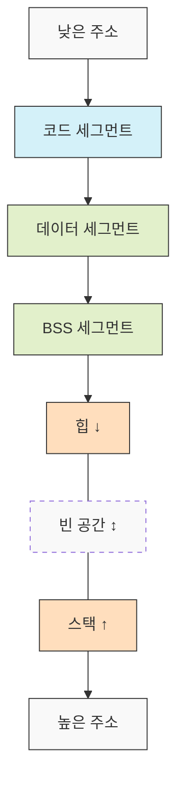
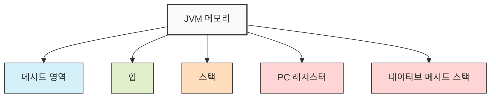

프로세스 메모리 구조는 운영체제가 각 프로세스에 할당하는 가상 메모리 공간의 논리적 구조입니다. 이 구조는 프로그램이 실행되는 동안 코드와 데이터를 효율적으로 관리하고 접근할 수 있도록 설계되어 있습니다. 프로세스 메모리 구조를 이해하는 것은 메모리 관리와 프로그램 최적화에 필수적인 지식입니다.

## 프로세스 메모리의 기본 구조

프로세스 메모리는 일반적으로 다음과 같은 세그먼트로 나뉩니다:



### 1. 코드 세그먼트 (Code/Text)

코드 세그먼트는 프로그램의 실행 가능한 명령어들이 저장되는 영역입니다.

- **특징**:
    - 읽기 전용(Read-Only)으로 설정되어 프로그램이 자신의 코드를 수정하는 것을 방지합니다.
    - 재진입 가능(Reentrant)하기 때문에 여러 프로세스가 동일한 코드를 공유할 수 있습니다.
    - 프로그램 시작 시 크기가 고정되어 런타임 중에는 변경되지 않습니다.

### 2. 데이터 세그먼트 (Data)

데이터 세그먼트는 프로그램의 전역 변수와 정적(static) 변수 중 초기화된 변수들이 저장되는 영역입니다.

- **특징**:
    - 프로그램 시작 시 크기가 결정되며 런타임 중에는 변경되지 않습니다.
    - 읽기/쓰기가 모두 가능합니다.
    - 프로그램 전체에서 접근 가능한 데이터를 저장합니다.

### 3. BSS 세그먼트 (Block Started by Symbol)

BSS 세그먼트는 초기화되지 않은 전역 변수와 정적 변수가 저장되는 영역입니다.

- **특징**:
    - 프로그램 로드 시 운영체제에 의해 0으로 초기화됩니다.
    - 실행 파일에는 실제 내용이 아닌 크기 정보만 포함됩니다.
    - Data 세그먼트와 마찬가지로 프로그램 시작 시 크기가 결정됩니다.

### 4. 힙 (Heap)

힙은 프로그램이 실행 중에 동적으로 할당받는 메모리 영역입니다.

- **특징**:
    - 런타임에 크기가 변할 수 있으며, 필요에 따라 확장 또는 축소됩니다.
    - 개발자가 명시적으로 메모리를 할당하고 해제해야 합니다(Java와 같은 언어에서는 [[가비지 컬렉션(Garbage Collection)]]이 자동으로 수행).
    - 메모리 누수(Memory Leak) 및 단편화(Fragmentation)가 발생할 수 있는 영역입니다.
    - 낮은 주소에서 높은 주소로 자라납니다(상향식 성장).

### 5. 스택 (Stack)

스택은 함수 호출과 관련된 정보를 저장하는 영역입니다.

- **특징**:
    - 함수의 지역 변수, 매개변수, 반환 주소, 임시 데이터 등이 저장됩니다.
    - LIFO(Last In, First Out) 구조로 동작합니다.
    - 함수 호출 시 스택 프레임이 생성되고, 함수 종료 시 제거됩니다.
    - 크기가 제한되어 있어 재귀 호출이 너무 깊어지면 스택 오버플로우(Stack Overflow)가 발생할 수 있습니다.
    - 높은 주소에서 낮은 주소로 자라납니다(하향식 성장).

## 메모리 할당 방향

힙과 스택은 서로 반대 방향으로 성장합니다:



이러한 설계는 두 영역이 충돌하지 않도록 하면서 각각의 영역이 필요에 따라 유연하게 확장될 수 있게 합니다. 만약 두 영역이 서로 만나게 되면 메모리 부족 오류가 발생할 수 있습니다.

## Java에서의 메모리 구조

Java 프로그램에서의 메모리 구조는 JVM(Java Virtual Machine)에 의해 관리되며, 다소 다른 구조를 가집니다.



- **메서드 영역**: 클래스 구조, 메서드 데이터, 정적 변수, 상수 풀 등을 저장합니다.
- **힙**: 객체와 배열이 저장되는 영역으로, 가비지 컬렉터에 의해 관리됩니다.
- **스택**: 각 스레드마다 하나씩 생성되며, 메서드 호출과 관련된 정보를 저장합니다.
- **PC 레지스터**: 각 스레드의 현재 실행 중인 명령어 주소를 저장합니다.
- **네이티브 메서드 스택**: JNI(Java Native Interface)를 통해 호출되는 네이티브 메서드를 위한 스택입니다.

자세한 내용은 [[JVM 메모리 구조]]를 참고해주세요.

## 프로세스 메모리 구조의 실제 활용

### 메모리 할당과 관리

프로그램에서 메모리는 다음과 같이 할당됩니다:

1. **정적 할당**:
    
    - 전역 변수, 정적 변수는 데이터/BSS 세그먼트에 자동으로 할당됩니다.
    - 컴파일 시간에 크기가 결정되며, 프로그램 종료 시까지 유지됩니다.
2. **자동 할당**:
    
    - 지역 변수, 함수 매개변수는 스택에 자동으로 할당됩니다.
    - 함수 호출 시 생성되고, 함수 종료 시 자동으로 해제됩니다.
3. **동적 할당**:
    
    - 런타임에 필요한 크기만큼 힙에서 할당받습니다.
    - Java에서는 `new` 키워드, C에서는 `malloc()`, C++에서는 `new` 연산자를 통해 할당합니다.
    - 명시적인 해제(C/C++)나 가비지 컬렉션(Java)을 통해 메모리가 회수됩니다.

### 메모리 관련 문제

프로세스 메모리 구조를 이해하면 다음과 같은 문제를 해결하는 데 도움이 됩니다:

1. **메모리 누수(Memory Leak)**:
    
    - 동적으로 할당된 메모리가 더 이상 필요하지 않을 때 해제되지 않는 문제입니다.
    - 힙 영역의 메모리가 계속해서 증가하여 결국 메모리 부족으로 프로그램이 실패할 수 있습니다.
2. **스택 오버플로우(Stack Overflow)**:
    
    - 스택 영역이 허용된 크기를 초과할 때 발생합니다.
    - 주로 너무 깊은 재귀 호출이나 너무 많은 지역 변수 사용으로 인해 발생합니다.
3. **힙 오버플로우(Heap Overflow)**:
    
    - 프로그램이 사용 가능한 힙 메모리보다 더 많은 메모리를 할당하려고 할 때 발생합니다.
4. **메모리 단편화(Memory Fragmentation)**:
    
    - 외부 단편화: 충분한 총 메모리가 있지만 연속적이지 않아 할당할 수 없는 상태
    - 내부 단편화: 할당된 메모리가 요청된 크기보다 클 때 발생하는 낭비

이러한 문제들에 대한 자세한 해결 방법은 [[메모리 관리 최적화 기법]]을 참고해주세요.

## 스프링에서의 메모리 관리

스프링 프레임워크는 JVM 위에서 실행되므로 기본적으로 Java의 메모리 구조를 따릅니다. 하지만 스프링은 몇 가지 메모리 관리 관련 기능을 제공합니다:

### 빈 스코프 관리

스프링의 빈(Bean)은 다양한 스코프를 가질 수 있으며, 이는 메모리 사용에 영향을 미칩니다:

- **싱글톤(Singleton)**: 애플리케이션 전체에서 하나의 인스턴스만 생성하여 메모리를 절약합니다.
- **프로토타입(Prototype)**: 요청할 때마다 새 인스턴스를 생성합니다.
- **리퀘스트(Request)**: HTTP 요청마다 새 인스턴스를 생성하고, 요청 처리 후 삭제합니다.
- **세션(Session)**: HTTP 세션마다 하나의 인스턴스를 생성하고, 세션 종료 시 삭제합니다.

### 캐시 관리

스프링은 `@Cacheable`, `@CachePut`, `@CacheEvict` 등의 어노테이션을 통해 메모리 캐시를 효과적으로 관리할 수 있는 기능을 제공합니다.

```java
@Service
public class ProductService {
    
    @Cacheable(value = "products", key = "#id")
    public Product getProductById(Long id) {
        // 데이터베이스에서 상품 조회 (비용이 많이 드는 작업)
        return productRepository.findById(id).orElse(null);
    }
}
```

캐시 관리에 대한 자세한 내용은 [[스프링 캐시 관리]]를 참고해주세요.

## 메모리 프로파일링 및 모니터링

메모리 사용을 분석하고 최적화하기 위해 다양한 도구를 사용할 수 있습니다:

1. **JVM 모니터링 도구**:
    
    - Java VisualVM: JVM의 메모리, CPU 사용량, 스레드 활동 등을 시각적으로 모니터링
    - Java Mission Control: 상세한 JVM 성능 분석 및 진단 도구
2. **프로파일링 도구**:
    
    - Eclipse Memory Analyzer (MAT): 힙 덤프 분석 및 메모리 누수 탐지
    - YourKit Java Profiler: CPU 및 메모리 프로파일링
3. **모니터링 솔루션**:
    
    - Spring Boot Actuator: 애플리케이션 상태 및 메트릭 모니터링
    - Prometheus + Grafana: 성능 메트릭 수집 및 시각화

자세한 모니터링 방법은 [[자바 애플리케이션 성능 모니터링]]을 참고해주세요.

## 결론

프로세스 메모리 구조에 대한 이해는 효율적인 프로그램 개발과 디버깅에 필수적입니다. 코드, 데이터, BSS, 힙, 스택 영역의 특성과 용도를 알면 메모리 관련 문제를 예방하고 해결하는 데 큰 도움이 됩니다. 특히 힙과 스택의 동작 방식을 이해하면 동적 메모리 할당과 함수 호출이 프로그램 실행에 미치는 영향을 정확히 파악할 수 있습니다.

현대 프로그래밍 언어와 프레임워크는 많은 메모리 관리 작업을 자동화하고 있지만, 근본적인 메모리 구조에 대한 지식은 여전히 고성능, 안정적인 소프트웨어 개발에 중요한 기반이 됩니다.

## 참고 자료

- Operating System Concepts, 10th Edition - Abraham Silberschatz
- Computer Systems: A Programmer's Perspective - Randal E. Bryant
- Inside the Java Virtual Machine - Bill Venners
- Spring Framework Documentation (https://docs.spring.io/spring-framework/docs/current/reference/html/)