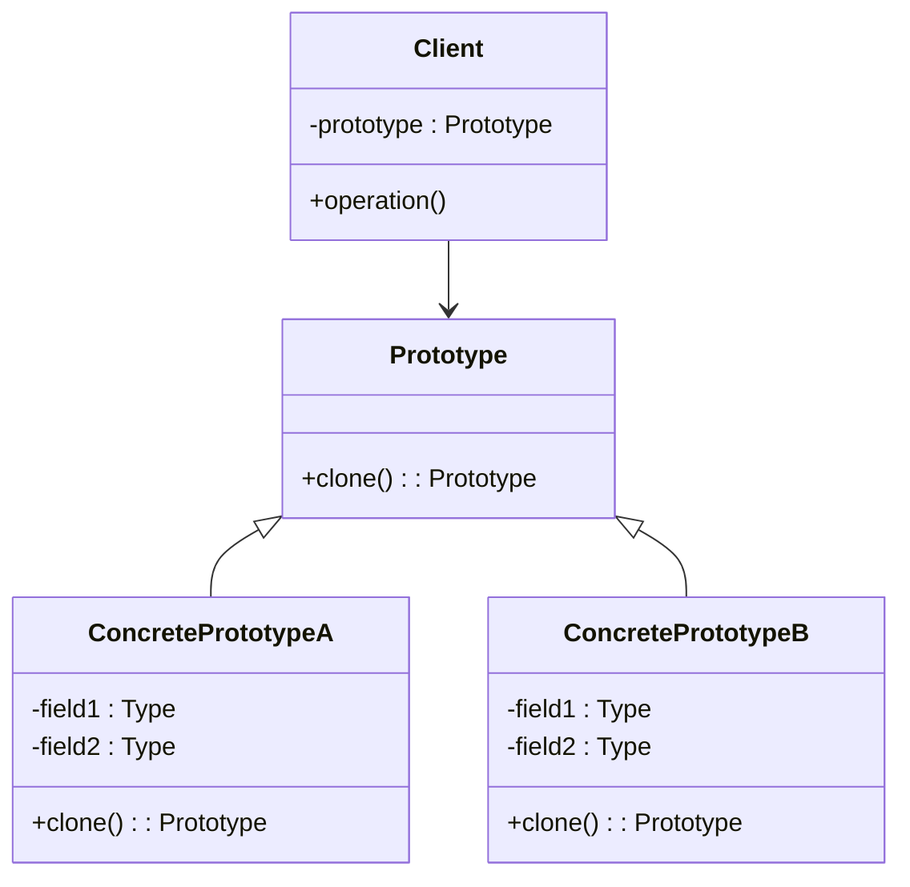

프로토타입 패턴은 기존 객체를 복제하여 새로운 객체를 생성하는 [[생성 패턴(Creational Pattern)]]입니다. 이 패턴은 객체 생성 비용이 큰 경우, 비슷한 객체가 이미 존재하는 경우, 또는 객체 생성이 복잡한 경우에 특히 유용합니다.

## 프로토타입 패턴의 핵심 개념

프로토타입 패턴의 핵심은 객체 복제 기능을 제공하는 인터페이스를 정의하고, 이를 통해 클라이언트 코드에서 구체적인 클래스에 의존하지 않고도 객체를 복제할 수 있게 하는 것입니다. 이는 객체 생성 로직을 중앙화하고, 객체 생성의 복잡성을 캡슐화하는 데 도움이 됩니다.

## 프로토타입 패턴의 구조



- **Prototype**: 객체를 복제하는 메서드를 선언하는 인터페이스
- **ConcretePrototype**: Prototype 인터페이스를 구현하고 자신을 복제하는 메서드를 제공하는 구체 클래스
- **Client**: 프로토타입을 복제하여 새 객체를 얻는 클라이언트

## Java에서의 프로토타입 패턴 구현

Java에서는 `Cloneable` 인터페이스와 `Object` 클래스의 `clone()` 메서드를 활용하여 프로토타입 패턴을 구현할 수 있습니다.

```java
// 프로토타입 인터페이스
public interface Prototype extends Cloneable {
    Prototype clone();
}

// 구체적인 프로토타입 클래스
public class Document implements Prototype {
    private String content;
    private String formatting;
    private List<String> images;

    public Document(String content, String formatting, List<String> images) {
        this.content = content;
        this.formatting = formatting;
        this.images = new ArrayList<>(images);
    }

    // 얕은 복사를 수행하는 clone 메서드
    @Override
    public Document clone() {
        try {
            Document cloned = (Document) super.clone();
            // 깊은 복사가 필요한 필드는 별도로 처리
            cloned.images = new ArrayList<>(this.images);
            return cloned;
        } catch (CloneNotSupportedException e) {
            return null;
        }
    }

    // Getter와 Setter 메서드
    public String getContent() {
        return content;
    }

    public void setContent(String content) {
        this.content = content;
    }

    public String getFormatting() {
        return formatting;
    }

    public void setFormatting(String formatting) {
        this.formatting = formatting;
    }

    public List<String> getImages() {
        return images;
    }

    public void setImages(List<String> images) {
        this.images = images;
    }
}

// 클라이언트 코드
public class Client {
    public static void main(String[] args) {
        // 원본 문서 생성
        List<String> images = Arrays.asList("image1.jpg", "image2.jpg");
        Document original = new Document("원본 내용", "기본 서식", images);

        // 문서 복제
        Document copy = original.clone();
        
        // 복제된 문서 수정
        copy.setContent("수정된 내용");
        copy.getImages().add("image3.jpg");

        // 원본과 복제본 확인
        System.out.println("원본 문서 내용: " + original.getContent());
        System.out.println("원본 문서 이미지: " + original.getImages());
        System.out.println("복제 문서 내용: " + copy.getContent());
        System.out.println("복제 문서 이미지: " + copy.getImages());
    }
}
```

## 얕은 복사(Shallow Copy)와 깊은 복사(Deep Copy)

프로토타입 패턴을 구현할 때 중요한 고려사항 중 하나는 **얕은 복사**와 **깊은 복사** 사이의 선택입니다.

### 얕은 복사

얕은 복사는 객체의 참조 변수(필드)들을 그대로 복사합니다. 이는 원본 객체와 복제된 객체가 같은 참조 객체를 가리키게 됩니다. Java의 기본 `clone()` 메서드는 얕은 복사를 수행합니다.

```java
@Override
public Object clone() throws CloneNotSupportedException {
    return super.clone(); // 얕은 복사 수행
}
```

얕은 복사의 문제점은 원본이나 복제본 중 하나에서 참조 객체를 수정하면 다른 쪽에도 영향을 미친다는 것입니다.

### 깊은 복사

깊은 복사는 객체의 모든 필드를 복사하며, 참조 타입의 필드에 대해서는 참조하는 객체까지 새로 복사합니다. 이를 통해 원본과 복제본이 완전히 독립적인 객체를 가지게 됩니다.

```java
@Override
public Object clone() throws CloneNotSupportedException {
    Document cloned = (Document) super.clone();
    // 깊은 복사 수행
    cloned.images = new ArrayList<>(this.images);
    return cloned;
}
```

깊은 복사 구현 방법에 대한 자세한 내용은 [[깊은 복사 구현 방법]]을 참고해주세요.

## 프로토타입 패턴의 장점

1. **객체 생성 비용 감소**: 복잡한 객체의 생성 과정을 반복하지 않고 복제를 통해 새 객체를 생성합니다.
2. **런타임에 객체 생성**: 런타임에 동적으로 객체의 종류를 결정할 수 있습니다.
3. **복잡한 객체 생성 과정 숨김**: 클라이언트는 복잡한 객체 생성 과정을 알 필요 없이 복제 메서드만 호출하면 됩니다.
4. **상속 계층 단순화**: 많은 서브클래스 대신 복제를 통해 객체의 변형을 만들 수 있습니다.

## 프로토타입 패턴의 단점

1. **복제 과정의 복잡성**: 순환 참조가 있는 복잡한 객체의 경우 깊은 복사를 구현하기 어려울 수 있습니다.
2. **생성자 호출 생략**: 객체 복제 시 생성자가 호출되지 않아 초기화 로직이 실행되지 않을 수 있습니다.

## 프로토타입 패턴 활용 사례

1. **객체 생성 비용이 큰 경우**: 데이터베이스에서 데이터를 가져오거나 네트워크 요청이 필요한 객체
2. **상태가 유사한 객체가 많은 경우**: 기본 설정에서 약간의 변경만 있는 다양한 객체 생성
3. **객체의 생성이 복잡한 경우**: 사용자 입력이나 다른 외부 요인에 의해 결정되는 복잡한 객체
4. **팩토리 메서드에서 활용**: 팩토리 메서드 패턴과 함께 사용하여 객체 생성의 유연성 향상

## 스프링 프레임워크에서의 프로토타입 패턴

스프링 프레임워크에서는 빈(Bean)의 스코프 중 하나로 프로토타입 스코프를 제공합니다. 프로토타입 스코프의 빈은 요청할 때마다 새로운 인스턴스가 생성됩니다.

```java
@Component
@Scope("prototype")
public class PrototypeBean {
    // 빈 내용
}
```

스프링의 프로토타입 스코프에 대한 자세한 내용은 [[스프링 빈 스코프]]를 참고해주세요.

## 프로토타입 패턴과 다른 디자인 패턴의 관계

- **추상 팩토리 패턴과 프로토타입 패턴**: 추상 팩토리는 프로토타입의 인스턴스를 반환하는 팩토리 클래스를 구현할 수 있습니다.
- **메멘토 패턴과 프로토타입 패턴**: 메멘토 패턴은 객체의 상태를 저장하고 복원하는 반면, 프로토타입 패턴은 객체를 복제합니다.
- **컴포지트 패턴과 프로토타입 패턴**: 프로토타입 패턴을 사용하여 복잡한 컴포지트 구조를 복제할 수 있습니다.

## 결론

프로토타입 패턴은 객체 생성의 비용이 큰 경우나 유사한 객체를 많이 생성해야 하는 경우에 유용한 디자인 패턴입니다. Java에서는 `Cloneable` 인터페이스와 `clone()` 메서드를 통해 쉽게 구현할 수 있으며, 얕은 복사와 깊은 복사 중 적절한 방식을 선택하는 것이 중요합니다.

프로토타입 패턴을 사용할 때는 복제 과정의 복잡성과 생성자 호출 생략으로 인한 잠재적 문제를 고려해야 합니다. 적절히 활용하면 객체 생성의 유연성을 높이고 성능을 최적화하는 데 도움이 됩니다.

## 참고 자료

- Design Patterns: Elements of Reusable Object-Oriented Software - Erich Gamma, Richard Helm, Ralph Johnson, John Vlissides
- Effective Java, 3rd Edition - Joshua Bloch
- Head First Design Patterns - Eric Freeman, Elisabeth Robson
- 스프링 공식 문서(https://docs.spring.io/spring-framework/docs/current/reference/html/core.html#beans-factory-scopes)