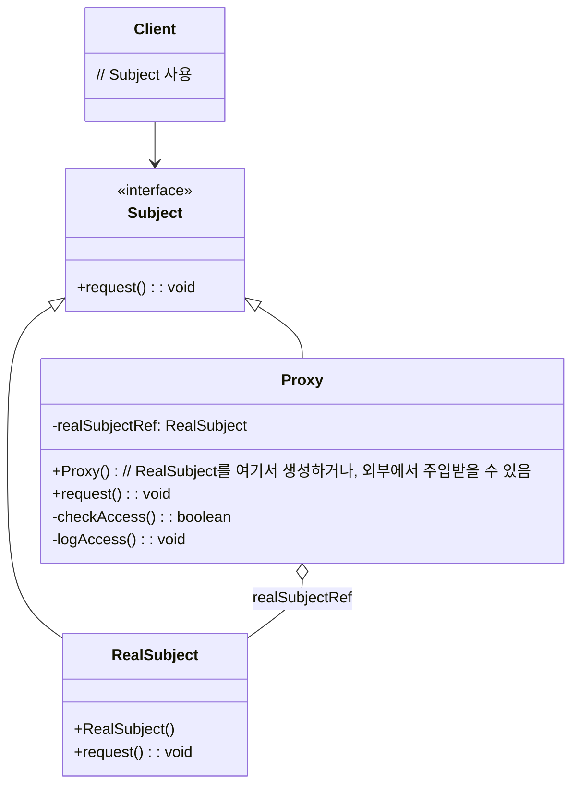

영화나 드라마에서 중요한 인물에게는 항상 비서나 대리인이 있죠? 이들은 중요한 인물(실제 객체)을 대신하여 외부와의 소통을 관리하고, 불필요한 접근을 막거나, 사전 준비 작업을 처리합니다. 프록시 패턴은 소프트웨어 세계에서 바로 이러한 '대리인'의 역할을 수행합니다.

## 프록시 패턴이란 무엇인가요?

**프록시 패턴 (Proxy Pattern)** 은 **어떤 객체(실제 객체, Real Subject)에 대한 접근을 제어하기 위한 대리자(Proxy)나 자리 표시자(Placeholder)를 제공하는 패턴**입니다. 클라이언트는 실제 객체를 직접 참조하는 대신 프록시 객체를 참조하게 되며, 이 프록시 객체가 실제 객체로의 접근을 관리하거나 부가적인 작업을 수행합니다.

클라이언트 입장에서는 프록시를 사용하든 실제 객체를 사용하든 동일한 [[인터페이스(Interface)]]를 통해 상호작용하기 때문에, 프록시의 존재를 모를 수도 있습니다. 하지만 그 뒤에서는 프록시가 다양한 제어 로직을 수행하며 시스템의 효율성과 보안을 높이는 데 기여합니다.

프록시는 단순히 요청을 전달하는 것을 넘어, 실제 객체의 기능을 확장하거나 접근 방식을 변경하는 등 다양한 역할을 수행할 수 있습니다.

## 왜 프록시 패턴을 사용할까요?

프록시 패턴은 다양한 목적을 달성하기 위해 사용됩니다. 대표적인 경우들은 다음과 같습니다:

1. **지연 초기화(Lazy Initialization) (가상 프록시, Virtual Proxy)**: 실제 객체가 생성 비용이 크거나 당장 필요하지 않을 때, 프록시가 실제 객체 생성을 최대한 늦춥니다. 실제 객체에 대한 요청이 처음 들어올 때 객체를 생성하여 시스템 시작 시간을 단축하고 리소스를 절약합니다. (예: 고해상도 이미지 로딩, JPA의 엔티티 지연 로딩)
2. **접근 제어(Access Control) (보호 프록시, Protection Proxy)**: 특정 클라이언트만 실제 객체의 메서드를 호출할 수 있도록 접근 권한을 제어합니다. (예: 사용자 역할에 따른 기능 접근 제한)
3. **부가 기능 추가 (로깅, 캐싱, 트랜잭션 프록시 등)**: 실제 객체의 코드를 수정하지 않고, 프록시에서 로깅, 성능 측정, 결과 캐싱, 트랜잭션 관리 등의 부가적인 공통 관심사를 처리합니다. 이는 [[객체 지향 프로그래밍(OOP)]]의 핵심 원리이기도 합니다.
4. **원격 접근 (원격 프록시, Remote Proxy)**: 다른 주소 공간(예: 다른 서버)에 있는 객체를 마치 로컬에 있는 객체처럼 사용할 수 있도록 합니다. 프록시는 원격 통신과 관련된 복잡한 세부 사항을 숨겨줍니다. (원격 프로시저 호출(RPC) 개념과 관련)
5. **스마트 참조 (스마트 프록시, Smart Proxy/Smart Reference)**: 실제 객체에 접근할 때 추가적인 동작을 수행합니다. 예를 들어, 객체에 대한 참조 횟수를 계산하거나, 객체가 사용 중일 때 잠금을 수행하는 등의 작업을 할 수 있습니다.

## 프록시 패턴의 구조

프록시 패턴을 구성하는 주요 참여자는 다음과 같습니다:

- **Subject (주체)**: `RealSubject`와 `Proxy`가 공유하는 공통 인터페이스입니다. 클라이언트는 이 인터페이스를 통해 `RealSubject`나 `Proxy`를 동일한 방식으로 다룰 수 있습니다.
- **RealSubject (실제 주체)**: 프록시가 대변하는 실제 객체입니다. 핵심적인 비즈니스 로직을 수행하며, 프록시에 의해 요청이 위임됩니다.
- **Proxy (프록시)**: `RealSubject`와 동일한 `Subject` 인터페이스를 구현합니다. 내부적으로 `RealSubject` 객체에 대한 참조를 가질 수 있습니다. 클라이언트의 요청을 받으면, 프록시는 요청을 처리하기 전후에 필요한 부가 작업을 수행하고, 필요에 따라 `RealSubject`에게 실제 작업을 위임합니다.
- **Client (클라이언트)**: `Subject` 인터페이스를 통해 `Proxy` 객체를 사용합니다. 클라이언트는 자신이 `Proxy`를 사용하는지 `RealSubject`를 직접 사용하는지 알 필요가 없을 수도 있습니다.




## 프록시 패턴의 종류 및 예시 (Java 코드 - 가상 프록시)

프록시 패턴은 그 목적에 따라 다양한 종류로 나뉩니다. 가장 흔히 볼 수 있는 **가상 프록시(Virtual Proxy)** 를 이미지 로딩 예시로 살펴보겠습니다.

```java
// Subject 인터페이스
interface Image {
    void display();
}

// RealSubject 클래스
class RealImage implements Image {
    private String fileName;

    public RealImage(String fileName) {
        this.fileName = fileName;
        loadFromDisk(fileName); // 객체 생성 시 비용이 큰 작업 수행
    }

    private void loadFromDisk(String fileName) {
        System.out.println(fileName + " 이미지 로딩 중...");
        // 실제 이미지 파일 로딩 로직 (시간이 오래 걸린다고 가정)
        try {
            Thread.sleep(2000); // 2초 지연
        } catch (InterruptedException e) {
            e.printStackTrace();
        }
    }

    @Override
    public void display() {
        System.out.println(fileName + " 이미지 표시");
    }
}

// Proxy 클래스
class ProxyImage implements Image {
    private RealImage realImage; // RealSubject 참조
    private String fileName;

    public ProxyImage(String fileName) {
        this.fileName = fileName;
    }

    @Override
    public void display() {
        if (realImage == null) { // 실제 객체가 필요할 때 생성 (지연 초기화)
            realImage = new RealImage(fileName);
        }
        realImage.display(); // 실제 객체에 작업 위임
    }
}

// Client
public class ImageViewer {
    public static void main(String[] args) {
        System.out.println("--- 이미지 뷰어 시작 ---");

        // ProxyImage를 사용하면 RealImage 객체는 display() 호출 전까지 생성되지 않음
        Image image1 = new ProxyImage("photo1.jpg");
        Image image2 = new ProxyImage("photo2.png");

        System.out.println("Proxy 객체는 생성되었지만, 아직 실제 이미지는 로딩되지 않았습니다.");

        // 실제 이미지가 필요한 시점 (display 호출 시)에 RealImage 객체가 생성되고 로딩됨
        System.out.println("\n첫 번째 이미지 표시 요청:");
        image1.display(); // 이때 photo1.jpg 로딩

        System.out.println("\n두 번째 이미지 표시 요청:");
        image2.display(); // 이때 photo2.png 로딩

        System.out.println("\n첫 번째 이미지 다시 표시 요청 (이미 로딩됨):");
        image1.display(); // 이미 로딩되었으므로 추가 로딩 없음
    }
}
```

위 예시에서 `ProxyImage`는 `display()` 메서드가 처음 호출될 때까지 `RealImage` 객체의 생성을 지연시킵니다. 이를 통해 애플리케이션 시작 시 모든 이미지를 한 번에 로딩하는 부담을 줄일 수 있습니다.

다른 종류의 프록시로는 다음과 같은 것들이 있습니다:

- **보호 프록시 (Protection Proxy)**: 객체에 대한 접근 권한을 제어합니다. 예를 들어, 특정 사용자 역할만 특정 메서드를 호출할 수 있도록 프록시에서 권한 검사를 수행합니다.
- **원격 프록시 (Remote Proxy)**: 다른 주소 공간에 있는 객체를 대표합니다. 로컬에서 원격 객체의 메서드를 호출하면, 원격 프록시는 네트워크 통신을 통해 실제 원격 객체에 요청을 전달하고 결과를 받아옵니다. Java RMI가 대표적인 예입니다.
- **로깅/캐싱 프록시**: 메서드 호출 정보를 로깅하거나, 자주 사용되는 결과를 캐싱하여 성능을 향상시키는 등의 부가 기능을 수행합니다.

## 프록시 패턴의 장점

- **개방-폐쇄 원칙 (OCP) 준수**: 기존 `RealSubject`의 코드를 변경하지 않고도 새로운 기능(접근 제어, 지연 초기화, 로깅 등)을 추가할 수 있습니다.
- **관심사 분리**: 핵심 비즈니스 로직(in `RealSubject`)과 부가적인 기능(in `Proxy`)을 분리하여 코드의 가독성과 유지보수성을 높입니다.
- **유연성**: 다양한 종류의 프록시를 통해 객체 접근을 유연하게 제어하고 관리할 수 있습니다.
- **리소스 관리 효율화**: 가상 프록시를 통해 불필요한 객체 생성을 막고 시스템 리소스를 효율적으로 사용할 수 있습니다.

## 프록시 패턴의 단점

- **코드 복잡성 증가**: 프록시 클래스를 추가로 작성해야 하므로 클래스 수가 늘어나고 구조가 다소 복잡해질 수 있습니다.
- **약간의 성능 저하 가능성**: 프록시를 통해 한 단계 간접적으로 `RealSubject`를 호출하므로, 아주 약간의 성능 오버헤드가 발생할 수 있습니다. (하지만 대부분의 경우, 프록시가 제공하는 이점-예: 지연 로딩으로 인한 초기 성능 향상-이 이를 상쇄합니다.)
- **프록시의 비대화**: 프록시가 너무 많은 책임을 떠안게 되면 프록시 클래스 자체가 복잡해지고 관리하기 어려워질 수 있습니다.

## 데코레이터 패턴과의 비교

프록시 패턴은 [[데코레이터 패턴 (Decorator Pattern)]]과 구조적으로 매우 유사하여 혼동하기 쉽습니다. 둘 다 실제 객체를 감싸는 형태로 동작하지만, 주된 **목적**에서 차이가 있습니다.

- **프록시 패턴**: 주로 객체에 대한 **접근 제어**나 실제 객체를 **대신**하는 역할(지연 로딩, 원격 접근 등)에 중점을 둡니다. 클라이언트는 프록시의 존재를 모를 수도 있습니다.
- **데코레이터 패턴**: 객체에 **동적으로 새로운 책임(기능)을 추가**하는 데 중점을 둡니다. 클라이언트는 일반적으로 데코레이터를 명시적으로 사용하여 객체를 장식합니다.

자세한 비교는 프록시 패턴과 데코레이터 패턴 비교 문서를 참고하시면 도움이 될 것입니다.

## 실생활 및 프레임워크 예시

프록시 패턴은 현대 소프트웨어 개발에서 매우 광범위하게 사용됩니다:

- **[[스프링 프레임워크(Spring Framework)]]의 AOP (Aspect-Oriented Programming)**: 스프링 AOP는 프록시 패턴을 기반으로 동작합니다. 타겟 객체(RealSubject)의 메서드 호출 전후에 트랜잭션 관리, 보안 검사, 로깅 등의 공통 관심사(Cross-cutting concerns)를 프록시를 통해 동적으로 추가합니다. 스프링은 JDK Dynamic Proxy나 CGLIB 라이브러리를 사용하여 런타임에 프록시 객체를 생성합니다. (스프링 AOP와 프록시에서 더 자세히 알아보세요!)
- **JPA (Java Persistence API) / Hibernate의 지연 로딩 (Lazy Loading)**: 연관된 엔티티(Entity)나 컬렉션을 실제 사용할 때까지 데이터베이스에서 로딩하는 것을 지연시키기 위해 가상 프록시를 사용합니다. 예를 들어, `Order` 엔티티를 조회할 때 `Order.getCustomer()`를 호출하기 전까지 `Customer` 엔티티는 프록시 객체로 존재하다가, 실제 접근 시에 데이터베이스에서 로딩됩니다.
- **Java RMI (Remote Method Invocation)**: 원격 서버에 있는 객체의 메서드를 로컬에서 호출할 수 있도록 하는 기술로, 원격 프록시의 대표적인 예입니다.
- **보안 시스템**: 특정 리소스나 기능에 대한 접근 권한을 제어하는 데 보호 프록시가 사용될 수 있습니다.

## 결론

프록시 패턴은 실제 객체에 대한 접근을 유연하게 제어하고 다양한 부가 기능을 투명하게 추가할 수 있도록 해주는 매우 강력하고 실용적인 디자인 패턴입니다. 특히 스프링과 같은 프레임워크에서는 핵심적인 역할을 담당하고 있으므로, 그 원리를 이해하는 것은 현대적인 애플리케이션 개발에 큰 도움이 될 것입니다.

오늘 하루도 고생 많으셨습니다! 프록시 패턴에 대한 이해가 여러분의 퇴근길 발걸음을 조금이나마 가볍게 해드렸기를 바랍니다. 다음 디자인 패턴 이야기에서 또 만나요!