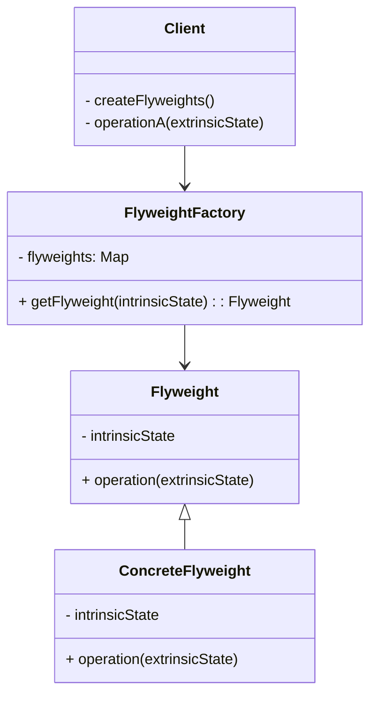

플라이웨이트 패턴은 구조 패턴의 하나로, 많은 수의 유사한 객체들이 필요할 때 메모리 사용을 최적화하기 위한 디자인 패턴입니다. 이 패턴은 객체의 상태를 '고유한(intrinsic) 상태'와 '공유한(extrinsic) 상태'로 분리하여, 동일한 고유 상태를 가진 객체들을 공유함으로써 메모리 사용량을 크게 줄일 수 있습니다.

## 문제 상황

수천, 수백만 개의 유사한 객체를 생성해야 하는 상황을 생각해봅시다. 예를 들어, 텍스트 에디터에서 각 문자를 객체로 표현하거나, 게임에서 수많은 입자(총알, 파편 등)를 렌더링해야 하는 경우가 있습니다. 이런 경우 각 객체마다 모든 상태를 독립적으로 저장하면 RAM 사용량이 급증하여 시스템 성능에 심각한 문제가 발생할 수 있습니다.

## 해결책

플라이웨이트 패턴은 객체의 상태를 다음과 같이 두 부분으로 나눕니다:

1. **고유한(intrinsic) 상태**: 여러 객체 간에 공유할 수 있는 불변 데이터입니다. 예를 들어, 텍스트 에디터의 문자 객체에서 글꼴, 크기, 색상 정보 등이 이에 해당합니다.
    
2. **공유한(extrinsic) 상태**: 각 객체마다 고유하며 컨텍스트에 따라 달라지는 데이터입니다. 예를 들어, 문자의 위치 좌표나 게임 입자의 속도와 방향 등이 이에 해당합니다.
    

플라이웨이트 패턴은 고유한 상태만 가진 플라이웨이트 객체를 생성하고, 공유한 상태는 외부에서 파라미터로 전달하는 방식으로 동작합니다. 이를 통해 동일한 고유 상태를 가진 객체는 하나의 인스턴스만 생성하여 공유함으로써 메모리 사용량을 크게 줄일 수 있습니다.

## 구조



- **Flyweight**: 플라이웨이트 인터페이스로, 고유한 상태를 사용하는 메서드와 외부에서 전달받은 공유 상태를 함께 사용하는 연산을 정의합니다.
- **ConcreteFlyweight**: 구체적인 플라이웨이트 클래스로, 공유 가능한 고유 상태를 저장합니다.
- **FlyweightFactory**: 플라이웨이트 객체를 생성하고 관리하는 팩토리 클래스입니다. 이미 생성된 플라이웨이트가 있다면 재사용하고, 없다면 새로 생성합니다.
- **Client**: 플라이웨이트를 사용하는 클라이언트로, 공유 상태를 관리하고 필요할 때 적절한 플라이웨이트와 함께 사용합니다.

## 구현 예시

간단한 텍스트 에디터에서 문자를 표현하는 예제를 살펴보겠습니다.

```java
// 문자의 고유한 상태를 담는 플라이웨이트 클래스
public class CharacterFlyweight {
    private final char character;
    private final String fontFamily;
    private final int fontSize;
    private final boolean isBold;
    private final boolean isItalic;
    
    public CharacterFlyweight(char character, String fontFamily, int fontSize, boolean isBold, boolean isItalic) {
        this.character = character;
        this.fontFamily = fontFamily;
        this.fontSize = fontSize;
        this.isBold = isBold;
        this.isItalic = isItalic;
    }
    
    // 고유 상태를 사용하는 메서드들...
    public char getCharacter() {
        return character;
    }
    
    public String getFontFamily() {
        return fontFamily;
    }
    
    public int getFontSize() {
        return fontSize;
    }
    
    public boolean isBold() {
        return isBold;
    }
    
    public boolean isItalic() {
        return isItalic;
    }
    
    // 외부에서 전달받은 공유 상태(좌표)와 함께 문자를 그리는 메서드
    public void draw(Graphics g, int x, int y) {
        // 폰트 설정
        Font font = new Font(fontFamily, 
                            (isBold ? Font.BOLD : 0) | (isItalic ? Font.ITALIC : 0), 
                            fontSize);
        g.setFont(font);
        
        // 문자 그리기
        g.drawString(String.valueOf(character), x, y);
    }
}

// 플라이웨이트 팩토리 클래스
public class CharacterFlyweightFactory {
    private static final Map<String, CharacterFlyweight> flyweights = new HashMap<>();
    
    // 플라이웨이트 객체를 얻는 메서드
    public static CharacterFlyweight getCharacterFlyweight(char character, String fontFamily, int fontSize, boolean isBold, boolean isItalic) {
        // 고유 상태를 기반으로 키 생성
        String key = character + fontFamily + fontSize + (isBold ? "B" : "") + (isItalic ? "I" : "");
        
        // 기존 플라이웨이트가 있으면 반환, 없으면 새로 생성
        CharacterFlyweight flyweight = flyweights.get(key);
        if (flyweight == null) {
            flyweight = new CharacterFlyweight(character, fontFamily, fontSize, isBold, isItalic);
            flyweights.put(key, flyweight);
            System.out.println("새로운 문자 플라이웨이트 생성: " + key);
        }
        return flyweight;
    }
    
    public static int getFlyweightCount() {
        return flyweights.size();
    }
}

// 문자의 외부 상태(위치)를 포함하는 컨텍스트 클래스
public class CharacterContext {
    private final CharacterFlyweight flyweight;
    private int x;
    private int y;
    
    public CharacterContext(CharacterFlyweight flyweight, int x, int y) {
        this.flyweight = flyweight;
        this.x = x;
        this.y = y;
    }
    
    public void draw(Graphics g) {
        flyweight.draw(g, x, y);
    }
    
    // 위치 조정 메서드
    public void setPosition(int x, int y) {
        this.x = x;
        this.y = y;
    }
}

// 텍스트 에디터 클래스 예시
public class TextEditor {
    private final List<CharacterContext> characters = new ArrayList<>();
    
    public void addCharacter(char c, String font, int size, boolean bold, boolean italic, int x, int y) {
        // 플라이웨이트 팩토리에서 플라이웨이트 객체 얻기
        CharacterFlyweight flyweight = CharacterFlyweightFactory.getCharacterFlyweight(c, font, size, bold, italic);
        
        // 외부 상태와 함께 컨텍스트 객체 생성
        CharacterContext context = new CharacterContext(flyweight, x, y);
        characters.add(context);
    }
    
    public void draw(Graphics g) {
        for (CharacterContext character : characters) {
            character.draw(g);
        }
    }
    
    public int getCharacterCount() {
        return characters.size();
    }
    
    public int getFlyweightCount() {
        return CharacterFlyweightFactory.getFlyweightCount();
    }
}
```

사용 예시:

```java
public class Main {
    public static void main(String[] args) {
        TextEditor editor = new TextEditor();
        
        // 텍스트 추가 (Hello, World! 반복)
        String text = "Hello, World! ";
        String font = "Arial";
        int size = 12;
        
        for (int i = 0; i < 1000; i++) {
            int x = (i % 50) * 10;  // 단순화된 위치 계산
            int y = (i / 50) * 15;
            
            for (int j = 0; j < text.length(); j++) {
                char c = text.charAt(j);
                boolean bold = (i % 2 == 0);  // 홀수 번째 줄은 볼드
                boolean italic = (j % 3 == 0);  // 3의 배수 위치의 문자는 이탤릭
                
                editor.addCharacter(c, font, size, bold, italic, x + j * 8, y);
            }
        }
        
        System.out.println("총 문자 수: " + editor.getCharacterCount());
        System.out.println("플라이웨이트 객체 수: " + editor.getFlyweightCount());
        // 결과: 많은 문자(14,000개 이상)가 저장되지만, 플라이웨이트 객체는 고작 28개 정도만 생성됨
    }
}
```

위 예제에서 같은 문자, 폰트, 크기, 스타일 조합은 단 하나의 `CharacterFlyweight` 객체만 생성됩니다. 결과적으로 14,000개 이상의 문자를 저장하더라도 고유한 플라이웨이트 객체는 28개 정도만 생성되므로 메모리 사용량이 크게 줄어듭니다.

## 플라이웨이트 패턴의 실제 활용

플라이웨이트 패턴은 다음과 같은 실제 환경에서 활용됩니다:

1. **텍스트 에디터**: 위 예제처럼 대량의 문자 처리 시 메모리 절약
2. **그래픽 시스템**: 이미지, 아이콘, 스프라이트 등의 공유
3. **게임 개발**: 대량의 게임 오브젝트(나무, 입자 효과 등) 렌더링
4. **데이터베이스 연결 풀**: 동일한 설정의 데이터베이스 연결을 공유
5. **캐싱 시스템**: 자주 사용되는 동일 데이터의 공유

## Spring 프레임워크에서의 활용 예시

Spring에서도 플라이웨이트 패턴을 활용할 수 있습니다. 예를 들어, Spring의 Bean Scope에서 `singleton` 스코프는 플라이웨이트 패턴과 유사한 개념을 적용합니다.

```java
@Configuration
public class FlyweightConfig {
    
    @Bean
    @Scope("singleton")  // 기본값이라 생략 가능
    public ExpensiveResource expensiveResourceFlyweight() {
        // 생성 비용이 큰 리소스를 한 번만 생성하고 공유
        System.out.println("비용이 큰 리소스 생성");
        return new ExpensiveResource();
    }
    
    // 사용 예시용 서비스
    @Bean
    public SomeService someService1() {
        return new SomeService(expensiveResourceFlyweight(), "서비스1");
    }
    
    @Bean
    public SomeService someService2() {
        return new SomeService(expensiveResourceFlyweight(), "서비스2");
    }
}

// 생성 비용이 큰 리소스
public class ExpensiveResource {
    private final byte[] data = new byte[100 * 1024 * 1024]; // 100MB
    
    // 기타 메서드...
}

// 서비스 클래스
public class SomeService {
    private final ExpensiveResource resource;
    private final String name;
    
    public SomeService(ExpensiveResource resource, String name) {
        this.resource = resource;
        this.name = name;
        System.out.println(name + " 서비스가 리소스를 공유받음");
    }
    
    // 비즈니스 로직...
    public void doSomething() {
        System.out.println(name + "에서 공유 리소스 사용 중");
    }
}
```

위 예제에서 `ExpensiveResource`는 생성 비용이 큰 리소스로, Spring의 싱글턴 스코프를 통해 한 번만 생성되고 여러 서비스에서 공유됩니다. 이는 플라이웨이트 패턴의 원리를 활용한 것입니다.

## 장점과 단점

### 장점

1. **메모리 사용량 감소**: 동일한 데이터를 여러 객체가 공유함으로써 메모리를 절약할 수 있습니다.
2. **객체 생성 비용 감소**: 동일한 내용의 객체를 여러 번 생성하지 않고 재사용함으로써 객체 생성 비용을 줄입니다.
3. **성능 향상**: 객체 생성 및 가비지 컬렉션의 부담이 줄어들어 전반적인 시스템 성능이 향상됩니다.

### 단점

1. **코드 복잡성 증가**: 상태를 내부와 외부로 분리하고 관리하는 과정에서 코드가 복잡해질 수 있습니다.
2. **디버깅 어려움**: 객체가 공유되므로 디버깅이 어려울 수 있습니다.
3. **변경 위험**: 플라이웨이트 객체가 불변(immutable)이어야 하므로, 실수로 수정하면 모든 사용처에 영향을 미칩니다.
4. **컨텍스트 전환 비용**: 외부 상태를 메서드 파라미터로 전달하는 과정에서 CPU 사용량이 증가할 수 있습니다.

## 다른 패턴과의 관계

1. **싱글턴(Singleton)**: 플라이웨이트는 여러 다른 객체를 공유하고, 싱글턴은 하나의 객체만 존재합니다. 플라이웨이트 팩토리는 종종 싱글턴으로 구현됩니다.
2. **복합체(Composite)**: 플라이웨이트는 종종 복합체 패턴의 잎 노드를 구현할 때 사용되어 메모리를 절약합니다.
3. **전략(Strategy)**: 플라이웨이트는 객체 공유에 중점을 두고, 전략은 교체 가능한 알고리즘에 중점을 둡니다.
4. **프록시(Proxy)**: 프록시는 객체에 대한 접근을 제어하는 반면, 플라이웨이트는 객체 자체를 공유합니다.

## 적용 시점

플라이웨이트 패턴은 다음과 같은 상황에서 사용하는 것이 좋습니다:

1. 애플리케이션이 **대량의 유사한 객체**를 생성해야 할 때
2. 메모리 사용량이 **주요 성능 이슈**일 때
3. 객체의 대부분 상태가 **외부 상태로 분리 가능**할 때
4. 객체들 사이에 **공유 가능한 중복 데이터가 많을** 때
5. 객체 공유 후 식별성(identity)이 더 이상 **중요하지 않을** 때

## 결론

플라이웨이트 패턴은 대량의 객체를 다룰 때 메모리 사용을 최적화하는 강력한 도구입니다. 이 패턴을 통해 고유 상태와 공유 상태를 분리하고, 동일한 고유 상태를 가진 객체를 공유함으로써 메모리 사용량을 크게 줄일 수 있습니다. 그러나 코드 복잡성이 증가하고 디버깅이 어려워질 수 있다는 점을 염두에 두어야 합니다. 따라서 실제 메모리 문제가 있는 상황에서만 적용하는 것이 좋습니다.