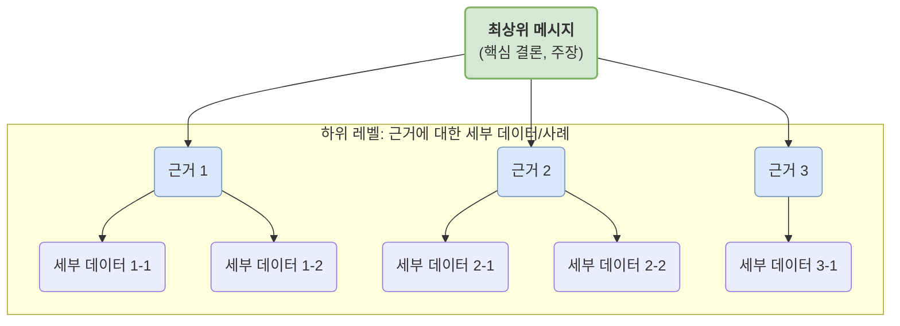

**피라미드 원칙(Pyramid Principle)**은 컨설팅 회사 맥킨지 앤 컴퍼니의 바바라 민토(Barbara Minto)가 개발한 매우 강력하고 체계적인 글쓰기 및 사고 정리 방법론입니다. 핵심은 **결론을 먼저 제시하고(결론 우선), 그에 대한 근거들을 피라미드 형태로 조직화하여 논리적으로 뒷받침하는 것**입니다.

이 원칙은 보고서, 이메일, 프레젠테이션 등 비즈니스 커뮤니케이션에서 생각을 명확하고 설득력 있게 전달하는 데 매우 효과적입니다.

## 왜 피라미드 구조인가?

사람의 뇌는 연관성 있는 정보들을 그룹화하여 이해하는 경향이 있습니다. 세부 사항을 먼저 나열하고 결론을 나중에 제시하면, 듣는 사람은 각 세부 정보들이 어떤 관계에 있는지, 무엇을 말하려는 것인지 추론하며 들어야 하므로 상당한 정신적 노력이 필요합니다.

피라미드 원칙은 이러한 뇌의 작동 방식에 맞춰, 가장 상위 수준의 요약된 생각(결론)을 먼저 전달합니다. 그러면 독자나 청중은 글의 핵심과 전체적인 구조를 미리 파악한 상태에서 세부 내용을 접하게 되므로, 훨씬 쉽고 빠르게 내용을 이해할 수 있습니다.

## 피라미드 원칙의 기본 구조

피라미드 구조는 크게 수직적 관계와 수평적 관계로 이루어집니다.

### 1. 수직적 관계 (Vertical Relationship)

- 피라미드의 위에서 아래로 내려가는 관계를 말합니다.
- 상위 메시지(결론)는 바로 아래 하위 메시지들(근거)의 핵심을 요약한 것이어야 합니다.
- 독자가 상위 메시지를 보고 "왜 그렇게 생각하지? (Why so?)" 또는 "어떻게 그렇게 할 수 있지? (How so?)"라는 질문을 던졌을 때, 하위 메시지들이 그에 대한 명쾌한 답변이 되어야 합니다.

### 2. 수평적 관계 (Horizontal Relationship)

- 피라미드에서 같은 레벨에 있는 메시지들 간의 관계를 말합니다.
- 동일한 계층에 있는 근거들은 논리적으로 동일한 종류여야 하며, 함께 모여 상위 메시지를 온전하게 뒷받침해야 합니다.
- 이때, 근거들은 [[MECE 원칙]]에 따라 서로 중복되지 않고(Mutually Exclusive), 전체적으로 누락된 항목이 없어야(Collectively Exhaustive) 합니다.
- 수평적 관계를 구성하는 논리 전개 방식은 주로 두 가지입니다.
    - **연역적 추론 (Deductive Reasoning):** '대前提 - 소前提 - 결론'의 삼단논법처럼, 앞선 사실로부터 논리적 필연성에 따라 결론을 이끌어내는 방식입니다. (예: 모든 사람은 죽는다 -> 소크라테스는 사람이다 -> 그러므로 소크라테스는 죽는다)
    - **귀납적 추론 (Inductive Reasoning):** 여러 개의 구체적인 사례나 관찰(근거)로부터 일반적인 결론이나 원칙을 이끌어내는 방식입니다. 비즈니스 문서에서 가장 흔하게 사용됩니다.

## 도입부 구성: SCQA 프레임워크

바바라 민토는 독자의 흥미를 유발하고 왜 이 글을 읽어야 하는지 명확히 하기 위한 도입부 구성 방식으로 **SCQA**를 제시했습니다.

1. **S (Situation, 상황):** 독자가 이미 알고 있거나 쉽게 동의할 수 있는 일반적인 상황을 설명합니다. (예: "최근 A 서비스의 월간 활성 사용자(MAU)가 정체 상태입니다.")
2. **C (Complication, 전개/문제):** 이 상황 속에서 발생한 변화나 문제점을 제시합니다. (예: "특히, 핵심 기능인 '콘텐츠 공유'의 사용률이 지난 분기 대비 30% 감소했습니다.")
3. **Q (Question, 질문):** 상황과 문제로 인해 자연스럽게 제기되는 질문을 도출합니다. 이 질문은 독자의 머릿속에 떠오를 질문과 일치해야 합니다. (예: "어떻게 하면 콘텐츠 공유 기능을 다시 활성화할 수 있을까요?")
4. **A (Answer, 답변):** 이 질문에 대한 핵심 답변을 제시합니다. 이 답변이 바로 피라미드 구조의 최상위 메시지가 됩니다. (예: "UI를 직관적으로 개선하고 공유 프로세스를 단축하여 사용성을 높이는 방향으로 기능을 개편해야 합니다.")

## 피라미드 원칙 적용의 장점

- **명확성:** 두괄식 구성으로 핵심을 빠르게 전달하여 커뮤니케이션 효율을 극대화합니다.
- **논리성:** 생각을 구조화하는 과정에서 논리의 허점을 스스로 점검하고 보완하게 됩니다.
- **설득력:** 탄탄한 근거들이 상위 주장을 체계적으로 뒷받침하므로 메시지의 설득력이 높아집니다.
- **시간 절약:** 보고를 받는 사람과 하는 사람 모두의 시간을 절약해 줍니다. 보고받는 사람은 핵심을 빠르게 파악할 수 있고, 보고하는 사람은 불필요한 질문을 줄일 수 있습니다.

피라미드 원칙은 단순히 글쓰기 기술을 넘어, **복잡한 문제를 구조적으로 분석하고 해결책을 찾아가는 사고의 틀(Thinking Framework)**이라고 할 수 있습니다. 이 원칙을 꾸준히 훈련하면 개발자로서 기술 문서를 작성하거나, 프로젝트 제안, 문제 해결 방안을 제시할 때 훨씬 더 명확하고 설득력 있는 커뮤니케이션을 할 수 있게 될 것입니다.