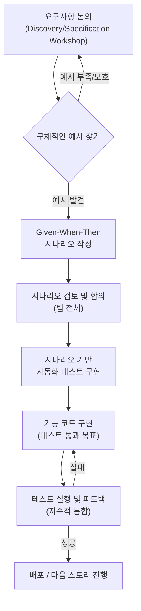

소프트웨어 개발의 궁극적인 목표는 사용자에게 가치를 전달하고, 복잡한 비즈니스 요구사항을 정확히 충족시키는 것입니다. 하지만 프로젝트를 진행하다 보면 기획자, 개발자, QA 테스터 등 다양한 이해관계자들 사이에 미묘한 오해나 잘못된 해석으로 인해 예상치 못한 결과물이 나오거나, 프로젝트 막바지에 중요한 요구사항이 누락되었음을 발견하는 안타까운 상황을 종종 마주하게 됩니다.

**행위 주도 개발(Behavior-Driven Development, BDD)**은 바로 이러한 소통의 간극을 메우고, 팀 전체가 동일한 목표를 향해 나아갈 수 있도록 돕는 강력한 개발 접근법입니다. BDD는 단순한 테스트 기법을 넘어, 소프트웨어의 "행위(Behavior)"에 초점을 맞추어 개발의 모든 단계를 이끌어가는 개발 문화이자 방법론입니다.

이 글을 통해 BDD가 무엇인지, 어떤 배경에서 등장했으며 핵심 원칙은 무엇인지, 그리고 BDD를 실천함으로써 얻을 수 있는 이점과 실제 개발 프로세스에 어떻게 적용할 수 있는지 명확하게 이해하실 수 있을 것입니다.

---

## 행위 주도 개발(BDD)이란 무엇인가?

**행위 주도 개발(BDD)**은 소프트웨어 개발 팀이 비즈니스 가치에 집중하고, 모든 구성원(개발자, QA, 기획자, 심지어 고객까지) 간의 **공통된 이해와 긴밀한 협업**을 증진시키기 위해 고안된 애자일 소프트웨어 개발 방법론입니다. BDD의 핵심은 **소프트웨어가 제공해야 하는 구체적인 행위**를 중심으로 요구사항을 정의하고, 이를 기반으로 개발과 테스트를 진행하는 것입니다.

BDD는 [[테스트 주도 개발(TDD)]]의 아이디어에서 출발했지만, 한 걸음 더 나아가 '무엇을 테스트할 것인가'를 넘어 '왜 이 기능이 필요한가'와 '이 기능이 사용자에게 어떤 행위를 제공해야 하는가'에 대한 질문에 답하고자 합니다.

BDD에서 행위를 명세화하는 데 가장 널리 사용되는 형식은 바로 우리가 이전에 살펴본 [[Given-When-Then 패턴]]입니다. 이 패턴은 자연어에 가까운 형태로 시나리오를 작성하여, 기술적인 지식이 없는 사람도 시스템의 행위를 쉽게 이해하고 검증 과정에 참여할 수 있도록 돕습니다.

---

## BDD의 등장 배경 및 목표

BDD는 2000년대 초반 댄 노스(Dan North)에 의해 처음 제안되었습니다. 이는 기존의 [[테스트 주도 개발(TDD)]]가 가진 몇 가지 한계점을 개선하고, 개발 과정에서 발생하는 소통의 문제를 해결하고자 하는 노력의 일환이었습니다. TDD는 개발자에게 매우 유용한 기법이지만, 때로는 테스트의 목적이 비즈니스 요구사항보다는 코드의 기술적인 측면에만 치우치거나, 테스트 케이스가 비개발자들이 이해하기 어려운 형태로 작성되는 경우가 있었습니다.

BDD는 이러한 간극을 메우기 위해 다음과 같은 주요 목표를 추구합니다:

- **이해관계자 간의 공통된 이해 형성**: 개발자와 비개발자(기획자, QA, 현업 사용자 등)가 소프트웨어의 기능과 동작 방식에 대해 동일한 그림을 그리도록 돕습니다.
- **요구사항의 모호함 제거**: 추상적인 요구사항 대신, 구체적인 "예시(Examples)"를 기반으로 행위를 정의함으로써 모호함을 줄이고 명확성을 높입니다.
- **개발 프로세스 초기의 활발한 피드백 루프 구축**: 시나리오 작성 단계부터 다양한 관점의 피드백을 반영하여 잘못된 방향으로 개발이 진행되는 것을 조기에 방지합니다.
- **살아있는 문서(Living Documentation) 구축**: BDD 시나리오 자체가 시스템의 현재 행위를 가장 정확하게 설명하는 최신 문서가 됩니다. 코드가 변경되면 시나리오(테스트)도 함께 변경되어, 문서와 실제 구현 간의 괴리를 최소화합니다. 더 자세한 내용은 [[살아있는 문서(Living Documentation)]]를 참고해주세요.

---

## BDD의 핵심 원칙

BDD를 성공적으로 실천하기 위한 몇 가지 핵심 원칙이 있습니다.

1. **비즈니스 가치 중심 (Business Value First)**: 개발의 모든 결정과 활동은 최종적으로 비즈니스 목표 달성과 사용자 가치 제공에 기여해야 합니다. 모든 [[사용자 스토리(User Story)]]와 시나리오는 이러한 관점에서 정의되고 우선순위가 매겨집니다.
2. **협업과 소통 (Collaboration and Communication)**: BDD는 혼자 하는 활동이 아닙니다. 개발자, 테스터, 프로덕트 오너, 디자이너 등 다양한 역할의 사람들이 함께 모여 대화하고 시나리오를 작성하며 공동의 이해를 구축해 나갑니다.
3. **구체적인 예시 사용 (Concrete Examples)**: "시스템은 빨라야 한다"와 같은 추상적인 표현 대신, "사용자가 검색 버튼을 누르면 3초 안에 결과가 표시되어야 한다"처럼 구체적이고 측정 가능한 예시를 통해 행위를 정의합니다. 이것이 바로 "Specification by Example"의 핵심입니다.
4. **보편적인 언어 사용 (Ubiquitous Language)**: [[도메인 주도 설계(DDD,Domain Driven Design)]]에서 강조하는 개념으로, 프로젝트에 참여하는 모든 사람이 동일한 용어를 사용하여 소통함으로써 오해의 소지를 줄입니다. BDD 시나리오는 이러한 보편적인 언어로 작성됩니다.
5. **외부에서 내부로 (Outside-In Development)**: 사용자의 관점에서 시스템의 행위를 먼저 정의하고, 이를 만족시키기 위해 내부 구현을 진행하는 하향식 접근 방식을 장려합니다.
6. **지속적인 자동화 테스트 (Continuous Automated Testing)**: 정의된 시나리오는 자동화된 [[인수 테스트(Acceptance Test)]]로 구현되어, 시스템이 의도한 대로 동작하는지 지속적으로 검증합니다.

---

## BDD 프로세스: 함께 만들어가는 소프트웨어

BDD는 특정한 도구나 기술에 국한되기보다는, 협업을 중심으로 하는 일련의 흐름을 따릅니다. 일반적인 BDD 프로세스는 다음과 같이 진행될 수 있습니다.




1. **요구사항 논의 (Discovery / Specification Workshop)**: 모든 이해관계자가 함께 모여 [[사용자 스토리(User Story)]]를 기반으로 토론합니다. 이 과정에서 "Three Amigos" (보통 프로덕트 오너, 개발자, 테스터 대표) 미팅이 활용되기도 합니다. 목표는 기능에 대한 다양한 관점을 나누고 숨겨진 요구사항이나 예외 케이스를 발견하는 것입니다.
2. **구체적인 예시 찾기**: 논의된 요구사항을 바탕으로, 시스템이 어떻게 동작해야 하는지를 보여주는 구체적인 예시들을 도출합니다.
3. **시나리오 작성 (Specification by Example)**: 도출된 예시들을 [[Given-When-Then 패턴]]을 사용하여 자연어 형태의 시나리오로 명세화합니다. 이때 사용하는 언어는 팀 전체가 동의한 **보편적인 언어(Ubiquitous Language)**여야 합니다.

```Gherkin
    Feature: 온라인 서점 도서 검색
    
      Scenario: 저자 이름으로 도서 검색 성공
        Given 사용자가 로그인하지 않은 상태로 홈페이지에 접속했을 때
        And 검색창에 저자 이름 "김영하"를 입력하고
        When "검색" 버튼을 클릭하면
        Then 검색 결과 페이지로 이동해야 한다
        And 검색 결과 목록에는 "김영하" 저자의 도서들이 최소 1권 이상 보여야 한다
```
    
4. **시나리오 검토 및 합의**: 작성된 시나리오를 팀 전체가 다시 한번 검토하고, 모든 사람이 동의하는지 확인합니다. 이 과정에서 오해를 바로잡고 요구사항을 더욱 명확하게 다듬습니다.
5. **자동화된 테스트 구현**: 합의된 시나리오를 기반으로 자동화된 테스트 코드를 작성합니다. 이때 [[Cucumber]] (Java, Ruby 등), [[SpecFlow]] (.NET), [[JBehave]] (Java)와 같은 BDD 도구들이 활용됩니다. 이 도구들은 자연어로 작성된 Gherkin 시나리오를 실제 실행 가능한 코드로 연결해 줍니다.
6. **소프트웨어 기능 구현**: 작성된 자동화 테스트를 통과할 수 있도록 실제 애플리케이션 코드를 개발합니다. 개발자는 이 테스트들을 가이드 삼아 필요한 기능을 구현하게 됩니다.
7. **지속적인 검증 및 피드백**: 코드가 변경될 때마다 자동화된 테스트를 실행하여 시스템의 행위가 여전히 의도대로 작동하는지 지속적으로 확인합니다. 테스트 실패 시 즉각적인 피드백을 통해 문제를 빠르게 수정할 수 있습니다.

이러한 반복적인 과정을 통해 소프트웨어는 점진적으로 발전하며, 항상 비즈니스 요구사항에 부합하는 상태를 유지하게 됩니다.

---

## BDD의 장점: 왜 BDD를 선택해야 할까요? 🌟

BDD를 도입하면 개발팀과 프로젝트 전체에 많은 긍정적인 변화를 가져올 수 있습니다.

- **요구사항 명확화 및 오해 감소**: 가장 큰 장점입니다. 구체적인 시나리오를 통해 "같은 내용을 다르게 이해하는" 상황을 현저히 줄여줍니다.
- **향상된 협업 문화 조성**: 개발팀 내부뿐만 아니라 기획, 디자인, 현업 부서 등 다양한 팀과의 소통과 협업을 촉진합니다. 모두가 제품 개발에 적극적으로 참여하는 문화를 만듭니다.
- **고품질 소프트웨어 개발**: 사용자의 실제 사용 사례와 비즈니스 가치를 중심으로 개발하기 때문에, 최종적으로 사용자 만족도가 높은 고품질의 소프트웨어를 만들 가능성이 커집니다.
- **살아있는 문서 (Living Documentation) 확보**: BDD 시나리오와 자동화된 테스트는 코드와 함께 발전하는 "살아있는 문서"가 됩니다. 별도의 문서를 관리하는 데 드는 노력을 줄이고, 항상 최신 상태의 정확한 명세를 유지할 수 있습니다.
- **유지보수 용이성 증대**: 시스템의 각 기능이 어떤 행위를 수행해야 하는지 명확하게 문서화(시나리오)되어 있기 때문에, 시간이 지나도 시스템을 이해하고 수정하거나 확장하기가 용이합니다.
- **빠르고 빈번한 피드백**: 개발 초기 단계부터 지속적인 테스트와 검토를 통해 문제점을 조기에 발견하고 수정함으로써, 프로젝트 후반부에 발생할 수 있는 큰 비용과 위험을 줄일 수 있습니다.
- **개발자 만족도 향상**: 자신이 만드는 기능이 왜 필요하고 어떤 가치를 제공하는지 명확히 이해하고 개발할 수 있어 개발자의 동기 부여와 만족도를 높일 수 있습니다.

---

## BDD와 [[테스트 주도 개발(TDD)]] 비교

BDD는 TDD와 밀접한 관련이 있지만, 몇 가지 중요한 차이점이 있습니다.

|   |   |   |
|---|---|---|
|**특징**|**[[테스트 주도 개발(TDD)]]**|**행위 주도 개발(BDD)**|
|**주요 관점**|개발자 관점, 코드의 내부 구조 및 단위 기능 검증에 초점|사용자/비즈니스 관점, 시스템의 외부에서 관찰 가능한 "행위" 검증에 초점|
|**사용 언어**|프로그래밍 언어 (예: Java, Python) 로 테스트 코드 직접 작성|자연어 또는 준자연어 (예: Gherkin)로 시나리오 작성 후 자동화 코드 연결|
|**소통 대상**|주로 개발자 자신 또는 다른 개발자|개발자, QA, 기획자, 고객 등 다양한 이해관계자|
|**테스트 범위**|주로 [[단위 테스트(Unit Test)]]|[[단위 테스트(Unit Test)]], [[인수 테스트(Acceptance Test)]], 통합 테스트 등 더 넓은 범위|
|**목표**|잘 설계되고 견고한 코드 작성, 기술적 부채 감소|비즈니스 요구사항 충족, 이해관계자 간의 공통된 이해, 살아있는 문서 구축|

BDD는 TDD를 대체한다기보다는 TDD의 원칙을 확장하고 보완하는 개념으로 볼 수 있습니다. 많은 팀에서는 BDD를 통해 시스템의 전체적인 행위를 정의하고, 그 내부 구현은 TDD 방식을 따르는 형태로 두 가지를 함께 활용하기도 합니다. 둘의 관계 및 시너지 효과에 대한 자세한 내용은 [[TDD vs BDD 비교 분석]] 노트를 참고해주세요.

---

## BDD 도입 시 고려사항 🤔

BDD는 많은 이점을 제공하지만, 성공적인 도입을 위해서는 몇 가지 고려해야 할 사항이 있습니다.

- **팀 문화의 변화 필요**: BDD는 도구나 기술보다 협업과 소통을 중시하는 문화가 바탕이 되어야 합니다. 팀원들이 적극적으로 의견을 개진하고 함께 문제를 해결하려는 자세가 중요합니다.
- **초기 학습 곡선**: BDD 개념, Gherkin 문법, 관련 도구(Cucumber 등) 사용법을 익히는 데 시간이 필요할 수 있습니다.
- **시나리오 작성 및 관리의 어려움**: 의미 있고 유지보수하기 좋은 시나리오를 작성하는 것은 생각보다 어려울 수 있습니다. 너무 많은 시나리오나 잘못된 추상화 수준의 시나리오는 오히려 부담이 될 수 있습니다.
- **초기 시간 투자**: 특히 프로젝트 초기에 이해관계자들이 모여 시나리오를 논의하고 작성하는 데 상당한 시간이 투자될 수 있습니다. 하지만 이는 장기적으로 볼 때 오해로 인한 재작업 비용을 줄여주는 효과적인 투자입니다.
- **모든 프로젝트에 적합한 것은 아님**: 매우 작거나 탐색적인 프로젝트, 또는 요구사항이 극도로 불확실한 경우에는 BDD의 모든 절차를 따르는 것이 비효율적일 수 있습니다. 프로젝트의 특성과 팀의 성숙도를 고려하여 유연하게 적용하는 지혜가 필요합니다.

성공적인 BDD 도입을 위한 전략에 대해서는 [[BDD 도입 전략]] 노트에서 더 자세히 다루겠습니다.

---

## 결론: 함께 만들어가는 더 나은 소프트웨어 🌈

행위 주도 개발(BDD)은 단순히 테스트 코드를 작성하는 새로운 방법이 아닙니다. 이는 **소프트웨어 개발의 전 과정에 걸쳐 협업을 강화하고, 비즈니스 가치를 중심으로 모든 활동을 정렬하며, 살아있는 문서를 통해 지속 가능한 개발을 가능하게 하는 개발 문화이자 철학**입니다.

BDD를 통해 우리는 "무엇을 만들어야 하는가"뿐만 아니라 "왜 만들어야 하는가"에 대한 깊은 공감대를 형성할 수 있습니다. 처음에는 다소 어색하고 추가적인 노력이 필요하다고 느껴질 수 있지만, 꾸준한 실천과 개선을 통해 BDD가 제공하는 진정한 가치를 경험하게 될 것입니다.

궁극적으로 BDD는 더 나은 소통, 더 명확한 목표, 그리고 사용자를 만족시키는 더 가치 있는 소프트웨어를 함께 만들어가는 여정입니다.

---

## 참고 자료

- Dan North - Introducing BDD: [https://dannorth.net/introducing-bdd/](https://dannorth.net/introducing-bdd/)
- Cucumber - BDD Basics: [https://cucumber.io/docs/bdd/](https://cucumber.io/docs/bdd/)
- Martin Fowler - BehaviorDrivenDevelopment: [https://martinfowler.com/bliki/BehaviorDrivenDevelopment.html](https://www.google.com/search?q=https://martinfowler.com/bliki/BehaviorDrivenDevelopment.html)
- Aslak Hellesøy, Matt Wynne - The Cucumber Book: Behaviour-Driven Development for Testers and Developers
- John Ferguson Smart - BDD in Action: Behavior-Driven Development for the whole software lifecycle