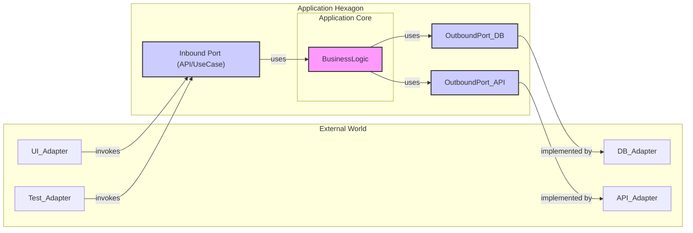

소프트웨어 개발 분야에서 아키텍처는 시스템의 품질, 유지보수성, 확장성을 결정짓는 매우 중요한 요소입니다. 다양한 아키텍처 패턴 중에서, 최근 몇 년간 많은 개발자에게 주목받으며 그 중요성이 강조되고 있는 패턴 중 하나가 바로 **헥사고널 아키텍처(Hexagonal Architecture)** 입니다. 이 아키텍처는 **포트와 어댑터(Ports and Adapters)** 아키텍처라는 이름으로도 잘 알려져 있으며, 애플리케이션의 핵심 로직을 외부 환경의 변화로부터 보호하고, 유연하며 테스트하기 쉬운 시스템을 구축하는 데 강력한 기반을 제공합니다.

본 문서는 헥사고널 아키텍처의 탄생 배경부터 핵심 구성 요소, 장단점, 그리고 실제 프로젝트에 적용하기 위한 구체적인 가이드라인까지 심도 있게 다루고자 합니다. 독자 여러분이 이 글을 통해 헥사고널 아키텍처에 대한 정확하고 깊이 있는 이해를 얻고, 실제 프로젝트에 성공적으로 적용하는 데 도움을 받을 수 있기를 바랍니다.

## I. 들어가며: 헥사고널 아키텍처란 무엇인가?

헥사고널 아키텍처는 2005년 앨리스터 콕번(Alistair Cockburn) 박사에 의해 공식적으로 제안된 소프트웨어 아키텍처 패턴입니다.1 이 아키텍처의 가장 근본적인 목표는 애플리케이션의 핵심 비즈니스 로직(도메인 로직)을 사용자 인터페이스(UI), 데이터베이스, 외부 API와 같은 외부 기술적 관심사로부터 철저히 분리(decoupling)하는 것입니다.1

이러한 분리를 통해 얻을 수 있는 핵심적인 이점은 애플리케이션의 코어가 외부 환경의 변화에 영향을 받지 않고 독립적으로 개발되고 테스트될 수 있다는 점입니다. 예를 들어, 데이터베이스 기술을 교체하거나 새로운 UI 프레임워크를 도입하더라도, 잘 설계된 헥사고널 아키텍처에서는 핵심 비즈니스 로직의 수정 없이 이러한 변경을 수용할 수 있습니다. 이는 애플리케이션의 생명주기 동안 발생할 수 있는 다양한 기술적 변화에 대한 적응력을 높이고, 시스템의 장기적인 유지보수 비용을 절감하는 데 크게 기여합니다. 결국 헥사고널 아키텍처는 애플리케이션의 핵심 가치인 비즈니스 로직을 외부의 기술적인 변화나 복잡성으로부터 '보호'하고, 그 자체로 온전히 테스트 가능하며 독립적으로 진화할 수 있도록 만드는 것을 지향합니다.

## II. 헥사고널 아키텍처의 탄생 배경과 핵심 구성 요소

헥사고널 아키텍처를 깊이 이해하기 위해서는 이 아키텍처가 어떤 문제의식을 바탕으로 등장했으며, 그 핵심을 이루는 구성 요소들이 무엇인지 명확히 파악하는 것이 중요합니다.

### 앨리스터 콕번이 헥사고널 아키텍처를 제안한 이유

앨리스터 콕번은 기존의 소프트웨어 개발 방식에서 반복적으로 나타나는 문제점들을 해결하고자 헥사고널 아키텍처를 고안했습니다. 전통적인 아키텍처에서는 종종 애플리케이션의 핵심 비즈니스 로직이 사용자 인터페이스(UI) 코드나 데이터베이스 접근 로직과 강하게 결합되는 경향이 있었습니다. 이러한 결합은 다음과 같은 실질적인 어려움을 야기했습니다 5

1. **자동화된 테스트의 어려움**: 비즈니스 로직의 일부가 UI의 시각적 세부 사항(예: 버튼 위치, 필드 크기)에 의존하게 되면, UI 변경 시 테스트 코드도 함께 수정해야 하는 등 자동화된 테스트 스위트를 안정적으로 구축하고 유지하기 어려웠습니다.
2. **시스템 구동 방식 전환의 어려움**: 사람이 직접 UI를 통해 시스템을 사용하는 방식에서 배치(batch) 작업이나 다른 프로그램에 의해 시스템이 구동되는 방식으로 전환하는 것이 매우 복잡하거나 불가능해졌습니다.
3. **외부 프로그램과의 연동 제약**: 다른 애플리케이션이 현재 시스템의 기능을 호출하거나 연동하려고 할 때, UI에 종속된 로직 때문에 API를 통한 깔끔한 연동이 어려웠습니다.

콕번은 이러한 문제들이 본질적으로 애플리케이션의 내부 로직과 외부 세계와의 상호작용 방식이 서로 뒤섞여 발생하는 대칭적인 문제임을 간파했습니다. 즉, UI와의 결합 문제나 데이터베이스와의 결합 문제 모두 핵심 로직이 특정 외부 기술에 종속됨으로써 발생하는 유사한 성격의 문제라는 것입니다.5 헥사고널 아키텍처는 이러한 문제들을 해결하기 위해, 애플리케이션이 제공하는 모든 기능이 외부 인터페이스(API)를 통해 동등하게 접근 가능하도록 설계하는 아이디어에서 출발했습니다. 이는 단순히 학문적인 탐구를 넘어, 개발 현장에서 겪는 실제적인 고통을 줄이고, 변화에 유연하며 테스트하기 쉬운 소프트웨어를 만들고자 하는 실질적인 필요성에서 비롯된 해결책이었습니다.

### "헥사고널(Hexagonal)"이라는 이름의 유래

앨리스터 콕번이 이 아키텍처를 설명하면서 육각형(hexagon) 모양의 다이어그램을 사용한 데에는 특별한 이유가 있습니다. 전통적인 아키텍처 다이어그램은 주로 사각형을 사용하여 계층을 표현했는데, 이는 종종 위-아래 또는 왼쪽-오른쪽과 같은 방향성을 암시하며 특정 계층(예: UI는 위, 데이터베이스는 아래)에 대한 고정관념을 갖게 했습니다.5 콕번은 이러한 고정관념에서 벗어나고자 했습니다.

육각형을 선택한 주된 이유는 다음과 같습니다 5:

- **방향성 탈피**: 육각형은 특정 방향(상하좌우)을 강요하지 않아, 애플리케이션 코어를 중심으로 다양한 외부 요소들이 대등하게 연결될 수 있음을 시각적으로 표현하기에 적합했습니다.
- **다수의 연결점 표현**: 육각형은 여러 개의 변을 가지고 있어, 애플리케이션이 다양한 종류의 외부 장치나 시스템과 여러 개의 포트(연결점)를 통해 상호작용할 수 있음을 나타내는 데 충분한 공간을 제공했습니다.
- **시각적 편의성**: 오각형이나 칠각형보다 그리기가 용이하면서도 사각형과는 다른 새로운 시각적 메타포를 제공할 수 있었습니다.

중요한 것은 육각형의 '6'이라는 숫자가 아키텍처적으로 특별한 의미를 가지는 것은 아니라는 점입니다.5 애플리케이션이 필요로 하는 포트의 개수는 2개가 될 수도, 4개가 될 수도, 혹은 그 이상이 될 수도 있습니다. 육각형은 단지 애플리케이션 코어가 여러 외부 요소와 다양한 인터페이스를 통해 상호작용한다는 개념을 시각적으로 강조하기 위한 장치입니다. 이처럼 육각형이라는 시각적 표현은 단순한 그림을 넘어, 아키텍처의 핵심 철학인 '내부와 외부의 분리', 그리고 '다양한 외부 요소와의 동등한 연결'을 직관적으로 전달하는 강력한 메타포로 작용합니다.

### 핵심 구성 요소: 포트(Ports)와 어댑터(Adapters)

헥사고널 아키텍처는 크게 애플리케이션 코어(또는 헥사곤), 포트, 그리고 어댑터라는 세 가지 핵심 구성 요소로 이루어집니다.

#### 1. 애플리케이션 코어 (Application Core / Hexagon)

애플리케이션 코어는 시스템의 심장부로, 순수한 비즈니스 로직과 도메인 규칙을 담고 있습니다.2 이 코어는 UI, 데이터베이스, 특정 프레임워크와 같은 외부 기술이나 인프라스트럭처의 세부 사항으로부터 완전히 독립적이어야 합니다. 즉, 코어 로직은 외부 세계가 어떻게 변화하든 그 자체로 완전하고 일관성 있게 유지되어야 합니다. 이것이 바로 헥사고널 아키텍처가 보호하고자 하는 가장 중요한 부분이며, 외부 환경의 변화에 흔들리지 않고 애플리케이션의 본질적인 기능을 안정적으로 수행하는, 시스템의 가장 중요한 자산이라고 할 수 있습니다.

#### 2. 포트 (Ports)

포트는 애플리케이션 코어가 외부 세계와 상호작용하는 방법을 정의하는 인터페이스입니다.3 포트는 특정 기술에 대한 약속이 아니라, 코어가 외부와 어떤 종류의 데이터를 주고받을지, 어떤 기능을 제공하거나 사용할지에 대한 '계약(contract)' 또는 API(Application Programming Interface)를 명세합니다.5 포트는 그 목적과 방향에 따라 인바운드 포트와 아웃바운드 포트로 구분됩니다.

- **인바운드 포트**: 외부의 요청을 받아 애플리케이션 코어의 기능을 실행하기 위한 인터페이스입니다.3 예를 들어, 사용자의 요청을 처리하는 유스케이스(Use Case) 인터페이스나 서비스 인터페이스가 인바운드 포트에 해당할 수 있습니다. 이러한 포트는 외부의 '주도 어댑터(Driving Adapter)'에 의해 호출됩니다.
- **아웃바운드 포트**: 애플리케이션 코어가 외부 시스템의 기능을 사용하기 위해 필요한 인터페이스입니다.3 예를 들어, 데이터베이스에 데이터를 저장하거나 조회하기 위한 리포지토리(Repository) 인터페이스, 또는 외부 서비스 API를 호출하기 위한 인터페이스가 아웃바운드 포트에 해당합니다. 이러한 포트는 애플리케이션 코어에 의해 호출되며, 외부의 '피주도 어댑터(Driven Adapter)'에 의해 구현됩니다.

포트는 단순한 기술적 인터페이스가 아니라, 애플리케이션 코어가 외부 세계와 '어떤 목적을 위해 어떻게 상호작용할 것인가'를 정의하는 의도적인 계약(Intentional Contract)입니다. 잘 정의된 포트는 시스템의 기능을 명확하게 드러내고, 코어와 외부 요소 간의 결합도를 낮추는 데 핵심적인 역할을 합니다.

#### 3. 어댑터 (Adapters)

어댑터는 포트 인터페이스와 실제 외부 기술 또는 시스템 사이를 연결하는 다리 역할을 합니다.3 어댑터는 포트에서 정의한 추상적인 약속(API)을 특정 기술이 이해할 수 있는 구체적인 방식으로 변환하거나, 그 반대의 변환을 수행합니다.5 어댑터 역시 포트와 마찬가지로 주도 어댑터와 피주도 어댑터로 나뉩니다.

- **]:** 외부 세계로부터의 요청을 받아 애플리케이션 코어의 인바운드 포트를 호출하는 역할을 합니다.10 예를 들어, 웹 요청을 처리하는] 컨트롤러, GUI 이벤트 핸들러, 자동화된 테스트 스크립트 등이 주도 어댑터에 해당합니다.
- **]:** 애플리케이션 코어의 아웃바운드 포트 인터페이스를 구현하여, 코어가 필요로 하는 외부 기능을 실제로 제공합니다.10 예를 들어, JPA를 사용하여 데이터베이스와 통신하는 리포지토리 구현체, 외부 REST API를 호출하는 클라이언트, 메시지 큐에 메시지를 발행하는 구현체 등이 피주도 어댑터에 해당합니다.

어댑터는 애플리케이션 코어의 언어(포트 인터페이스)와 외부 세계의 특정 기술 언어 사이를 번역하고 연결하는 '플러그 앤 플레이' 방식의 중개자라고 생각할 수 있습니다. 특정 데이터베이스를 사용하기 위한 어댑터, 특정 메시징 시스템을 위한 어댑터, 특정 UI 프레임워크를 위한 어댑터 등 다양한 어댑터가 존재할 수 있으며, 필요에 따라 어댑터를 교체하거나 추가함으로써 시스템의 유연성을 확보할 수 있습니다.

다음은 헥사고널 아키텍처의 주요 구성 요소와 상호작용을 보여주는 Mermaid 다이어그램입니다.



이 다이어그램은 헥사고널 아키텍처의 핵심 원칙 중 하나인 "의존성 흐름"을 명확하게 보여줍니다. 주도 어댑터(UI Adapter, Test Adapter)는 인바운드 포트를 호출하고, 이 인바운드 포트는 코어 비즈니스 로직을 사용합니다. 코어 비즈니스 로직은 다시 아웃바운드 포트(Repository Interface, External Service Interface)를 사용하며, 이 아웃바운드 포트는 외부의 피주도 어댑터(Database Adapter, External API Adapter)에 의해 구현됩니다. 중요한 점은 모든 의존성이 외부에서 내부(코어)를 향하거나, 코어가 정의한 추상화(포트)에 의존한다는 것입니다. 이는 전통적인 계층형 아키텍처에서 흔히 볼 수 있는, 비즈니스 로직이 데이터베이스와 같은 하위 계층의 구체적인 구현에 직접 의존하는 것과는 대조적입니다. 이러한 시각화는 헥사고널 아키텍처의 의존성 관리 방식을 직관적으로 이해하는 데 큰 도움을 줍니다.

### [[의존성 역전 원칙 (Dependency Inversion Principle)]]과 헥사고널 아키텍처

헥사고널 아키텍처의 핵심적인 설계 원리 중 하나는 **의존성 역전 원칙(Dependency Inversion Principle, DIP)** 을 적극적으로 활용한다는 것입니다.4

DIP의 핵심 내용은 다음과 같습니다 4:

- 고수준 모듈은 저수준 모듈에 의존해서는 안 된다. 둘 모두 추상화에 의존해야 한다.
- 추상화는 세부 사항에 의존해서는 안 된다. 세부 사항이 추상화에 의존해야 한다.

헥사고널 아키텍처에서 이 원칙은 다음과 같이 적용됩니다:

- **애플리케이션 코어(고수준 모듈)**는 자신이 필요로 하는 기능(예: 데이터 저장, 알림 발송)을 **포트(추상화)**라는 인터페이스로 정의합니다.
- **어댑터(저수준 모듈)**는 이 포트 인터페이스를 **구현(세부 사항)**합니다.
- 결과적으로, 애플리케이션 코어는 어댑터의 구체적인 기술(예: MySQL, Kafka, SMTP)이나 구현 방식에 대해 전혀 알 필요 없이, 오직 자신이 정의한 포트 인터페이스에만 의존하게 됩니다.

이러한 의존성 역전은 매우 중요합니다. 만약 DIP가 적용되지 않는다면, 애플리케이션 코어가 특정 데이터베이스 라이브러리나 UI 프레임워크의 구체적인 클래스를 직접 참조하게 될 것입니다. 이는 코어를 외부 기술에 종속시키고, 헥사고널 아키텍처가 추구하는 유연성과 테스트 용이성을 심각하게 저해합니다. 따라서 의존성 역전 원칙은 단순히 좋은 설계 지침을 넘어, 헥사고널 아키텍처가 그 목적을 달성할 수 있도록 하는 근본적인 메커니즘입니다. 의존성의 방향이 전통적인 방식(코어 -> 외부 기술)과 반대로, 외부(어댑터)에서 내부(코어가 정의한 포트)로 향하게 함으로써 코어의 독립성과 순수성을 지킬 수 있게 되는 것입니다.

## III. 헥사고널 아키텍처의 장점

헥사고널 아키텍처를 올바르게 적용했을 때 얻을 수 있는 이점은 다양하며, 이는 시스템의 품질과 개발 생산성에 긍정적인 영향을 미칩니다.

### 향상된 테스트 용이성 (Improved Testability)

헥사고널 아키텍처의 가장 두드러진 장점 중 하나는 테스트 용이성의 향상입니다.1 애플리케이션 코어가 UI, 데이터베이스, 외부 API와 같은 외부 기술로부터 완전히 분리되어 있기 때문에, 핵심 비즈니스 로직을 이러한 외부 요소 없이도 독립적으로, 그리고 매우 신속하게 테스트할 수 있습니다.

테스트 시에는 실제 어댑터 대신 목(Mock) 어댑터나 스텁(Stub) 어댑터를 사용하여 포트 인터페이스를 구현함으로써 테스트 환경을 손쉽게 제어할 수 있습니다.8 예를 들어, 데이터베이스에 접근하는 아웃바운드 포트에 대해 메모리 기반의 목 리포지토리를 구현하여 사용하면, 실제 데이터베이스를 구동하지 않고도 데이터 영속성 관련 로직을 제외한 순수 비즈니스 로직을 빠르게 테스트할 수 있습니다. 이는 특히 단위 테스트와 통합 테스트 작성에 매우 유리합니다.

이러한 테스트 용이성 향상은 단순히 테스트 코드 작성이 쉬워지는 것을 넘어, 개발 과정에서 훨씬 빠르고 안정적인 피드백 루프를 구축할 수 있게 합니다. 이는 애자일(Agile) 개발 방식이나],]2와 같은 현대적인 개발 방법론과 매우 잘 부합합니다. 버그를 조기에 발견하고 수정함으로써 전체 개발 비용을 절감하고, 최종적으로 소프트웨어의 품질을 높이는 데 크게 기여합니다.

### 유연성 및 확장성 (Flexibility and Extensibility)

애플리케이션 코어가 외부 기술로부터 분리되어 있기 때문에, 시스템의 유연성과 확장성이 크게 향상됩니다. 외부 시스템이나 기술(예: 데이터베이스 종류 변경, UI 프레임워크 교체, 새로운 메시징 시스템 도입)을 변경하거나 새로운 기술을 도입해야 할 때, 애플리케이션 코어 로직에는 거의 또는 전혀 영향을 주지 않고 해당 기술과 관련된 어댑터만 수정하거나 새로 추가하면 됩니다.8

또한, 새로운 비즈니스 기능이나 외부 시스템과의 연동 요구사항이 발생했을 때, 기존 코어 로직을 최대한 재사용하면서 새로운 포트와 그에 맞는 어댑터를 추가하는 방식으로 시스템을 비교적 쉽게 확장할 수 있습니다.2 이러한 "플러그인 스타일" 아키텍처 13는 시스템이 변화하는 비즈니스 요구사항과 기술 환경에 민첩하게 대응할 수 있도록 합니다.

이러한 유연성은 애플리케이션을 장기적으로 "미래 경쟁력 있는(future-proof)" 상태로 유지하는 데 도움을 줍니다. 특정 기술에 종속되지 않음으로써, 새로운 기술 트렌드가 등장하거나 기존 기술이 노후화되었을 때 보다 쉽게 시스템을 현대화하고 발전시킬 수 있습니다. 이는 특히 마이크로서비스 아키텍처4와 같이 여러 독립적인 서비스로 구성된 분산 시스템 환경에서 각 서비스의 독립성을 유지하며 발전시키는 데 매우 유리한 특성입니다.

### 기술적 변화로부터 비즈니스 로직 보호

헥사고널 아키텍처는 애플리케이션의 핵심 자산인 비즈니스 로직을 외부의 기술적인 변화로부터 효과적으로 보호합니다. 애플리케이션 코어는 외부 기술의 세부 사항(예: 특정 데이터베이스의 SQL 문법, 특정 프레임워크의 API)으로부터 완전히 격리되어 있기 때문에, 사용 중인 프레임워크의 버전 업데이트, 라이브러리 변경, 혹은 인프라스트럭처 교체와 같은 기술적인 변화가 핵심 비즈니스 로직에 미치는 영향을 최소화할 수 있습니다.2

비즈니스 로직이 이처럼 기술 변화로부터 보호된다는 것은 시스템 변경 시 발생할 수 있는 예기치 않은 버그나 기능 회귀(regression)의 위험을 크게 줄여줍니다.2 또한, 특정 기술에 대한 의존성이 낮아지므로 해당 기술의 변화에 따른 유지보수 작업 범위가 줄어들어 전체적인 유지보수 비용도 절감될 수 있습니다. 이는 개발팀이 비즈니스 가치를 창출하는 핵심 로직 개발에 더 집중할 수 있도록 돕습니다.

### 외부 시스템 교체의 용이성

위에서 언급된 유연성의 한 측면으로, 헥사고널 아키텍처는 외부 시스템을 교체하는 작업을 상대적으로 용이하게 만듭니다. 예를 들어, 현재 사용 중인 관계형 데이터베이스를 NoSQL 데이터베이스로 교체하거나, 특정 외부 서비스 제공자(예: 이메일 발송 서비스, 결제 서비스)를 다른 제공자로 변경해야 하는 상황이 발생할 수 있습니다. 헥사고널 아키텍처에서는 이러한 변경이 필요할 때, 해당 외부 시스템과 연동되는 어댑터만 새로 구현하거나 수정하면 됩니다.4 애플리케이션 코어는 포트 인터페이스를 통해 일관된 방식으로 외부 시스템과 상호작용하므로, 코어 로직의 변경은 최소화됩니다.

이러한 외부 시스템 교체의 용이성은 기업이 특정 벤더나 기술에 종속되는 것을 방지하고(vendor lock-in 방지), 비용 효율적이거나 더 나은 성능을 제공하는 새로운 솔루션으로 유연하게 전환할 수 있는 전략적 민첩성을 제공합니다. 이는 빠르게 변화하는 비즈니스 환경과 기술 트렌드에 효과적으로 적응하는 데 매우 중요한 요소입니다.

### [[관심사 분리 (Separation of Concerns)]]

헥사고널 아키텍처는 애플리케이션 코어(비즈니스 로직), 포트(애플리케이션 인터페이스), 어댑터(외부 연동 기술) 간의 역할과 책임을 명확하게 구분합니다.3 이러한 명확한 관심사 분리는 코드의 가독성, 이해도, 그리고 궁극적으로 유지보수성을 높이는 데 크게 기여합니다.4

각 구성 요소는 자신만의 명확한 책임을 가지므로, 개발자는 특정 기능을 수정하거나 추가할 때 시스템의 어느 부분을 변경해야 할지 쉽게 파악할 수 있습니다. 예를 들어, UI 표시 방식 변경은 UI 어댑터에, 데이터베이스 스키마 변경은 데이터베이스 어댑터에, 핵심 비즈니스 규칙 변경은 애플리케이션 코어에 집중하여 작업할 수 있습니다.

이처럼 명확한 관심사 분리는 서로 다른 기술 스택이나 전문성을 가진 개발팀 간의 협업을 용이하게 합니다. 프론트엔드 개발자는 UI 어댑터에, 백엔드 개발자는 애플리케이션 코어와 데이터베이스 어댑터에 집중할 수 있으며, 각 컴포넌트의 경계가 명확하므로 독립적인 개발과 테스트, 심지어 배포까지도 더 용이해질 수 있습니다. 이는 코드의 모듈성을 높여 전체 시스템의 복잡성을 효과적으로 관리하는 데 도움을 줍니다.12

### 의사결정 지연 (Deferring Decisions)

헥사고널 아키텍처를 적용하면 개발 초기 단계에서 특정 기술 선택에 대한 의사결정을 뒤로 미룰 수 있는 장점이 있습니다.13 개발팀은 우선 애플리케이션의 핵심 비즈니스 로직을 정의하고 구현하는 데 집중할 수 있으며, 이 로직을 어떤 UI 프레임워크로 보여줄지, 어떤 데이터베이스에 저장할지, 어떤 메시징 시스템과 연동할지에 대한 구체적인 결정은 프로젝트의 후반부나 필요성이 명확해지는 시점까지 연기할 수 있습니다.

프로젝트 초기에 모든 기술 스택을 확정하는 것은 상당한 위험을 수반할 수 있습니다. 프로젝트가 진행됨에 따라 요구사항이 변경될 수도 있고, 초기에 선택했던 기술보다 더 적합하거나 효율적인 새로운 기술이 등장할 수도 있기 때문입니다. 헥사고널 아키텍처는 이러한 기술 의존적인 결정을 "마지막 책임 있는 순간(last responsible moment)"까지 미룰 수 있게 함으로써, 초기 단계의 불확실성에 대한 대응력을 높이고 변화하는 요구사항에 더욱 유연하게 적응할 수 있도록 지원합니다.13 이는 불필요한 재작업을 줄이고, 프로젝트의 성공 가능성을 높이는 데 기여합니다.

## IV. 헥사고널 아키텍처의 단점 및 고려사항

모든 아키텍처 패턴과 마찬가지로 헥사고널 아키텍처 역시 장점만 있는 것은 아닙니다. 성공적인 도입을 위해서는 몇 가지 단점과 고려사항을 충분히 인지하고 대비해야 합니다.

### 초기 학습 곡선 (Steeper Learning Curve)

전통적인 계층형 아키텍처에 익숙한 개발자들에게는 포트, 어댑터, 의존성 역전과 같은 헥사고널 아키텍처의 핵심 개념들이 다소 생소하고 복잡하게 느껴질 수 있습니다.8 특히, 애플리케이션의 기능을 추상적인 포트 인터페이스로 정의하고, 이를 다양한 어댑터로 구현하여 연결하는 방식은 처음 접하는 개발자에게 직관적이지 않을 수 있습니다.

올바른 포트와 어댑터를 설계하고, 의존성 관계를 명확하게 설정하기 위해서는 아키텍처 원리에 대한 충분한 이해와 경험이 필요합니다.8 따라서 헥사고널 아키텍처를 성공적으로 도입하기 위해서는 팀 전체의 학습과 이해가 필수적입니다. 단순히 패턴의 구조를 모방하는 것을 넘어, 그 기본 원리와 철학을 공유하고, 필요한 경우 경험이 풍부한 개발자의 멘토링이나 가이드가 도움이 될 수 있습니다. 특히 초기 설계 단계에서 포트의 역할과 경계를 어떻게 설정할 것인지에 대한 신중한 계획과 검토가 중요하며, 이는 추가적인 설계 노력을 요구할 수 있습니다.8

### 증가된 코드 복잡성 및 간접 참조 (Increased Code Complexity and Indirection)

헥사고널 아키텍처는 포트와 어댑터를 통해 여러 계층의 간접 참조(indirection)를 도입합니다. 이로 인해 단순한 기능을 가진 애플리케이션의 경우, 전통적인 방식보다 코드의 양이 더 많아지고 전체적인 구조가 더 복잡해 보일 수 있습니다.13 예를 들어, 간단한 CRUD(Create, Read, Update, Delete) 연산만을 수행하는 애플리케이션에 헥사고널 아키텍처를 완전하게 적용하면, 포트 인터페이스, 서비스 구현체, 어댑터 구현체 등 여러 클래스와 인터페이스가 추가로 필요하게 됩니다.

컴퓨터 과학 분야의 격언 중 "모든 문제는 또 다른 간접 참조 계층으로 해결할 수 있다. 너무 많은 간접 참조 계층 문제만 빼고"라는 말이 있듯이 13, 과도하거나 불필요한 간접 참조는 오히려 코드의 흐름을 파악하기 어렵게 만들고 시스템의 복잡성을 증가시킬 수 있습니다.

따라서 헥사고널 아키텍처의 장점을 살리면서도 불필요한 복잡성을 피하기 위해서는 추상화 수준에 대한 신중한 균형 감각이 필요합니다. 모든 외부 상호작용에 대해 엄격하게 포트와 어댑터를 적용하기보다는, 실제로 분리가 필요하고 유연성이 요구되는 중요한 경계에 선택적으로 적용하는 실용적인 접근 방식이 중요할 수 있습니다. 프로젝트의 규모와 복잡도, 팀의 성숙도 등을 종합적으로 고려하여 적절한 수준의 추상화를 적용해야 합니다.

### 모델 간 번역 오버헤드 (Translation Overhead between models)

애플리케이션 코어는 자체적인 [[도메인 모델(Domain Model)]]을 사용하여 비즈니스 로직을 표현합니다. 반면, 어댑터는 외부 시스템과 통신하기 위해 각 시스템에 특화된 데이터 모델을 사용할 수 있습니다. 예를 들어, 웹 어댑터(컨트롤러)는 HTTP 요청/응답을 위한 데이터 전송 객체를 사용하고, 영속성 어댑터(리포지토리 구현체)는 데이터베이스 스키마에 매핑되는 엔티티(Entity) 객체를 사용할 수 있습니다.13

이로 인해 애플리케이션 코어의 도메인 모델과 어댑터에서 사용하는 외부 모델 간의 데이터 변환(mapping) 작업이 필요하게 됩니다. 이러한 매핑 로직은 추가적인 개발 노력을 요구하며, 경우에 따라 약간의 런타임 오버헤드를 발생시킬 수도 있습니다.13 모델이 복잡하거나 변환 로직이 많아질 경우, 이 작업은 번거롭고 오류 발생 가능성이 있는 부분이 될 수 있습니다.

하지만 이러한 모델 간 매핑은 단순히 번거로운 작업으로만 볼 것은 아닙니다. 각 계층의 관심사를 명확히 분리하고, 각 모델이 해당 계층의 목적에 최적화되도록 하는 중요한 역할을 수행하기 때문입니다. 예를 들어, API DTO는 API 클라이언트와의 계약을 안정적으로 유지하는 데 중점을 두고, 도메인 모델은 순수한 비즈니스 규칙을 표현하는 데 집중하며, 데이터베이스 엔티티는 영속성 메커니즘과의 효율적인 상호작용을 고려하여 설계될 수 있습니다. 이러한 분리는 일종의 안티코럽션 계층 (Anti-Corruption Layer)처럼 작용하여, 외부 시스템의 모델 변경이 애플리케이션 코어의 도메인 모델에 직접적인 영향을 미치는 것을 방지하고 도메인 모델의 순수성과 안정성을 유지하는 데 기여합니다.]을 통해 이러한 매핑 오버헤드를 최소화하고 가치를 극대화하는 방안(예: 자동 매퍼 라이브러리 활용)을 고려하는 것이 좋습니다.

### 과도한 엔지니어링 가능성 (Potential for Over-engineering in simple projects)

모든 프로젝트에 헥사고널 아키텍처가 최적의 선택은 아닙니다. 비교적 단순하고 단기적으로 운영될 프로젝트, 또는 외부 시스템과의 연동이 거의 없거나 매우 제한적인 소규모 애플리케이션의 경우, 헥사고널 아키텍처를 도입하는 것이 불필요한 복잡성만 가중시키는 과도한 엔지니어링(over-engineering)이 될 수 있습니다.14 추가적인 인터페이스와 클래스, 그리고 모델 간 매핑 로직을 작성하는 데 드는 노력은 프로젝트의 규모나 복잡도에 비해 그 이점이 크지 않을 수 있습니다.15

아키텍처 선택은 항상 프로젝트의 구체적인 맥락(규모, 복잡도, 팀의 역량, 예상되는 변경 빈도, 장기적인 비전 등)을 종합적으로 고려하여 이루어져야 합니다. 헥사고널 아키텍처가 제공하는 유연성, 테스트 용이성 등의 장점이 프로젝트가 직면한 문제 해결에 실질적으로 기여하고, 그로 인해 발생하는 추가적인 복잡성이나 개발 노력을 상쇄할 수 있다고 판단될 때 선택하는 것이 현명합니다. 무조건적으로 특정 아키텍처 패턴을 따르기보다는, 실용적인 관점에서 그 효용성을 평가하는 자세가 필요합니다.

### 디버깅의 어려움 (Debugging)

포트와 어댑터를 통한 간접 참조 계층이 많아지면, 특정 로직의 실행 흐름을 추적하거나 디버깅하는 것이 다소 어려워질 수 있습니다.13 예를 들어, 사용자 요청이 컨트롤러(주도 어댑터)를 통해 서비스 인터페이스(인바운드 포트)로 전달되고, 다시 서비스 구현체에서 리포지토리 인터페이스(아웃바운드 포트)를 호출하여 데이터베이스 어댑터(피주도 어댑터)로 이어지는 과정을 디버깅할 때, 여러 인터페이스와 구현체를 넘나들며 실행 경로를 따라가야 할 수 있습니다.

이러한 디버깅의 어려움을 완화하기 위해서는 몇 가지 전략을 고려할 수 있습니다. 첫째, 각 어댑터와 포트의 경계에서 명확하고 유용한 정보를 담은 로깅(logging) 전략을 수립하는 것이 중요합니다. 둘째, IDE(통합 개발 환경)에서 제공하는 디버깅 도구(예: 스택 트레이스 분석, 조건부 중단점 설정)를 효과적으로 활용하는 능력을 갖추는 것이 도움이 됩니다. 마지막으로, 헥사고널 아키텍처의 주요 장점인 테스트 용이성을 적극 활용하여, 각 컴포넌트에 대한 잘 작성된 단위 테스트와 통합 테스트를 충분히 확보하는 것입니다. 이는 시스템의 각 부분이 예상대로 작동함을 보장하여 복잡한 전체 시스템 디버깅의 필요성을 줄여주는 데 기여할 수 있습니다.

## V. 헥사고널 아키텍처 vs. [[계층형 아키텍처(Layered Architecture)]]

헥사고널 아키텍처를 이해하는 데 있어 전통적인 계층형 아키텍처와의 비교는 매우 유용합니다. 두 아키텍처 모두 시스템을 구성하는 요소들을 분리하려는 목적을 가지고 있지만, 그 방식과 철학에는 중요한 차이점이 있습니다.

### 전통적인 계층형 아키텍처 소개

전통적인 계층형 아키텍처(Layered Architecture 또는 N-Tier Architecture)는 시스템을 논리적인 계층으로 분리하는 가장 널리 알려진 방식 중 하나입니다. 일반적으로 다음과 같은 계층으로 구성됩니다 8:

- **프레젠테이션 계층 (Presentation Layer)**: 사용자 인터페이스(UI)를 담당하며, 사용자와의 상호작용을 처리합니다. 웹 애플리케이션의 경우 웹 페이지, API 엔드포인트 등이 여기에 해당합니다.
- **비즈니스 로직 계층 (Business Logic Layer / Service Layer)**: 애플리케이션의 핵심 비즈니스 규칙과 로직을 수행합니다. 사용자의 요청을 받아 데이터를 처리하고, 비즈니스 규칙에 따라 결과를 반환합니다.
- **데이터 접근 계층 (Data Access Layer / Persistence Layer)**: 데이터베이스나 다른 영속성 저장소와의 상호작용을 담당합니다. 데이터의 저장, 조회, 수정, 삭제(CRUD) 작업을 수행합니다.

계층형 아키텍처의 핵심적인 특징 중 하나는 각 계층이 일반적으로 자신의 바로 아래 계층에만 의존하는 선형적인 의존성 구조를 가진다는 것입니다.8 예를 들어, 프레젠테이션 계층은 비즈니스 로직 계층에 의존하고, 비즈니스 로직 계층은 데이터 접근 계층에 의존하는 형태입니다.

### 주요 차이점 비교

헥사고널 아키텍처와 전통적인 계층형 아키텍처의 주요 차이점은 다음과 같습니다.

- **의존성 방향**:
    
    - **계층형**: 일반적으로 상위 계층이 하위 계층에 의존합니다 (예: UI → 비즈니스 로직 → 데이터 접근).8 이러한 의존성은 단방향으로 흐르는 경향이 있습니다.
    - **헥사고널**:]을 통해 외부(어댑터)가 내부(애플리케이션 코어의 포트)로 의존합니다. 즉, 모든 의존성이 애플리케이션 코어를 향하거나, 코어가 정의한 추상화(포트)를 향합니다.2 이는 의존성의 흐름이 계층형과 반대되거나 중심 지향적임을 의미합니다.
- **결합도 (Coupling)**:
    
    - **계층형**: 하위 계층의 변경이 상위 계층에 영향을 미칠 수 있는 단방향의 강한 결합(tight coupling)이 발생하기 쉽습니다.8 예를 들어, 데이터 접근 계층의 인터페이스가 변경되면 비즈니스 로직 계층도 영향을 받을 수 있습니다.
    - **헥사고널**: 포트와 어댑터를 통해 느슨한 결합(loose coupling)을 지향합니다. 애플리케이션 코어는 포트라는 추상화된 인터페이스에만 의존하므로, 외부 어댑터의 구체적인 구현 변경으로부터 상대적으로 자유롭습니다.8
- **유연성 및 테스트 용이성**:
    
    - **계층형**: 계층 간의 직접적인 의존성으로 인해 특정 계층만 독립적으로 교체하거나 테스트하기 어려울 수 있습니다.8 예를 들어, 비즈니스 로직을 테스트하기 위해서는 실제 데이터 접근 계층이나 목(mock) 객체가 필요하며, 이는 테스트 환경 구성을 복잡하게 만들 수 있습니다.
    - **헥사고널**: 애플리케이션 코어 로직과 외부 요소(UI, DB 등)가 명확히 분리되어 있어 유연성이 높습니다. 특정 어댑터를 다른 구현으로 교체하기 용이하며, 코어 로직은 목 어댑터를 활용하여 외부 의존성 없이 독립적으로 테스트할 수 있습니다.8
- **중심 사상**:
    
    - **계층형**: 종종 데이터베이스나 UI를 아키텍처의 기반 또는 중심으로 간주하고 계층을 구성하는 경향이 있습니다.18 즉, 기술적인 관심사가 아키텍처 구조에 큰 영향을 미칠 수 있습니다.
    - **헥사고널**:]의 영향을 받아 비즈니스 도메인 로직을 아키텍처의 절대적인 중심으로 둡니다.2 다른 모든 외부 요소(UI, DB, 외부 API 등)는 이 핵심 도메인을 지원하는 주변부 역할로 간주되며, 어댑터를 통해 연결됩니다.

### 표: 헥사고널 아키텍처 vs. 계층형 아키텍처 비교

두 아키텍처의 핵심적인 차이점을 한눈에 비교하여 독자의 이해를 돕기 위해 다음 표를 제시합니다. 이 표는 특히 8과 18의 내용을 기반으로 구성되었습니다.

|   |   |   |
|---|---|---|
|**특징**|**전통적인 계층형 아키텍처**|**헥사고널 아키텍처 (포트와 어댑터)**|
|**주요 관심사**|기술 계층 분리 (UI, 비즈니스, 데이터)|비즈니스 로직 중심, 외부 관심사로부터의 분리|
|**의존성 방향**|상위 계층 → 하위 계층 (선형적)|외부 (어댑터) → 내부 (코어의 포트) (중심 지향적, 의존성 역전)|
|**결합도**|상대적으로 강한 결합 (Tightly coupled)|느슨한 결합 (Loosely coupled)|
|**유연성**|낮음 (하위 계층 변경이 상위 계층에 영향)|높음 (외부 요소 교체 용이, 코어 로직 영향 최소화)|
|**테스트 용이성**|상대적으로 어려움 (계층 간 의존성으로 독립 테스트 제약)|높음 (코어 로직 독립 테스트 용이, 목(Mock) 어댑터 활용)|
|**주요 구조**|계층 (Layers)|코어 (Hexagon), 포트 (Ports), 어댑터 (Adapters)|
|**데이터베이스/UI 위치**|종종 아키텍처의 기반 또는 최하위/최상위 계층으로 간주|애플리케이션 코어의 외부, 어댑터를 통해 연결되는 주변 요소|

이러한 비교를 통해 알 수 있듯이, 헥사고널 아키텍처는 전통적인 계층형 사고방식에서 벗어나, 애플리케이션 코어를 중심으로 "내부(inside)"와 "외부(outside)"라는 명확한 경계를 설정하고, 이 경계를 통해 어떻게 상호작용할 것인지(포트와 어댑터)에 집중하는 관점의 전환을 요구합니다.18 이는 단순히 계층을 나누는 것을 넘어, 시스템의 핵심 가치인 비즈니스 로직을 보호하고 외부 환경의 변화에 유연하게 대응하기 위한 전략적인 접근 방식이라고 할 수 있습니다.

## VI. 헥사고널 아키텍처와 다른 아키텍처들

헥사고널 아키텍처는 그 자체로도 중요하지만, 유사한 목표를 추구하는 다른 현대적인 아키텍처 패턴들과의 관계를 이해하는 것도 중요합니다. 대표적으로 클린 아키텍처(Clean Architecture)와 어니언 아키텍처(Onion Architecture)가 있습니다.

### 클린 아키텍처 (Clean Architecture)와의 관계

클린 아키텍처는 로버트 C. 마틴(Robert C. Martin, 일명 Uncle Bob)에 의해 제안된 아키텍처 패턴으로, 헥사고널 아키텍처의 핵심 원칙들을 수용하고 이를 더욱 구체화하거나 확장한 개념으로 볼 수 있습니다.7

**공통 목표**: 두 아키텍처 모두 다음과 같은 핵심 목표를 공유합니다:

- **도메인 중심**: 애플리케이션의 핵심 비즈니스 로직(도메인)을 시스템의 가장 안쪽, 중심에 둡니다.
- **외부 의존성으로부터의 독립**: 프레임워크, UI, 데이터베이스, 외부 API 등 외부 기술적 세부 사항으로부터 핵심 로직을 독립적으로 유지합니다.
- **의존성 규칙**: 모든 의존성은 외부에서 내부를 향해야 합니다. 즉, 내부의 코어 로직은 외부의 구체적인 구현에 대해 알지 못해야 합니다.7

**차이점 (관점에 따라)**:

- **계층 구조의 명시성**: 클린 아키텍처는 동심원 형태의 다이어그램을 사용하여 보다 세분화된 계층(예: Entities, Use Cases, Interface Adapters, Frameworks & Drivers)을 명시적으로 제시하는 경향이 있습니다.7 각 계층 간의 의존성 규칙 또한 엄격하게 정의됩니다.
- **초점의 차이**: 헥사고널 아키텍처는 애플리케이션 코어와 외부 세계 간의 상호작용 지점인 "포트"와 이를 구체화하는 "어댑터"를 통한 "내부"와 "외부"의 분리에 더 큰 초점을 맞추는 반면, 클린 아키텍처는 애플리케이션 내부 구조 자체의 계층화와 각 계층의 역할 정의에 더 중점을 둘 수 있습니다.20

실제로 로버트 C. 마틴은 클린 아키텍처가 헥사고널 아키텍처를 포함한 여러 유사 아키텍처들의 아이디어를 통합하려는 시도라고 언급한 바 있습니다.20 따라서 클린 아키텍처는 헥사고널 아키텍처의 핵심 아이디어를 기반으로, 애플리케이션 내부 구조를 엔티티, 유스케이스 등과 같은 더 구체적인 역할로 나누어 제시함으로써, 헥사고널 아키텍처를 더욱 구체화하거나 확장한 형태로 이해할 수 있습니다. 많은 경우, 두 용어는 실질적으로 매우 유사한 아키텍처 스타일을 지칭하는 데 혼용되기도 하며, 중요한 것은 이들이 공유하는 핵심 원칙(도메인 중심, 의존성 역전)을 이해하고 적용하는 것입니다.

### 어니언 아키텍처 (Onion Architecture)와의 유사점

제프리 팔레르모(Jeffrey Palermo)가 제안한 어니언 아키텍처 또한 헥사고널 아키텍처 및 클린 아키텍처와 매우 유사한 목표와 원칙을 공유합니다.13 이름에서 알 수 있듯이, 양파 껍질처럼 여러 계층이 애플리케이션 코어를 감싸는 형태로 시각화됩니다.

**핵심 유사점**:

- **애플리케이션 코어(도메인 모델) 중심**: 어니언 아키텍처 역시 시스템의 가장 중심부에 애플리케이션 코어(도메인 모델, 도메인 서비스)를 위치시킵니다.
- **인터페이스를 통한 외부 의존성 분리**: 외부 의존성(UI, 인프라스트럭처, 테스트 등)은 이 코어를 둘러싼 외부 계층에 위치하며, 내부 계층은 외부 계층에 직접 의존하지 않습니다.
- **의존성 역전 원칙 적용**: 모든 의존성은 외부 계층에서 내부 계층을 향하도록, 즉 의존성 역전 원칙을 엄격하게 따릅니다.18 내부 계층은 인터페이스를 정의하고, 외부 계층이 이를 구현하는 방식입니다.

결론적으로 헥사고널 아키텍처, 클린 아키텍처, 어니언 아키텍처는 모두 "도메인 중심, 의존성 역전, 외부 관심사 분리"라는 핵심 철학을 공유합니다. 각 아키텍처가 사용하는 시각적 메타포(육각형, 동심원, 양파 껍질)나 세부적인 계층 구분 방식에는 약간의 차이가 있을 수 있지만, 근본적으로 지향하는 바는 매우 유사합니다.16 따라서 개발자는 특정 명칭이나 다이어그램의 형태에 얽매이기보다는, 이들 아키텍처가 공통적으로 강조하는 핵심 원칙들을 깊이 이해하고 자신의 프로젝트 상황에 맞게 적용하는 것이 더욱 중요합니다.

## VII. 헥사고널 아키텍처 실제 적용 가이드

헥사고널 아키텍처의 개념을 이해했다면, 이제 실제 프로젝트에 어떻게 적용할 수 있을지에 대한 구체적인 가이드가 필요합니다. 여기서는 패키지 구조화 전략과 Java 및 Spring 프레임워크를 활용한 간단한 구현 예시, 그리고 도메인 모델과 DTO 간의 매핑 전략에 대해 살펴보겠습니다.

### 헥사고널 아키텍처 패키지 구조화 전략

헥사고널 아키텍처를 코드 레벨에서 구현할 때, 패키지 구조는 아키텍처의 원칙을 반영하고 강제하는 중요한 역할을 합니다. 일반적으로 다음과 같은 기준으로 패키지를 구성할 수 있습니다 21:

- **도메인 (Domain) / 코어 (Core)**: 애플리케이션의 핵심 비즈니스 로직을 담습니다. 순수한 도메인 엔티티, 값 객체(Value Objects), 도메인 서비스 인터페이스 및 구현체 (필요시) 등이 위치합니다. 이 패키지는 다른 어떤 기술적인 패키지에도 의존하지 않아야 합니다.
- **애플리케이션 (Application)**: 유스케이스(Use Cases) 또는 애플리케이션 서비스를 정의하고 구현합니다. 인바운드 포트(Inbound Ports) 인터페이스와 그 구현체가 여기에 해당하며, 아웃바운드 포트(Outbound Ports) 인터페이스도 이 패키지 내에 정의될 수 있습니다. 이 계층은 도메인 계층에 의존하여 비즈니스 로직을 오케스트레이션합니다.
- **어댑터 (Adapter) / 인프라스트럭처 (Infrastructure)**: 외부 세계와의 실제 연동을 담당하는 어댑터 구현체들이 위치합니다.
    - **인바운드 어댑터 (Inbound/Driving Adapters)**: 외부로부터의 요청을 받아 애플리케이션 계층의 인바운드 포트를 호출합니다. 예: 웹 컨트롤러(Spring MVC), 메시지 리스너.
    - **아웃바운드 어댑터 (Outbound/Driven Adapters)**: 애플리케이션 계층에서 정의한 아웃바운드 포트 인터페이스를 구현하여 실제 외부 시스템(DB, 외부 API 등)과의 통신을 처리합니다. 예: JPA 리포지토리 구현체, REST API 클라이언트 구현체.
- **(선택적) 인프라스트럭처 (Infrastructure)**: 위의 어댑터 패키지에 포함될 수도 있지만, 별도로 분리하여 애플리케이션 전반의 설정, 공통 유틸리티, 프레임워크 관련 설정 등을 관리할 수 있습니다.21

다음은 일반적인 Java/Spring 프로젝트에서의 예시 패키지 구조입니다:

```
com.example.service
└── user                     // 특정 도메인 (예: 사용자)
    ├── domain               // 도메인 계층: 순수 비즈니스 로직
    │   ├── model            //   User 엔티티, 값 객체 등
    │   └── service          //   (선택적) 도메인 서비스 인터페이스 및 구현
    ├── application          // 애플리케이션 계층: 유스케이스, 포트 정의
    │   ├── port             //   포트 인터페이스 정의
    │   │   ├── in           //     인바운드 포트 (예: CreateUserUseCase, GetUserQuery)
    │   │   └── out          //     아웃바운드 포트 (예: SaveUserPort, LoadUserPort, NotifyUserPort)
    │   └── service          //   인바운드 포트 구현체 (애플리케이션 서비스)
    ├── adapter              // 어댑터 계층: 외부 연동 구현
    │   ├── in               //   주도 어댑터 (Driving Adapters)
    │   │   └── web          //     예: UserController (Spring MVC)
    │   ├── out              //   피주도 어댑터 (Driven Adapters)
    │   │   ├── persistence  //     예: UserPersistenceAdapter (JPA Repository 구현)
    │   │   └── notification //     예: EmailNotificationAdapter (이메일 발송 구현)
    └── infrastructure       // (선택적) 설정, DI 구성, 공통 유틸리티 등
```

이러한 패키지 구조화의 핵심은 **의존성 방향**을 명확히 하는 것입니다. 의존성은 항상 외부(어댑터)에서 내부(애플리케이션 또는 도메인)를 향해야 합니다. 즉, `adapter` 패키지는 `application` 패키지(특히 포트 인터페이스)에 의존할 수 있고, `application` 패키지는 `domain` 패키지에 의존할 수 있습니다. 그러나 `domain` 패키지는 `application`이나 `adapter` 패키지에 절대 의존해서는 안 됩니다. 마찬가지로 `application` 패키지도 `adapter` 패키지에 의존해서는 안 됩니다 (단, `application`이 정의한 아웃바운드 포트를 `adapter`가 구현하는 경우는 의존성 역전에 해당).

잘 설계된 패키지 구조는 단순히 파일을 정리하는 것을 넘어, 헥사고널 아키텍처의 핵심 원칙인 관심사 분리와 의존성 역전을 코드 수준에서 강제하고 시각화하는 역할을 합니다. 이는 개발자가 아키텍처를 올바르게 이해하고 따르도록 유도하며, 코드의 응집도(cohesion)를 높이고 결합도(coupling)를 낮추는 데 기여합니다. ArchUnit과 같은 도구를 사용하면 이러한 패키지 간 의존성 규칙이 잘 지켜지고 있는지 자동으로 검증할 수도 있습니다.21

### Java 및 Spring을 활용한 간단한 어댑터 구현 예시

헥사고널 아키텍처의 개념을 구체적으로 이해하는 데 도움을 주기 위해, Java와 Spring 프레임워크를 사용한 간단한 코드 예시를 살펴보겠습니다. 이 예시들은 핵심 아이디어를 전달하는 데 초점을 맞추며, 모든 상황에 적용되는 유일한 정답은 아님을 유념해주시기 바랍니다.10 중요한 것은 포트와 어댑터의 역할, 그리고 의존성 방향의 원칙을 이해하고 프로젝트의 특성에 맞게 적용하는 것입니다.

#### 1. 인바운드 포트 구현

인바운드 포트는 애플리케이션이 외부(주도 어댑터)에 제공하는 기능의 명세입니다. 주로 유스케이스 인터페이스 형태로 정의됩니다.

```java
// src/main/java/com/example/user/application/port/in/CreateUserUseCase.java
package com.example.user.application.port.in;

import com.example.user.domain.model.User; // 도메인 모델 참조

public interface CreateUserUseCase {
    User createUser(CreateUserCommand command); // Command 객체 사용
}

// Command 객체 (데이터 전달용)
// src/main/java/com/example/user/application/port/in/CreateUserCommand.java
package com.example.user.application.port.in;

public class CreateUserCommand {
    private final String name;
    private final String email;

    public CreateUserCommand(String name, String email) {
        this.name = name;
        this.email = email;
    }

    public String getName() { return name; }
    public String getEmail() { return email; }
}
```

애플리케이션 서비스는 이 인바운드 포트를 구현하며, 필요한 아웃바운드 포트를 통해 외부 기능(예: 데이터 저장)을 사용합니다.

```java
// src/main/java/com/example/user/application/service/CreateUserService.java
package com.example.user.application.service;

import com.example.user.application.port.in.CreateUserCommand;
import com.example.user.application.port.in.CreateUserUseCase;
import com.example.user.application.port.out.SaveUserPort; // 아웃바운드 포트
import com.example.user.domain.model.User;
import org.springframework.stereotype.Service; // Spring의 @Service 사용 가능
import org.springframework.transaction.annotation.Transactional; // Spring의 @Transactional 사용 가능

@Service // Spring 컴포넌트로 등록
public class CreateUserService implements CreateUserUseCase {

    private final SaveUserPort saveUserPort; // 아웃바운드 포트 의존성 주입

    public CreateUserService(SaveUserPort saveUserPort) {
        this.saveUserPort = saveUserPort;
    }

    @Transactional // 트랜잭션 관리 (Spring AOP 활용)
    @Override
    public User createUser(CreateUserCommand command) {
        // 1. Command 객체로부터 도메인 객체 생성
        User newUser = new User(null, command.getName(), command.getEmail()); // ID는 생성 시 null

        // 2. (필요시) 비즈니스 유효성 검사 또는 도메인 로직 수행
        // 예: newUser.validate();

        // 3. 아웃바운드 포트를 통해 도메인 객체 저장 요청
        User savedUser = saveUserPort.saveUser(newUser);

        // 4. (필요시) 이벤트 발행 등 추가 작업
        // 예: userEventPublisherPort.publishUserCreatedEvent(savedUser);

        return savedUser;
    }
}
```

#### 2. 아웃바운드 포트 구현

아웃바운드 포트는 애플리케이션 코어가 외부 시스템(예: 데이터베이스)에 요청하는 기능의 명세입니다. 리포지토리 인터페이스가 대표적입니다.

```java
// src/main/java/com/example/user/application/port/out/SaveUserPort.java
package com.example.user.application.port.out;

import com.example.user.domain.model.User;

public interface SaveUserPort {
    User saveUser(User user);
}
```

영속성 어댑터는 이 아웃바운드 포트를 구현하여 실제 데이터베이스 연동을 처리합니다. Spring Data JPA를 사용하는 예시입니다.

```java
// src/main/java/com/example/user/adapter/out/persistence/UserPersistenceAdapter.java
package com.example.user.adapter.out.persistence;

import com.example.user.application.port.out.SaveUserPort;
import com.example.user.domain.model.User;
import org.springframework.stereotype.Repository; // Spring의 @Repository 사용 가능
import lombok.RequiredArgsConstructor; // Lombok 사용 예시

// JPA Entity (별도 파일에 정의)
// package com.example.user.adapter.out.persistence;
// import javax.persistence.*;
// @Entity @Table(name = "users")
// public class UserJpaEntity { /*... 필드, 생성자, getter... */ }

// JPA Repository Interface (Spring Data JPA, 별도 파일에 정의)
// package com.example.user.adapter.out.persistence;
// import org.springframework.data.jpa.repository.JpaRepository;
// public interface UserJpaRepository extends JpaRepository<UserJpaEntity, Long> {}


@Repository // Spring 컴포넌트로 등록
@RequiredArgsConstructor // Lombok: final 필드에 대한 생성자 자동 생성
public class UserPersistenceAdapter implements SaveUserPort {

    private final UserJpaRepository userJpaRepository; // Spring Data JPA Repository 주입
    // private final UserMapper userMapper; // 도메인-엔티티 매퍼 (선택적)

    @Override
    public User saveUser(User user) {
        // 1. 도메인 모델 User 객체를 JPA 엔티티 UserJpaEntity 객체로 변환
        //    (여기서는 UserMapper를 사용한다고 가정하거나, 직접 변환 로직 작성)
        UserJpaEntity userEntity = mapDomainToJpaEntity(user); // 예시 매핑 메서드

        // 2. JPA Repository를 사용하여 엔티티 저장
        UserJpaEntity savedEntity = userJpaRepository.save(userEntity);

        // 3. 저장된 JPA 엔티티를 다시 도메인 모델 User 객체로 변환하여 반환
        return mapJpaEntityToDomain(savedEntity); // 예시 매핑 메서드
    }

    // 예시 매핑 메서드 (실제로는 UserMapper 클래스 등으로 분리하는 것이 좋음)
    private UserJpaEntity mapDomainToJpaEntity(User user) {
        // User -> UserJpaEntity 변환 로직
        // return new UserJpaEntity(user.getId(), user.getName(), user.getEmail());
        System.out.println("Mapping Domain to JPA Entity for: " + user.getName());
        // 임시 구현
        UserJpaEntity entity = new UserJpaEntity();
        entity.setId(user.getId());
        entity.setName(user.getName());
        entity.setEmail(user.getEmail());
        return entity;
    }

    private User mapJpaEntityToDomain(UserJpaEntity entity) {
        // UserJpaEntity -> User 변환 로직
        // return new User(entity.getId(), entity.getName(), entity.getEmail());
        System.out.println("Mapping JPA Entity to Domain for ID: " + entity.getId());
        return new User(entity.getId(), entity.getName(), entity.getEmail());
    }
}

// UserJpaEntity와 UserJpaRepository는 설명을 위해 주석 처리된 형태로 포함했습니다.
// 실제 프로젝트에서는 각자의 파일에 정의되어야 합니다.
// UserJpaEntity.java
// package com.example.user.adapter.out.persistence;
// import javax.persistence.*;
// import lombok.AllArgsConstructor;
// import lombok.Data;
// import lombok.NoArgsConstructor;
// @Entity
// @Table(name = "users")
// @Data
// @NoArgsConstructor
// @AllArgsConstructor
// public class UserJpaEntity {
//    @Id @GeneratedValue(strategy = GenerationType.IDENTITY)
//    private Long id;
//    private String name;
//    private String email;
// }

// UserJpaRepository.java
// package com.example.user.adapter.out.persistence;
// import org.springframework.data.jpa.repository.JpaRepository;
// public interface UserJpaRepository extends JpaRepository<UserJpaEntity, Long> {}
```

#### 3. 인바운드 어댑터 예시 (Controller)

인바운드 어댑터는 외부(예: 웹)로부터의 요청을 받아 인바운드 포트를 호출합니다. Spring MVC 컨트롤러 예시입니다.

```java
// src/main/java/com/example/user/adapter/in/web/UserController.java
package com.example.user.adapter.in.web;

import com.example.user.application.port.in.CreateUserCommand;
import com.example.user.application.port.in.CreateUserUseCase;
import com.example.user.domain.model.User;
import org.springframework.http.ResponseEntity;
import org.springframework.web.bind.annotation.PostMapping;
import org.springframework.web.bind.annotation.RequestBody;
import org.springframework.web.bind.annotation.RequestMapping;
import org.springframework.web.bind.annotation.RestController;
import lombok.RequiredArgsConstructor;

// 요청 DTO (별도 파일에 정의)
// package com.example.user.adapter.in.web;
// public class UserRegistrationRequest { /*... 필드, 생성자, getter... */ }

@RestController
@RequestMapping("/api/users")
@RequiredArgsConstructor
public class UserController {

    private final CreateUserUseCase createUserUseCase; // 인바운드 포트(유스케이스) 주입

    @PostMapping
    public ResponseEntity<UserResponse> registerUser(@RequestBody UserRegistrationRequest request) {
        // 1. 웹 요청 DTO(UserRegistrationRequest)를 애플리케이션 계층의 Command 객체로 변환
        CreateUserCommand command = new CreateUserCommand(request.getName(), request.getEmail());

        // 2. 인바운드 포트(유스케이스) 호출
        User createdUser = createUserUseCase.createUser(command);

        // 3. 결과(도메인 객체)를 웹 응답 DTO(UserResponse)로 변환하여 반환
        UserResponse response = new UserResponse(createdUser.getId(), createdUser.getName(), createdUser.getEmail());
        return ResponseEntity.ok(response);
    }
}

// 요청 DTO (UserRegistrationRequest.java)
// package com.example.user.adapter.in.web;
// import lombok.Data;
// @Data
// public class UserRegistrationRequest {
//    private String name;
//    private String email;
// }

// 응답 DTO (UserResponse.java)
// package com.example.user.adapter.in.web;
// import lombok.AllArgsConstructor;
// import lombok.Data;
// @Data
// @AllArgsConstructor
// public class UserResponse {
//    private Long id;
//    private String name;
//    private String email;
// }
```

위 코드 예시들은 헥사고널 아키텍처의 주요 구성 요소들이 어떻게 상호작용하는지 보여줍니다. `UserController`(인바운드 어댑터)는 `CreateUserUseCase`(인바운드 포트)에 의존하고, `CreateUserService`(인바운드 포트 구현체)는 `SaveUserPort`(아웃바운드 포트)에 의존하며, `UserPersistenceAdapter`(아웃바운드 어댑터)가 `SaveUserPort`를 구현합니다. 이를 통해 관심사가 분리되고 의존성 역전이 이루어짐을 알 수 있습니다. 실제 프로젝트에서는 예외 처리, 상세한 유효성 검사, 매퍼 클래스 분리 등이 추가로 고려되어야 합니다.

### 모델 간 변환

헥사고널 아키텍처에서는 각 계층이 자신만의 데이터 표현 방식을 가질 수 있기 때문에, 계층 간 데이터 전달 시 모델 간 변환(매핑)이 필요합니다.13

- **필요성**:
    
    - **애플리케이션 코어의 도메인 모델**: 비즈니스 규칙과 상태를 표현하는 데 최적화되어 있으며, 풍부한 행위(behavior)를 가질 수 있습니다.
    - **인바운드 어댑터 (예: 웹 컨트롤러)**: 외부 클라이언트와의 통신을 위한]를 사용합니다. DTO는 주로 데이터 전달에 목적을 두며, API 명세(contract)를 나타냅니다.
    - **아웃바운드 어댑터 (예: 영속성 어댑터)**: 데이터베이스 스키마에 맞춰진 엔티티(Entity) 객체를 사용하거나, 외부 API가 요구하는 형식의 데이터를 사용합니다.
- **매핑 위치**:
    
    - **인바운드 어댑터**: 외부로부터 받은 요청 DTO를 애플리케이션 코어가 이해할 수 있는 커맨드(Command) 객체나 도메인 모델로 변환합니다. 또한, 애플리케이션 코어로부터 받은 결과(도메인 모델)를 응답 DTO로 변환하여 외부로 전달합니다.
    - **아웃바운드 어댑터**: 애플리케이션 코어로부터 전달받은 도메인 모델을 외부 시스템(예: 데이터베이스 엔티티, 외부 API 요청 DTO)에 맞는 형태로 변환합니다. 반대로, 외부 시스템으로부터 받은 데이터를 도메인 모델로 변환하여 애플리케이션 코어에 전달합니다.
- **매핑 방법**:
    
    - **수동 매핑**: 생성자, 정적 팩토리 메서드, 빌더 패턴 등을 사용하여 개발자가 직접 매핑 코드를 작성합니다. 모델이 단순하거나 특정 로직이 필요한 경우 유용하지만, 모델이 복잡해지면 반복적이고 오류 발생 가능성이 높은 코드가 많아질 수 있습니다.
    - **매퍼 라이브러리 사용**: MapStruct, ModelMapper와 같은 라이브러리를 사용하면 반복적인 매핑 코드를 크게 줄일 수 있습니다. 어노테이션 기반으로 매핑 규칙을 정의하거나, 규칙 기반으로 자동 매핑을 지원하여 개발 생산성을 높일 수 있습니다.

도메인 모델과 외부 모델(DTO, 엔티티) 간의 매핑은 단순한 데이터 복사를 넘어, 일종의 안티코럽션 계층 (Anti-Corruption Layer) 역할을 수행합니다. 이를 통해 외부 시스템의 모델 변경(예: API 응답 필드 변경, 데이터베이스 컬럼 추가)이 애플리케이션 코어의 도메인 모델에 직접적인 영향을 미치는 것을 방지하고, 도메인 모델의 순수성과 안정성을 유지할 수 있습니다.17 DTO는 API 계약의 안정성을, 엔티티는 데이터베이스 스키마와의 정합성을 보장하는 등 각 모델이 자신의 책임 영역에 집중할 수 있도록 돕는 중요한 과정입니다.

## VIII. 마무리: 헥사고널 아키텍처, 언제 선택해야 할까요?

헥사고널 아키텍처는 많은 장점을 제공하지만, 모든 프로젝트에 적합한 만능 해결책은 아닙니다. 이 아키텍처를 선택할지 여부는 프로젝트의 특성, 팀의 역량, 그리고 장기적인 목표를 신중하게 고려하여 결정해야 합니다.

### 적합한 프로젝트 유형

다음과 같은 특징을 가진 프로젝트에서 헥사고널 아키텍처의 도입을 고려해볼 수 있습니다:

- **장기적으로 유지보수하고 발전시켜야 하는 복잡한 비즈니스 로직을 가진 애플리케이션**: 핵심 비즈니스 로직이 안정적이고 복잡하며, 기술 변화로부터 이를 보호해야 할 필요성이 클 때 유리합니다.2
- **다양한 종류의 클라이언트가 동일한 핵심 로직을 사용해야 하는 경우**: 예를 들어, 웹 UI, 모바일 앱, 배치 작업, 외부 시스템 API 등 여러 경로로 동일한 비즈니스 기능을 제공해야 할 때, 코어 로직을 재사용하며 각 클라이언트에 맞는 어댑터만 개발할 수 있습니다.15
- **UI나 데이터베이스와 같은 외부 기술 요소를 주기적으로 변경하거나 현대화해야 할 가능성이 높은 시스템**: 기술 스택의 변화에 유연하게 대응하고, 특정 기술에 대한 종속성을 줄이고자 할 때 효과적입니다.15
- **애플리케이션이 여러 입력 제공자(input providers)와 출력 소비자(output consumers)를 가져야 하고, 이로 인해 로직 커스터마이징이 복잡해질 수 있는 경우**: 다양한 외부 시스템과의 연동이 많고, 각 연동 방식이 다를 때 포트와 어댑터 구조가 유용할 수 있습니다.15
- **높은 테스트 커버리지가 요구되고, 비즈니스 로직의 독립적인 테스트가 중요한 프로젝트**: 테스트 용이성을 극대화하여 소프트웨어 품질을 높이고자 할 때 강력한 선택지가 될 수 있습니다.8
- **[[마이크로서비스 아키텍처(Microservice Architecture)]]에서 각 서비스의 내부 아키텍처**: 각 마이크로서비스가 독립적으로 개발, 배포, 확장될 수 있도록 내부적으로 견고하고 유연한 구조를 갖추는 데 적합할 수 있습니다.4

### 팀의 준비도 및 고려사항

헥사고널 아키텍처를 성공적으로 도입하기 위해서는 다음과 같은 팀의 준비도와 고려사항을 점검해야 합니다:

- **팀의 이해도 및 역량**: 팀원들이 헥사고널 아키텍처의 기본 개념, 특히 포트, 어댑터, 의존성 역전 원칙 등을 충분히 이해하고 실제 코드에 적용할 수 있는 역량을 갖추었는지 평가해야 합니다.8 초기 학습 곡선이 있을 수 있음을 인지하고, 필요한 교육이나 스터디를 진행하는 것이 좋습니다.
- **초기 설계 및 구현 노력**: 헥사고널 아키텍처는 전통적인 계층형 아키텍처에 비해 초기 설계 및 구현에 추가적인 시간과 노력이 투입될 수 있습니다.8 포트와 어댑터의 경계를 명확히 하고, 모델 간 매핑 로직을 작성하는 등의 작업이 필요합니다.
- **과도한 엔지니어링 방지**: 프로젝트의 규모나 복잡도에 비해 헥사고널 아키텍처가 과도한 엔지니어링이 되지 않도록 주의해야 합니다.14 단순한 프로젝트에는 더 가벼운 아키텍처가 적합할 수 있습니다.

### 최종 조언

헥사고널 아키텍처는 애플리케이션의 핵심 비즈니스 로직을 보호하고, 변화에 유연하게 대응하며, 테스트 가능한 시스템을 만드는 데 매우 강력한 도구입니다. 하지만 그 이면에는 학습 곡선, 잠재적인 복잡성 증가와 같은 고려사항도 존재합니다.

따라서 헥사고널 아키텍처 도입은 단기적인 개발 속도 향상보다는 장기적인 시스템의 건강성, 유지보수성, 그리고 적응성에 대한 투자로 보아야 합니다. "이 프로젝트에 헥사고널 아키텍처가 정말로 필요한가? 그로 인해 얻는 이점이 투입되는 노력과 복잡성을 상쇄하는가?"라는 질문을 스스로에게 던지고, 프로젝트의 특성과 목표에 부합하는지 신중하게 판단하는 것이 중요합니다. 이는 단순히 기술적인 결정을 넘어, 비즈니스의 지속 가능성과 성공에 영향을 미치는 전략적인 선택이 될 수 있습니다.

궁극적으로 아키텍처 선택의 목표는 현재와 미래의 요구사항을 가장 효과적으로 만족시키는 견고하고 지속 가능한 시스템을 구축하는 것임을 기억해야 합니다.

## IX. 참고 자료

- Alistair Cockburn, "Hexagonal Architecture" (Original article): [https://alistair.cockburn.us/hexagonal-architecture/](https://alistair.cockburn.us/hexagonal-architecture/) 5
- Alistair Cockburn, Interview on Hexagonal Architecture history: [https://jmgarridopaz.github.io/content/interviewalistair.html](https://jmgarridopaz.github.io/content/interviewalistair.html) 6
- AWS Prescriptive Guidance - Hexagonal Architecture Pattern: [https://docs.aws.amazon.com/prescriptive-guidance/latest/cloud-design-patterns/hexagonal-architecture.html](https://docs.aws.amazon.com/prescriptive-guidance/latest/cloud-design-patterns/hexagonal-architecture.html) 1
- Wikipedia - Hexagonal architecture (software): [https://en.wikipedia.org/wiki/Hexagonal_architecture_(software)](https://en.wikipedia.org/wiki/Hexagonal_architecture_\(software\)) 7
- Ambitious Solutions - Hexagonal vs Traditional Architecture: [https://ambitioussolutions.mk/blog/hexagonal-vs-traditional-architecture/](https://ambitioussolutions.mk/blog/hexagonal-vs-traditional-architecture/) 8
- CardoAI - Hexagonal Architecture: What is it and why should you use it?: [https://cardoai.com/hexagonal-architecture-what-is-it-and-why-should-you-use-it/](https://cardoai.com/hexagonal-architecture-what-is-it-and-why-should-you-use-it/) 13
- Aalpha NET - Hexagonal Architecture: [https://www.aalpha.net/blog/hexagonal-architecture/](https://www.aalpha.net/blog/hexagonal-architecture/) 14
- Scalastic.io - Hexagonal Architecture: [https://scalastic.io/en/hexagonal-architecture/](https://scalastic.io/en/hexagonal-architecture/) 2
- GeeksforGeeks - Hexagonal Architecture System Design: [https://www.geeksforgeeks.org/hexagonal-architecture-system-design/](https://www.geeksforgeeks.org/hexagonal-architecture-system-design/) 3
- Apiumhub - Clean and Hexagonal Architecture: [https://apiumhub.com/tech-blog-barcelona/clean-and-hexagonal-architecture/](https://apiumhub.com/tech-blog-barcelona/clean-and-hexagonal-architecture/) 19
- (GitHub Example) naspredam/rest-spring-boot-hexagonal-architecture: [https://github.com/naspredam/rest-spring-boot-hexagonal-architecture](https://github.com/naspredam/rest-spring-boot-hexagonal-architecture) 21
- (GitHub Example) MartinCastroAlvarez/hexagonal-spring-boot: [https://github.com/MartinCastroAlvarez/hexagonal-spring-boot](https://github.com/MartinCastroAlvarez/hexagonal-spring-boot) 22
- Curate Partners - Understanding Hexagonal Architecture: [https://curatepartners.com/blogs/skills-tools-platforms/understanding-hexagonal-architecture-ports-and-adapters-for-modern-software-solutions/](https://curatepartners.com/blogs/skills-tools-platforms/understanding-hexagonal-architecture-ports-and-adapters-for-modern-software-solutions/) 4
- Adyog Blog - Understanding Hexagonal Architecture: [https://blog.adyog.com/2023/10/03/understanding-hexagonal-architecture-a-comprehensive-guide/](https://blog.adyog.com/2023/10/03/understanding-hexagonal-architecture-a-comprehensive-guide/) 12
- Dev.to - Hexagonal Architecture or Port & Adapters (Jhonny Faber): [https://dev.to/jhonifaber/hexagonal-architecture-or-port-adapters-23ed](https://dev.to/jhonifaber/hexagonal-architecture-or-port-adapters-23ed) 11
- GeeksforGeeks - Hexagonal Architecture in Java: [https://www.geeksforgeeks.org/hexagonal-architecture-in-java/](https://www.geeksforgeeks.org/hexagonal-architecture-in-java/) 10
- Scalastic.io - Hexagonal Architecture Domain: [https://scalastic.io/en/hexagonal-architecture-domain/](https://scalastic.io/en/hexagonal-architecture-domain/) 23
- Dev.to - Hexagonal Architecture (akdevblog): [https://dev.to/akdevblog/hexagonal-architecture-1a0d](https://dev.to/akdevblog/hexagonal-architecture-1a0d) 9
- JHUMELSINE Blog - Hexagonal Architecture Introduction: [https://jhumelsine.github.io/2023/10/24/hexagonal-architecture-introduction.html](https://jhumelsine.github.io/2023/10/24/hexagonal-architecture-introduction.html) 16
- Dev3lop.com - Hexagonal Architecture for Data Platforms: [https://dev3lop.com/hexagonal-architecture-for-data-platforms-ports-and-adapters/](https://dev3lop.com/hexagonal-architecture-for-data-platforms-ports-and-adapters/) 25