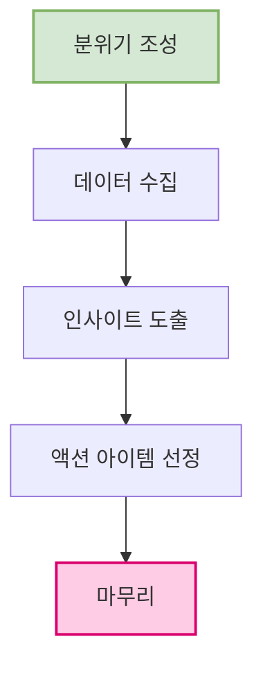

**회고(Retrospective)** 는 팀이 정기적으로 자신들의 일하는 방식(프로세스, 도구, 협업 등)을 되돌아보고, 다음 단계에서 더 나은 방향으로 나아가기 위한 구체적인 개선점을 찾아 실행을 약속하는 활동입니다.

단순히 "무엇을 잘못했는가"를 따지는 자리가 아니라, **"어떻게 하면 우리가 더 나아질 수 있을까?"** 라는 미래지향적인 질문에 답을 찾는 건설적인 논의의 장입니다. 주로 애자일(Agile) 개발 방법론, 특히 스크럼(Scrum) 프레임워크에서 스프린트(Sprint)라는 정해진 개발 주기가 끝날 때마다 진행하는 핵심 이벤트 중 하나입니다.

## 회고의 핵심 목표

- **지속적인 개선:** 팀 스스로 문제를 진단하고 해결책을 찾아 적용함으로써, 점진적으로 팀의 효율성과 생산성을 높입니다.
- **프로세스 중심:** 특정 개인의 실수나 성과를 평가하는 것이 아니라, 팀의 업무 프로세스, 협업 방식, 소통 문화 등 시스템 전체를 개선하는 데 집중합니다.
- **팀워크 강화:** 팀원들이 함께 의견을 나누고 해결책을 모색하는 과정을 통해 서로에 대한 이해를 높이고 신뢰를 쌓아 강력한 팀으로 성장합니다.
- **실행 가능한 계획 도출:** 논의가 단순한 불평이나 아이디어 제시에 그치지 않고, 다음 주기 동안 실천할 수 있는 구체적인 '액션 아이템(Action Item)'을 도출하는 것을 목표로 합니다.

## 성공적인 회고의 전제 조건: 심리적 안정감

회고가 성공적으로 이루어지기 위한 가장 중요한 요소는 **[[심리적 안정감(Psychological Safety)]]**입니다. 팀원들이 어떤 의견을 제시하더라도 비난받거나 불이익을 당할 걱정 없이 솔직하게 말할 수 있는 환경이 조성되어야 합니다.

이러한 문화를 만들기 위해 많은 팀들이 회고 시작 전 **'최우선 지침(Prime Directive)'**을 함께 읽으며 마음가짐을 다집니다.

> **최우선 지침 (The Prime Directive)**
> 
> "우리는 지금부터 우리가 발견한 것이 무엇이든 간에, 각자가 가진 기술, 지식, 능력 및 가용했던 자원과 당시 상황을 고려했을 때, 모두가 최선을 다했다는 사실을 이해하고 굳게 믿을 것입니다."
> 
> (Regardless of what we discover, we understand and truly believe that everyone did the best job they could, given what they knew at the time, their skills and abilities, the resources available, and the situation at hand.)
> 
> - Norm Kerth

## 회고의 일반적인 진행 과정

회고는 정해진 틀은 없지만, 일반적으로 다음과 같은 5단계의 흐름을 따를 때 효과적입니다.

1. **분위기 조성 (Set the Stage):** 모든 팀원이 편안하게 참여할 수 있도록 아이스 브레이킹을 하거나 '최우선 지침'을 공유하며 회고의 목표와 규칙을 다시 한번 확인합니다.
2. **데이터 수집 (Gather Data):** 지난 주기 동안 있었던 일들에 대해 객관적인 사실과 각자 느낀 점을 수집합니다. 특정 회고 기법(예: [[KPT]])에 따라 포스트잇에 의견을 적어 화이트보드에 붙이는 방식을 많이 사용합니다.
3. **인사이트 도출 (Generate Insights):** 수집된 데이터를 그룹화하고 패턴을 분석하며, "왜 이런 일이 발생했을까?"에 대한 근본적인 원인을 파고듭니다. 팀이 겪는 문제의 핵심을 발견하는 단계입니다.
4. **액션 아이템 선정 (Decide What to Do):** 발견한 문제점들을 해결하기 위한 구체적이고 실행 가능한 액션 아이템을 1~3개 선정합니다. 누가, 언제까지 책임지고 실행할지 명확히 정하는 것이 중요합니다.
5. **마무리 (Close the Retrospective):** 결정된 액션 아이템을 다시 한번 모두에게 공유하고, 회고 과정 자체에 대한 짧은 피드백(예: 이번 회고는 유익했는가?)을 나누며 긍정적으로 마무리합니다.

## 회고는 '비난의 장'이 아닙니다

많은 조직에서 회고를 '잘못한 점 찾기'나 '문제아 색출'의 시간으로 오해하는 경우가 많습니다. 이는 회고의 근본적인 목적을 훼손하고 팀 문화를 망가뜨리는 가장 큰 원인입니다.

회고의 초점은 항상 **과거의 '사람'이 아닌 미래의 '프로세스'**에 맞춰져야 합니다. "누가 실수를 했는가?"가 아니라 "어떤 환경과 프로세스가 우리를 실수하게 만들었는가?", "다음에는 어떻게 이 문제를 시스템적으로 방지할 수 있을까?"를 함께 고민하는 시간이 되어야 합니다.

정기적이고 건강한 회고 문화는 팀이 스스로 학습하고 성장하게 만드는 가장 강력한 엔진입니다. 이는 단순히 더 나은 제품을 만드는 것을 넘어, 함께 일하고 싶은 훌륭한 팀을 만드는 핵심적인 과정입니다.