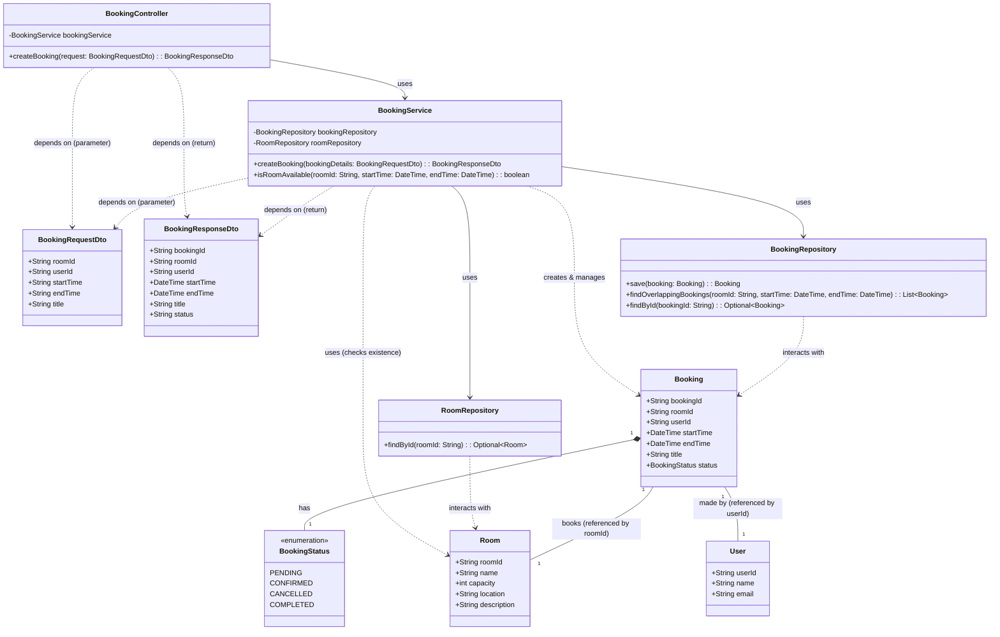
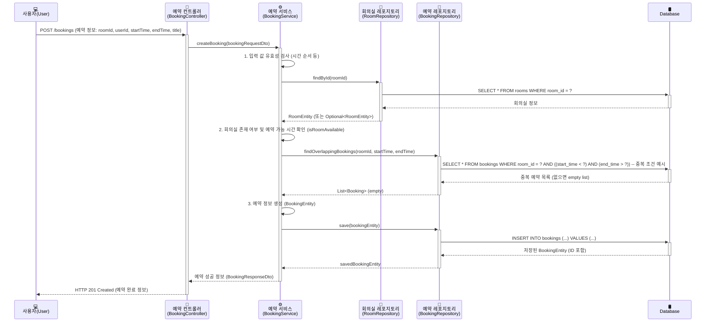

### 1. 클래스 다이어그램 (Class Diagrams)





---

### 2. 시퀀스 다이어그램 (Sequence Diagrams)




---

### 3. API 명세 (API Specifications)

#### 회의실 예약 API: `POST /bookings`

- **Description**: 새로운 회의실 예약을 생성합니다.
- **Request**:
    - **URL**: `/bookings`
    - **HTTP Method**: `POST`
    - **Headers**:
        - `Content-Type: application/json`
        - `Authorization: Bearer <token>` (필요시 인증 토큰)
    - **Request Body** (`BookingRequestDto`):
        
        JSON
        
        ```
        {
          "roomId": "CONF_ROOM_101",
          "userId": "user_abc123",
          "startTime": "2025-07-15T10:00:00Z",
          "endTime": "2025-07-15T11:00:00Z",
          "title": "주간 팀 미팅"
        }
        ```
        
- **Response**:
    - **Success (201 Created)**:
        - **Headers**: `Location: /bookings/{bookingId}`
        - **Body** (`BookingResponseDto`):
            
            JSON
            
            ```
            {
              "bookingId": "bk_xyz789",
              "roomId": "CONF_ROOM_101",
              "userId": "user_abc123",
              "startTime": "2025-07-15T10:00:00Z",
              "endTime": "2025-07-15T11:00:00Z",
              "title": "주간 팀 미팅",
              "status": "CONFIRMED"
            }
            ```
            
    - **Failure**:
        - **400 Bad Request** (입력 값 오류)
        - **404 Not Found** (회의실을 찾을 수 없음)
        - **409 Conflict** (예약 시간 중복)
        - **401 Unauthorized** (인증 실패)
        - **500 Internal Server Error** (서버 내부 오류)

---

### 4. 데이터 모델 (Data Model)

```sql
-- Rooms Table: 회의실 정보
CREATE TABLE Rooms (
    room_id     VARCHAR2(50 CHAR) CONSTRAINT pk_rooms PRIMARY KEY,
    name        VARCHAR2(100 CHAR) NOT NULL,
    capacity    NUMBER NOT NULL,
    location    VARCHAR2(255 CHAR),
    description CLOB,
    created_at  TIMESTAMP DEFAULT CURRENT_TIMESTAMP,
    updated_at  TIMESTAMP DEFAULT CURRENT_TIMESTAMP
);

COMMENT ON TABLE Rooms IS '회의실 정보 테이블';
COMMENT ON COLUMN Rooms.room_id IS '회의실 고유 ID';
COMMENT ON COLUMN Rooms.name IS '회의실 이름';
COMMENT ON COLUMN Rooms.capacity IS '수용 가능 인원';
COMMENT ON COLUMN Rooms.location IS '위치 (예: 본사 3층 A구역)';
COMMENT ON COLUMN Rooms.description IS '기타 설명';
COMMENT ON COLUMN Rooms.created_at IS '생성 일시';
COMMENT ON COLUMN Rooms.updated_at IS '수정 일시';

-- Bookings Table: 예약 정보
CREATE TABLE Bookings (
    booking_id  VARCHAR2(50 CHAR) CONSTRAINT pk_bookings PRIMARY KEY,
    room_id     VARCHAR2(50 CHAR) NOT NULL,
    user_id     VARCHAR2(50 CHAR) NOT NULL,
    start_time  TIMESTAMP NOT NULL,
    end_time    TIMESTAMP NOT NULL,
    title       VARCHAR2(255 CHAR) NOT NULL,
    status      VARCHAR2(20 CHAR) DEFAULT 'CONFIRMED' NOT NULL
                CONSTRAINT chk_booking_status CHECK (status IN ('PENDING', 'CONFIRMED', 'CANCELLED', 'COMPLETED')),
    created_at  TIMESTAMP DEFAULT CURRENT_TIMESTAMP,
    updated_at  TIMESTAMP DEFAULT CURRENT_TIMESTAMP,
    CONSTRAINT fk_bookings_room_id FOREIGN KEY (room_id) REFERENCES Rooms(room_id)
);

COMMENT ON TABLE Bookings IS '예약 정보 테이블';
COMMENT ON COLUMN Bookings.booking_id IS '예약 고유 ID';
COMMENT ON COLUMN Bookings.room_id IS 'Rooms 테이블의 room_id 참조 (FK)';
COMMENT ON COLUMN Bookings.user_id IS '예약을 생성한 사용자 ID';
COMMENT ON COLUMN Bookings.start_time IS '예약 시작 시간 (UTC)';
COMMENT ON COLUMN Bookings.end_time IS '예약 종료 시간 (UTC)';
COMMENT ON COLUMN Bookings.title IS '예약 목적 또는 제목';
COMMENT ON COLUMN Bookings.status IS '예약 상태 (PENDING, CONFIRMED, CANCELLED, COMPLETED)';
COMMENT ON COLUMN Bookings.created_at IS '생성 일시';
COMMENT ON COLUMN Bookings.updated_at IS '수정 일시';

-- Indexes for Bookings Table
CREATE INDEX idx_bookings_room_time ON Bookings(room_id, start_time, end_time);
CREATE INDEX idx_bookings_user_id ON Bookings(user_id);
CREATE INDEX idx_bookings_status ON Bookings(status);

-- Triggers for automatic updated_at (Oracle doesn't support ON UPDATE CURRENT_TIMESTAMP in table DDL)
CREATE OR REPLACE TRIGGER trg_rooms_updated_at
BEFORE UPDATE ON Rooms
FOR EACH ROW
BEGIN
    :NEW.updated_at := CURRENT_TIMESTAMP;
END;
/

CREATE OR REPLACE TRIGGER trg_bookings_updated_at
BEFORE UPDATE ON Bookings
FOR EACH ROW
BEGIN
    :NEW.updated_at := CURRENT_TIMESTAMP;
END;
/
```

