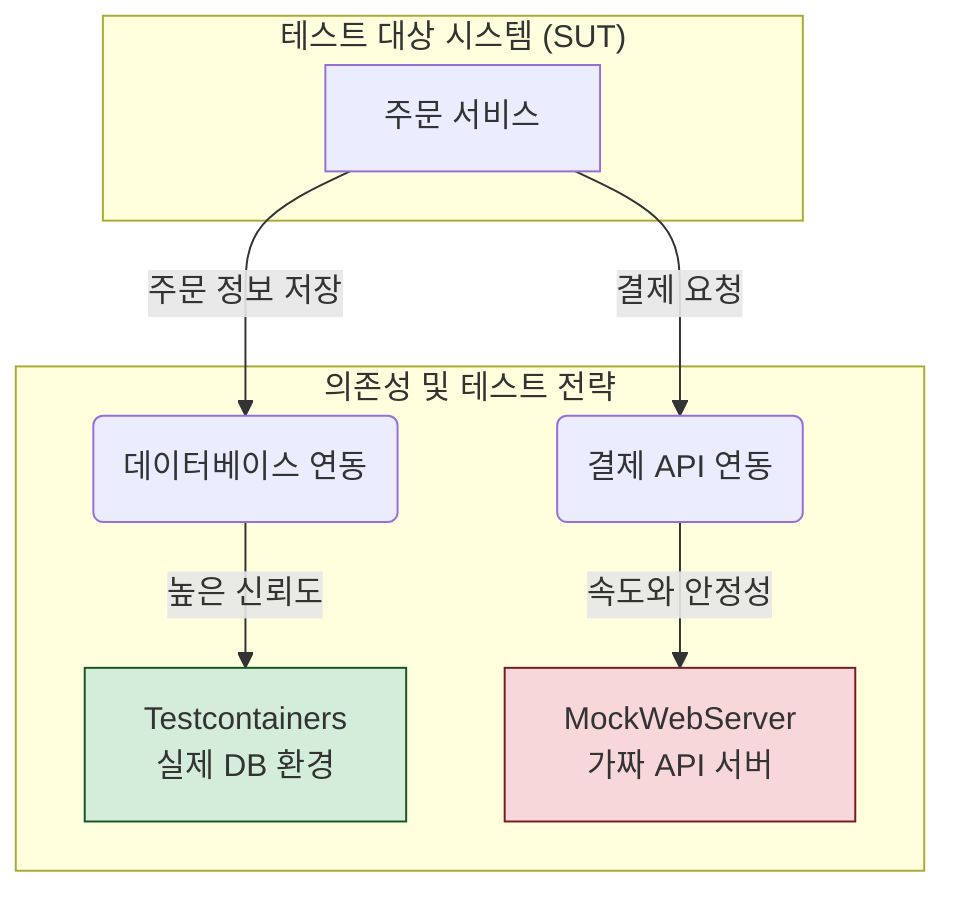

효과적인 통합 테스트를 구축하는 핵심은 '모든 것을 테스트하는 것'이 아니라, **'비용 대비 최대의 신뢰도'**를 얻을 수 있도록 전략적으로 접근하는 데 있습니다. 통합 테스트는 느리고 관리하기 어렵다는 단점이 명확하기에, 현명한 전략 없이는 오히려 개발 속도를 저해하는 애물단지가 될 수 있습니다.

이 글에서는 모듈 간의 '상호작용 지점'에 집중하고 외부 의존성을 현명하게 관리하여, 빠르고 안정적이며 유지보수하기 쉬운 통합 테스트를 구축하는 핵심 전략들을 소개합니다.

---

### 1. 테스트 범위의 명확한 정의: '상호작용'에 집중하기

가장 먼저 해야 할 일은 "어디부터 어디까지를 하나의 통합 범위로 볼 것인가?"를 명확히 정의하는 것입니다. 효과적인 통합 테스트는 통합되는 모듈들의 **내부 구현을 다시 테스트하는 것이 아니라, 이들 사이의 '계약(Contract)'이 올바르게 지켜지는지 검증**하는 데 초점을 맞춰야 합니다.

예를 들어, `Service` 계층과 `Repository` 계층을 통합 테스트한다면, 테스트의 목표는 다음과 같아야 합니다.

- `Service`가 올바른 인자를 담아 `Repository`의 메서드를 호출하는가?
- `Repository`가 반환한 데이터(또는 예외)를 `Service`가 올바르게 해석하고 처리하는가?

이때 `Repository`가 내부적으로 어떤 SQL을 실행하는지, 그 SQL이 최적화되었는지 등은 `Repository`의 단위 테스트에서 검증할 몫입니다. 통합 테스트에서까지 이를 중복 검증할 필요는 없습니다. 이처럼 모듈 간의 약속을 정의하고 검증하는 방식에 더 깊이 알고 싶다면 [[계약 테스트(Contract Test)]] 문서를 참고해주세요.

---

### 2. 외부 의존성 관리: 실제와 가짜 사이의 균형

통합 테스트가 느려지는 주된 원인은 데이터베이스, 외부 API, 메시지 큐와 같은 **외부 의존성** 때문입니다. 이 의존성을 어떻게 다루느냐가 통합 테스트의 성패를 좌우합니다.

**전략은 크게 두 가지로 나뉩니다.**

1. **실제 의존성 사용 (고충실도, High-Fidelity)**: 테스트 환경의 신뢰도를 높이기 위해 실제 운영 환경과 유사한 기술을 사용합니다.
    
    - **데이터베이스**: H2와 같은 인메모리 DB나, Testcontainers를 활용하여 실제 PostgreSQL, MySQL 등을 격리된 환경에서 실행합니다.
    - **장점**: 실제 환경과 거의 동일하게 동작하므로 테스트의 신뢰도가 매우 높습니다.
    - **단점**: 환경을 구성하고 실행하는 데 시간이 오래 걸립니다.
2. **테스트 대역(Test Double) 사용 (고립, Isolation)**: 테스트 범위를 벗어나는 외부 시스템은 가짜 객체로 대체하여 테스트를 단순화하고 속도를 높입니다.
    
    - **외부 API**: `MockWebServer`와 같은 라이브러리로 가짜 API 서버를 띄워, 특정 요청에 미리 정의된 응답을 반환하도록 설정합니다.
    - **장점**: 외부 시스템의 상태나 네트워크 지연에 영향을 받지 않아 빠르고 안정적인 테스트가 가능합니다.
    - **단점**: 가짜 객체가 실제 시스템의 동작을 정확히 흉내 내지 못하면 테스트의 신뢰도가 떨어질 수 있습니다.

어떤 전략을 선택할지는 테스트의 목표에 따라 달라집니다. 아래 그림처럼, DB 연동처럼 내부 시스템의 핵심적인 통합은 실제 기술로 검증하고, 제어할 수 없는 외부 API 연동은 가짜 객체로 대체하는 것이 일반적인 접근법입니다.



다양한 테스트 대역의 종류와 활용법은 [[테스트 더블(Test Double)]] 문서에서 더 자세히 확인할 수 있습니다.

---

### 3. 독립적이고 일관된 테스트 데이터 관리

통합 테스트는 여러 테스트 케이스가 동일한 데이터베이스나 외부 자원을 공유하는 경우가 많습니다. 이때 한 테스트가 다른 테스트에 영향을 미치지 않도록 **테스트 간 격리(Test Isolation)**를 보장하는 것이 매우 중요합니다.

**주요 전략은 다음과 같습니다.**

- **테스트 실행 후 상태 롤백**: 스프링에서 `@Transactional` 어노테이션을 테스트 클래스나 메서드에 붙이면, 테스트가 끝난 후 모든 데이터베이스 변경 사항이 자동으로 롤백됩니다. 이는 각 테스트가 항상 깨끗한 상태에서 시작되도록 보장하는 가장 간단하고 효과적인 방법입니다.
    
    ```java
    @SpringBootTest
    @Transactional // 테스트 메서드 종료 시 데이터베이스 상태를 롤백
    class MemberServiceIntegrationTest {
    
        @Autowired
        private MemberService memberService;
    
        @Test
        void 회원가입() {
            // given: 테스트를 위한 데이터 준비
            // when: 로직 실행
            // then: 결과 검증
        } // <-- 이 시점에서 DB 변경사항이 모두 롤백됨
    
        @Test
        void 다른_테스트() {
            // '회원가입' 테스트의 영향을 받지 않고 깨끗한 상태에서 시작
        }
    }
    ```
    
- **일관된 테스트 데이터 생성**: 매번 테스트에 필요한 데이터를 수동으로 만드는 것은 번거롭고 실수를 유발하기 쉽습니다. 테스트 데이터 빌더(Test Data Builder) 패턴이나 `Object Mother` 패턴을 활용하면, 의미 있는 테스트 데이터를 일관되고 재사용 가능하게 만들 수 있습니다.
    

---

### 4. 실행 속도와 신뢰도의 균형점 찾기

모든 통합 테스트를 매번 실행하는 것은 비효율적입니다. [[테스트 피라미드(Test Pyramid)]] 원칙에 따라, 통합 테스트는 단위 테스트보다 그 수가 적어야 하며, 실행 빈도 또한 조절할 필요가 있습니다.

- **테스트 슬라이스 활용**: `@SpringBootTest`는 전체 애플리케이션 컨텍스트를 로드하므로 무겁습니다. 웹 계층만 테스트하고 싶다면 `@WebMvcTest`를, 데이터베이스 연동만 테스트하고 싶다면 `@DataJpaTest`를 사용하는 등, 필요한 부분만 잘라내어 테스트하는 **'테스트 슬라이스'** 전략을 사용하면 속도를 크게 향상시킬 수 있습니다. 자세한 내용은 스프링 테스트 슬라이스 문서를 참고해주세요.
    
- **CI/CD 파이프라인 분리**: 빠른 피드백이 중요한 단위 테스트는 코드 커밋 시마다 실행하고, 상대적으로 느린 통합 테스트는 Pull Request를 생성하거나 메인 브랜치에 병합하기 전, 혹은 야간 빌드(Nightly Build) 시에만 실행하도록 파이프라인을 구성하여 전체 개발 플로우의 효율을 높일 수 있습니다.
    

---

### 결론: 전략이 품질을 결정합니다

효과적인 통합 테스트는 무작정 많이 만드는 것이 아니라, **명확한 목표를 가지고 전략적으로 구축**할 때 빛을 발합니다. 다음 네 가지 핵심 전략을 기억하고 프로젝트에 적용한다면, 시스템의 안정성을 높이고 리팩토링에 대한 자신감을 심어주는 견고한 테스트 스위트를 만들 수 있을 것입니다.

1. **범위를 명확히 하고 상호작용에 집중하세요.**
2. **외부 의존성은 목표에 따라 실제와 가짜를 현명하게 선택하세요.**
3. **데이터를 격리하여 테스트의 독립성을 보장하세요.**
4. **실행 속도와 신뢰도의 균형을 고려하여 테스트 실행 계획을 세우세요.**

이러한 전략적 고민과 실천이 결국 소프트웨어의 품질을 결정짓는 중요한 밑거름이 될 것입니다.

---

### 참고 자료

- [Martin Fowler - Integration Test](https://martinfowler.com/bliki/IntegrationTest.html)
- [Spring Boot Docs - Testing](https://www.google.com/search?q=https://docs.spring.io/spring-boot/docs/current/reference/html/features.html%23features.testing)
- [Testcontainers - Universal Test Environments](https://www.testcontainers.org/)